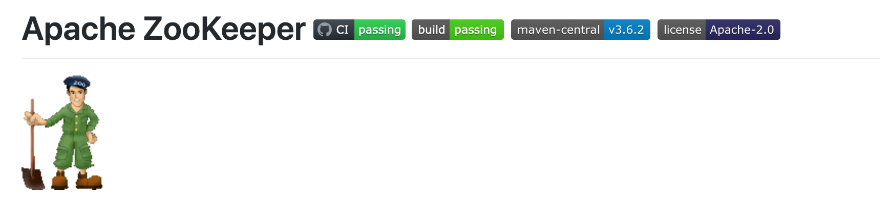
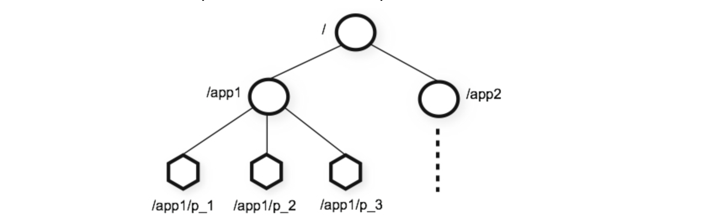
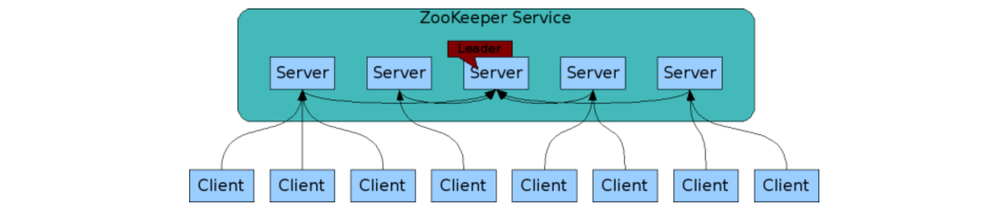

[TOC]

# Zookeeper



## 1. ZK简介

- dubbo框架 springcloud 框架      zk  注册中心    AService     BService
- Hadoop Hbase 组件   集群架构   zk  集群管理者 
- zk实现分布式锁  redis分布式

> ZooKeeper(动物园管理者) 简称 **ZK**，**一个分布式的，开放源码的分布式应用程序协调服务**，是Google的Chubby一个开源的实现，是Hadoop和Hbase的重要组件。ZooKeeper 使用 Java 所编写，但是支持 Java 和 C 两种编程语言。

---

## 2. ZK内存数据模型

### 2.1 模型结构



### 2.2 模型的特点

- 每个子目录如/node1都被称作一个znode(节点)。这个 znode 是被它所在的路径唯一标识
- znode 可以有子节点目录，并且每个 znode 可以存储数据
- znode 是有版本的，每个 znode 中存储的数据可以有多个版本，也就是一个访问路径中可以存储多份数据
- znode 可以被监控，包括这个目录节点中存储的数据的修改，子节点目录的变化等，一旦变化可以通知设置监控的客户端

---

## 3. 节点的分类

#### 3.1 持久节点（PERSISTENT）

+ 这种节点的信息会持久化的保存在磁盘上（需要指定保存目录）

> 是指在节点创建后，就一直存在，直到有删除操作来主动删除这个节点——不会因为创建该节点的客户端会话失效而消失
#### 3.2 持久顺序节点（PERSISTENT_SEQUENTIAL）

+ 这种节点的信息会持久化的保存在磁盘上（需要指定保存目录）

>这类节点的基本特性和上面的节点类型是一致的。额外的特性是，在ZK中，每个父节点会为他的第一级子节点维护一份时序，会记录每个子节点创建的先后顺序。基于这个特性，在创建子节点的时候，可以设置这个属性，那么在创建节点过程中，ZK会自动为给定节点名加上一个数字后缀，作为新的节点名。这个数字后缀的范围是整型的最大值。
#### 3.3 临时节点（EPHEMERAL）

>和持久节点不同的是，临时节点的生命周期和客户端会话绑定。也就是说，如果客户端会话失效，那么这个节点就会自动被清除掉。注意，这里提到的是会话失效，而非连接断开。另外，在临时节点下面不能创建子节点。 
#### 3.4 临时顺序节点（EPHEMERAL_SEQUENTIAL）

> 具有临时节点特点,额外的特性是，每个父节点会为他的第一级子节点维护一份时序。这点和刚才提到的持久顺序节点类似

---
## 4. 安装

### 4.1 linux系统安装

```markdown
# 1.安装jdk并配置环境变量 & 下载zk安装包
-	https://mirrors.bfsu.edu.cn/apache/zookeeper/zookeeper-3.5.7/apache-zookeeper-3.5.7-bin.tar.gz

# 2.下载安装包上传到linux服务中,并解压缩
-	tar -zxvf zookeeper-3.5.7.tar.gz

# 3.重命名安装目录
-	mv zookeeper-3.5.7 Zookeeper3.5.7

# 4.配置zoo.cfg配置文件
-	1.修改zk的conf目录下的zoo_simple.cfg，修改完后，重命名为zoo.cfg
  tickTime=2000
  initLimit=10
  syncLimit=5
  # 这是zookeeper持节结点的保存目录
  dataDir=/export/servers/Zookeeper3.5.7/zkData

  clientPort=2181

# 5.启动zk
-	在zk的bin目录下，运行zkServer.sh
	./bin/zkServer.sh start /usr/zookeeper/conf/zoo.cfg
	
# 6.使用jps查看启动是否成功
# QuorumPeerMain：这是在 Linux 系统中的 ZK 进程名字

# 7.启动客户端连接到zk
- ./bin/zkCli.sh -server 192.168.0.220:2181
	注意:可以通过  ./bin/zkCli.sh help 查看客户端所有可以执行的指令
```

### 4.2 Docker安装zookeeper

```markdown
# 1.获取zk的镜像
- docker pull zookeeper:3.4.14

# 2.启动zk服务
- docker run --name zk -p 2181:2181 -d zookeeper:3.4.14
```


---

## 5.客户端基本指令

```markdown
# 1.ls path    							查看特定节点下面的子节点

# 2.create path data   			创建一个节点。并给节点绑定数据(默认是持久性节点)
  - create path data								  创建持久节点(默认是持久节点)
  - create -s path data 						  创建持久性顺序节点
  -	create -e path data 						  创建临时性节点(注意:临时节点不能含有任何子节点)
  -	create -e -s path data            创建临时顺序节点(注意:临时节点不能含有任何子节点)
 
# 3.stat path                查看节点状态
# 4.set path data            修改节点数据
# 5.ls -s path                 查看节点下孩子和当前节点的状态
# 6.history                  查看操作历史
# 7.get path                  获得节点上绑定的数据信息
# 8.delete path              删除节点(注意:删除节点不能含有子节点)
# 9.rmr  path                递归删除节点(注意:会将当前节点下所有节点删除)
# 10.quit                    退出当前会话(会话失效)
```

---

## 6.节点监听机制 watch

> 客户端可以监测znode节点的变化。Zonode节点的变化触发相应的事件，然后清除对该节点的监测。当监测一个znode节点时候，Zookeeper会发送通知给监测节点。**一个Watch事件是一个一次性的触发器，当被设置了Watch的数据和目录发生了改变的时候,则服务器将这个改变发送给设置了Watch的客户端以便通知它们。**

+ 监听分为两类
  + 目录
  + 数据

```markdown
# 1.ls /path true             监听节点目录的变化
# 2.get /path true						监听节点数据的变化。   
```

## 7.java操作ZK

### 7.1 创建项目引入依赖

```xml
<dependency>
    <groupId>com.101tec</groupId>
    <artifactId>zkclient</artifactId>
    <version>0.10</version>
</dependency>
```

### 7.2 获取zk客户端对象

```java
private ZkClient zkClient;
/**
 * 获取zk客户端连接
 */
@Before
public void Before(){
    //参数1:服务器的ip和端口
    //参数2:会话的超时时间
    //参数3:回话的连接时间
    //参数4:序列化方式
    zkClient = new ZkClient("192.168.28.132:2181",30000,60000,new SerializableSerializer());
}
/**
 * 关闭资源
 */
@After
public void after(){
    zkClient.close();
}
```

### 7.3 常用API

- 创建节点

```java
/**
 * 创建节点
 */
@Test
public void testCreateNode(){
    //第一中创建方式  返回创建节点的名称
    String nodeName = zkClient.create("/node5","lisi", CreateMode.PERSISTENT);
    zkClient.create("/node6","zhangsan", CreateMode.PERSISTENT_SEQUENTIAL);
    zkClient.create("/node7","王五",CreateMode.EPHEMERAL);
    zkClient.create("/node8","xiaozhang",CreateMode.EPHEMERAL_SEQUENTIAL);
    //第二种创建方式 不会返回创建节点的名称
    zkClient.createPersistent("/node1","持久数据");
    zkClient.createPersistentSequential("/node1/aa","持久数据顺序节点");
    zkClient.createEphemeral("/node2","临时节点");
    zkClient.createEphemeralSequential("/node1/bb","临时顺序节点");
}
```

- 删除节点

```java
/**
 * 删除节点
 */
@Test
public void testDeleteNode(){
    //删除没有子节点的节点  返回值:是否删除成功
    boolean delete = zkClient.delete("/node1");
    //递归删除节点信息 返回值:是否删除成功
    boolean recursive = zkClient.deleteRecursive("/node1");
}
```

- 查看节点的子节点

```java
/**
 * 查询节点
 */
@Test
public void testFindNodes(){
    //获取指定路径的节点信息  //返回值: 为当前节点的子节点信息
    List<String> children = zkClient.getChildren("/");
    for (String child : children) {
        System.out.println(child);
    }
}
```

- 查看当前节点的数据
  - 注意:如果出现:org.I0Itec.zkclient.exception.ZkMarshallingError: java.io.StreamCorruptedException: invalid stream header: 61616161 
    异常的原因是: 在shell中的数据序列化方式 和 java代码中使用的序列化方式不一致导致  因此要解决这个问题只需要保证序列化一致即可  都使用相同端操作即可

```java
/**
 * 获取节点的数据
 *
 */
@Test
public void testFindNodeData(){
    Object readData = zkClient.readData("/node3");
    System.out.println(readData);
}
```

- 查看当前节点的数据并获取状态信息

```java
/**
 * 获取数据以及当前节点的状态信息
 */
@Test
public void testFindNodeDataAndStat(){
    Stat stat = new Stat();
    Object readData = zkClient.readData("/node60000000024",stat);
    System.out.println(readData);
    System.out.println(stat);
}
```

- 修改节点数据

```java
/**
 * 修改节点数据
 */
@Test
public void testUpdateNodeData(){
    zkClient.writeData("/node60000000024", new User("121","name","xxx"));
}
```

- 监听节点数据的变化

```java
/**
 * 监听节点数据的变化
 */
@Test
public  void testOnNodeDataChange() throws IOException {
    zkClient.subscribeDataChanges("/node60000000024", new IZkDataListener() {
        //当节点的值在修改时,会自动调用这个方法  将当前修改节点的名字,和节点变化之后的数据传递给方法
        public void handleDataChange(String nodeName, Object result) throws Exception {
            System.out.println(nodeName);
            System.out.println(result);
        }
        //当节点的值被删除的时候,会自动调用这个方法,会将节点的名字已参数形式传递给方法
        public void handleDataDeleted(String nodename) throws Exception {
            System.out.println("节点的名字:"+nodename);
        }
    });
    //阻塞客户端
    System.in.read();
}
```

- 监听节点目录的变化

```java
/**
 * 监听节点的变化
 */
@Test
public  void testOnNodesChange() throws IOException {
    zkClient.subscribeChildChanges("/node60000000024", new IZkChildListener() {
        //当节点的发生变化时,会自动调用这个方法
        //参数1:父节点名称
        //参数2:父节点中的所有子节点名称
        public void handleChildChange(String nodeName, List<String> list) throws Exception {
            System.out.println("父节点名称: "+nodeName);
            System.out.println("发生变更后字节孩子节点名称:");
            for (String name : list) {
                System.out.println(name);
            }
        }
    });
    //阻塞客户端
    System.in.read();
}
```

-----

## 8.ZK的集群

### 8.1集群(cluster)

```markdown
# 1.集群(cluster)
- 集合同一种软件服务的多个节点同时提供服务

# 2.集群解决问题
-  单节点的并发访问的压力问题
-  单节点故障问题(如硬件老化,自然灾害等)
```

### 8.2集群架构

+ 主从架构
  + leader
  + follower
+ 不用自己确定主节点，集群自己选举主节点
  + 主节点宕机也会自己选出新的主节点



### 8.3集群搭建

```markdown
# 1.创建dataDir
	[root@c60 zookeeper]#	mkdir zkdata

# 2.分别在三个dataDir目录下面myid文件
	[root@c60 zookeeper]#   touch ./zkdata1/myid
	  myid的内容是 服务器的  表示  1|2|3

# 3.在/conf目录下创建zk配置文件，分别为 zoo.cfg
		解释:
    		1.server.X :x为服务器的唯一标识。
	    	2.192.168.0.220：服务器所在的ip地址
		    3.3002：数据同步使用的端口号
		    4.3003：选举使用的端口号

# 4.分别启动各个zk服务器
- [root@c60 zookeeper]# ./bin/zkServer.sh start


# 5.查看各个zk服务器的角色信息
- [root@c60 zookeeper]# ./bin/zkServer.sh status /usr/zookeeper/conf/zoo1.cfg

# 6.客户端连接任意zk服务器进行节点操作
- [root@c60 zookeeper]# ./bin/zkCli.sh -server 192.168.0.220:3001

# 7.停止特定zk服务器
- [root@c60 zookeeper]# ./bin/zkServer.sh stop
```

---


## 附录

### 配置文件说明

```bash
# 心跳：zk集群间通信时间间隔（毫秒）2s
tickTime=2000
# 初始化集群时集群节点间同步超时时间 20s（10次心跳）
initLimit=10
# 集群运行过程中同步数据超时时间 10s
syncLimit=5
# 持久结点数据存储路径
dataDir=/export/servers/Zookeeper3.5.7/zkData
# ZK 端口号
clientPort=2181
# 最大客户端连接数，线程池最大值
maxClientCnxns=60
# ZK 保存的树结构，常驻在内存中。并且会每隔一定的修改次数保存快照
# 要保留在 dataDir 中的快照数量
#autopurge.snapRetainCount=3
# 以小时为单位的清除任务间隔
# 设置为 "0 "可禁用自动清除功能
#autopurge.purgeInterval=1


################################cluster###########################
#1.server.X :x为服务器的唯一标识。
#2.glnode01：服务器所在的ip地址
#3.2888：数据同步使用的端口号
#4.3888：选举使用的端口号
server.1=glnode01:2888:3888
server.2=glnode02:2888:3888
server.3=glnode03:2888:3888
```


### zookeeper集群启动脚本

```bash
#! /bin/sh

for host in glnode01 glnode02 glnode03

do
 	# 打印正在执行的操作
	echo "Starting ZooKeeper on $host..."

    ssh $host "/export/servers/Zookeeper3.5.7/bin/zkServer.sh start"

    # 检查是否成功启动 ZooKeeper
    if [ $? -eq 0 ]; then
        echo "$host: ZooKeeper is running"
    else
        echo "$host: Failed to start ZooKeeper"
    fi

done
```

