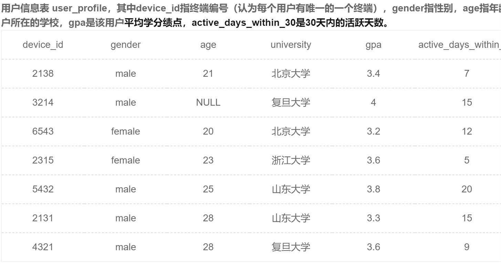
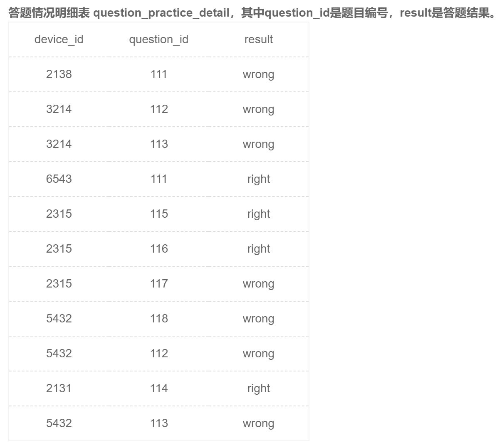
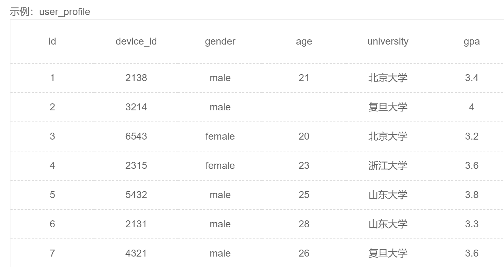
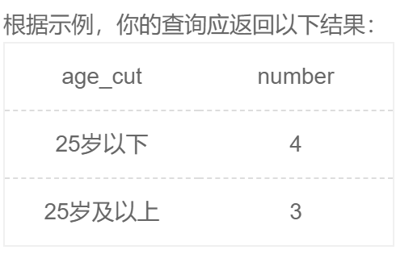
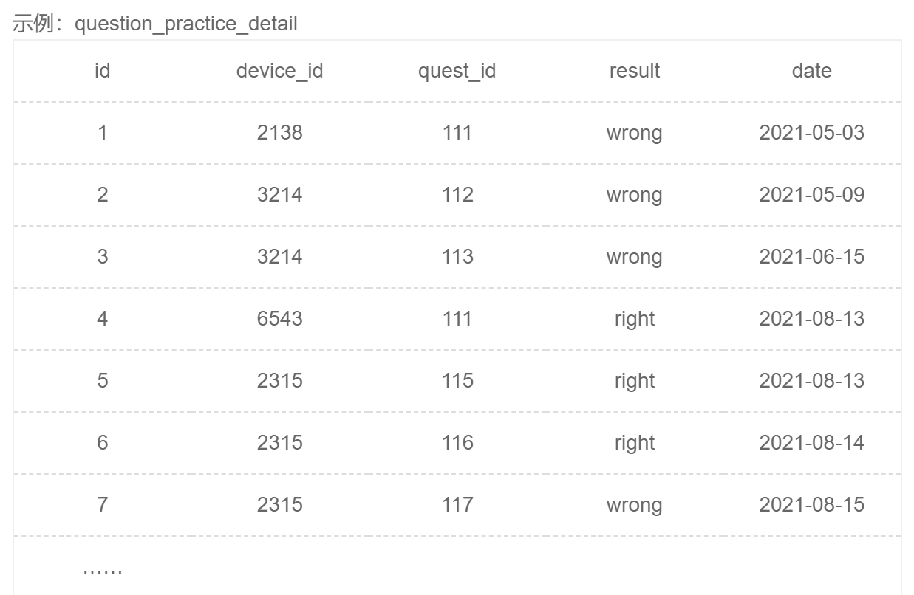
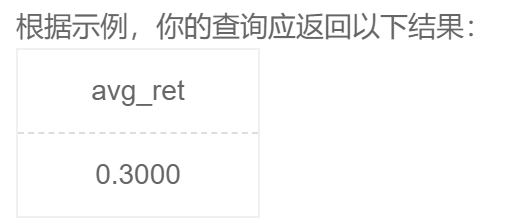
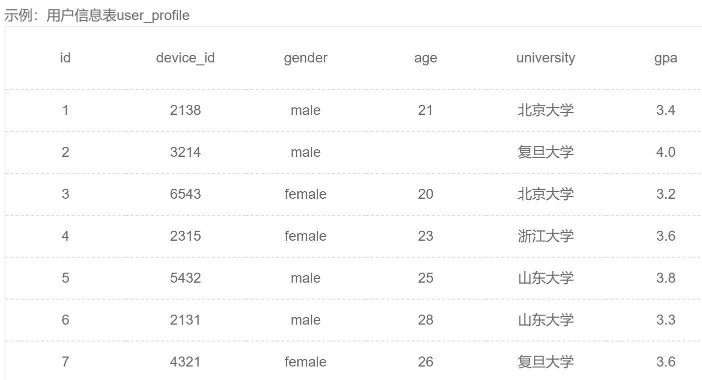
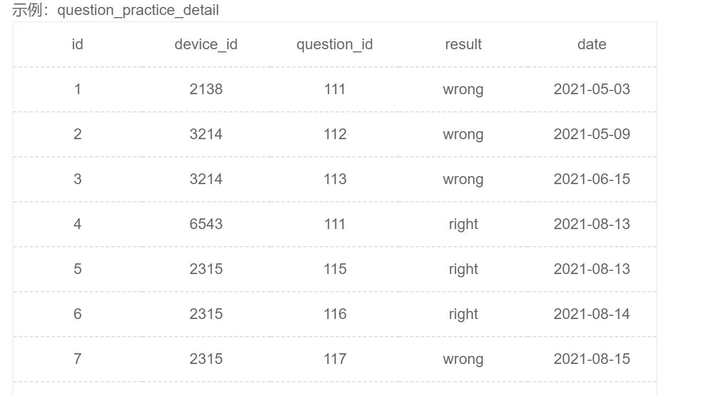
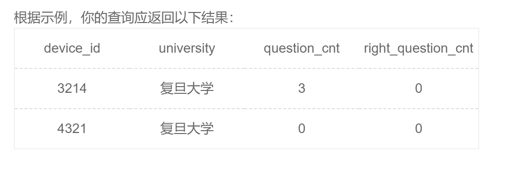

# 牛客

*前言：我的刷题顺序，先快速入门，然后看了SQL必知必会发现都是一些基础的内容，直接做SQL进阶挑战*

## Part One: 快速入门

<br>

### SQL22

##### 需求：

运营想要了解每个学校答过题的用户平均答题数量情况，请你取出数据。

##### 示例：





##### SQL：

```sql
SELECT
  university,
  COUNT(question_id)/COUNT(DISTINCT u.device_id)  avg_answer_cnt
FROM
  user_profile u
  INNER JOIN question_practice_detail q 
  ON u.device_id = q.device_id
GROUP BY
  u.university
ORDER BY
  u.university;
```

==注意==:COUNT() 函数中也可以用DISTINCT，来统计不同的值的数量

<br>

### SQL26

##### 需求：

现在运营想要将用户划分为25岁以下和25岁及以上两个年龄段，分别查看这两个年龄段用户数量

**本题注意：age为null 也记为 25岁以下**

##### 示例：





##### SQL：

```sql
SELECT IF(age >= 25 ,'25岁及以上','25岁以下' ) age_cut ,COUNT(*) number
FROM user_profile
group by age_cut
```

##### 知识点：

对于SQL的三个条件函数的使用，并且是可以对条件函数进行分组的！

<br>

### SQL28

+ 错误的：原因是mysql底层对于sql执行顺序有自己的优化，所以会先执行select后执行group by，所以执行到select中的day时，还没有执行group by，报错

```sql
select  day,count(*) question_cnt
from question_practice_detail
where YEAR(date) = 2021 and MONTH(date) = 08
group by DAY(date) day

```

+ 正确的

```sql
select  DAY(date) day,count(*) question_cnt
from question_practice_detail
where YEAR(date) = 2021 and MONTH(date) = 08
group by DAY(date)

```

<br>

### SQL29

##### 需求：

现在运营想要查看用户在某天刷题后第二天还会再来刷题的平均概率。请你取出相应数据。

##### 示例：





##### 理解：

用户在某天刷题后第二天还会再来刷题的平均概率.

既然概率则确定分子分母即可：

分母：这个有个坑，即如果一个用户在同一天刷了不同的题很多次，则会有同一用户在同一天的很多条记录，这个情况在分母中是需要排除的，分母排除掉用户编号和日期都相同的记录，在使用这个表的时候其实每次用的都是排除之后的数据，在分子中也一样，我们称为纯表。

分子：在纯表中的所有日期数据加一nextday，然后和没有加一的纯表对照，用户编号和nextday与day相等的数据筛选出来即可。


##### 解答：

```mysql
select
    (
        select
            count(*)
        from
            (
                select distinct
                    device_id,
                    date
                from
                    question_practice_detail
            ) A
            inner join (
                select distinct
                    device_id,
                    date_add (date, interval 1 day) nextday
                from
                    question_practice_detail
            ) B on A.date = B.nextday
            and A.device_id = B.device_id
    ) / count(distinct device_id, date) avg_ret
from
    question_practice_detail

```

<br>

### SQL34

##### 需求：

题目： 现在运营想要了解复旦大学的每个用户在8月份练习的总题目数和回答正确的题目数情况，请取出相应明细数据，对于在8月份没有练习过的用户，答题数结果返回0.

##### 示例：





##### 结果示例



##### sql:

对于聚合函数和条件函数的复合使用

```sql
select
    u.device_id,
    u.university,
    # if(count(*) != 0,count(*),0 ) 
    sum(if(month(q.date) = 08,1,0)) question_cnt,
    sum(if(q.result = 'right',1,0)) right_question_cnt
from
    user_profile u
    left join question_practice_detail q on u.device_id = q.device_id
where
    u.university = '复旦大学'
#    and month (q.date) = 08
group by
    u.device_id

```


## Part two: 进阶挑战

*这个部分看似很简单，但是每道题都考到了不同的知识点！*

### SQL 110

##### 需求：

就是插入两条数据

##### 注意：

mysql有自增主键，自增主键在插入时直接写null即可。或者 插入数据时不插入自增主键一列，会自动增加自增主键的。

```sql
insert into exam_record(id,uid,exam_id,start_time,submit_time,score)
values (null,1001,9001, str_to_date('2021-09-01 22:11:12', '%Y-%m-%d %H:%i:%S'),str_to_date('2021-09-01 23:01:12', '%Y-%m-%d %H:%i:%S'),90),(null,1002,9002, str_to_date('2021-09-04 07:01:02', '%Y-%m-%d %H:%i:%S'),null,null)

```


### SQL 111

##### 关键字：

$insert \qquad select$

```sql
insert into exam_record_before_2021(uid,exam_id,start_time,submit_time,score)

select uid,exam_id,start_time,submit_time,score
from exam_record
where year(start_time) < 2021 and submit_time is not null
```


### SQL 112

##### 关键字：

$replace\quad into$

+ 掌握replace into···values的用法（与insert唯一的区别就是把insert换成replace）

replace into 跟 insert into功能类似，不同点在于：replace into 首先尝试插入数据到表中，

1. 如果发现表中已经有此行数据（根据主键或者唯一索引判断）则先删除此行数据，然后插入新的数据；
2. 否则，直接插入新数据。

要注意的是：插入数据的表必须有主键或者是唯一索引！否则的话，replace into 会直接插入数据，这将导致表中出现重复的数据。

```sql
replace into
    examination_info (exam_id, tag, difficulty, duration, release_time)
values
    (
        9003,
        'SQL',
        'hard',
        90,
        str_to_date ('2021-01-01 00:00:00', '%Y-%m-%d %H:%i:%S')
    ) 
```


##### 关键字

$on\quad duplicate\quad key \quad update$

+ 在高并发项目中，使用[多线程](https://so.csdn.net/so/search?q=多线程&spm=1001.2101.3001.7020)录入数据有可能造成重复录入，出现主键冲突的异常，需要使用关键字进行判断数据库是否已存在此主键，如果存在会将插入操作变为==更新==操作。与replace的区别就在于，replace是先删除后插入，而这个是更新。

```sql
insert into player_count(player_id,count,name) value(1,1,'张三') 
on duplicate key update 
count= 1,name='张三';
```

