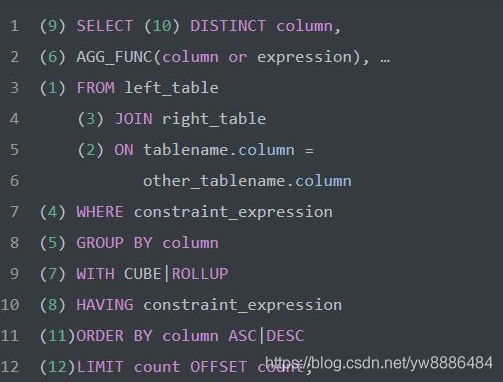
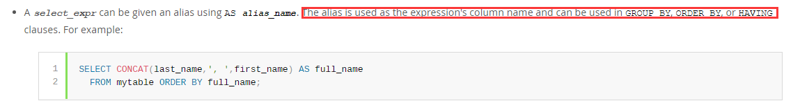

[TOC]
# SQL必知必会

<br>

==注意==

1.  SQL执行顺序依次为：

   

在查询mysql的字段别名使用的时候，翻到了mysql的官方文档，里面对别名的使用场景进行了简要的介绍：


意思就是别名可以使在order by、having、group by 子句中，但是根据上面的SQL执行过程，很明显group by 和 having都在select之前啊，这里值得注意的是，mysql对group by 进行了优化加强，所以在group by子句中可以使用别名进行分类，但是其他数据库还是遵循着SQL的执行顺序。

2. **格式化**便于观看理解

   ```sql
   SELECT
     university,
     AVG(question_cnt) avg_question_cnt,
     AVG(answer_cnt) avg_answer_cnt
   FROM
     user_profile
   GROUP BY
     university
   HAVING
     avg_question_cnt < 5
     OR
     avg_answer_cnt < 20;
   ```

   

<br>

## 第一课 数据库基础

<br>

## 第二课 检索数据

***关键字***

+ SELECT
+ DISTINCT
+ TOP X  /   LIMIT X

***注意***

1. 建议所有的关键字使用**大写**, 因为`SQL`关键字不区分大小写，但是==表名，列名==会区分大小写

2. `SQL`语句最后都是以`；`结束的
3. 检索多个列时，列名之间用逗号分隔
4. `SQl`里的注释`#`或`--`

<br>

## 第三课 排序检索数据

***关键字***

+ ORDER BY 

***注意***

1. 不等于: `<>`
2. ORDER BY ==必须==是 SELECT语句的最后一条子句
3. ORDER BY 可以用非检索列来排序
4. 排序默认 升序 使用 降序 DESC

<br>

## 第四课 过滤数据

***关键字***

+ WHERE
+ BETWEEN AND
+ IS NULL
+ IS NOT NULL

***注意***

1. 空值的检查用 IS NULL 和 IS NOT NULL
2. 字符型数据 要使用`''`, 数字型数据可以不用`''`

<br>

## 第五课 高级数据过滤

******

***关键字***

+ AND
+ OR
+ IN   (' ',' ')

***注意***

<br>

## 第六课 通配符

***关键字***

+ LIKE
+ __     任意字符一次
+ %     任意字符任意次数
+ []      指定一个字符集，匹配指定位置的一个字符     eg：'[JM]%'   以J或M开头的任意字符串     `[^JM]%`否定形式，除了以J或M开头的任意字符串

***注意***

1. LIKE '%'   不会匹配NULL的行
2. 能使用别的搜索匹配方法时，优先使用别的方法，通配符很慢

<br>

## 第七课 创建计算字段

***关键字***

+ 例： SELECT vend_name + '(' + vend_country + ')'
  + 不同数据库的拼接方式不一样  有的是`+`、`||`、
  + 还有的是Concat    例: SELECT   Concat(vend_name , '(' , vend_country , ')' )
+ TRIM()  函数表示去掉字符串左右两边空格
  + RTRIM（）  去掉字符串右边空格
  + LTRIM（）  去掉字符串左边空格
+ AS

***注意***

1. 算术计算 可以直接使用+，-，*，/
2. 测试计算： 只是用SELECT可以进行测试计算   
   1. SELECT 3 *2        返回6

<br>

## 第八课 函数

***关键字***

+ UPPER()      所有字母大写
+ LOWER()      所有字母小写
+ LENGTH()    返回字符串长度
+ ABS()            返回绝对值

***注意***

1. 很多函数的可移植性很差，即每种数据库的实现方式差距很大
2. 日期处理函数，每个数据库差异很大，用哪个查那个

<br>

## 第九课 汇总数据

***关键字***

+ AVG()
+ COUNT()
+ MIN()
+ MAX()
+ SUM()

***注意***

1. COUNT(*) 会计算所有行数  COUNT(column)  会忽略值为NULL的行

<br>

## 第十课 分组数据

***关键字***

+ GROUP BY
  + HAVING

***注意***

1. ***使用聚合函数时，SELECT子句中只能存在以下3中元素***
   - 常数
   - 聚合函数
   - GROUP BY指定的列名

2. WHERE在数据分组前进行过滤，HAVING在数据分组后进行过滤

<br>

## 第十一课 子查询

***关键字***

+ 即查询嵌套

***注意***

1. 总是先执行内层查询
2. 子查询的SELECT只能是==单列==
3. 使用JOIN也能解决此类需要子查询问题

<br>

## 第十二课 连接表

***关键字***

+ 内连接 INNER JOIN       ON

***注意***

+ 连接方式
  + 直接FROM多个表，用WHERE连接各个表
    + ==不要忘记WHERE==否则会对各个表做笛卡儿积
  + INNER JOIN table ON condition
    + 推荐使用
    + 连接的表数越少越好，为了性能

<br>

## 第十三课 高级连接

***关键字***

+ 可以对表起别名
+ INNER JOIN   table    ON    condition
+ LEFT JOIN      table    ON    condition
+ RIGHT JOIN   table    ON    condition
+ FULL JOIN      table    ON    condition

***注意***

+ 几个连接的区别INNER JOIN 只显示condition条件符合的行
+ LEFT JOIN 会显示左表的所有行
+ RIGHT JOIN 会显示右表的所有行
+ FULL JOIN 会显示左表和右表的所有行

<br>

## 第十四课 组合查询

***关键字***

+ UNION
+ UNION ALL

***注意***

+ UNION用于将多条SELECT语句组成一个结果集，但是要注意每个SELECT必须包含相同的列、表达式和聚集函数
+ UNION只是把几个SELECT的结果拼接到一起，但是会自动去除重复的行，使用UNION ALL可以返回重复的行
+ 对一个表操作时，使用组合查询UNION和使用多个WHERE条件效果其实相同
+ 当UNION使用的SELECT语句遇到不同的列明时，它会返回第一个SELECT的列明，并且在后面如果对他排序时，也只能使用第一个列明
+ 想要对UNION组合查询排序时，只能使用一条ORDER BY子句，它必须位于最后一条SELECT语句之后，它是对结果集的所有内容排序

<br>

## 第十五课 插入数据

***关键字***

+ INSERT INTO 

  VALUE

***示例***

+ 插入完整的行（不指定对应的次序），这种方法不要使用，这样高度依赖表中列定义的顺序，还依赖于每个信息的获得次序，很不安全。

```sql
INSERT INTO Customers
VALUES(100001,
       'new york'
       '123'
       NULL
		)
```

+ 指定对应的列插入（==在表明后的括号里明确的给出列名==，后面的VALUES要准确对应给出的次序）

```sql
INSERT INTO Customers(cust_id,
                      cust_city,
                      cust_num,
                      cust_email
						)
VALUES(100001,
       'new york'
       '123'
       NULL
		)
```

+ 插入检索出的数据（INSERT SELECT）

```sql
INSERT INTO Customers(cust_id,
                      cust_city,
                      cust_num,
                      cust_email
						)
SELECT  cust_id,
		cust_city,
		cust_num,
		cust_email
FROM CustNew
```

***注意***

+ 还可以复制整个表（用到现查）

<br>

## 第十六课 更新和删除数据

***关键字***

+ UPDATE         SET             WHERE
+ DELETE          WHERE
+ TRUNCATE TABLE

***示例***

+ 更新（必须使用WHERE关键字，否则就更新整个表）

```sql
UPDATE Customers
SET cust_email = '123@qq.com'
WHERE cust_id = 1000005
```

+ 删除（必须使用WHERE关键字，否则就删除整个表）

```sql
DELETE FROM Customers
WHERE cust_id = 1000005
```

+ 删除整个表所有行（不删除表结构）
  + SQL **TRUNCATE TABLE** 命令用于删除现有数据表中的所有数据。
  + 你也可以使用 DROP TABLE 命令来删除整个数据表，不过 DROP TABLE 命令不但会删除表中所有数据，还会将整个表结构从数据库中移除。如果想要重新向表中存储数据的话，必须重建该数据表。

```sql
TRUNCATE TABLE  table_name;
```

<br>

## 第十七课 创建和操纵表

***关键字***

+ CREAT TABLE
+ DEFAULT
+ ALTER TABLE
+ DROP TABLE

***示例***

+ 创建表且使用默认值
  + 默认值经常使用日期或者时间戳。通过指定引用系统日期的函数或变量，将系统日期作为默认值。（如：Oracle用户指定 DEFAULT SYSDATE）

```sql
CREATE TABLE OrderItems
(	
    order_num	INTEGER	NOT NULL,
    order_item	INTEGER	NOT NULL,
    order_id	INTEGER	NOT NULL,
    quantity	INTEGER	NOT NULL	DEFAULT 1,
    item_price	INTEGER	NULL
)
```

+ 更新表
  + 理想情况下，不要在表中包含数据时对其进行更新。应该在表的设计过程中充分考虑未来可能的需求，避免今后对表的结构做出大改动。
  + 复杂的表结构更改，直接建新表，转移数据·····

```sql
ALTER TABLE Vendors
ADD vend_phone CHAR(20);
```

+ 删除表

```sql
DROP TABLE CustCopy
```

+ 也可以对表重命名，每个数据库操作差别大

<br>

## 第十八课 视图

视图是虚拟的表。与包含数据的表不同，视图只包含使用时动态检索数据的查询

***关键字***

+ CREATE VIEW
+ DROP VIEW

***为什么使用视图***

+ 可以高效的重用SQL语句
+ 简化复杂的SQL操作
+ 使用表的一部分数据而不是整个表
+ 保护数据

***使用规则***

+ 视图必须唯一命名
+ 视图可以嵌套，（但是嵌套视图可能会严重影响查询的性能）

***示例***

+ 创建与删除视图

```sql
CREATE VIEW ProductCustomers AS
SELECT ................
FROM  .......
WHERE ........


DROP VIEW viewname
```

<br>

## 第十九课 存储过程

***存储过程***

存储过程是一种命名SQL程序块，它将一些相关的SQL语句、流程控制语句组合在一起，用于执行某些特定的操作或者任务，可以将经常需要执行的特定的操作写成过程。通过过程名，就可以多次调用过程，从而实现程序的模块化设计。这种方式极大地节省了用户的时间，也提高了程序的效率。

在Oracle中，可以在数据库中定义子程序，在子程序中将一些固定的操作集中起来，由Oracle数据库服务器完成，以完成某个特定的功能。这种子程序称为存储过程（Procedure）。存储过程可以通俗地理解为是存储在数据库服务器中的封装了一段或多段SQL语句的PL/SQL代码块。

***存储过程与视图***

1. 视图

+ 要把视图看做是一张表，包含了一张表的部分数据或者多个表的综合数据，视图的使用和普通表一样；
+ 视图中不存放数据，数据依然存放在视图引用的原始数据表中；
+ 总结：视图是一张虚拟表，不存放数据，数据依然存放在视图引用的原始数据表中
  

2. 存储过程

+ 就是事先存储好的SQL语句，放在数据库端，需要使用时直接调用存储过程就可以执行相应的SQL语句。==存储过程可带参数，也可返回结果==。

+ 执行速度更快；允许模块化设计；提高系统安全性；减少网络流量。

  （总结：存储过程是写一段sql语句，存储在数据库端，需要使用时直接调用存储过程就可以执行相应的SQL语句）
  

3. 视图与存储过程的区别

+ 视图仅仅用来查询，而存储过程可以用来增删改查；

==视图是数据库的一张虚拟表，可以像表一样使用，而存储过程本质来说还是在执行SQL语句。==

<br>

## 第二十课 事务处理

*前言：原理很简单，但是并不知道在哪里应用*

***事务处理定义***：事务处理，通过确保成批的SQL操作要么完全执行，要么完全不执行，来维护数据库的完整性

***关键字***

+ transaction：事务
+ rollback：回退
+ commit：提交
+ savepoint：保留点

***注意***

+ 每个保留点有唯一的名字（方便回退）

<br>

## 第二十一课 游标

1. 什幺是游标？

不过，这种方式也许更符合人们的习惯。比如，我们在电话本中查找号码，在学生档案中查找档案，最终都要归结于其中的一个号码，一个档案，那就是一条记录。现实生活中，我们在一张表格中寻找某一项时，可能会用手一条一条逐行的扫过，以帮助我们找到所需的那条记录。对应于数据库来说，这就是游标的模型。所以，你可以这样想象：表格是数据库中的表，而我们的手好比是游标。

所以，当你使用类似 .MoveNext，.MoveLast 这样的语句时，觉得再自然不过了。

现在，你明白什幺是游标了吧。游标就是数据的 ' 定位系统 ' 。

这个 ' 定位系统 ' 粗分有两种：服务器游标和客户游标。 。举例来说：

Set rs = Server.CreateObject("ADODB.RecordSet")
rs.CursorLocation = adUseServer   '缺省，使用服务器游标
.....
rs.CursorLocation = adUseClient   '使用客户游标

2. 什幺是服务器游标？

或者称为 API 服务器游标。

假设你要查询有关编程语言的书，写成 SQL 语句就是：SELECT book_id,book_title FROM books WHERE book_catalog = '编程' ORDER BY book_title，同时你指定使用服务器游标。

这条语句发送到服务器，服务器对数据进行检索，将符合查询条件的记录集合放入临时表(对某些游标类型是这样)中。==每当你进行 .MoveNext 操作，服务器就会发送一条记录到客户端的缓冲区==，然后你才可以使用它。

<br>

## 第二十二课 高级SQL特性

#### 约束（constraint）

管理如何插入或处理数据的规则，DBMS通过在数据库表上施加约束来实施引用完整性。大多数约束是在表定义中定义的。

+ 主键
  + 关键字：PRIMARY KEY
  + 主键唯一且永不改动
+ 外键
  + 关键字：FOREIGN KEY（REFERENCES）
  + 外键带来的好处主要是，保证数据的完整性和一致性，主要目的是控制存储在外键表中的数据。同时支持关联查询。FOREIGN KEY约束用于防止会破坏表之间链接的操作。
  + 关于外键的使用存在一些争议，因为它在确保两个表之间的关系的时候又带来很多限制，很多工程师认为应该在代码逻辑里控制两个表的关系，而不在数据库表之间定义这样的关系。同时，外键对数据的插入删除等都会带来影响，因为表与表之间存在关联，因此各种操作都会变慢，因此在定义外键之前应该尽量考虑好数据的量，以及数据的读写频率等等。
  + 个人从目前的实际经验出发也不是特别喜欢太多的外键关系存在。尽量子代码曾通过逻辑控制数据之间的关系可能确实是更好的做法。在使用的时候应该结合实际情况进行抉择。
+ 唯一约束
  + 关键字：UNIQUE
  + 唯一约束可以包含NULL值
  + 唯一约束可以更新或修改
+ 检查约束
  + 关键字：CHECK
  + 检查最大值最小值
  + 指定范围
  + 只允许特定值

##### 索引

+ 关键字：CREATE INDEX INDEXNAME    ON   TABLENAME(COLNAME)

+ 在关系数据库中，索引是一种单独的、物理的对数据库表中一列或多列的值进行排序的一种存储结构。一句话简单来说，索引的出现其实就是为了提高数据查询的效率，就像书的目录一样。
+ 三种简单的索引结构（建立索引就是把指定的列按照索引结构来建立索引）**哈希表**、**有序数组** 和 **搜索树**。
+ 主键数据总是排序的，这是DBMS的工作，所以按照主键检索特定的行总是高效的
+ 索引改善检索操作的性能，但降低了数据插入、修改和删除的性能，在执行这些操作的时候，DBMS必须动态的更新索引
+ 索引数据可能占用大量的存储空间
+ 索引必须唯一命名
+ 索引的效率会随着数据的增加或者改变而改变

##### 触发器

+ 触发器是一种特殊的存储过程，在特定的数据库活动发生时自动执行
+ 关键字：TRIGGER（还有很多关键字，很复杂，用到自己查）
