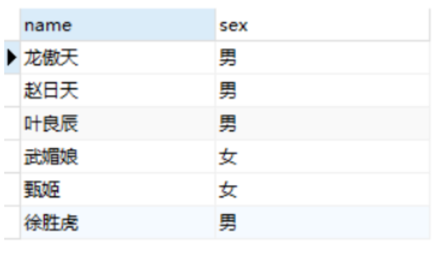

# 条件函数

*sql中的条件判断函数的用法*

***我们可以对条件函数划分的结果进行分组，就是group by 后面 可以是条件函数的别名***

### 一：CASE WHEN

+ case具有两种格式。简单case函数和case搜索函数。这两种方式，可以实现相同的功能。简单case函数的写法相对比较简洁，但是和case搜索函数相比，功能方面会有些限制，比如写判定式。还有一个需要注重的问题，case函数只返回第一个符合条件的值，剩下的case部分将会被自动忽略。

##### 简单CASE函数

```sql
CASE 字段 WHEN 预期值 THEN 结果1 ELSE 结果2 END
```

如果字段值等于预期值，则返回结果1，否则返回结果2。可以有多个when then

+ 例子


+ 需求：在score表中，sex为1表示男性，sex=0表示女性，查询时转换成汉字显示。
```sql
SELECT name,(CASE sex WHEN 0 THEN '女' ELSE '男' END) sex FROM score
```

+ 结果




##### CASE条件表达式

+ CASE的简单函数使用简便，但无法应对较为复杂的场景，这就需要用到条件表达式了，其语法结构如下：

```sql
CASE 
	WHEN condition THEN result1  ELSE result2
END
```

解释一下，语句中的condition是条件判断，如果该判断结果为true，那么CASE语句将返回result，否则返回result2，如果没有ELSE，则返回null。CASE与END之间可以有多个WHEN…THEN…ELSE语句。END表示CASE语句结束。

+ 需求：score 大于等于90为优秀，80-90为良好，60-80为及格，小于60为不及格，用SQL语句统计出每个学生的成绩级别。

```sql
SELECT name,score,(CASE 
	WHEN score>=90 THEN '优秀' 
	WHEN score>=80 THEN '良好' 
	WHEN score>=60 THEN '及格' 
	ELSE '不及格' END) level 
FROM score
```

+ 结果


##### 综合应用

*主要使用在==分段统计==功能的实现*

+ 需求：在下表`score`（sex=1为男，sex=0为女）中，统计有多少个男生和女生以及男女生及格的各有多少个。
+ 表数据


```sql
SELECT 
	SUM(CASE WHEN sex=0 THEN 1 ELSE 0 END) AS 女生人数,
	SUM(CASE WHEN sex=1 THEN 1 ELSE 0 END) AS 男生人数,
	SUM(CASE WHEN score>=60 AND sex=0 THEN 1 ELSE 0 END) 男生及格人数,
	SUM(CASE WHEN score>=60 AND sex=1 THEN 1 ELSE 0 END) 女生及格人数
FROM score;
```

+ 结果


### 二：IF

+ IF函数也能通过判断条件来返回特定值，它的语法如下：

```java
IF(expr,result_true,result_false)
```

expr是一个条件表达式，如果结果为true，则返回result_true，否则返回result_false。

+ 表数据


+ 使用

```sql
SELECT name,IF(sex=1,'男','女')sex FROM students;
```

可以看出，在一些场景中，`IF`函数和`CASE WHEN`是有同样效果的，前者相对简单，后者能应对更复杂的判断。

+ 另外，IF函数还可以和聚合函数结合，例如查询班级男生女生分别有多少人：

```sql
SELECT COUNT(IF(sex=1,1,NULL)) 男生人数,COUNT(IF(sex=0,1,NULL))女生人数 FROM students
```


### 三：IF NULL

+ 在Java程序中调用sql语句时，如果返回结果是`null`，是非常容易引发一些意外情况的。因此，我们希望在SQL中做一些处理，如果查询结果是`null`，就转换为特定的值，这就要用到Mysql中`IFNULL`函数。

```sql
IFNULL(expr1,expr2)
```

假如expr1 不为 NULL，则 IFNULL() 的返回值为 expr1; 否则其返回值为 expr2。IFNULL()的返回值是数字或是字符串，具体情况取决于其所使用的语境。


##### 参考资料

[【Mysql-3】条件判断函数-CASE WHEN、IF、IFNULL详解](https://cloud.tencent.com/developer/article/1698429)

[SQL中的条件判断语句（case when zhen if,ifnull）用法](https://www.cnblogs.com/hao-1234-1234/p/11466179.html)

