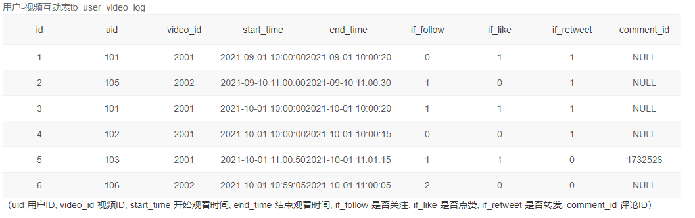
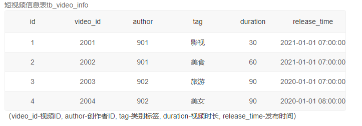

# 窗口函数、聚合函数和group by的结合使用

*关于窗口函数的使用可以看我的另一篇文章[]()*

##### 执行逻辑

在我们同时使用窗口函数、聚合函数group by时，sql语句的执行逻辑。

group by 最先起作用，按条件分组，然后在这个组内聚合函数发挥作用，统计数据，最后才是窗口函数对分完组之后的整体的数据再进行统计。


##### 使用情况示例

*[牛客SQL159](https://www.nowcoder.com/practice/d337c95650f640cca29c85201aecff84?tpId=268&tqId=2285069&ru=/exam/oj&qru=/ta/sql-factory-interview/question-ranking&sourceUrl=%2Fexam%2Foj)*

+ 数组表一：



+ 数据表二：



+ 需求：计算2021年里每个创作者每月的涨粉率及截止当月的总粉丝量

  **注**：

  - 涨粉率=(加粉量 - 掉粉量) / 播放量。结果按创作者ID、总粉丝量升序排序。
  - **if_follow-是否关注**为1表示用户观看视频中关注了视频创作者，为0表示此次互动前后关注状态未发生变化，为2表示本次观看过程中取消了关注。

+ sql:

这道题主要的问题在于，我们如何统计每个作者的粉丝人数，想要统计每个作者在每个月的粉丝人数我们就必须对数据按作者和月份分组，但是分组之后我们需要统计的是之前月份的粉丝数累加和，这种情况我能想到的最好的办法就是窗口函数了，通过over ( order by ) 可以对排序的列，逐条累加计算统计出之前的粉丝数量累计和。

```sql
select
    B.author,
    date_format (A.start_time, '%Y-%m') month,
    format (
        (
            sum(if (A.if_follow = 1, 1, 0)) - sum(if (A.if_follow = 2, 1, 0))
        ) / count(*),
        3
    ) fans_growth_rate,
    sum(
        sum(
            case
                when A.if_follow = 1 then 1
                when A.if_follow = 2 then -1
                else 0
            end
        )
    ) over (
        partition by
            author
        order by
            date_format (A.start_time, '%Y-%m') asc
    ) total_fans
from
    tb_user_video_log A
    inner join tb_video_info B on A.video_id = B.video_id
where
    year (A.start_time) = 2021
group by
    B.author,
    date_format (A.start_time, '%Y-%m')
order by
    B.author asc,
    total_fans asc
```

