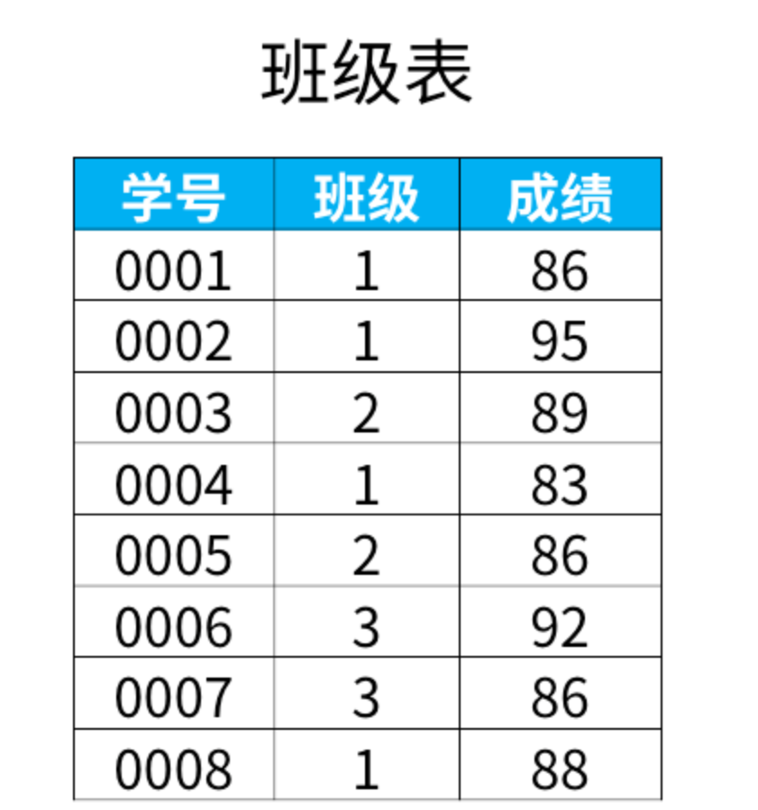
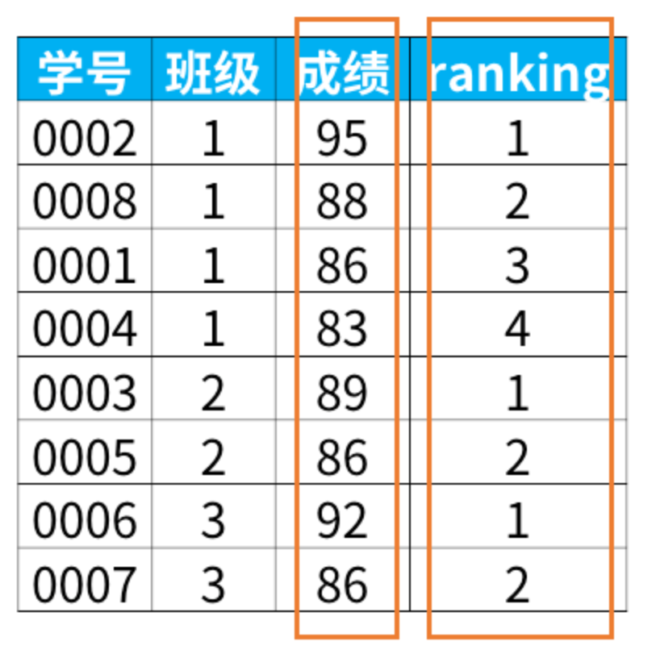
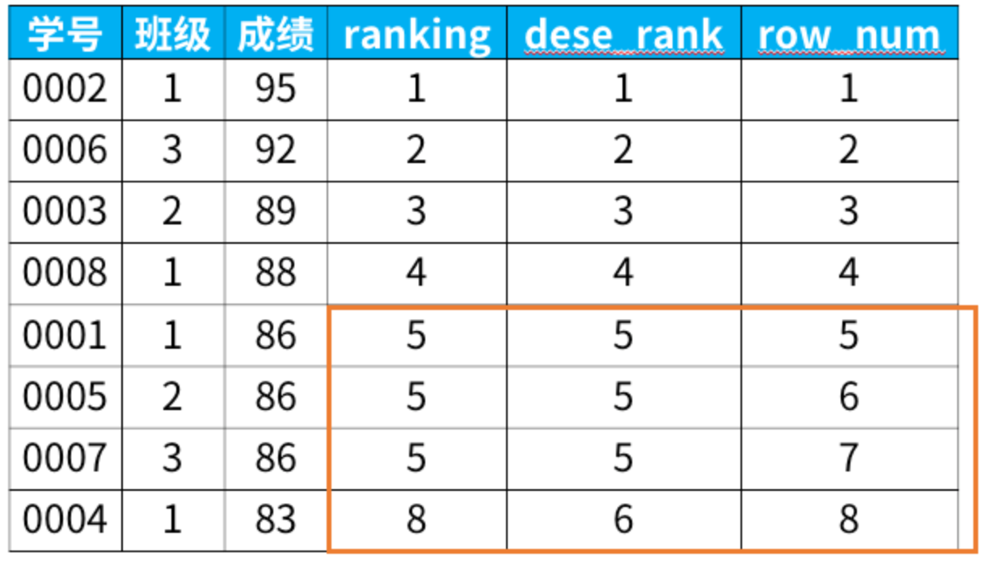
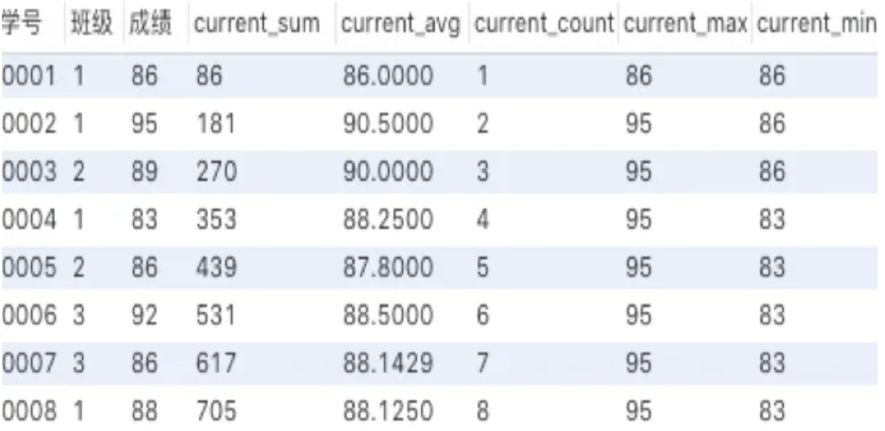

# SQL窗口函数

##### 一.窗口函数有什么用？

在日常工作中，经常会遇到需要**在每组内排名**，比如下面的业务需求：

> 排名问题：每个部门按业绩来排名
> topN问题：找出每个部门排名前N的员工进行奖励

面对这类需求，就需要使用sql的高级功能窗口函数了。

##### 二.什么是窗口函数？

窗口函数的基本语法如下：

```text
<窗口函数> over (partition by <用于分组的列名>
                order by <用于排序的列名>)
```

那么语法中的<窗口函数>都有哪些呢？

<窗口函数>的位置，可以放以下两种函数：

1） 专用窗口函数，包括后面要讲到的rank, dense_rank, row_number等专用窗口函数。

2） 聚合函数，如sum. avg, count, max, min等

因为窗口函数是对where或者group by子句处理后的结果进行操作，所以**窗口函数原则上只能写在select子句中**。


##### 三.如何使用

1. **专用窗口函数rank**

+ 例子



+ 想在每个班级内按成绩排名



```sql
select *,
   rank() over (partition by 班级
                 order by 成绩 desc) as ranking
from 班级表
```

+ 分析：

  + 我们来解释下这个sql语句里的select子句。rank是排序的函数。要求是“每个班级内按成绩排名”，这句话可以分为两部分：

    + 1）每个班级内：按班级分组

      **partition by用来对表分组**。在这个例子中，所以我们指定了按“班级”分组（partition by 班级）

    + 2）按成绩排名
    
      **order by子句的功能是对分组后的结果进行排序**，默认是按照升序（asc）排列。在本例中（order by 成绩 desc）是按成绩这一列排序，加了desc关键词表示降序排列。
  
+ 窗口函数具备了我们之前学过的group by子句分组的功能和order by子句排序的功能。那么，为什么还要用窗口函数呢？

  这是因为，**group by分组汇总后改变了表的行数，一行只有一个类别。而partiition by和rank函数不会减少原表中的行数**。


2. **其他专业窗口函数**

+ 专用窗口函数rank, dense_rank, row_number有什么区别呢？

  它们的区别我举个例子，你们一下就能看懂：

  ```text
  select *,
     rank() over (order by 成绩 desc) as ranking,
     dense_rank() over (order by 成绩 desc) as dese_rank,
     row_number() over (order by 成绩 desc) as row_num
  from 班级表
  ```



+ rank函数：这个例子中是5位，5位，5位，8位，也就是如果有并列名次的行，会占用下一名次的位置。比如正常排名是1，2，3，4，但是现在前3名是并列的名次，结果是：**1，1，1**，4。
+ dense_rank函数：这个例子中是5位，5位，5位，6位，也就是如果有并列名次的行，不占用下一名次的位置。比如正常排名是1，2，3，4，但是现在前3名是并列的名次，结果是：**1，1，1**，2。 
+ row_number函数：这个例子中是5位，6位，7位，8位，也就是不考虑并列名次的情况。比如前3名是并列的名次，排名是正常的**1，2，3**，4。


3. **聚合函数作为窗口函数**

+ 聚和窗口函数和上面提到的专用窗口函数用法完全相同，只需要把聚合函数写在窗口函数的位置即可，但是函数后面括号里面不能为空，需要指定聚合的列名。

​		我们来看一下窗口函数是聚合函数时，会出来什么结果：

```text
select *,
   sum(成绩) over (order by 学号) as current_sum,
   avg(成绩) over (order by 学号) as current_avg,
   count(成绩) over (order by 学号) as current_count,
   max(成绩) over (order by 学号) as current_max,
   min(成绩) over (order by 学号) as current_min
from 班级表
```

+ 结果




如上图，聚合函数sum在窗口函数中，是对自身记录、及位于自身记录以上的数据进行求和的结果。比如0004号，在使用sum窗口函数后的结果，是对0001，0002，0003，0004号的成绩求和，若是0005号，则结果是0001号~0005号成绩的求和，以此类推。


不仅是sum求和，平均、计数、最大最小值，也是同理，都是针对自身记录、以及自身记录之上的所有数据进行计算。


**四.总结**

**1.窗口函数语法**

```text
<窗口函数> over (partition by <用于分组的列名>
                order by <用于排序的列名>)
```

<窗口函数>的位置，可以放以下两种函数：


1） 专用窗口函数，比如rank, dense_rank, row_number等

2） 聚合函数，如sum. avg, count, max, min等


**2.窗口函数有以下功能：**

1）同时具有分组（partition by）和排序（order by）的功能

2）不减少原表的行数，所以经常用来在每组内排名

**3.注意事项**

窗口函数原则上只能写在select子句中

**4.窗口函数使用场景**

1）业务需求“**在每组内排名”**，比如：

> 排名问题：每个部门按业绩来排名
> topN问题：找出每个部门排名前N的员工进行奖励


##### 参考资料

[通俗易懂的学会：SQL窗口函数](https://zhuanlan.zhihu.com/p/92654574)