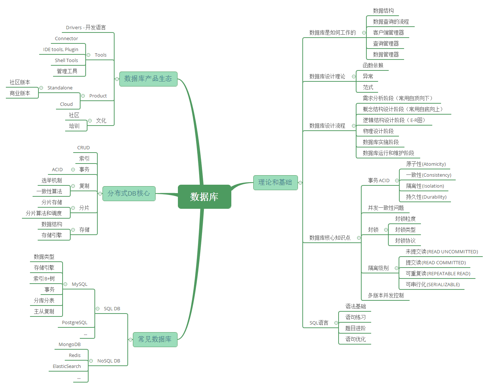

# 数据库的学习路线（还没有学习是的想法）

*首先：我是从项目入门的，由于在本科阶段也学习过数据库，但是大家懂得都懂，基本也没学会啥。在项目中就是写一些SQL语句，并且同时学习了SQL必知必会，其实对于简单的项目，如果不涉及到企业级应用，只看这本书，会写SQL就足够了。但是为了以后的工作还是想在数据库方向，多学习一些知识的，如数据库的原理，数据存储是的结构，如何优化等等，并且还想了解关于NoSQLDB的东西，所以找了很多资料，研究怎么学习sql，有了这篇文章*

##### chatGPT的回答

+ 推荐一下数据库的学习路线

数据库是计算机科学的重要分支之一，学习数据库是非常有必要的。以下是我推荐的数据库学习路线：

1. 数据结构和算法：作为计算机科学的基础知识，数据结构和算法的学习可以帮助你更好地理解数据库中的数据组织和处理。
2. SQL：SQL是关系型数据库的核心语言，学习SQL可以帮助你掌握数据库的基本操作和数据查询。
3. 数据库设计：了解数据库设计的基本原则和规范可以帮助你设计出可扩展、高效、易于维护的数据库。
4. 数据库管理系统：学习常见的数据库管理系统，如MySQL、Oracle、SQL Server等，可以帮助你了解它们的特点、优缺点以及如何安装、配置和管理它们。
5. 数据库安全：掌握数据库安全的基本概念和技术可以帮助你保护数据免受攻击和滥用。
6. 数据库性能优化：学习如何识别和优化数据库性能问题，可以帮助你提高数据库的效率和可靠性。
7. 数据仓库和数据挖掘：了解数据仓库和数据挖掘的概念和应用可以帮助你更好地利用数据库中的数据分析和决策。
8. NoSQL数据库：学习NoSQL数据库的基本概念和特点，可以帮助你了解它们与传统关系型数据库的不同之处，并为你提供更多选择。

以上是我推荐的数据库学习路线，但是在学习过程中要注重实践，通过项目实践不断提高自己的能力。

+ 当然，以下是一些数据库学习资料的推荐：

+ 当然，以下是一些数据库学习资料的推荐：

  1. 数据结构与算法：《算法导论》（Introduction to Algorithms）和《数据结构与算法分析》（Data Structures and Algorithm Analysis）。
  2. SQL：《SQL必知必会》（SQL in 10 Minutes, Sams Teach Yourself）和《Head First SQL：用图解方式学习SQL》（Head First SQL）。
  3. 数据库设计：《数据库系统概论》（Database System Concepts）和《数据库设计与实现》（Database Design and Implementation）。
  4. 数据库管理系统：MySQL官方文档（https://dev.mysql.com/doc/）、Oracle官方文档（https://docs.oracle.com/en/database/）和Microsoft SQL Server官方文档（https://docs.microsoft.com/en-us/sql/）。
  5. 数据库安全：《数据库安全指南》（Database Security: What Developers, Administrators, and Auditors Need to Know）和《Oracle数据库安全实践指南》（Oracle Database Security Best Practices）。
  6. 数据库性能优化：《高性能MySQL》（High Performance MySQL）和《SQL性能优化》（SQL Tuning）。
  7. 数据仓库和数据挖掘：《数据仓库工具包》（The Data Warehouse Toolkit）和《数据挖掘：概念与技术》（Data Mining: Concepts and Techniques）。
  8. NoSQL数据库：《NoSQL精粹》（NoSQL Distilled）和《MongoDB权威指南》（MongoDB: The Definitive Guide）。

  除此之外，还有很多优秀的在线资源和课程，例如Coursera、edX、Udemy等，都有关于数据库的课程和学习资源。可以根据自己的需求和学习风格，选择相应的学习资料和平台。

+ 有没有相关的视频学习资料

当然，以下是一些数据库视频学习资料的推荐：

1. SQL基础教程：B站UP主菜鸟教程的《SQL基础教程》系列，讲解了SQL语言的基础知识和常用操作。
2. MySQL视频教程：B站UP主尚硅谷的《MySQL视频教程》系列，涵盖了MySQL数据库的基本概念、SQL语言、数据库设计、性能优化等方面。
3. Oracle教程：YouTube上的Oracle Learning Library频道提供了大量的Oracle数据库相关的视频教程和文档，包括数据库安装、配置、管理、开发和优化等方面。
4. SQL Server教程：YouTube上的Microsoft SQL Server频道提供了关于SQL Server数据库的各种视频教程和演示，包括数据库管理、开发和BI等方面。
5. MongoDB教程：MongoDB官网提供了包括视频教程在内的各种学习资源，涵盖了MongoDB数据库的基本概念、CRUD操作、数据建模、索引和性能优化等方面。
6. NoSQL数据库教程：B站UP主黑马程序员的《NoSQL数据库教程》系列，涵盖了NoSQL数据库的基本概念、分类、应用场景、数据模型、分布式架构等方面。

以上是我推荐的一些数据库视频学习资料，可以根据自己的需求和学习进度选择相应的视频课程进行学习。同时，也可以结合书籍、在线资源和实践项目进行综合学习。

##### 我的思路

+ 基础（SQL语言）：个人认为也是应该先学习SQL必知必会的，先掌握了SQL查询语句这个是在工作中用到的最多的，而且也不是那么乏味学起来（如果你有一个具体的数据库的话，就算没有也可以去牛客网刷SQL练习）。先掌握了这个最基础的。
+ 根本（数据库设计、数据库系统概率）：下一步我认为就是先掌握数据库的设计原理了，我觉得了解这些是你以后优化你的查询的关键，而且可以应对面试。因为面试官也很喜欢问关于数据库底层数据结构和数据库的原理的一些问题（比如锁啊ACID特性什么的）
+ 非关系型数据库（NoSQL）：由于我在项目里，和网络中都经常的见到Redis数据库，而且在我的项目里也有他，这个数据库好像都会和关系型数据库搭配使用的，所以很有必要学习一下。
+ 具体（DBMS==这个目前位置可以待定，什么时候学习具体的数据库==）：学了数据库的设计原理、规则后就可以深入了解一下具体的数据库的细节了，网上的大部分资料都是关于MySQL的，可以选择看mysql，或者找一下关于oracle的课程和书籍（可以问==chatGPT==，它真的太厉害了）
+ 数据库的性能优化：学习如何识别和优化数据库性能问题，可以帮助你提高数据库的效率和可靠性。我根据这个名字的感觉，认为可以帮助我来调优我们数据库的性能，这个在工作中也是经常遇到的。
+ 了解了解（这个方面目前可以不深入看，以后用到了再具体学习吧）
  + 数据库安全、
  + 数据仓库和数据挖掘

##### 参考

[java全栈知识体系----数据库学习](https://pdai.tech/md/db/sql/sql-db.html)

[java程序员进阶之路](https://tobebetterjavaer.com/xuexiluxian/mysql.html#%E4%B9%A6%E7%B1%8D)

[chatgpt问答](https://chat.openai.com/chat)