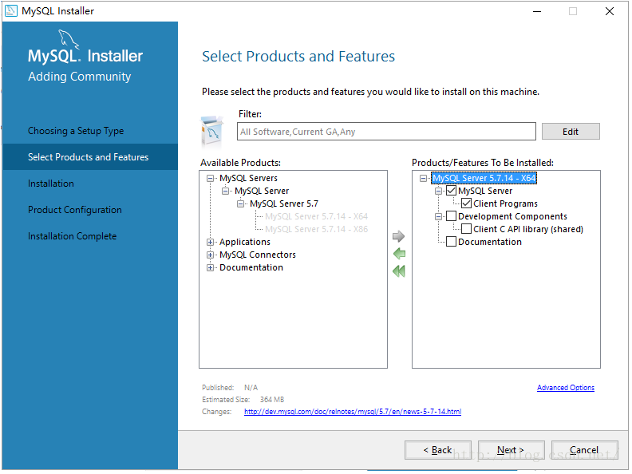

[mysql安装教程【安装版】](https://blog.csdn.net/qq_59636442/article/details/123058454)

[Windows上本地安装MySQL数据库](https://blog.csdn.net/chic_data/article/details/72286329)

+ 如果想要切换安装目录，则一定要选择Custom定制化安装

+ 在选择mysql产品时没必要选择connector，以我的使用为例，后台开发只要在maven中导入connector的依赖就可以连接到mysql了，不用再数据库安装的时候下载

+ 在选择完你要安装的产品后会有一个 Advanced Options 点进去就可以修改mysql下载目录和data目录了

