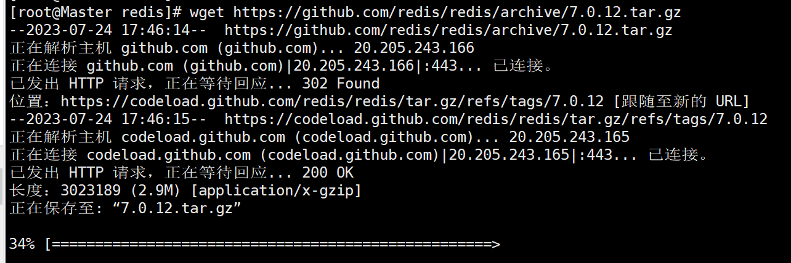
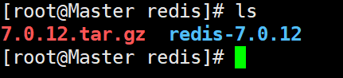
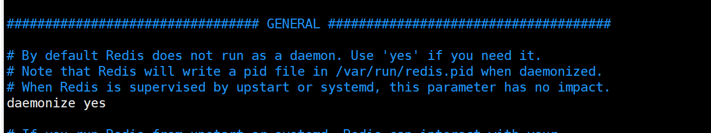
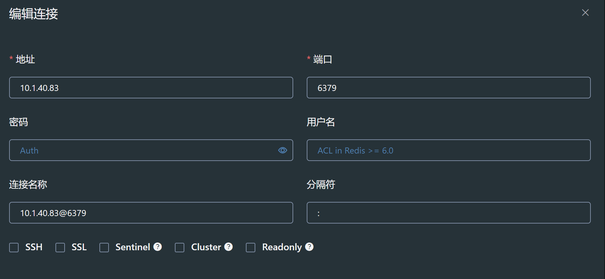
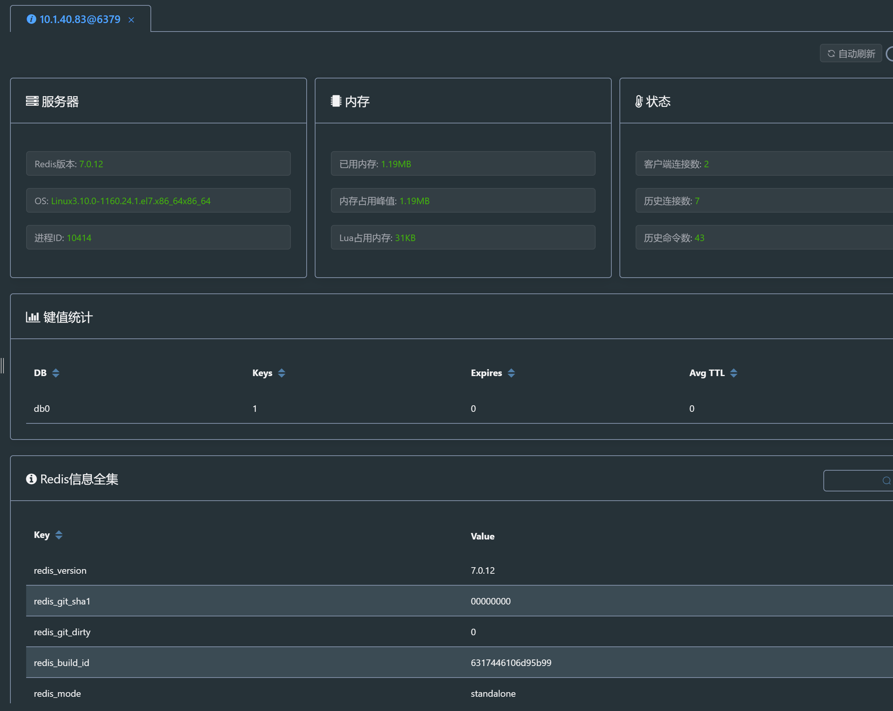

# Redis安装


### Redis安装与启动windows服务

[Redis 安装](https://www.runoob.com/redis/redis-install.html)

这样安装完在系统服务中并没有redis服务

[redis服务启动](https://blog.51cto.com/YangPC/5483487)


### Redis安装与启动Linux服务

##### 1.下载压缩包到服务器

我下载的是最新版本7.0.12，这里我是直接下载到了root目录下

```
wget https://github.com/redis/redis/archive/7.0.12.tar.gz
```

出现如下画面




##### 2.解压

将压缩文件解压，输入以下命令解压到当前目录

```
tar -zvxf 7.0.12.tar.gz
```

使用ls查看文件



##### 3.移动文件夹

一般都是下载到/usr/local/redis，所以我们直接把文件夹移动到这个目录

```
mv /root/redis-5.0.7 /usr/local/redis
```


##### 4.编译 and 安装

进入到redis文件夹下，看到有Makefile文件，输入命令make执行编译命令，接下来控制台会输出各种编译过程中输出的内容。

```
cd redis-4.0.8
make
cd src
make install PREFIX=/usr/local/redis
```

这里多了一个关键字 **`PREFIX=`** 这个关键字的作用是编译的时候用于指定程序存放的路径。比如我们现在就是指定了redis必须存放在/usr/local/redis目录。假设不添加该关键字Linux会将可执行文件存放在/usr/local/bin目录，

库文件会存放在/usr/local/lib目录。配置文件会存放在/usr/local/etc目录。其他的资源文件会存放在usr/local/share目录。这里指定好目录也方便后续的卸载，后续直接rm -rf /usr/local/redis 即可删除redis。


##### 5.移动配置文件到安装目录下

```
cd ../
mkdir /usr/local/redis/etc
mv redis.conf /usr/local/redis/etc
```


##### 6.配置redis为后台启动

将配置文件中的daemonize no 改成daemonize yes

```
cd etc/
vim redis.conf
```



通过 /daemonize 查找到属性，默认是no，更改为yes即可。 (vim可以通过`/关键字`查找出现多个结果则使用 n字符切换到下一个即可，查找到结果后输入:noh退回到正常模式)


##### 7.将redis加入到开机启动

```
vi /etc/rc.local //在里面添加内容：/usr/local/redis/bin/redis-server /usr/local/redis/etc/redis.conf (意思就是开机调用这段开启redis的命令)
```


##### 8.开启redis

```
/usr/local/redis/bin/redis-server /usr/local/redis/etc/redis.conf 
```


##### 9.将redis-cli,redis-server拷贝到bin下，让redis-cli指令可以在任意目录下直接使用

```
cp /usr/local/redis/bin/redis-server /usr/local/bin/
cp /usr/local/redis/bin/redis-cli /usr/local/bin/
```


##### 10.让防火墙通过（外网可以访问）

防火墙可能每个Linux使用的不同，所以这里不给出具体命令，请自行百度

```
a.配置防火墙:  


b.虽然防火墙开放了6379端口，但是外网还是无法访问的，因为redis监听的是127.0.0.1：6379，并不监听外网的请求。

（一）把文件夹目录里的redis.conf配置文件里的bind 127.0.0.1前面加#注释掉

（二）命令：redis-cli连接到redis后，通过 config get  daemonize和config get  protected-mode 是不是都为no，如果不是，就用config set 配置名 属性 改为no。
```


##### 11.使用工具连接redis

我使用的是another redis desktop manager，用户名密码默认空



成功连接




##### 参考

[Linux安装部署Redis(超级详细)](https://www.cnblogs.com/hunanzp/p/12304622.html)

[linux 安装redis 完整步骤](https://juejin.cn/post/7012898467643621412)
