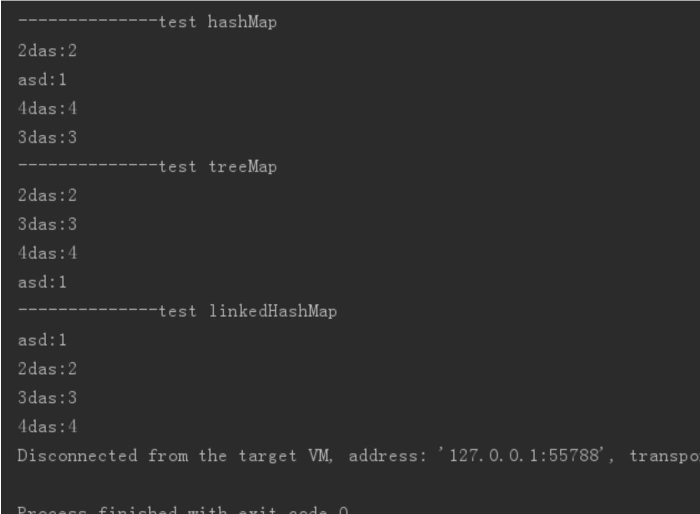
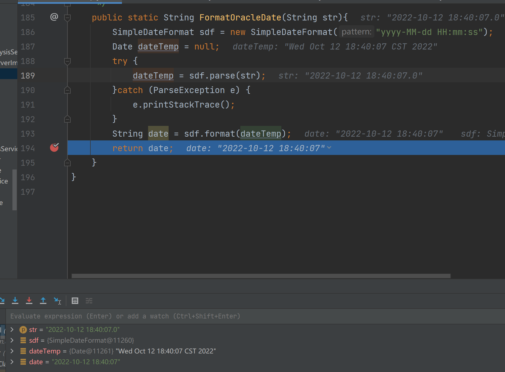

# stuprpfile

#  projects

<br>

### 1.map

一般使用map用的最多的就是hashmap，但是hashmap里面的元素是不按添加顺序排序的，那么除了使用hashmap外，还有什么map接口的实现类可以用呢？

这里有2个，treeMap和linkedHashMap，但是，要达到我们的要求：按添加顺序保存元素的，就只有LinkedHashMap。

```java
public class OrderedMapTest {
    public static void main(String[] args) {
        Map<String, Integer> hashMap = Maps.newHashMap();
        Map<String, Integer> treeMap = Maps.newTreeMap();
        Map<String, Integer> linkedHashMap = Maps.newLinkedHashMap();
        System.out.println("--------------test hashMap");
        testMap(hashMap);
        System.out.println("--------------test treeMap");
        testMap(treeMap);
        System.out.println("--------------test linkedHashMap");
        testMap(linkedHashMap);
    }
 
    private static void testMap(Map<String, Integer> map) {
        map.put("asd", 1);
        map.put("2das", 2);
        map.put("3das", 3);
        map.put("4das", 4);
        for (Map.Entry<String, Integer> entry : map.entrySet()) {
            System.out.println(entry.getKey() + ":" + entry.getValue());
        }
    }
 

```

运行结果



<br>

### 2.ORACLE

+ oracle的sql中对于字符串要用单引号```''```
+ 不要用```{}```,用```()```


### 3.SimpleDateFormat的使用

[lianjie](https://www.runoob.com/markdown/md-link.html)





### 4.Java中使用DigestUtils工具类对数据进行MD5加密

[Java中使用DigestUtils工具类对数据进行MD5加密](https://blog.csdn.net/weixin_44009447/article/details/106500353)
