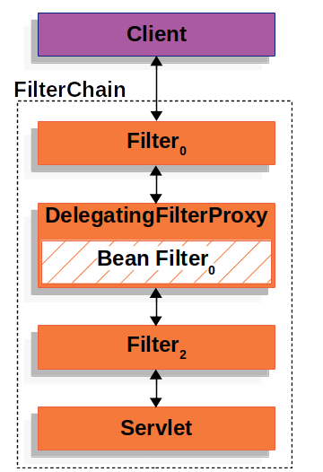
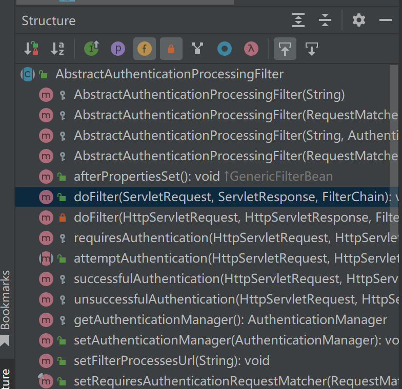
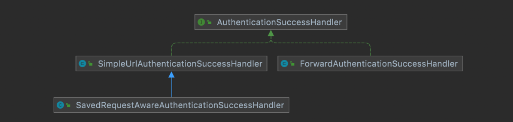

# Spring Security

*编程不良人B站视频*

[TOC]

## 第二章 环境搭建


### 整合Spring Security

+ 当我们引入Spring Security依赖时，所有接口都会被默认保护

```xml
<!--引入spring security依赖-->
<dependency>
  <groupId>org.springframework.boot</groupId>
  <artifactId>spring-boot-starter-security</artifactId>
</dependency>
```

> 2.再次启动项目
>
> - 1.启动完成后控制台生成一个密码
> - 2.访问 hello 发现直接跳转到登录页面


> 3.登录系统
>
> - 默认用户名为: user
> - 默认密码为:  控制台打印的 uuid


### 实现原理

>  虽然开发者只需要引入一个依赖，就可以让 Spring Security 对应用进行保护。Spring Security 又是如何做到的呢？

> 在 Spring Security 中 `认证、授权` 等功能都是基于[过滤器](https://docs.spring.io/spring-security/site/docs/5.5.4/reference/html5/#servlet-architecture)完成的。


+ 过滤器Filter是java web组件，在请求到达Servlet前进行处理
+ Spring Boot 中的Filter并不是直接放在java web的filter中，而是通过一个 $DelegatingFilterProxy$ (授权过滤器代理) 进行代理。因为java web原生的 filter 无法==使用一些 Spring Boot 的特性==，所以使用了一个这样的代理同时方便管理。
+ $DelegatingFilterProxy$ 顶层代理，管理所有的Spring Boot过滤器，通过它转发给我们的 Spring Boot 的过滤器



+ $DelegatingFilterProxy$ 顶层代理，肯定不能只管理一个Filter，所以在它下面还有一个 $ FilterChainProxy$ 过滤器链代理
+ $ FilterChainProxy$ (过滤器链代理) 二级代理，管理所有的过滤器链，通过它转发给所有的过滤器链


+  $SecurityFilterChain$ Spring Security过滤器链，由它来管理我们的Spring Security的过滤器链，过滤器链中可以有多个过滤器


+ 可以根据url的不同配置多个Spring Security的过滤器链


> 需要注意的是，默认过滤器并不是直接放在 Web 项目的原生过滤器链中，而是通过一个
> FlterChainProxy 来统一管理。Spring Security 中的过滤器链通过 FilterChainProxy 嵌入到 Web项目的原生过滤器链中。FilterChainProxy  作为一个顶层的管理者，将统一管理 Security Filter。FilterChainProxy 本身是通过 Spring 框架提供的 DelegatingFilterProxy 整合到原生的过滤器链中。


### 默认用户生成

1. $UsernamePasswordAuthenticationFilter$ 这个过滤器不是java web的原生过滤器，是Spring Boot的过滤器，所以可以没有doFilter方法。


源码分析为什么没有doFilter方法

+ $attemptAuthentication$ 是 $UsernamePasswordAuthenticationFilter$ 过滤器的主要功能方法，主要作用：从request中取出用户名密码，形成token，交给$AuthenticationManager$ 中的 $authenticate$ 方法去处理认证的流程。但是它没有doFilter方法，又是怎么运行到这里的呢

```java
    public Authentication attemptAuthentication(HttpServletRequest request, HttpServletResponse response) throws AuthenticationException {
        if (this.postOnly && !request.getMethod().equals("POST")) {
            throw new AuthenticationServiceException("Authentication method not supported: " + request.getMethod());
        } else {
            String username = this.obtainUsername(request);
            username = username != null ? username : "";
            username = username.trim();
            String password = this.obtainPassword(request);
            password = password != null ? password : "";
            UsernamePasswordAuthenticationToken authRequest = new UsernamePasswordAuthenticationToken(username, password);
            this.setDetails(request, authRequest);
            return this.getAuthenticationManager().authenticate(authRequest);
        }
    }
```

+ 可以看到他继承了父类（抽象类），可能是父类中实现了doFilter方法，我们去查看父类源码

```java
public class UsernamePasswordAuthenticationFilter extends AbstractAuthenticationProcessingFilter {
```

+ 可以看到父类的结构，确实有doFilter方法，那么又是怎么调用了我们的$attemptAuthentication$ 方法呢？我们去看这里的doFilter源码



+ doFilter源码，可以看到在第十行调用了 $attemptAuthentication$ 方法，我们看父类中的这个方法源码

```java
public void doFilter(ServletRequest request, ServletResponse response, FilterChain chain) throws IOException, ServletException {
        this.doFilter((HttpServletRequest)request, (HttpServletResponse)response, chain);
    }

    private void doFilter(HttpServletRequest request, HttpServletResponse response, FilterChain chain) throws IOException, ServletException {
        if (!this.requiresAuthentication(request, response)) {
            chain.doFilter(request, response);
        } else {
            try {
                Authentication authenticationResult = this.attemptAuthentication(request, response);
                if (authenticationResult == null) {
                    return;
                }

                this.sessionStrategy.onAuthentication(authenticationResult, request, response);
                if (this.continueChainBeforeSuccessfulAuthentication) {
                    chain.doFilter(request, response);
                }

                this.successfulAuthentication(request, response, chain, authenticationResult);
            } catch (InternalAuthenticationServiceException var5) {
                this.logger.error("An internal error occurred while trying to authenticate the user.", var5);
                this.unsuccessfulAuthentication(request, response, var5);
            } catch (AuthenticationException var6) {
                this.unsuccessfulAuthentication(request, response, var6);
            }

        }
    }
```

+ 可以看到父类中的这个方法是个抽象方法，因为这也是个抽象类。所以我们可以明白它的调用流程了

> 在 $UsernamePasswordAuthenticationFilter$ 过滤器对象中调用doFilter方法，因为子类没有实现这个方法，所以会自动继承了父类中的doFilter方法，调用父类的doFilter方法，然后在doFilter方法中调用 $attemptAuthentication$ 方法

```java
 public abstract Authentication attemptAuthentication(HttpServletRequest var1, HttpServletResponse var2) throws AuthenticationException, IOException, ServletException;
```


2. 

## 自定义认证

*自定义Spring Security 认证实现*

### 自定义资源权限规则

- 资源分为公共资源（common）和受限资源


- /portal  公共资源
- /hello .... 受保护资源 权限管理

我们继承 $WebSecurityConfigurerAdapter$ 类即可自定义配置 

```java
@Configuration
public class WebSecurityConfigurer extends WebSecurityConfigurerAdapter {
    @Override
    protected void configure(HttpSecurity http) throws Exception {
        http.authorizeHttpRequests()
                .mvcMatchers("/index").permitAll()
                .anyRequest().authenticated()
                .and().formLogin();
    }
}
```

```markdown
# 说明
- permitAll() 代表放行该资源,该资源为公共资源 无需认证和授权可以直接访问
- anyRequest().authenticated() 代表所有请求,必须认证之后才能访问
- formLogin() 代表开启表单认证
## 注意: 放行资源必须放在所有认证请求之前!
```


### 自定义登录界面

*前后端分离和前后端不分离*

#### 前后端不分离（thymeleaf）

*我们先使用thymeleaf*

+ 引入thymeleaf依赖

```xml
<!--thymeleaf-->
<dependency>
  <groupId>org.springframework.boot</groupId>
  <artifactId>spring-boot-starter-thymeleaf</artifactId>
</dependency>
```

+ 自定义登录的contriller

> 解释一下这个return  "login"：他会自动的去寻找resources目录下的templates目录下的login.html文件，thymeleaf会自动加上文件路径前缀和html的文件后缀

```java
@Controller
public class LoginController {

    @RequestMapping("/login.html")
    public String login() {
        return "login";
    }
}
```

+ 在 templates 中定义登录界面

```html
<!DOCTYPE html>
<html lang="en" xmlns:th="https://www.thymeleaf.org">
<head>
    <meta charset="UTF-8">
    <title>登录</title>
</head>
<body>
<h1>用户登录</h1>
<form method="post" th:action="@{/login}">
    用户名:<input name="username" type="text"/><br>
    密码:<input name="password" type="password"/><br>
    <input type="submit" value="登录"/>
</form>
</body>
</html>
```

> - **需要注意的是**
>
>   - 登录表单 method 必须为 `post`，action 的请求路径为 `/login`
>   - 用户名的 name 属性必须为 `username`
>   - 密码的 name 属性必须为 `password`
>
> - 至于原因，我们可以去查看源码，当我们使用formLogin时，我们实际上处理这个请求的Filter是 $UsernamePasswordAuthenticationFilter$ 在这个Filter中我们默认登录的请求必须是Post方法，请求的url必须是`/login`，用户名和密码的参数必须是username，password。
>


+ 配置 Spring Security 配置类

```java
@Configuration
public class WebSecurityConfigurer extends WebSecurityConfigurerAdapter {
    @Override
    protected void configure(HttpSecurity http) throws Exception {
         http.authorizeHttpRequests()
                .mvcMatchers("/login.html").permitAll()
                .mvcMatchers("/index").permitAll()
                .anyRequest().authenticated()
                .and()
                .formLogin()
                .loginPage("/login.html")
                .and()
                .csrf().disable();//这里先关闭 CSRF
    }
}
```

+ 当我们完成了上述配置后我们尝试进行登录认证，我们使用配置文件中指定的用户名和密码登录我们会发现，返回了http状态码302又重定向到了登陆界面

> 这是因为我们的登陆操作（点击登录按钮），请求的url为`/login`这个url也是被保护的所以我们又重定向到了登录页面。这时候小伙伴们肯定又有疑问了，之前的 $UsernamePasswordAuthenticationFilter$ 过滤器不是会默认处理`/login` 的请求吗？是的！但是！当我们自己指定了我们自定义的登录页面之后，这个处理登录请求的url我们也必须要显示的自己指定！


+ 修改 Spring Security 配置类

> 我们可以自己制定处理登录操作的url，这里指定为`/doLogin`，并且可以指定前端的用户名和密码的参数名称，还可以指定登陆成功后默认跳转的页面（前后端不分离项目中使用，在前后端分离项目中不适用）

 ```java
 @Configuration
 public class WebSecurityConfigurer extends WebSecurityConfigurerAdapter {
     @Override
     protected void configure(HttpSecurity http) throws Exception {
          http.authorizeHttpRequests()
                 .mvcMatchers("/login.html").permitAll() //放行资源写在任何前面
                 .mvcMatchers("/index").permitAll()
                 .anyRequest().authenticated()
                 .and()
                 .formLogin()
                 .loginPage("/login.html") //用来指定默认登录页面 注意: 一旦自定义登录页面以后必须指定登录url
                 .loginProcessingUrl("/doLogin") //指定处理登录请求 url
                 .usernameParameter("uname")
                 .passwordParameter("passwd")
                 //.successForwardUrl("/index") 		 //认证成功 forward 跳转路径  始终在认证成功之后跳转到指定请求
                 .defaultSuccessUrl("/index")   //认证成功 redirect 之后跳转   根据上一保存请求进行成功跳转
                 .failureUrl("/login.html")
                 .and()
                 .csrf().disable();//这里先关闭 CSRF
     }
 }
 ```


##### 关于forward跳转和redirect跳转

> + forward
>
> 在Java Web中，forward跳转是一种服务器端跳转的方式。当一个页面或者一个Servlet请求转发到另外一个页面或者Servlet时，就可以使用forward跳转。在forward跳转中，浏览器只发出一次请求，服务器端将请求转发到另外一个页面或者Servlet，并且将响应返回给浏览器，这样浏览器就可以看到另外一个页面或者Servlet的内容了。在forward跳转中，请求转发后的页面或者Servlet无法获得浏览器的地址栏中的URL信息。
>
> + redirect
>
> 重定向跳转是一种通过发送HTTP重定向响应来引导用户浏览器跳转到新页面的机制。在重定向跳转中，浏览器会向服务器发出第一次请求，服务器接收请求后响应一个302状态码和新的Location头部指向目标页面的URL。浏览器接收到这个响应后会自动向新的URL发送第二次请求，从而实现页面的跳转。与 forward 跳转不同的是，重定向跳转是两个独立的请求，因此在第二个请求中不会再次调用原先的处理器。重定向跳转的优点是可以保持URL的更改，同时可以在新页面重新加载数据，缺点是会增加网络请求的开销。


#### 自定义登录成功处理

*前后端分离*

+ 有时候页面跳转并不能满足我们，特别是在前后端分离开发中就不需要成功之后跳转页面。只需要给前端返回一个 JSON 通知登录成功还是失败与否。这个时候可以通过自定义 $AuthenticationSucccessHandler$ 实现

```java
public interface AuthenticationSuccessHandler {

	/**
	 * Called when a user has been successfully authenticated.
	 * @param request the request which caused the successful authentication
	 * @param response the response
	 * @param authentication the <tt>Authentication</tt> object which was created during
	 * the authentication process.
	 */
	void onAuthenticationSuccess(HttpServletRequest request, HttpServletResponse response,
			Authentication authentication) throws IOException, ServletException;
}
```

+ **根据接口的描述信息,也可以得知登录成功会自动回调这个方法，进一步查看它的默认实现，你会发现successForwardUrl、defaultSuccessUrl也是由它的子类实现的**



+ 自定义 $AuthenticationSuccessHandle$ 实现登录成功的处理

> 其实前后端分离项目的交互方式也是通过http协议的，只是在http协议的body部分约定了其中的数据格式为application/json因为json格式轻量级，解析方便，即使我们在controller层返回的可能只是一个java实体或者字符串，但是 spring boot 底层可以自动进行解析，把实体解析为json对象放回到response对象的body中（通过获取到ServletRequest对象的输出流进行写入JSON）。所以在一些处理中我们可以直接向response对象输出流中中写入数据进行返回

```java
public class MyAuthenticationSuccessHandler implements AuthenticationSuccessHandler {
    @Override
    public void onAuthenticationSuccess(HttpServletRequest request, HttpServletResponse response, Authentication authentication) throws IOException, ServletException {
        Map<String, Object> result = new HashMap<String, Object>();
        result.put("msg", "登录成功");
        result.put("status", 200);
        result.put("authentication", authentication);
        response.setContentType("application/json;charset=UTF-8");
        String s = new ObjectMapper().writeValueAsString(result);
        response.getWriter().println(s);
    }
}
```

+ 配置 AuthenticationSuccessHandler

```java
@Configuration
public class WebSecurityConfigurer extends WebSecurityConfigurerAdapter {
    @Override
    protected void configure(HttpSecurity http) throws Exception {
        http.authorizeHttpRequests()
                //...
                .and()
                .formLogin()
                //....
                .successHandler(new MyAuthenticationSuccessHandler())//前后端分离时的登陆成功处理方式
                .failureUrl("/login.html")
                .and()
                .csrf().disable();//这里先关闭 CSRF
    }
}
```


### 显示登录失败信息

*分为前后端分离与不分离版本*

#### 前后端不分离

+ 配置

```java
@Configuration
public class WebSecurityConfigurer extends WebSecurityConfigurerAdapter {

    @Override
    protected void configure(HttpSecurity http) throws Exception {
        http.authorizeHttpRequests()
              	//..
                .and()
                .formLogin()
                //....
                //.failureUrl("/login.html") // 默认 认证失败之后 redirect 跳转
                .failureForwardUrl("/login.html") //认证失败之后 forward 跳转
                .and()
                .csrf().disable();//这里先关闭 CSRF
    }
}

```

> failureUrl、failureForwardUrl 关系类似于之前提到的 successForwardUrl 、defaultSuccessUrl 方法
>
> - failureUrl 失败以后的重定向跳转
> - failureForwardUrl 失败以后的 forward 跳转 `注意:因此获取 request 中异常信息,这里只能使用failureForwardUrl`

#### 自定义登录失败处理

*前后端分离*

+ 和自定义登录成功处理一样，Spring Security 同样为前后端分离开发提供了登录失败的处理，这个类就是  AuthenticationFailureHandler，源码为：

```java
public interface AuthenticationFailureHandler {

	/**
	 * Called when an authentication attempt fails.
	 * @param request the request during which the authentication attempt occurred.
	 * @param response the response.
	 * @param exception the exception which was thrown to reject the authentication
	 * request.
	 */
	void onAuthenticationFailure(HttpServletRequest request, HttpServletResponse response,
			AuthenticationException exception) throws IOException, ServletException;

}
```

+ **根据接口的描述信息,也可以得知登录失败会自动回调这个方法，进一步查看它的默认实现，你会发现failureUrl、failureForwardUrl也是由它的子类实现的。**


+ 自定义 AuthenticationFailureHandler 实现

```java
public class SecurityAuthenticationFailureHandler implements AuthenticationFailureHandler {

    @Override
    public void onAuthenticationFailure(HttpServletRequest request, HttpServletResponse response, AuthenticationException exception) throws IOException, ServletException {

        Authentication authentication; //认证对象

        Map<String, Object> result = new HashMap<>();
        result.put("msg", "登录失败: " + exception.getMessage());
        result.put("status", 500);
        response.setContentType("application/json;charset=UTF-8");
        String s = new ObjectMapper().writeValueAsString(result);
        response.getWriter().println(s);
    }
}

```

+ 配置 AuthenticationFailureHandler

```java
@Configuration
public class WebSecurityConfigurer extends WebSecurityConfigurerAdapter {

    @Override
    protected void configure(HttpSecurity http) throws Exception {
        http.authorizeHttpRequests()
	              //...
                .and()
                .formLogin()
               	//..
                .failureHandler(new MyAuthenticationFailureHandler())
                .and()
                .csrf().disable();//这里先关闭 CSRF
    }
}
```


##### 参考

[【编程不良人】SpringSecurity 最新实战教程，知识点完结！](https://www.bilibili.com/video/BV1z44y1j7WZ?p=5&vd_source=88553068aea08e911c13f3696d2bfaa2)
