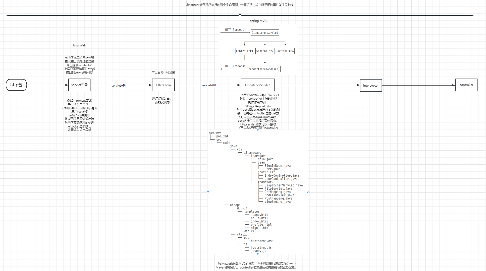

##### servlet容器

> Servlet容器是一种用于运行Java Servlet（服务器端Java程序）的软件环境，它负责处理HTTP请求和响应，并管理Servlet的生命周期。Servlet容器实现了Java Servlet规范，并提供了一些额外的功能，如HTTP连接管理、会话管理、安全认证、请求处理、响应生成等。
>
> 在Java Web应用程序中，Servlet容器通常作为Web服务器的一部分运行，负责接收HTTP请求，并将请求交给相应的Servlet进行处理。Servlet容器负责管理Servlet的生命周期，包括初始化、实例化、销毁等操作。Servlet容器还提供了一些管理Servlet的功能，如Servlet映射、请求分发、过滤器、监听器等。
>
> 常见的Servlet容器包括Tomcat、Jetty、Undertow等。Spring Boot默认使用嵌入式Servlet容器，可以直接在应用程序中引入相应的依赖，并配置相应的属性来选择不同的Servlet容器。嵌入式Servlet容器的优点是可以将应用程序和Servlet容器一起打包，方便部署和分发，同时也提供了简化的配置和管理方式。

##### Spring MVC和servlet

> Spring MVC是一个基于Java的Web应用程序框架，用于构建基于MVC（Model-View-Controller）设计模式的Web应用程序。它是Spring框架的一部分，提供了一组用于处理HTTP请求和响应的组件，包括控制器、视图和模型。
>
> Servlet（Serverlet）是Java中的一种用于处理Web请求和响应的规范（Specification）。它定义了一种在Web服务器上运行的Java类的方式，用于处理HTTP请求和生成HTTP响应。Servlet通常运行在Java Servlet容器中，如Tomcat、Jetty等，它负责管理Servlet的生命周期、处理请求和响应、线程管理等。
>
> Spring MVC框架基于Servlet规范，通过Servlet容器来处理HTTP请求和生成HTTP响应。Spring MVC提供了一种基于注解和配置的方式来定义和处理控制器、视图和模型，以实现Web应用程序的业务逻辑和用户界面。因此，可以说Spring MVC是在Servlet规范之上构建的一种高级Web应用程序框架，提供了更加灵活和强大的功能来简化Web应用程序的开发和维护。

##### Filter and Intercept

> 在Spring Boot中，拦截器（Interceptor）和过滤器（Filter）都是用于在请求到达控制器之前或者在响应返回客户端之前进行处理的组件，用于实现对请求和响应进行处理的功能。虽然它们在功能上有一些相似之处，但它们在实现上有一些不同。
>
> 以下是关于拦截器和过滤器在Spring Boot中的一些基本概念和区别：
>
> 1. 拦截器（Interceptor）：
> - 拦截器是基于Spring MVC框架的组件，它可以在请求到达控制器之前（preHandle）、在控制器处理请求之后返回响应给客户端之前（postHandle）、在响应返回客户端之后（afterCompletion）等时机进行处理。
> - 拦截器可以访问并修改请求和响应对象，例如修改请求参数、验证用户身份、记录请求日志等。
> - 拦截器在Spring MVC框架中通过实现 HandlerInterceptor 接口来定义，并通过配置 WebMvcConfigurer 或使用 @Interceptor 注解来注册。
>
> 2. 过滤器（Filter）：
> - 过滤器是基于Servlet规范的组件，它可以在请求到达Servlet容器之前或者在响应返回客户端之前进行处理。
> - 过滤器可以访问并修改请求和响应对象，例如修改请求参数、验证用户身份、记录请求日志等。
> - 过滤器在Servlet容器中通过实现 Filter 接口来定义，并通过配置 FilterRegistrationBean 或使用 @WebFilter 注解来注册。
>
> 区别：
> - 拦截器是基于Spring MVC框架的组件，而过滤器是基于Servlet规范的组件，它们的处理时机和注册方式不同。
> - 拦截器可以访问和修改Handler处理器相关的信息，例如控制器的处理方法、处理方法的参数和返回值等；而过滤器只能访问和修改HttpServletRequest和HttpServletResponse对象。
> - 拦截器只对Spring MVC中的请求有效，不会对其他类型的请求产生影响；而过滤器对所有类型的请求都有效，包括静态资源和Servlet请求。
> - 拦截器只能在Spring MVC的请求处理流程中进行处理，而过滤器可以在Servlet容器中对请求进行处理，不受Spring MVC框架的限制。
> - 拦截器可以在Handler处理器处理之前和之后进行处理，而过滤器可以在请求到达Servlet容器之前和之后进行处理。
> - 拦截器在处理异常时，异常会被Spring MVC框架处理，可以通过@ControllerAdvice全局异常处理器进行处理；而过滤器在处理异常时，异常会被Servlet容器处理，需要通过web.xml中的<error-page>配置或者自定义错误处理Servlet进行处理。
>
> 需要注意的是，拦截器和过滤器虽然功能上有一些相似之处，但是在使用时需要根据实际需求选择合适的方式。一般来说，如果需要对请求和响应进行更细粒度的处理，例如访问和修改Handler处理器相关的信息，或者需要在Spring MVC框架中进行全局异常处理，那么拦截器是一个更合适的选择。如果只需要对请求和响应进行简单的处理，例如修改请求参数、验证用户身份等，或者需要对所有类型的请求进行处理，包括静态资源和Servlet请求，那么过滤器是一个更合适的选择。
>
> 在Spring Boot项目中，可以通过使用@Interceptor注解和实现HandlerInterceptor接口来定义和注册拦截器，或者通过使用@WebFilter注解和实现Filter接口来定义和注册过滤器。可以根据项目需求和开发团队的实际情况选择合适的方式来进行请求和响应的处理。

##### springboot项目内置了那些监听器

> Spring Boot内置了一些常用的监听器，用于监听应用程序的生命周期事件、请求事件、会话事件等。以下是一些常见的Spring Boot内置监听器：
>
> 1. `ServletContextListener`：用于监听`ServletContext`（Servlet上下文）的生命周期事件，如初始化和销毁事件。可以通过实现`ServletContextListener`接口来创建自定义的`ServletContextListener`。
>
> 2. `ServletRequestListener`：用于监听HTTP请求的生命周期事件，如请求初始化和请求销毁事件。可以通过实现`ServletRequestListener`接口来创建自定义的`ServletRequestListener`。
>
> 3. `HttpSessionListener`：用于监听HTTP会话的生命周期事件，如会话创建和会话销毁事件。可以通过实现`HttpSessionListener`接口来创建自定义的`HttpSessionListener`。
>
> 4. `ApplicationListener`：用于监听Spring Boot应用程序的生命周期事件，如应用程序启动和关闭事件。可以通过实现`ApplicationListener`接口来创建自定义的`ApplicationListener`。
>
> 5. `SmartLifecycle`：用于监听Spring Boot应用程序的生命周期事件，但与`ApplicationListener`不同的是，`SmartLifecycle`接口允许实现者控制监听器的启动和停止时机。可以通过实现`SmartLifecycle`接口来创建自定义的`SmartLifecycle`。
>
> 这些内置监听器可以通过在Spring Boot应用程序中添加相应的bean来注册和配置。例如，可以通过在配置类中使用`@Bean`注解来创建和配置自定义的监听器，并将其注册到Spring Boot应用程序的上下文中。

##### 监听器是在springboot程序的整个生命流程中一直运行吗

> 是的，监听器在Spring Boot应用程序的整个生命周期中会一直运行，监听相应的事件并执行相应的逻辑。监听器可以在应用程序启动时自动注册，并在应用程序关闭时自动销毁。例如，`ApplicationListener`和`SmartLifecycle`监听器会在应用程序启动和关闭时自动触发相应的事件回调方法。
>
> 需要注意的是，监听器的生命周期和作用范围由监听器的类型和注册方式决定。例如，通过实现`ApplicationListener`接口的监听器会在整个Spring Boot应用程序的生命周期中一直运行，而通过`@EventListener`注解定义的监听器只会在所属的Spring管理的Bean的生命周期中运行。因此，在使用监听器时，需要根据具体的需求和业务场景选择合适的监听器类型，并在应用程序中进行正确的注册和配置。

##### 监听器会在它监听的事件发生后触发对吗

> 是的，监听器会在其监听的事件发生后触发。监听器会在特定的事件发生时自动调用相应的回调方法，以执行预定义的逻辑。例如，在Spring Boot中，`ApplicationListener`监听器可以监听应用程序启动和关闭事件，从而在应用程序启动和关闭时执行相应的逻辑。类似地，通过`@EventListener`注解定义的监听器可以监听Spring事件，例如Bean初始化完成、HTTP请求处理完成等事件，从而在这些事件发生后触发相应的逻辑。
>
> 需要注意的是，不同类型的监听器可能对应不同的事件触发时机和事件处理逻辑。因此，在使用监听器时，需要仔细了解监听器的文档和用法，确保监听器的逻辑与应用程序的需求一致，并在应用程序中正确配置和注册监听器。

##### Spring Boot中的由拦截器实现的功能具体举例

> 在Spring Boot中，通过拦截器可以实现许多功能，例如：
>
> 1. 身份验证和授权：可以使用拦截器对用户身份进行验证，并根据用户的权限和角色进行授权。例如，可以在拦截器中检查用户是否登录，是否具有访问某些资源或执行某些操作的权限。
>
> 2. 日志记录：可以使用拦截器记录请求和响应的日志信息，例如请求的URL、请求参数、响应状态码、响应内容等，用于日志审计、性能监控等目的。
>
> 3. 请求参数校验：可以使用拦截器对请求的参数进行校验，例如检查参数的合法性、格式、长度等，从而保证请求的合法性和安全性。
>
> 4. 缓存管理：可以使用拦截器实现缓存管理功能，例如在拦截器中检查缓存中是否存在某个资源的副本，如果存在则返回缓存中的数据，否则从数据库或其他数据源中获取数据并存入缓存。
>
> 5. 跨域请求处理：可以使用拦截器实现跨域请求处理，例如设置响应头信息，允许跨域请求的来源、方法、头部等。
>
> 6. 请求日志脱敏：可以使用拦截器对请求和响应中的敏感信息进行脱敏处理，例如将请求中的手机号、身份证号、密码等敏感信息进行脱敏，保护用户隐私。
>
> 以上只是一些示例，实际上拦截器可以根据业务需求实现各种不同的功能。拦截器在Spring Boot中通过实现`HandlerInterceptor`接口来定义，然后在配置类中注册为Bean，并通过`addInterceptor()`方法添加到拦截器链中，从而在请求处理过程中按照注册的顺序依次执行。

##### 日志功能到底是由监听器还是拦截器实现的？

> 日志功能通常是通过日志框架和日志库来实现的，而不是通过监听器或拦截器。监听器和拦截器在Spring Boot中可以用于记录请求和响应的一些信息，例如请求的URL、请求参数、响应状态码等，但通常不用于实现完整的日志功能。
>
> 在Spring Boot项目中，通常使用日志框架如Logback、Log4j2等，通过配置日志级别、输出格式、日志文件路径等参数来实现日志记录的功能。这些日志框架会根据日志级别来记录日志信息，例如DEBUG、INFO、WARN、ERROR等，可以在应用程序的不同部分记录不同级别的日志，以便于调试、问题定位、性能监控等目的。
>
> 拦截器和监听器主要用于在请求处理过程中对请求和响应进行拦截和处理，例如身份验证、授权、请求参数校验、跨域请求处理等，而不是专门用于实现日志记录的功能。当然，拦截器和监听器也可以结合日志框架一同使用，例如在拦截器或监听器中记录日志信息，但这通常是一种辅助手段，实现日志功能的主要方式还是通过专门的日志框架和日志库。

##### 身份验证功能由拦截器还是过滤器实现

> 身份验证功能通常由拦截器或过滤器来实现，具体取决于使用的技术栈和架构设计。
>
> 在Spring Boot项目中，通常可以使用拦截器或过滤器来实现身份验证功能。拦截器是Spring MVC提供的一种机制，通过实现HandlerInterceptor接口可以在请求处理前、请求处理后以及请求完成后进行拦截和处理。拦截器可以在Spring MVC的请求处理流程中拦截请求，进行身份验证、授权、请求参数校验等操作。
>
> 过滤器是Servlet规范提供的一种机制，通过实现javax.servlet.Filter接口可以对请求和响应进行过滤和处理。过滤器是在Servlet容器级别对请求进行处理，可以在请求到达Spring MVC之前进行拦截和处理。
>
> 两者的区别在于拦截器是在Spring MVC框架中进行拦截和处理的，而过滤器是在Servlet容器级别进行拦截和处理的。拦截器可以获取Spring MVC的上下文信息，例如HandlerMapping、HandlerExecutionChain等，而过滤器只能获取Servlet容器的HttpServletRequest和HttpServletResponse对象。因此，如果需要在请求处理之前或之后对Spring MVC的上下文信息进行操作，可以选择使用拦截器；如果只需要对请求和响应进行过滤和处理，而不需要访问Spring MVC的上下文信息，可以选择使用过滤器。在实际项目中，可以根据需求和架构设计选择使用拦截器或过滤器来实现身份验证功能。

