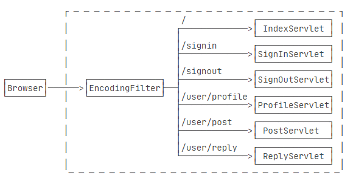
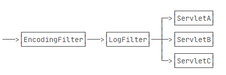

# Filter

*过滤器在Spring Boot开发中一定会被用到，一直不明白怎么实现的，是什么逻辑，学习一下*

### 介绍

> 在Java Enterprise Edition（Java EE）中，过滤器（Filter）是一种用于在Web应用程序中处理HTTP请求和响应的组件。过滤器允许开发人员在请求到达Servlet或JSP之前、响应发送到客户端之前对请求和响应进行预处理和后处理操作。
>
> 过滤器可以通过实现`javax.servlet.Filter`接口来创建，它定义了三个主要的方法：
>
> 1. `init(FilterConfig config)`：在过滤器被实例化后，容器会调用该方法来进行初始化操作。`FilterConfig`对象提供了获取过滤器配置信息的方法，例如获取过滤器的名称、URL模式、初始化参数等。
>
> 2. `doFilter(ServletRequest request, ServletResponse response, FilterChain chain)`：该方法是过滤器的主要处理逻辑。当请求到达时，容器会调用该方法来对请求和响应进行处理。开发人员可以在该方法中对请求和响应进行修改、验证、记录日志、设置编码等操作。`FilterChain`对象用于将请求传递给下一个过滤器或目标Servlet或JSP。
>
> 3. `destroy()`：在过滤器被销毁前，容器会调用该方法来进行清理操作，例如释放资源、关闭连接等。
>
> 过滤器可以在`web.xml`文件中进行配置，指定过滤器的名称、URL模式、初始化参数等。过滤器的配置顺序决定了它们在请求处理链中的执行顺序。
>
> 过滤器在Web应用程序中有许多应用场景，例如：
>
> 1. 认证和授权：过滤器可以对请求进行身份验证和授权，确保只有合法用户可以访问特定的资源。
>
> 2. 数据压缩和解压缩：过滤器可以在请求和响应之间进行数据压缩和解压缩，减小网络传输的数据量。
>
> 3. 请求日志记录：过滤器可以记录请求的详细信息，例如请求的URL、请求参数、请求头等，用于调试和监控。
>
> 4. 编码处理：过滤器可以对请求和响应进行编码和解码操作，确保数据在传输过程中的正确性和安全性。
>
> 5. 跨站点脚本（XSS）和跨站点请求伪造（CSRF）防御：过滤器可以对请求参数和响应进行检查，防御XSS和CSRF等安全攻击。
>
> 总的来说，过滤器是Java EE中强大且灵活的组件，用于对HTTP请求和响应进行处理，实现请求和响应的预处理和后处理逻辑，从而实现对Web应用程序的增强和定制化。

### 逻辑

> 为了把一些公用逻辑从各个Servlet中抽离出来，JavaEE的Servlet规范还提供了一种Filter组件，即过滤器，它的作用是，在HTTP请求到达Servlet之前，可以被一个或多个Filter预处理，类似打印日志、登录检查等逻辑，完全可以放到Filter中。
>
> ```java
> @WebFilter(urlPatterns = "/*")
> public class EncodingFilter implements Filter {
>     public void doFilter(ServletRequest request, ServletResponse response, FilterChain chain)
>             throws IOException, ServletException {
>         System.out.println("EncodingFilter:doFilter");
>         request.setCharacterEncoding("UTF-8");
>         response.setCharacterEncoding("UTF-8");
>         chain.doFilter(request, response);
>     }
> }
> ```
>
> 编写Filter时，必须实现`Filter`接口，在`doFilter()`方法内部，要继续处理请求，必须调用`chain.doFilter()`。最后，用`@WebFilter`注解标注该Filter需要过滤的URL。这里的`/*`表示所有路径。
>
> 添加了Filter之后，整个请求的处理架构如下：
>
> 
>
> 还可以继续添加其他Filter，例如LogFilter：
>
> ```java
> @WebFilter("/*")
> public class LogFilter implements Filter {
>     public void doFilter(ServletRequest request, ServletResponse response, FilterChain chain)
>             throws IOException, ServletException {
>         System.out.println("LogFilter: process " + ((HttpServletRequest) request).getRequestURI());
>         chain.doFilter(request, response);
>     }
> }
> ```
>
> 多个Filter会组成一个链，每个请求都被链上的Filter依次处理：
>
> 
>
> 有些细心的童鞋会问，有多个Filter的时候，Filter的顺序如何指定？多个Filter按不同顺序处理会造成处理结果不同吗？
>
> 答案是Filter的顺序确实对处理的结果有影响。但遗憾的是，Servlet规范并没有对`@WebFilter`注解标注的Filter规定顺序。如果一定要给每个Filter指定顺序，就必须在`web.xml`文件中对这些Filter再配置一遍。


### 多Filter执行顺序

> 在Spring Boot中，多个过滤器的执行顺序由它们在`FilterRegistrationBean`中的添加顺序决定。Spring Boot通过`FilterRegistrationBean`来配置过滤器，并且可以通过设置`FilterRegistrationBean`的`order`属性来指定过滤器的执行顺序。
>
> 以下是一个示例配置多个过滤器的执行顺序的方式：
>
> ```java
> @Bean
> public FilterRegistrationBean<Filter1> filter1() {
>     FilterRegistrationBean<Filter1> registrationBean = new FilterRegistrationBean<>();
>     registrationBean.setFilter(new Filter1());
>     registrationBean.addUrlPatterns("/*");
>     registrationBean.setOrder(1); // 设置过滤器的执行顺序
>     return registrationBean;
> }
> 
> @Bean
> public FilterRegistrationBean<Filter2> filter2() {
>     FilterRegistrationBean<Filter2> registrationBean = new FilterRegistrationBean<>();
>     registrationBean.setFilter(new Filter2());
>     registrationBean.addUrlPatterns("/*");
>     registrationBean.setOrder(2); // 设置过滤器的执行顺序
>     return registrationBean;
> }
> ```
>
> 在上面的示例中，`Filter1` 的执行顺序为1，`Filter2` 的执行顺序为2，因此 `Filter1` 会在 `Filter2` 之前执行。
>
> 需要注意的是，`order`属性的值越小，优先级越高，即越先执行。如果没有设置`order`属性，默认的执行顺序是根据过滤器的添加顺序决定的，后添加的过滤器会在前添加的过滤器之后执行。因此，在配置多个过滤器时，开发人员应该根据需要显式地设置过滤器的执行顺序，以确保逻辑按照预期执行。


##### 参考

[廖雪峰-Filter](https://www.liaoxuefeng.com/wiki/1252599548343744/1266264823560128)