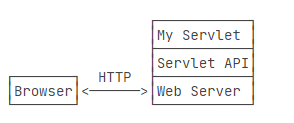

##### tomcat

> Tomcat（全名 Apache Tomcat）是一个开源的Java Servlet容器，用于实现Java Web应用的部署和运行。它是Apache软件基金会（Apache Software Foundation，简称ASF）的一个顶级项目，也是目前最流行的Java Web服务器之一。
>
> Tomcat实现了Java Servlet和JavaServer Pages（JSP）规范，可以作为一个独立的Web服务器，也可以与其他Web服务器（例如Apache HTTP Server）配合使用作为一个Servlet容器。它提供了一个用于处理HTTP请求的Servlet容器，能够接收、处理和响应客户端发起的HTTP请求，从而实现Java Web应用的运行。
>
> Tomcat是一个轻量级的容器，具有良好的性能和灵活性，广泛应用于Java Web应用的开发和部署。它支持最新的Java Servlet和JSP规范，并且提供了丰富的管理和配置工具，方便开发人员进行Web应用的部署、配置和监控。Tomcat也被广泛用于Java Web应用的开发、测试和部署环境，是Java开发人员在构建Web应用时的重要工具之一。

  


##### tomcat有什么用

> Tomcat（全名 Apache Tomcat）是一个用于部署和运行Java Web应用的开源Java Servlet容器。它有以下几个主要用途：
>
> 1. 运行Java Web应用：Tomcat作为Java Servlet容器，可以接收、处理和响应客户端发起的HTTP请求，从而实现Java Web应用的运行。它支持最新的Java Servlet和JavaServer Pages（JSP）规范，能够在Web服务器上部署和运行由Java编写的Web应用，包括网站、Web服务、RESTful API等。
>
> 2. 提供Servlet容器：Tomcat实现了Java Servlet规范，可以作为一个独立的Servlet容器，用于运行Java Servlet和JSP应用。开发人员可以将自己编写的Servlet和JSP代码部署到Tomcat上，通过Tomcat来处理客户端的HTTP请求，生成响应并返回给客户端。
>
> 3. 支持Java Web应用的开发和测试：Tomcat提供了一个方便的开发和测试环境，可以在其中部署和运行Java Web应用。开发人员可以在Tomcat上进行Java Web应用的开发、调试和测试，从而加速应用的开发和调试过程。
>
> 4. 提供管理和配置工具：Tomcat提供了丰富的管理和配置工具，方便开发人员进行Web应用的部署、配置和监控。这些工具包括Tomcat管理界面、配置文件、日志记录等，使得开发人员可以方便地管理和监控部署在Tomcat上的Java Web应用。
>
> 5. 支持Java Web应用的扩展和定制：Tomcat是一个开源项目，提供了丰富的扩展和定制机制。开发人员可以通过编写自定义的Servlet、过滤器、监听器等来扩展Tomcat的功能，从而满足特定的需求。
>
> 总的来说，Tomcat在Java Web应用开发和部署过程中具有重要的作用，它为开发人员提供了一个稳定、灵活和高性能的Java Servlet容器，用于运行Java Web应用并支持各种管理、配置和扩展需求。


##### tomcat作用

> 在上一节中，我们看到，编写HTTP服务器其实是非常简单的，只需要先编写基于多线程的TCP服务，然后在一个TCP连接中读取HTTP请求，发送HTTP响应即可。
>
> 但是，要编写一个完善的HTTP服务器，以HTTP/1.1为例，需要考虑的包括：
>
> - 识别正确和错误的HTTP请求；
> - 识别正确和错误的HTTP头；
> - 复用TCP连接；
> - 复用线程；
> - IO异常处理；
> - ...
>
> 这些基础工作需要耗费大量的时间，并且经过长期测试才能稳定运行。如果我们只需要输出一个简单的HTML页面，就不得不编写上千行底层代码，那就根本无法做到高效而可靠地开发。
>
> 因此，在JavaEE平台上，处理TCP连接，解析HTTP协议这些底层工作统统扔给现成的Web服务器去做，我们只需要把自己的应用程序跑在Web服务器上。为了实现这一目的，JavaEE提供了Servlet API，我们使用Servlet API编写自己的Servlet来处理HTTP请求，Web服务器实现Servlet API接口，实现底层功能：
>
> 

+ 其实就是由web服务器来处理网络中发送过来的HTTP请求，由它处理上面的几点，并且他为我们的业务逻辑实现提供一个API我们的业务层的controller按照它的api规范接收web服务器处理好的数据就可以了。


##### HttpServletRequest 和 HttpServletResponse

> 一个Servlet总是继承自`HttpServlet`，然后覆写`doGet()`或`doPost()`方法。注意到`doGet()`方法传入了`HttpServletRequest`和`HttpServletResponse`两个对象，分别代表HTTP请求和响应。我们使用Servlet API时，并不直接与底层TCP交互，也不需要解析HTTP协议，因为`HttpServletRequest`和`HttpServletResponse`就已经封装好了请求和响应。以发送响应为例，我们只需要设置正确的响应类型，然后获取`PrintWriter`，写入响应即可。


##### servlet

> Servlet是Java技术中用于处理Web请求和生成动态Web内容的组件。它是基于Java语言的服务器端程序，运行在Servlet容器中，用于接收、处理和响应客户端（通常是Web浏览器）发起的HTTP请求。
>
> Servlet可以看作是一种Java类，实现了Java Servlet规范中定义的接口，并通过容器提供的生命周期管理和事件处理机制来处理Web请求。Servlet可以接收来自客户端的HTTP请求，进行处理，生成动态的HTML、XML或其他类型的Web内容，并将生成的响应发送回客户端。
>
> Servlet通常用于构建Java Web应用，例如网站、Web服务、RESTful API等。它可以处理各种类型的HTTP请求，包括GET、POST、PUT、DELETE等，可以访问HTTP请求的参数、头部、Cookies等信息，并可以与其他Java技术（如数据库、JavaBean等）进行交互，从而实现丰富的Web应用功能。
>
> Servlet是Java Web应用的核心组件，常常与JavaServer Pages（JSP）一起使用，形成一个完整的Java Web应用。Servlet容器（如Tomcat）负责管理Servlet的生命周期、处理请求分发、处理线程池等，从而使Servlet能够高效地处理Web请求并生成动态Web内容。


##### http请求中contentType

> 在HTTP请求中，Content-Type是一个用于指定请求消息体（request body）中的数据类型的标头（header）字段。它用于告诉服务器请求消息体中的数据是什么类型的，以便服务器能够正确地解析和处理请求。
>
> Content-Type的值通常是一个MIME类型（Multipurpose Internet Mail Extensions），也称为媒体类型（Media Type）。MIME类型是一个字符串，由两个部分组成，中间用斜杠（/）分隔，例如：type/subtype。常见的MIME类型包括：
>
> - text/plain：纯文本类型
> - text/html：HTML类型
> - text/xml：XML类型
> - application/json：JSON类型
> - application/x-www-form-urlencoded：表单数据类型
> - multipart/form-data：多部分表单数据类型
> - image/jpeg：JPEG图片类型
> - image/png：PNG图片类型
> - application/pdf：PDF文档类型
> - application/octet-stream：二进制流类型
>
> 通过设置Content-Type字段，客户端（如Web浏览器）可以告诉服务器请求中包含的数据的类型，从而服务器可以根据Content-Type值来解析请求中的数据，并做出相应的处理。服务器也可以通过设置响应消息的Content-Type字段来指定响应消息体中的数据类型，告诉客户端响应的数据类型，以便客户端能够正确地处理响应。


##### MIME类型

> MIME（Multipurpose Internet Mail Extensions）类型，也称为媒体类型（Media Type），是一种用于标识互联网上传输的数据的类型的字符串标识。它用于指示数据的性质和格式，以便接收者可以正确地解析和处理数据。
>
> MIME类型通常由两个部分组成，中间用斜杠（/）分隔。第一个部分称为主类型（type），表示数据的大类别，如文本、图像、音频、视频等。第二个部分称为子类型（subtype），表示主类型下的具体类型。
>
> MIME类型在HTTP协议中广泛使用，用于标识请求和响应消息中消息体（message body）的数据类型。例如，在HTTP请求中，Content-Type标头字段用于指定请求消息体中的数据类型；在HTTP响应中，Content-Type标头字段用于指定响应消息体中的数据类型，以便客户端能够正确地解析和处理响应。
>
> MIME类型还被用于电子邮件、文件上传、Web服务和其他互联网应用中，用于描述传输的数据类型和格式，从而确保数据在传输和处理过程中能够被正确解析和处理。常见的MIME类型包括text/plain、text/html、application/json、image/jpeg、audio/mp3等。每种MIME类型都有其独特的标识，用于识别不同类型的数据。


##### application/x-www-form-urlencoded

> `application/x-www-form-urlencoded` 是一种用于在HTTP请求中传输表单数据的MIME类型。它是一种比较简单的编码方式，通常用于将表单数据编码为URL参数形式，然后作为请求消息体中的数据发送给服务器。
>
> `application/x-www-form-urlencoded` 的编码规则如下：
>
> 1. 将表单数据的每个字段名和字段值使用等号（=）连接，形成键值对（key=value）。
> 2. 使用和号（&）连接不同的键值对，形成多个键值对的序列。
> 3. 对键和值进行URL编码，将特殊字符（如空格、加号、斜杠、问号等）转换为特定的编码形式，通常使用百分号（%）后面跟着两个十六进制字符。
>
> 例如，将以下表单数据编码为`application/x-www-form-urlencoded` 格式：
>
> ```
> name: John Doe
> age: 30
> city: New York
> ```
>
> 编码后的数据将如下所示：
>
> ```
> name=John%20Doe&age=30&city=New%20York
> ```
>
> 在HTTP请求中，可以将上述编码后的数据作为请求消息体（request body）发送给服务器，并设置请求头（header）中的`Content-Type`字段为`application/x-www-form-urlencoded`，以指示服务器请求中包含的数据类型为表单数据。
>
> 在服务器端，接收到`application/x-www-form-urlencoded` 格式的数据后，通常会进行解码操作，将URL编码的数据解码为原始的表单数据，以便服务器能够正确地处理和解析请求中的数据。在Java中，可以使用`java.net.URLDecoder`类进行URL解码操作。


##### application/json与application/x-www-form-urlencoded

> `application/x-www-form-urlencoded` 和 `application/json` 是两种不同的MIME类型，用于在HTTP请求中传输数据的不同格式。
>
> 1. 数据格式：`application/x-www-form-urlencoded` 格式是一种键值对（key=value）的格式，用于传输表单数据，将数据编码为URL参数形式。而 `application/json` 格式是一种用于传输结构化数据的格式，使用JSON（JavaScript Object Notation）作为数据表示方式，支持复杂的嵌套数据结构。
>
> 2. 编码方式：`application/x-www-form-urlencoded` 使用简单的URL编码方式对数据进行编码，将特殊字符转换为百分号（%）后面跟着两个十六进制字符。而 `application/json` 则使用JSON格式对数据进行编码，采用类似JavaScript对象的键值对形式，数据以键值对、数组和嵌套对象的形式组织。
>
> 3. 应用场景：`application/x-www-form-urlencoded` 主要用于传输简单的表单数据，例如HTML表单提交的数据，适用于传输少量的简单数据。而 `application/json` 则适用于传输结构化和复杂的数据，通常用于API接口传输数据、前后端交互以及各种应用程序之间的数据交换。
>
> 4. 数据大小：`application/x-www-form-urlencoded` 格式相对较轻量，适合传输小量的简单数据。而 `application/json` 格式支持传输大量的复杂数据，可以包含更多的信息和结构。
>
> 5. 数据可读性：`application/x-www-form-urlencoded` 格式编码后的数据相对较难读取和解析，因为它使用简单的URL编码方式，数据呈现形式较为紧凑。而 `application/json` 格式编码后的数据相对较易读取和解析，因为它使用了人类可读的JSON格式。
>
> 综上所述，`application/x-www-form-urlencoded` 和 `application/json` 是两种不同的数据传输格式，适用于不同的应用场景和数据类型。选择使用哪种格式取决于具体的需求和应用需求。


##### http请求

> 是的，HTTP 请求通常包含请求头（Request Headers）和请求体（Request Body）两部分。
>
> 请求头（Request Headers）是包含在 HTTP 请求中的元数据信息，通常以键值对（key-value pairs）的形式出现，包含了客户端对服务器的请求的一些控制信息和元数据，例如请求的方法、URL、内容类型、身份验证信息、缓存控制策略等。
>
> 请求体（Request Body）是包含在 HTTP 请求中的实际数据部分，通常在 POST、PUT 等请求中用于传递客户端要提交的数据。请求体的格式和内容类型通常由请求头中的 Content-Type 字段指定，例如 JSON、XML、表单数据等。
>
> 请求头和请求体合在一起构成了完整的 HTTP 请求，用于客户端向服务器传递请求信息和数据，服务器根据这些信息和数据进行处理和响应。在进行 HTTP 请求时，请求头和请求体的内容和格式需符合 HTTP 协议的规定，以确保请求能够正确地被服务器解析和处理。


##### http请求头

> HTTP 请求头是在 HTTP 请求中传递元数据和其他控制信息的一种方式，通常包含在 HTTP 请求的头部（header）中。HTTP 请求头通常包含以下一些常见的信息：
>
> 1. Method：表示 HTTP 请求的方法，例如 GET、POST、PUT、DELETE 等。
>
> 2. URL：表示请求的 URL 地址，包括协议、域名、端口号、路径、查询参数等。
>
> 3. Host：表示请求的主机名或域名。
>
> 4. User-Agent：表示发送请求的客户端（如浏览器、移动应用等）的标识信息。
>
> 5. Accept：表示客户端可以接受的响应内容类型，通常是 MIME 类型。
>
> 6. Content-Type：表示请求体中的数据类型，通常在 POST、PUT 等请求中用来指定请求体的数据格式。
>
> 7. Content-Length：表示请求体中的数据长度。
>
> 8. Authorization：表示客户端的身份验证信息，例如用于 Basic、Bearer 等身份验证方式。
>
> 9. Cookie：表示客户端发送的 Cookie 信息，通常用于在服务端进行会话管理。
>
> 10. Referer：表示请求来源的 URL 地址，通常在跳转、请求资源等场景中使用。
>
> 11. Cache-Control：表示客户端对缓存的控制策略。
>
> 12. If-None-Match：表示客户端发送的资源的标识符，用于与服务端的资源进行比对，判断资源是否需要更新。
>
> 这些只是常见的 HTTP 请求头信息，实际上还有很多其他的请求头信息，具体使用的请求头信息取决于客户端和服务端的需求和约定。


##### session

+ session是在请求头中吗

> 在传统的基于 Cookie 的会话管理方式中，Session 信息通常是存储在服务端，并通过在 HTTP 请求头中的 Cookie 字段传递给服务器的。
>
> 当客户端发送 HTTP 请求时，请求头中的 Cookie 字段会包含该客户端之前从服务器获取的 Session ID，服务器可以通过解析 Cookie 字段中的 Session ID 来识别客户端，并从服务器端的 Session 存储中找到对应的 Session 数据。服务器端根据 Session ID 来维护与客户端的会话状态，并进行相应的处理。
>
> 然而，需要注意的是，并非所有的会话管理方式都使用 Session，也不是所有的请求头中都包含 Session 信息。例如，使用 JSON Web Token (JWT) 进行身份认证和会话管理时，会将用户的认证信息嵌入到 JWT 中，并将 JWT 作为请求头中的 Authorization 字段传递给服务器，而不需要传递 Session ID。
>
> 因此，是否在请求头中包含 Session 信息取决于具体的会话管理方式和身份认证方式，不同的实现方式可能有不同的方式来传递会话信息。

+ 在http请求的session中可以存储键值对吗

> 在 HTTP 请求的 Session 中，通常是在服务端存储键值对形式的会话数据，而不是在请求头中。HTTP 是无状态协议，不会在请求头中存储持久性的会话数据。而 Session 则是一种在服务器端维护的会话状态，用于存储特定用户的会话数据，以便在后续的请求中进行识别和使用。
>
> 在基于 Cookie 的会话管理方式中，服务器会为每个会话生成一个唯一的 Session ID，并将该 Session ID 存储在 Cookie 中，随后每次客户端发送请求时，会将该 Cookie 自动包含在请求头中，服务器通过解析 Cookie 中的 Session ID 来识别对应的 Session 数据，从而实现会话管理。
>
> Session 中存储的会话数据通常以键值对（key-value pairs）的形式进行存储，可以包含各种类型的数据，例如用户登录信息、用户偏好设置、购物车信息等。这些会话数据存储在服务器端，可以在整个会话期间持久保持，供后续的请求使用，用于维护用户的会话状态。不过需要注意的是，Session 数据的存储和管理由服务器端负责，客户端无法直接访问和修改 Session 数据。

+ 是不是session可以存储键值对，但是键值对只能在服务器中维护，通过前端传来的cookie参数来识别是否是同一个会话，同一个会话的话则可以在后端访问之前存储在session中的参数

> 是的，您理解得很正确。
>
> Session 是一种在服务器端维护的会话状态，可以用于存储键值对形式的会话数据。服务器在每个会话中都会为用户生成一个唯一的 Session ID，并将该 Session ID 存储在客户端的 Cookie 中。客户端在后续的请求中会自动将包含该 Session ID 的 Cookie 发送给服务器，服务器通过解析 Cookie 中的 Session ID 来识别对应的 Session 数据。
>
> 在服务器端的 Session 中，可以存储各种类型的键值对数据，例如用户登录信息、用户偏好设置、购物车信息等。这些会话数据在整个会话期间可以持久保持，供后续的请求使用，用于维护用户的会话状态。
>
> 需要注意的是，Session 数据的存储和管理由服务器端负责，客户端无法直接访问和修改 Session 数据。客户端只需在每次请求中包含正确的 Session ID，服务器会根据 Session ID 来识别对应的 Session 数据，并将其中存储的键值对数据用于后续的请求处理。

+ session的弊端

> 是的，当客户端切换服务器时，一般来说会导致会话信息的丢失，从而不再是同一个 Session。
>
> 在分布式 Web 应用中，当客户端请求被转发到不同的服务器时，每个服务器都可能维护自己的 Session 数据，这就导致了会话信息在不同服务器之间无法共享。例如，当使用负载均衡等技术将请求转发到不同的服务器时，服务器之间的会话信息是独立的，不会自动共享。
>
> 为了解决这个问题，通常有以下几种方法：
>
> 1. 使用会话复制：在分布式环境中，可以使用会话复制技术，将 Session 数据复制到所有的服务器，从而在服务器之间共享会话信息。这种方法的缺点是会增加网络传输和存储的开销，并且可能导致不一致的数据状态。
>
> 2. 使用共享存储：可以将会话数据存储在共享的存储系统中，例如数据库、缓存系统等，从而在不同服务器之间共享会话信息。这种方法可以避免会话复制带来的不一致性问题，但需要考虑存储系统的性能和可靠性。
>
> 3. 使用无状态会话：将会话数据存储在客户端，而不依赖服务器端的 Session 数据。例如，使用基于 Token 的认证机制，如 JWT（JSON Web Token），在客户端携带认证信息，服务器无需存储 Session 数据，从而避免了服务器之间共享 Session 数据的问题。
>
> 需要根据具体的技术栈和框架选择合适的方式来处理分布式环境下的会话管理，以满足应用的需求和性能要求。

+ 无状态会话

> 无状态会话（Stateless Session），是指服务器端不保存任何会话状态信息，而将会话状态信息全部保存在客户端，并通过客户端在每次请求中传递该信息，从而实现会话管理。
>
> 传统的会话管理方式（有状态会话）通常是服务器端保存会话状态信息，例如将会话数据存储在服务器的内存或数据库中，并通过 Session ID 或 Cookie 将会话状态与客户端关联。但在分布式环境下，这种方式会导致服务器之间无法共享会话状态信息，从而造成一些问题，如负载均衡后的请求可能无法访问到之前保存在其他服务器上的会话数据。
>
> 无状态会话则将会话状态信息完全保存在客户端，通常通过将会话数据加密并保存在 Token 中，例如使用 JWT（JSON Web Token）技术。客户端在每次请求中携带 Token，服务器端通过解析 Token 中的信息来验证用户身份和会话状态，无需在服务器端保存任何会话状态信息。
>
> 无状态会话的优点包括：
>
> 1. 可扩展性：由于服务器端无需保存会话状态信息，因此可以更好地支持分布式和横向扩展，不受服务器之间共享会话状态的限制。
>
> 2. 高性能：无需在服务器端保存会话状态信息，从而减少了服务器端的存储和计算开销，提高了性能。
>
> 3. 简化了服务器端的状态管理：无状态会话将会话状态信息完全保存在客户端，从而减轻了服务器端的状态管理工作。
>
> 4. 更好的安全性：由于会话状态信息保存在客户端，并通过加密的 Token 进行传递，因此能够提供更好的安全性，防止服务器端的会话状态信息被篡改。
>
> 需要注意的是，无状态会话适用于某些场景，如无需保存大量会话状态信息、会话状态信息较小且不敏感的场景。对于一些需要保存大量会话状态信息或涉及敏感信息的场景，仍然需要谨慎选择合适的会话管理方式。


##### 参考

[廖雪峰-web开发](https://www.liaoxuefeng.com/wiki/1252599548343744/1304265949708322)