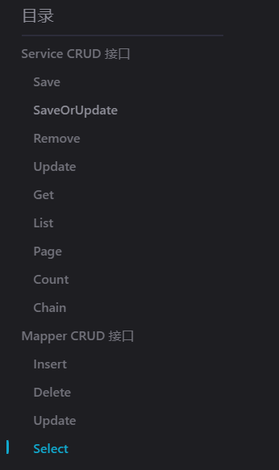

# mybatis plus 学习

*研一下(2023-04-14)  因为要参加一个比较正式的项目了，有点急，所以抓紧系统的学一下mybatis plus*


## 官网教程

*官网既然有教程，优先直接官网学习*


### 快速入门


#### 配置

##### Spring Boot 工程

+ 在Spring Boot工程中，官网上写的要配置 $@MapperScan$ 注解，但是在我的实际项目中却没有配置这个注解但是依然完成了对应的功能。

+ $@MapperScan$ 的作用：

  >  [`@MapperScan`是MyBatis框架中的一个注解，它用于指定Spring应该扫描哪些包以查找带有`@Mapper`注解的接口](https://www.programmersought.com/article/429710216461/)。这些接口将被MyBatis自动实现，并在运行时创建相应的代理对象。

+ $mybatis-plus-boot-starter$ 依赖依然可以完成对应的功能

   >  [`mybatis-plus-boot-starter`是MyBatis-Plus框架的Spring Boot集成依赖。它可以自动扫描并注册带有`@Mapper`注解的接口，因此您无需使用`@MapperScan`注解](https://blog.csdn.net/qq_41865229/article/details/119766921)。

  > 但是，如果您希望扫描特定的包或排除某些包，则仍然可以使用`@MapperScan`注解来指定要扫描的包。此外，您也可以使用`MapperScannerConfigurer`类来扫描和注册Mapper接口，就像在非Spring Boot项目中一样。

```java
@SpringBootApplication
@MapperScan("com.baomidou.mybatisplus.samples.quickstart.mapper")
public class Application {

    public static void main(String[] args) {
        SpringApplication.run(Application.class, args);
    }

}
```


### 核心功能


#### 代码生成器

*学习这一部分需要先学习==builder设计模式==*


#### CRUD接口

+ 可以看到我们的CRUD接口分为了 Service CRUD 接口和 Mapper CRUD 接口，为什么要这么划分呢？下面给出一个解释



> 在MyBatis Plus中，`Service CRUD` 接口和 `Mapper CRUD` 接口都提供了用于执行CRUD操作的方法。它们之间的主要区别在于它们所处的层次不同。
>
> `Mapper CRUD` 接口位于数据访问层，它直接与数据库交互，负责执行SQL语句。你可以在 `Mapper` 接口中定义自定义的CRUD方法，并使用MyBatis Plus提供的注解来指定SQL语句。
>
> `Service CRUD` 接口位于业务逻辑层，它==封装了对 `Mapper` 接口的调用==，提供了更高层次的抽象。你可以在 `Service` 接口中定义业务逻辑方法，并在这些方法中调用 `Mapper` 接口中定义的CRUD方法。
>
> 这种分层架构有助于提高代码的可维护性和可扩展性。它允许你将业务逻辑和数据访问逻辑分离，使代码更加清晰易懂。
>
> 希望这些信息能够帮助你理解MyBatis Plus中的 `Service CRUD` 接口和 `Mapper CRUD` 接口。
>
+ 其实就是 Service CRUD 接口主要是在 Controller 层 进行调用，而Mapper CRUD 接口主要是在Service层进行调用

##### Service CRUD 接口


##### Mapper CRUD 接口


#### 条件构造器

*学习这一部分要先明白==lambda表达式==*

##### 先导知识

*学习这一部分需要很多先验知识，比如有下面的警告中很多名词都不知道是什么，更不用说这一句话是什么意思了*

> 警告:
>
> 不支持以及不赞成在 RPC 调用中把 Wrapper 进行传输
>
> 1. wrapper 很重
> 2. 传输 wrapper 可以类比为你的 controller 用 map 接收值(开发一时爽,维护火葬场)
> 3. 正确的 RPC 调用姿势是写一个 DTO 进行传输,被调用方再根据 DTO 执行相应的操作
> 4. 我们拒绝接受任何关于 RPC 传输 Wrapper 报错相关的 issue 甚至 pr

###### DTO（Data Transfer Object）数据传输对象

+ DO（Data Object）：与数据库表对应的实体（与表结构一一对应）

> Java 开发中的 DO 是 Data Object，数据对象，它与数据库表结构一一对应，通过 DAO 层向上传输数据源对象。DO 是领域对象，就是从现实世界中抽象出来的有形或无形的业务实体。DO 通常不包含业务逻辑，只有简单的属性和属性的 getter 和 setter 方法。

+ DTO：只包含DO中的一些属性

> DTO 是数据传输对象 (Data Transfer Object) 的缩写。它是一种设计模式，用于在不同层或不同系统之间封装和传输数据，减少方法调用的次数。DTO 通常是没有行为的普通 JavaBeans，只包含一些属性和对应的 get/set 方法。DTO 可以根据不同的视角和需求，对领域对象进行数据封装，实现层与层之间的数据传递。

+ DTO存在的意义

> DTO 的用途和意义主要有以下几点：
>
> - 数据封装，然后传递，可以减少分布式调用的次数，提高性能和降低网络负载
> - 用于提供给外部的接口，用于参数接收，可以屏蔽一些敏感数据或者无关数据
> - 用于保存 DO 数据，因为 DO 是有状态的，所以使用数据的时候通常都是使用一个无状态的 DTO
> - 完全面向 UI 设计，没有行为属性，可以根据不同的 UI 需求定制不同的 DTO

###### RPC（Remote Procedure Call） 远程过程调用

> RPC 是 Remote Procedure Call，远程过程调用，它是一种协议，用于让不同计算机上的进程通过网络进行通信和协作。RPC 允许一个进程在一个计算机上调用另一个计算机上的一个过程，就像这个过程是在本地运行一样。RPC 有一个接口和一个通信协议，接口定义了要执行的标准操作，通信协议负责在网络上发送和接收调用请求和响应消息。

###### Lambda 表达式

> [java8 lambda 表达式详解](https://www.jianshu.com/p/613a6118e2e0)

###### 方法引用


###### Lambda 表达式 和 方法引用

+ 方法引用其实是Lambda表达式的子集

> 可以这么说，方法引用是lambda表达式的一种特殊形式，或者称之为语法糖。方法引用可以让代码更加简洁和清晰，但是它的使用场景是有限的，只能引用已经存在的方法 。而lambda表达式可以表示任意的函数方案，更加灵活和通用。

+ Lambda 表达式 和 方法引用 的区别

> lambda表达式和方法引用是java8的新特性，它们都可以用来表示函数式接口的实现。但是，它们也有一些区别：
>
> - lambda表达式是匿名的，方法引用是有名的。
>   - lambda表达式没有具体的方法名，只有参数列表、箭头符号和方法体。而方法引用是通过双冒号运算符来引用一个已有的方法名。
> - lambda表达式可以自由控制传递参数，方法引用只能按照已有方法的参数列表传递。
> - lambda表达式可以表示任意的函数方案，方法引用只能引用已经存在的方法。


##### 参考

[mybatis-plus 官网快速开始](https://baomidou.com/pages/223848/#tablename)


