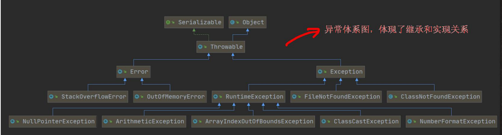
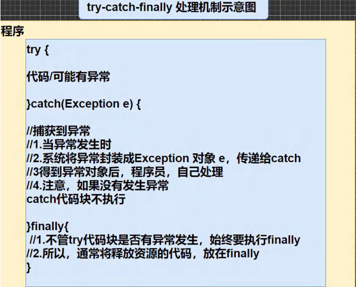
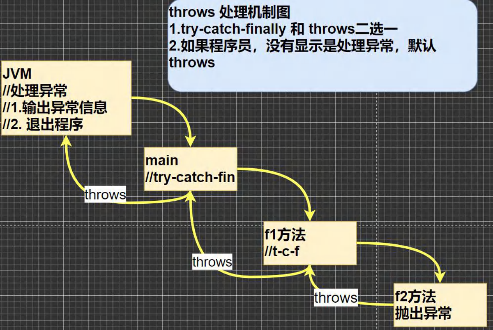

## JAVA 异常基础（Exception）

##### 异常简介

1. 基本概念

+ JAVA程序执行中发生的不正常情况称之为“异常”。（不包括开发过程中的语法错误和逻辑错误）
+ 异常事件分类
  + Error（错误）：Java虚拟机无法解决的严重问题。如：JVM系统内部错误、资源耗尽等严重情况。比如：StackOverflowError[栈溢出]和OOM[out of memory]，Error时严重错误，程序会崩溃
  + Exception：其他因编程错误或者偶然的外在因素导致的一般性问题，可以使用针对性的代码进行处理。例如空指针访问，试图读取不存在的文件等等。Exception分为两大类：
    + 运行时异常（RuntimeException）：程序运行时发生的异常
    + 编译时异常：编译时，编译器检查出的异常

2. **异常的类图**

   

+ 运行时异常：编译器检查不出来。指的就是运行时的逻辑错误，是程序员应该避免出现的异常。对应的为java.lang.RuntimeException类及它的子类都是运行时异常
+ 其实对于运行时异常，是可以不做处理的，因为这类异常很普遍，若全都处理会对程序的可读性和运行效率产生很大的影响（因为java会默认对运行时异常做抛出处理，但会终止程序的运行）
+ 编译时异常，是编译器要求必须处置的异常

##### 常见的运行时异常

1. NullPointerException 空指针异常
2. ArithmeticException 数学运算异常
3. ArrayIndexOutOfBoundsException 数组下标越界异常
4. ClassCastException 类型转换异常
5. NumberFormatException 数字格式不正确异常

##### 编译异常

1. 介绍：在编译期间就必须处理的异常，否则代码无法通过编译的
2. 常见的编译异常 

+ SQLException 操作数据库时，查询表可能发生的异常
+ IOException 操作文件时的异常
+ FileNotFoundException 文件不存在异常
+ ClassNotFoundException 类不存在异常
+ IllegalArguementException 非法参数异常

##### 异常处理

1. try-catch-finally

​		程序员在代码中捕获发生的异常，自行处理

2. throws

   将发生的异常抛出由方法的调用者来处理，最上层的处理者就是JVM虚拟机（JVM对于异常处理十分简单粗暴，即直接输出异常然后结束程序，这也是运行时异常的默认处理方式，因为运行时异常会被默认抛出，一层一层直至抛出到JVM虚拟机）

3. 处理机制

+ try-catch-finally的处理机制



+ throws的处理机制



##### try-catch异常处理

1. try-catch语法

```java
try{
    //可能会产生异常的代码块
    //将异常生成的对应的异常对象，传递给catch块
}catch(异常){
    //对于异常的处理
}
//可以没有finally
```

+ 例子

```java
public static void main(String[] args) {
	int num1 = 10;
	int num2 = 0;
try {
	int res = num1 / num2;
} catch (Exception e/*捕获到的异常*/) {
	System.out.println(e.getMessage());
}
}
```

2. 注意事项

+ 如果产生了异常，则产生异常后面的代码不会执行，直接进入到catch块中
+ 如果异常没有发生，则顺序执行try的代码块，不会进入到catch
+ 如果希望不管是否发生异常，都执行某段代码（如：关闭连接，释放资源等），则使用finally{}

```java
try{
 	//可能异常代码   
}catch(异常){
    //处理
}finally{
    //释放资源等
}
```

+ 可以有多个catch语句（try中的代码块可能发生多种异常），捕获不同的异常（用于进行不同的业务逻辑处理），要求父类异常的捕获在后，子类异常的捕获在前。（如：Exception在后，NullPointerException在前），如果发生异常，只会匹配一个catch

```java
package com.edu.try_;

	public class TryCatchDetail02 {
	public static void main(String[] args) {

	//1.如果 try 代码块有可能有多个异常
	//2.可以使用多个 catch 分别捕获不同的异常，相应处理
	//3.要求子类异常写在前面，父类异常写在后面
	try {
		Person person = new Person();
		//person = null;
		System.out.println(person.getName());//NullPointerException
		int n1 = 10;
		int n2 = 0;
		int res = n1 / n2;//ArithmeticException
	} catch (NullPointerException e) {
		System.out.println("空指针异常=" + e.getMessage());
	} catch (ArithmeticException e) {
		System.out.println("算术异常=" + e.getMessage());
	} catch (Exception e) {
		System.out.println(e.getMessage());
	} finally {
	}
}
}
class Person {
	private String name = "jack";
	public String getName() {
	return name;
}
}
```

+ 可以使用try-finally，这种用法相当于没有捕获异常，所以程序一定会终止执行的。应用于，执行一段代码无论是否异常都要执行某个业务逻辑

3. 小结

+ 如果没有异常，则执行try中的所有语句，不执行catch中的语句，如果有finally，最后还要执行finally中的语句
+ 如果出现了异常，则try块中异常发生后，try块中剩下的语句不再执行。将执行catch块中的语句，如果有finally，最后还要执行finally中的语句

##### throws异常处理

1. 简介

+ 使用时机：如果一个方法中的语句可能产生某种异常，但是并不确定要如何处理这些异常，那么我们可以使用throws显式的抛出此异常，表明在我们的方法内不对这些异常进行处理，由该方法的调用者进行处理（调用者也可以继续抛出或者用try-catch处理）
+ 使用：在方法的声明中可以用throws语句声明抛出的异常的列表（可以同时抛出多个异常），throws后面的异常类型可以是方法中产生的异常类型，也可以是它的父类
+ 语法：

```java
public static void readFile(String file) throws FileNotFoundException{
    //读文件可能产生FileNotFoundException类型的异常
    FileInputStream fis = new FileInputStream("d://a.tex");
}
```

2. 使用细节

+ 对于编译异常，那么我们必须要在程序中处理掉（try-catch或throws），否则无法通过编译
+ 对于运行时异常，即使我们的程序中没有处理，JAVA默认就是用throws的方法处理。即其实每个方法的声明中都默认包含throws RuntimeException，有异常发生时就会一层一层的向上抛出，最高层的调用者就是JVM虚拟机，然后虚拟机就会处理这个异常（输出异常然后结束程序）
+ 子类重写父类的方法时的异常处理：子类重写的方法，所抛出的异常类型要么和父类方法的一致，要么是父类抛出异常的子类
+ throws和try-catch两个处理方法中，只需要有一个即可

##### 自定义异常

1. 很多时候，尤其是在项目中，我们都需要自定义异常（可以结合枚举类定义异常信息），用于描述错误信息，并且返回给前端
2. 自定义异常的步骤：
   + 定义类：自定义异常类名继承Exception或者RuntimeException
   + 如果继承了Exception，属于编译异常
   + 如果继承了RuntimeException，属于运行时异常（一般都是运行时异常）

3. 使用

```java
public class CustomException {
	public static void main(String[] args) /*throws AgeException*/ {
		int age = 180;
		//要求范围在 18 – 120 之间，否则抛出一个自定义异常
		if(!(age >= 18 && age <= 120)) {
		//这里我们可以通过构造器，设置信息
			throw new AgeException("年龄需要在 18~120 之间");
		}
		System.out.println("你的年龄范围正确.");
	}
}
//自定义一个异常
//1. 一般情况下，我们自定义异常是继承 RuntimeException
//2. 即把自定义异常做成 运行时异常，好处时，我们可以使用默认的处理机制
//3. 即比较方便

class AgeException extends RuntimeException {
	public AgeException(String message) {//构造器
		super(message);
	}
}

```

##### throw和throws的区别

|        |           意义           |    位置    | 后面跟的东西 |
| :----: | :----------------------: | :--------: | :----------: |
| throws |      异常处理的方式      | 方法声明处 |   异常类型   |
| throw  | 手动生成异常对象的关键字 |  方法体中  |   异常对象   |

<br>