[TOC]

# Java 基础

<br>

<br>

## 总结

|   关键字    |  类  | 方法 | 属性/变量 | 接口 |
| :---------: | :--: | :--: | :-------: | :--: |
| public/默认 |  √   |  √   |     √     |  √   |
|  protected  |      |  √   |     √     |      |
|   private   |      |  √   |     √     |      |
|   static    |      |  √   |     √     |      |
|    final    |  √   |  √   |     √     |      |
|  abstract   |  √   |  √   |           |      |


## chapter02 Java概述


### 2.1 开发细节

1. 一个源文件中最多只能有==一个public类==，且`.java`文件名必须和public类名相同，其他类的个数不限
2. java程序的执行入口是main()方法，固定格式public static void main(String[] args) { }
3. Java 严格区分大小写
4. java 方法中，每条语句都以`;`结束
5. 一个`.java`的文件中有多个类，编译`javac`之后，有几个类就会生成几个`.class`，这样的非public类中也可以有main()方法

<br>

### 2.2转义字符

1. `\r`表示一个回车（**没有换行**）

   ```java
   //\r 回车
   //1.输出：我爱小贝贝
   //\r回车：光标移动到本行的开始，即“我”的前面，然后输出“飞飞”，“飞飞”会把“我爱”给顶掉，即输出“飞飞小贝贝”
   System.out.println("我爱小贝贝\r飞飞");
   ```

2. `\n`: 换行

3. `\t`: 制表位

4. `\'`: 输出一个`'`

5. `\"`: 输出一个`"`

6. `\\`: 输出一个`\`

<br>

### 2.3 文档注释

1. 文档注释是可以被`JavaDoc`所解析的，生成一套网页文件，有固定格式

   ```java
   //文档注释
   /**
    * @version 1.1
    * @author zhf
    * @。。。。
    */
   ```

   

2. 通过`javadoc`生成说明网页（一整套网页，非常多的html文件）

   ```cmd
   javadoc -d D:\tools\IDEA\project_all\rookie\docomment -author -version JavaDoc.java
   ```

   

<br>

### 2.4 Java代码规范

1. 可以选中==多行==按`tab`整体右移，也可以整体左移，按`shift+tab`

   <br>

### 2.5DOS命令

1. `tree d:\tools`查看目录下的所有子集目录
2. `cls`清屏
3. `exit`退出DOS
4. `cd ..`进入上一级目录
5. `cd \`进入根目录
6. `cd /D c:`切换磁盘，必须要有`/D`
7. `md`创建目录
8. `rd`删除目录
9. `echo hello > hello.txt`输入hello到hello.txt, 如果没有这个文档, 则创建hello.txt
10. `del hello.txt`删除文档

<br>

<br>

## chapter03 变量

<br>

### 3.1加号使用

1. 字符型+整形=字符型

```java
//对于加号的使用
		System.out.println("Hello" + 100 + 3 );  //输出  Hello1003
		System.out.println(100 + 3 + "Hello" );  //输出  103Hello
```

<br>

### 3.2数据类型

1. 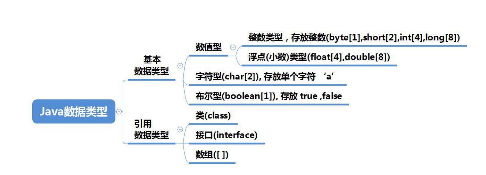

<br>

### 3.3整型细节

1. Java的整型常量默认为 int 型, 要声明long型的常量须在后面加`l`或`L`

   ```java
   long a = 10;   //不会报错，虽然10默认int型，但是由于是小存储单元向大存储单元转换，会自动类型转换，没有损失
   ```

<br>

### 3.4浮点数细节

1. Java浮点型常量默认为double型，声明为float型常量时，必须在后面加`f`或`F`

```java
float num = 1.1;     //报错，因为1.1默认为double型的，属于大存储单元向小存储单元转换，会有精度损失问题，会报错
float num2 = 1.1f;    //必须用F后缀
```

2. ==浮点数使用陷阱==        ==浮点数计算==：对浮点数进行计算时，结果有不确定性	

   ​	2.7  和   8.1/3 不相等

```java
//浮点数使用陷阱: 2.7 和 8.1 / 3 比较
//看看一段代码
double num11 = 2.7;
double num12 = 8.1 / 3; //2.7
System.out.println(num11);//2.7
System.out.println(num12);//接近 2.7 的一个小数，而不是 2.7
//得到一个重要的使用点: 当我们对运算结果是小数的进行相等判断是，要小心
//应该是以两个数的差值的绝对值，在某个精度范围类判断
if( num11 == num12) {   //并不相等，无法输出
System.out.println("num11 == num12 相等");
}
//正确的写法 , ctrl + / 注释快捷键, 再次输入就取消注释
if(Math.abs(num11 - num12) < 0.000001 ) {
System.out.println("差值非常小，到我的规定精度，认为相等...");

}
// 可以通过 java API 来看 下一个视频介绍如何使用 API
System.out.println(Math.abs(num11 - num12));
//细节:如果是直接查询得的的小数或者直接赋值，是可以判断相等
}
}
```

<br>

### 3.5boolean类型

1. boolean类型的值只有ture或false，不可以用数字表示真假

<br>

### 3.6基本数据类型和String类型的转换

1. String 和 基本数据类型的转换不能通过强转实现

2. 基本数据类型 转 String

   ```java
   int n1 = 100;
   float f1 = 1.1F;
   double d1 = 4.5;
   boolean b1 = true;
   String s1 = (String)n1;  //错误的形式，编译无法通过
   String s2 = f1 + "";
   String s3 = d1 + "";
   String s4 = b1 + "";
   System.out.println(s1 + " " + s2 + " " + s3 + " "+s4)
   ```

3. String 转 基本数据类型

   ```java
   //String->对应的基本数据类型
   String s5 = "123";
   //会在 OOP 讲对象和方法的时候回详细
   //解读 使用 基本数据类型对应的包装类，的相应方法，得到基本数据类型
   int num1 = Integer.parseInt(s5);
   double num2 = Double.parseDouble(s5);
   float num3 = Float.parseFloat(s5);
   long num4 = Long.parseLong(s5);
   
   byte num5 = Byte.parseByte(s5);
   boolean b = Boolean.parseBoolean("true");
   short num6 = Short.parseShort(s5);
   System.out.println("===================");
   System.out.println(num1);//123
   System.out.println(num2);//123.0
   System.out.println(num3);//123.0
   System.out.println(num4);//123
   System.out.println(num5);//123
   System.out.println(num6);//123
   System.out.println(b);//true
   //怎么把字符串转成字符 char -> 含义是指 把字符串的第一个字符得到
   //解读 s5.charAt(0) 得到 s5 字符串的第一个字符 '1' 
   System.out.println(s5.charAt(0));
   ```

   <br>

## Chapter04 运算符

<br>

### 4.1 短路于 与 逻辑与

1. &&短路与：如果第一个条件为 false，则第二个条件不会判断，最终结果为 false，效率高 
2. & 逻辑与：不管第一个条件是否为 false，第二个条件都要判断，效率低  
3. 开发中， 我们使用的基本是使用短路与&&

<br>

### 4.2赋值运算符


```java
//复合赋值运算符会进行类型转换
byte b = 3;
b += 2; // 等价 b = (byte)(b + 2);
b = b + 2   //会报错，因为2是int型，b+2会自动类型转换为int，但b是byte型
b++; // b = (byte)(b+1);
```

<br>

### 4.3三元运算符

1. 条件表达式 ? 表达式 1:表达式2；

   表达式1 和 表达式2 永远都只有一个会被执行

   ```java
   int a = 10;
   int b = 99;
   // 解读
   // 1. a > b 为 false
   // 2. 返回 b--, 先返回 b 的值,然后在 b-1
   // 3. 返回的结果是 99
   int result = a > b ? a++ : b--;
   System.out.println("result=" + result);  //99
   System.out.println("a=" + a);    //10,因为a++不会被执行
   System.out.println("b=" + b);    //98
   ```

   <br>

### 4.4变量名命名规范

1. 包名：多单词组成时所有字母都小写：aaa.bbb.ccc //比如 com.hsp.crm 
2. 类名、接口名：多单词组成时，所有单词的首字母大写：XxxYyyZzz [大驼峰] 比如： TankShotGame 
3. 变量名、方法名：多单词组成时，第一个单词首字母小写，第二个单词开始每个单词首字母大写：xxxYyyZzz [小 驼峰， 简称 驼峰法] 比如： tankShotGame 
4. 常量名：所有字母都大写。多单词时每个单词用下划线连接：XXX_YYY_ZZZ 比如 ：定义一个所得税率 TAX_RAT

<br>

<br>

## Chapter05 程序控制结构

<br>

### 5.1 Break 可以指定退出的循环 通过标签

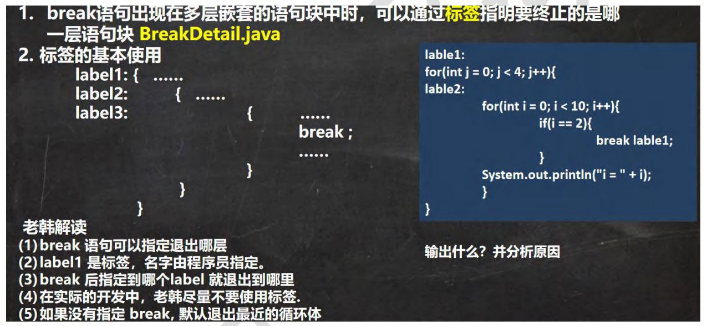

<br>

### 5.2 Continue可以指定继续那个循环 通过标签

```java
label1:
for(int j = 0; j < 4; j++){
label2:
for(int i = 0; i < 10; i++){
if(i == 2){
//看看分别输出什么值，并分析
//continue ;
//continue label2;
continue label1;
}
System.out.println("i = " + i);
}
}
```


==***Break 和 Continue 注意***==

+ Break 跳出循环时，不会执行最后的i++，但是 Continue 继续下一次循环的时候，每次都会执行最后的i++

<br>

<br>

## Chapter06 数组、排序和查找

<br>

### 6.1 数组的使用

1. ​    数组定义方法

   ```java
   //数组定义方法1：
   double scores[] = new double[5];    //数组大小为5
   double[] scores = new double[5];    //两种形式都可以
   //数组定义方法2：
   int a[] = {1 ,2 ,23 ,23 ,5 ,2 };
   ```

2. 数组创建后，不赋值，会有默认初值

   所有的数字型的都是0，boolean false, String null

<br>

### 6.2 二维数组

1. 二维数组中一维数组的个数`arr.length`

2. 二维数组中每个一维数组中元素的个数`arr[i].length`

3. 二维数组的定义方法

   ```java
   //数组定义方法1:
   double scores[][] = new double[2][3];    //数组大小为2x3  
   double[][] scores = new double[2][3];    //两种形式都可以
   
   //数组定义方法2：  (列数不确定，java中每行的列数可以不同)
   
   
   //创建 二维数组，一个有 3 个一维数组，但是每个一维数组还没有开数据空间
   int[][] arr = new int[3][];
   for(int i = 0; i < arr.length; i++) {//遍历 arr 每个一维数组
   	//给每个一维数组开空间 new
   	//如果没有给一维数组 new ,那么 arr[i]就是 null
   	arr[i] = new int[i + 1];
   	//遍历一维数组，并给一维数组的每个元素赋值
   for(int j = 0; j < arr[i].length; j++) {
   	arr[i][j] = i 
   }
   }
       
       
   ```

   

<br>

## Chapter07 面向对象编程 -- 基础

<br>

### 7.1 类与对象的属性

1. 属性如果不赋值，会有默认值和数组的默认值一样
2. 对象和数组一样都是引用类型，都存放的是地址

<br>

### 7.2 方法

访问修饰符：`public`,`protected`,`private`, 默认 	

##### 方法的重载

1. java 中允许同一个类中，多个同名方法的存在，但要求==形参列表不一致==！

   

<br>

### 7.3 可变参数

1. java 允许将同一个类中多个同名同功能但参数个数不同的方法，封装成一个方法。
2. 访问修饰符 返回类型 方法名(数据类型... 形参名) { }
3. 本质 就是 数组，实参可以是数组

```java
public int sum(int... nums) {
//System.out.println("接收的参数个数=" + nums.length);
	int res = 0;
	for(int i = 0; i < nums.length; i++) {
		res += nums[i];
	}
	return res;
}
```

4. 可变参数可以和普通类型的参数一起放在形参列表，但必须保证可变参数在最后
5. 一个形参列表中只能出现一个可变参数

<br>

### 7.4 作用域

1. 全局变量(属性)可以不赋值，直接使用，因为有默认值
2. 局部变量必须赋值后，才能使用，因为没有默认值
3. 细节: 属性可以加修饰符(public protected private..) ，局部变量不能加修饰符

<br>

### 7.5 构造器

1. 构造方法又叫构造器(constructor)，是类的一种特殊的方法，它的主要作用是完成对新对象的==初始化==。它有几个特点： 

   1) ***方法名和类名相同***
   2) ***没有返回值*** 
   3) 在创建对象时，系统会自动的调用该类的构造器完成对象的初始化

2. [修饰符] 方法名(形参列表){ 

   ​	方法体;

    }

3. ```java
   class Person {
   	String name;
   	int age;
   	//构造器
   	//1. 构造器没有返回值, 也不能写 void
   	//2. 构造器的名称和类 Person 一样
   	//3. (String pName, int pAge) 是构造器形参列表，规则和成员方法一样
   	public Person(String pName, int pAge) {
   		System.out.println("构造器被调用~~ 完成对象的属性初始化");
   		name = pName;
   		age = pAge;
   	}
   }
   ```

4. 可以对构造器进行重载，定义多个不同的构造器，只是形参不同

5. ```java
   class Dog {
   //如果程序员没有定义构造器，系统会自动生成一个默认无参构造器(也叫默认构造器)
   //使用 javap 指令 反编译看看
   /*
   默认构造器
   Dog() {}
   */
   //一旦定义了自己的构造器,默认的构造器就覆盖了，就不能再使用默认的无参构造器，即创建对象时不能无参了，
   //除非显式的定义一下,即: Dog(){} 写 (这点很重要)
   //
   	public Dog(String dName) {
   	//... 
       }
   	Dog() { //显式的定义一下 无参构造器
   	}
   }
   ```

6. javap 可以对`.class` 文件进行反编译，得到它的对应的java源码

<br>

### 7.6 this

1. this就表示当前对象

   ```java
   public class This01 {
   //编写一个 main 方法
   public static void main(String[] args) {
   Dog dog1 = new Dog("大壮", 3);
   System.out.println("dog1 的 hashcode=" + dog1.hashCode());
   //dog1 调用了 info()方法
   dog1.info();
   System.out.println("============");
   Dog dog2 = new Dog("大黄", 2);
   System.out.println("dog2 的 hashcode=" + dog2.hashCode());
   dog2.info();
   }
   }
   class Dog{ //类
   String name;
   int age;
   // public Dog(String dName, int dAge){//构造器
   // name = dName;
   // age = dAge;
   // }
   //如果我们构造器的形参，能够直接写成属性名，就更好了
   //但是出现了一个问题，根据变量的作用域原则
   //构造器的 name 是局部变量，而不是属性
   //构造器的 age 是局部变量，而不是属性
   //==> 引出 this 关键字来解决
   public Dog(String name, int age){//构造器
   //this.name 就是当前对象的属性 name
   this.name = name;
   //this.age 就是当前对象的属性 age
   this.age = age;
   System.out.println("this.hashCode=" + this.hashCode());
   }
   public void info(){//成员方法,输出属性 x 信息
   System.out.println("this.hashCode=" + this.hashCode());
   System.out.println(name + "\t" + age + "\t");
   }
   
   ```

2. 对象的hashcode():通过对象的内部地址(也就是物理地址)转换成一个整数，然后该整数通过hash函数的算法就得到了hashcode。

3. hash 哈希 散列函数，通过算法把输入转换为相同长度的输出

4. this可以用于在构造器内访问另一个构造器

   只能在一个构造器内访问另一个构造器，且必须在第一条语句

   访问构造器语法：this(参数列表)

   <br>

## Chapter08 面向对象编程 中级

<br>

### 8.1 访问修饰符

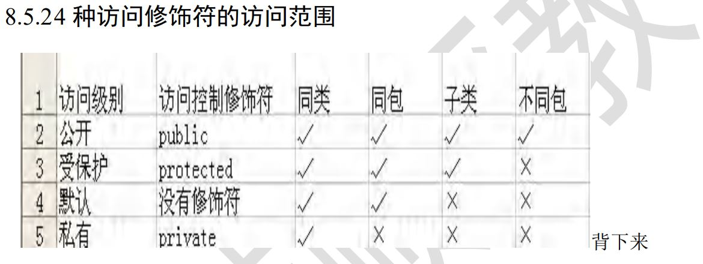

<br>

### 8.2 封装

封装即Getter、Setter和ToString，可以在Setter中对值的范围做限制，构造器可以直接调用Setter，ToString即输出所有的属性

<br>

### 8.3 继承

***解决代码复用性的问题***

1. 子类继承了所有的属性和方法，非私有的属性和方法可以在子类直接访问, 但是私有属性和方法不能在子类直接访 问，要通过父类提供公共的方法去访问
2. 子类必须调用父类的构造器， 完成父类的初始化
3. 当创建子类对象时，不管使用子类的哪个构造器，默认情况下总会去调用父类的无参构造器。如果父类没有提供无 参构造器，则必须在子类的构造器中用 super 去指定使用父类的哪个构造器完成对父类的初始化工作，否则，编译不会通过
4. 如果希望指定去调用父类的某个构造器，则显式的调用一下 : super(参数列表)
5. super 在使用时，必须放在构造器第一行(super 只能在构造器中使用）
6. super() 和 ==this()==（调用本类中的构造方法）都只能放在构造器第一行，因此这两个方法不能共存在一个构造器
7. java 所有类都是 Object 类的子类, Object 是所有类的基类.
8. 子类最多只能继承一个父类(指直接继承)，即 java 中是单继承机制

<br>

### 8.4 super

***super 代表父类的引用，用于访问父类的属性、方法、构造器***

1. 访问父类的属性 , 但不能访问父类的 private 属性 ，super.属性；

2. 访问父类的方法 , 不能访问父类的 private 方法 ，super.方法名（参数列表）；

3. 访问父类构造器，super（参数列表）；

4. 找 cal 方法时(cal() 和 this.cal())，顺序是:

   (1)先找本类，如果有，则调用 

   (2)如果没有，则找父类(如果有，并可以调用，则调用) 

   (3)如果父类没有，则继续找父类的父类,整个规则，就是一样的,直到 Object 类

   提示：如果查找属性的过程中，找到了，但是不能访问(private)， 则报错, cannot access

   如果查找属性的过程中，没有找到，则提示属性不存在

   <br>

### 8.5 重写override

1. override：子类有一个方法，和父类某个方法的**名称、返回类型、参数**一样，那么就说子类的这个给方法覆盖了父类的方法

   <br>

### 8.6 多态

##### 方法的多态

- 重写和重载体现多态

##### 对象的多态

- 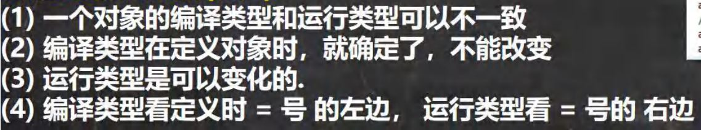
- 

```java
//使用多态机制，可以统一的管理主人喂食的问题
//animal 编译类型是 Animal,可以指向(接收) Animal 子类的对象
//food 编译类型是 Food ,可以指向(接收) Food 子类的对象
public void feed(Animal animal, Food food) {
	System.out.println("主人 " + name + " 给 " + animal.getName() + " 		吃 " + food.getName());
}


//上下两段代码效果相同，复用性提高


//主人给小狗 喂食 骨头
public void feed(Dog dog, Bone bone) {
	System.out.println("主人 " + name + " 给 " + dog.getName() + " 吃 		" + bone.getName());
}
// //主人给 小猫喂 黄花鱼
public void feed(Cat cat, Fish fish) {
	System.out.println("主人 " + name + " 给 " + cat.getName() + 		" 吃 " + fish.getName());
}
```

##### 向上转型、向下转型

1. 

2. 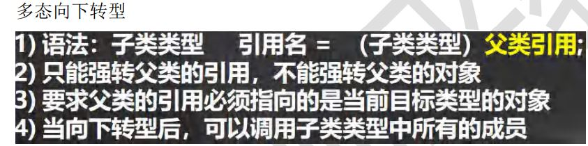

   ​	向下转型就是把向上转型后的对象的父类引用，再次的转换为对象的子类引用

   ```java
   public static void main(String[] args) {
   
       //向上转型: 父类的引用指向了子类的对象
   	//语法：父类类型引用名 = new 子类类型();
   	Animal animal = new Cat();
   	Object obj = new Cat();//可以吗? 可以 Object 也是 Cat 的父类
   	//向上转型调用方法的规则如下:
   	//(1)可以调用父类中的所有成员(需遵守访问权限)
   	//(2)但是不能调用子类的特有的成员
   	//(#)因为在编译阶段，能调用哪些成员,是由编译类型来决定的
   	//animal.catchMouse();错误
   	//(4)最终运行效果看子类(运行类型)的具体实现, 即调用方法时，按照从子类	(运行类型)开始查找方法
   	//，然后调用，规则我前面我们讲的方法调用规则一致。
       
   	animal.eat();//猫吃鱼.. animal.run();//跑
   	animal.show();//hello,你好
   	animal.sleep();//睡
       
   	//老师希望，可以调用 Cat 的 catchMouse 方法
   	//多态的向下转型
   	//(1)语法：子类类型 引用名 =（子类类型）父类引用;
   	//问一个问题? cat 的编译类型 Cat,运行类型是 Cat
   
       Cat cat = (Cat) animal;
   	cat.catchMouse();//猫抓老鼠
   	//(2)要求父类的引用必须指向的是当前目标类型的对象
   
   	Dog dog = (Dog) animal; //可以吗？
   	System.out.println("ok~~");
   }
   ```

3. ```java
   public static void main(String[] args) {
   	//属性没有重写之说！属性的值看编译类型
       
   	Base base = new Sub();//向上转型
   	System.out.println(base.count);// ？ 看编译类型 10
   }
   ```

4. instanceOf 比较操作符，用于判断对象的运行类型是否为 XX 类型或 XX 类型的子类型

   ```java
   BB bb = new BB();
   System.out.println(bb instanceof BB);//true
   ```

##### 多态参数

+ 方法定义的形参类型为父类类型，实参类型允许为子类类型

<br>

### 8.7 Object类详解

##### equals方法

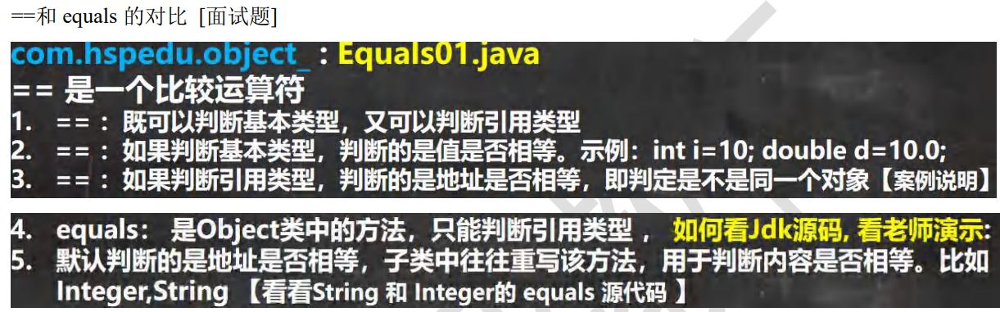

声明一个东西后，直接用new赋值，这种的都是引用类型，变量里存放的都是地址。

比较时最好都用.equals

##### hashcode方法

1. 提高具有哈希结构的容器的效率！ 
2. 两个引用，如果指向的是同一个对象，则哈希值肯定是一样的！
3. 两个引用，如果指向的是不同对象，则哈希值是不一样的
4. 哈希值主要根据地址号来的！， 不能完全将哈希值等价于地址。 

##### toString方法

1. 基本介绍：默认返回：全类名+@+哈希值的十六进制，子类往往重写 toString 方法，用于返回对象的属性信息
2. 重写 toString 方法，打印对象或拼接对象时，都会自动调用该对象的 toString 形式. 
3. 当直接输出一个对象时，toString 方法会被默认的调用, 比如 System.out.println(monster)； 就会默认调用 monster.toString()

##### finalize方法

1. 当对象被回收时，系统自动调用该对象的 finalize 方法。子类可以重写该方法，做一些释放资源的操作
2. 什么时候被回收：当某个对象没有任何引用时，则 jvm 就认为这个对象是一个垃圾对象，就会使用垃圾回收机制来 销毁该对象，在销毁该对象前，会先调用 finalize 方法。 
3. 垃圾回收机制的调用，是由系统来决定(即有自己的 GC 算法), 也可以通过 System.gc() 主动触发垃圾回收机制
4. 我们在实际开发中，几乎不会运用 finalize , 所以更多就是为了应付面试.

<br>

## Chapter10 面向对象编程

### 10.1 类变量和类方法

##### 类变量

1. 类变量即静态变量：是该类的所有对象共享的变量，任何一个该类的对象去访问它时，取到的都是相同的值，同样的任何一个该类的对象去修改它时，修改的也是同一个变量。

2. 定义语法：

   访问修饰符 static 数据类型 变量名；

3. 访问方式：

   类名.类变量名

   对象名.类变量名

4. **注意：**

   + 类变量是随着类的加载而创建，所以即使没有创建对象实例也可以访问

##### 类方法

1. 类方法即静态方法

2. 定义语法：

   ​	访问修饰符 static 数据返回类型 方法名() {}

3. 访问方法：

   ​	类名.类方法名

   ​	对象名.类方法名

4. 使用场景：

   ​	当方法中不涉及到任何的和具体对象相关的成员，则可以将方法设计成静态方法

   ​	比如说，很多工具类的方法。当我i们调用Math工具类时从来没有创建过对象而是直接使用Math.square()等方法来使用的，因为这只是个工具，不需要创建对象

5. **注意**

   + 类方法中不能使用和对象有关的关键字，比如thsi和super
   + 类方法中只能访问 静态变量 和 静态方法

<br>

### 10.2 理解main方法语法

##### 深入理解main方法

1. main方法是java虚拟机调用

2. java虚拟机需要调用类的Main()方法，所以该方法的访问权限必须是public

3. java虚拟机再执行main()方法时不必创建对象，所以该方法必须是static

4. 该方法接收String类型的数组参数，该数组中保存执行java命令时传递给所运行的类的参数

   ​	cmd：java 执行的参数 参数一 参数二 参数三......

##### 代码块与类加载时的代码执行顺序

1. 基本介绍


2. 基本语法

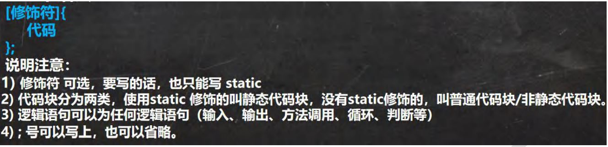

3. 注意

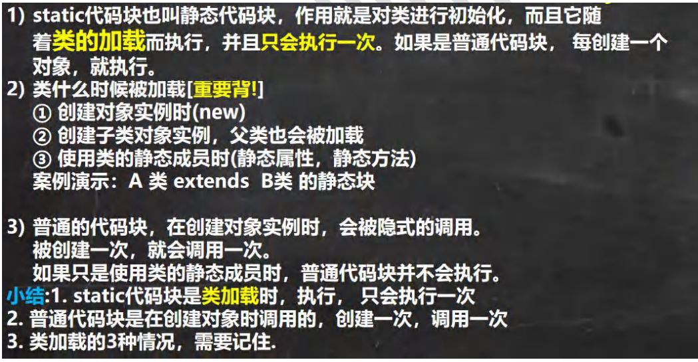

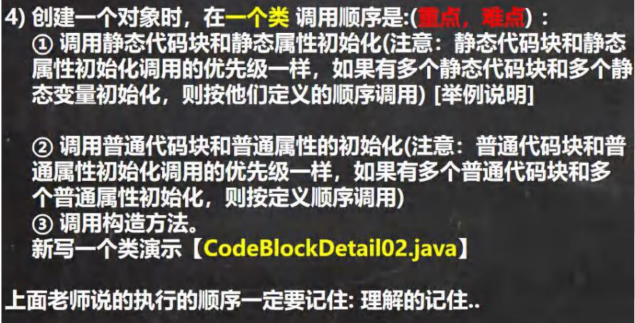

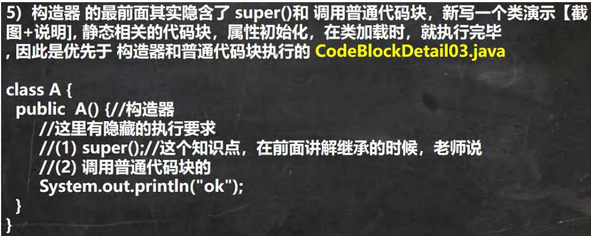

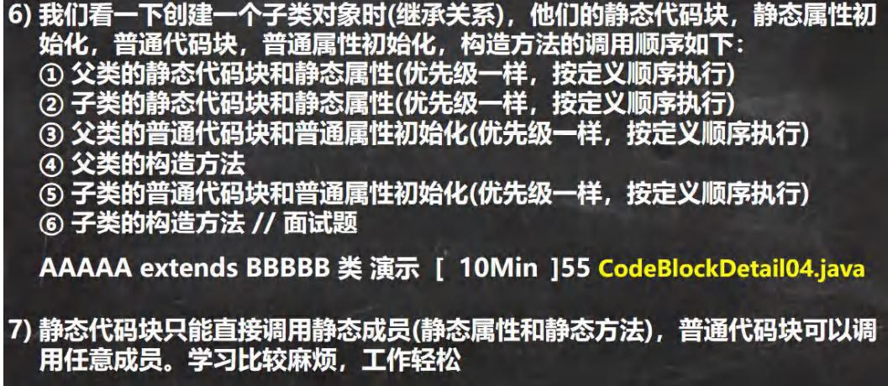

<br>

### 10.3 单例设计模式

# ==***设计模式***==

==***以后学习设计模式***==

##### 什么是设计模式

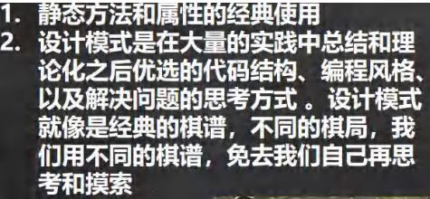

##### 单例设计模式

1. 定义


2. 步骤

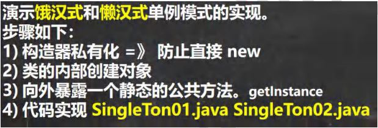

3. 代码

```java
public class SingleTon01 {

	public static void main(String[] args) {
		// GirlFriend xh = new GirlFriend("小红");
		// GirlFriend xb = new GirlFriend("小白");
		//通过方法可以获取对象
		GirlFriend instance = GirlFriend.getInstance();
		System.out.println(instance);
		GirlFriend instance2 = GirlFriend.getInstance();
		System.out.println(instance2);
		System.out.println(instance == instance2);//T
		//System.out.println(GirlFriend.n1);
		//... }
	}
    
	//有一个类， GirlFriend
	//只能有一个女朋友
	class GirlFriend {
		private String name;
	
		//public static int n1 = 100;
		//为了能够在静态方法中，返回 gf 对象，需要将其修饰为 static
		//對象，通常是重量級的對象, 餓漢式可能造成創建了對象，但是沒有使用 
        private static GirlFriend gf = new GirlFriend("小红红");
		//如何保障我们只能创建一个 GirlFriend 对象
        
        
		//步骤[单例模式-饿汉式]
		//1. 将构造器私有化
		//2. 在类的内部直接创建对象(该对象是 static)
		//3. 提供一个公共的 static 方法，返回 gf 对象
		private GirlFriend(String name) {
			System.out.println("構造器被調用.");
			this.name = name;
		}
		public static GirlFriend getInstance() {
			return gf;
		}
		@Override
		public String toString() {
			return "GirlFriend{" +
			"name='" + name + '\'' +
			'}';
		}
	
	}
    
    
	package com.hspedu.single_;
	/**
	* 演示懶漢式的單例模式
	*/
	public class SingleTon02 {
		public static void main(String[] args) {
		//new Cat("大黃");
		//System.out.println(Cat.n1);
		Cat instance = Cat.getInstance();
		System.out.println(instance);
		//再次調用 getInstance
		Cat instance2 = Cat.getInstance();
		System.out.println(instance2);
		System.out.println(instance == instance2);//T
		}
	}
	//希望在程序運行過程中，只能創建一個 Cat 對象
	
	//使用單例模式
	class Cat {
		private String name;
		public static int n1 = 999;
		private static Cat cat ; //默認是 null
		//步驟
		//1.仍然構造器私有化
		//2.定義一個 static 靜態屬性對象
		//3.提供一個 public 的 static 方法，可以返回一個 Cat 對象
		//4.懶漢式，只有當用戶使用 getInstance 時，才返回 cat 對象, 後面再次調用時，	會返回上次創建的 cat 對象
		// 從而保證了單例
		private Cat(String name) {
			System.out.println("構造器調用...");
			this.name = name;
		}
		public static Cat getInstance() {
			if(cat == null) {//如果還沒有創建 cat 對象
			cat = new Cat("小可愛");
		}
		return cat;
		}
		@Override
		public String toString() {
	
			return "Cat{" +
			"name='" + name + '\'' +
			'}';
		}
```

<br>

### 10.4 final

##### 基本介绍

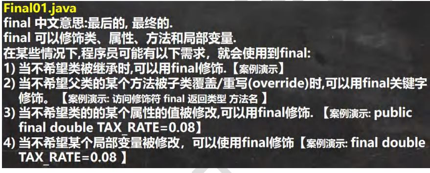

##### 注意

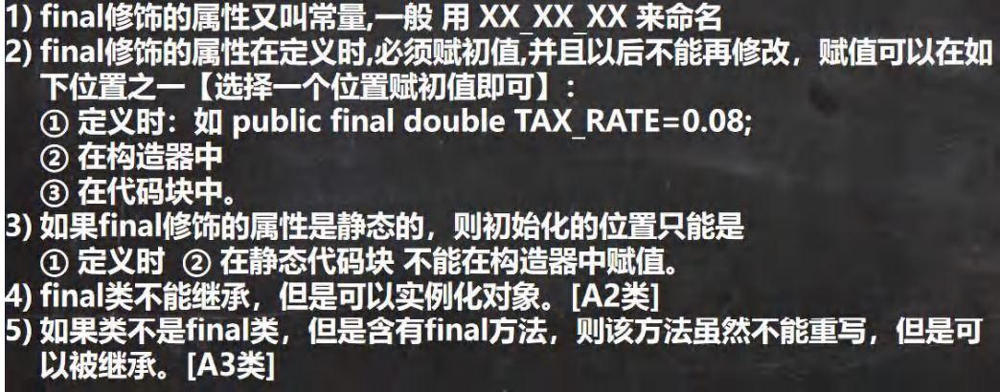

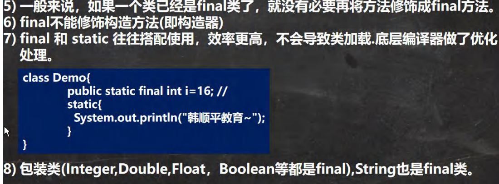

<br>

### 10.5 抽象类

##### 抽象类的介绍


##### 注意

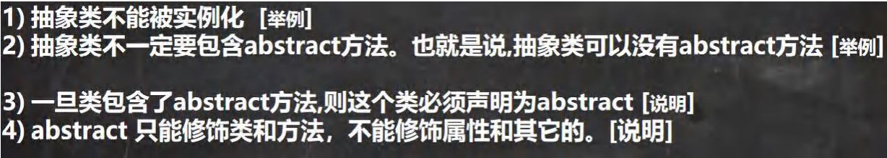

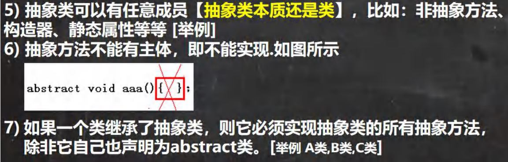

+ 不能有方法体的意思就是，方法不能有大括号
+ 抽象方法不能使用private、final和static来修饰，因为这些关键字都是和重写违背的
+ 抽象类中可以有==非抽象方法==，这也是抽象类最重要的机制，可以把抽象类当作模板设计

##### 模板设计模式

1. 介绍

   ​	抽象类型体现的就是一种模板设计模式，抽象类作为多个子类的通用模板，子类在抽象类的基础上进行扩展、改造，但子类总体上会保留抽象类的行为方式。

2. 模板模式能解决的问题

   + 当功能内部一部分实现是确定的，一部分实现是不确定的。这时可以把不确定的部分暴露出去，让子类去实现
   + 编写一个抽象父类，父类提供多个子类的通用方法，并把一个或多个方法留给子类实现，就是一种模板模式

3. 实践

   + 需求

   ​	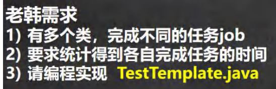

   实现

```java
abstract public class Template { //抽象类-模板设计模式
	public abstract void job();//抽象方法
	public void calculateTime() {//实现方法，调用 job 方法
	//得到开始的时间
	long start = System.currentTimeMillis();

	job(); //动态绑定机制
	//得的结束的时间
	long end = System.currentTimeMillis();
		System.out.println("任务执行时间 " + (end - start));
	}
}

public class AA extends Template {
	//计算任务
	//1+....+ 800000
	@Override
	public void job() { //实现 Template 的抽象方法 job
		long num = 0;
		for (long i = 1; i <= 800000; i++) {
			num += i;
		}
	}
	// public void job2() {
	// //得到开始的时间
	// long start = System.currentTimeMillis();
	// long num = 0;

	// for (long i = 1; i <= 200000; i++) {
	// num += i;
	// }
	// //得的结束的时间
	// long end = System.currentTimeMillis();
	// System.out.println("AA 执行时间 " + (end - start));
	// }
	}

public class BB extends Template{
	public void job() {//这里也去，重写了 Template 的 job 方法
		long num = 0;
		for (long i = 1; i <= 80000; i++) {
			num *= i;
		}
	}
}

public class TestTemplate {
	public static void main(String[] args) {

		AA aa = new AA();
		aa.calculateTime(); //这里还是需要有良好的 OOP 基础，对多态
		BB bb = new BB();
		bb.calculateTime();
	}
}
```

<br>

### 10.6 接口

##### 接口介绍


+ 接口中的抽象方法，实现类中必须实现

##### 注意

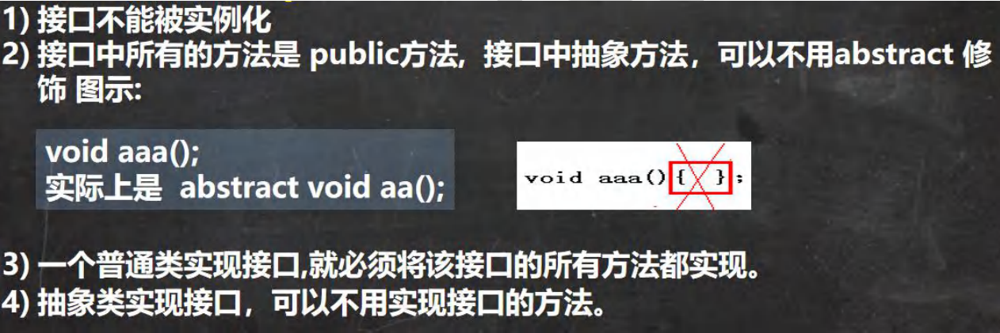

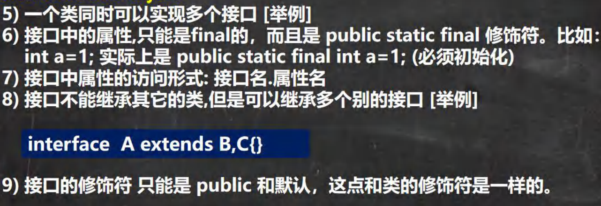

##### 实现

```java
interface IB {
	//接口中的属性,只能是 final 的，而且是 public static final 修饰符
	int n1 = 10; //等价 public static final int n1 = 10;
	void hi();
}

interface IC {
	void say();
	}

//接口不能继承其它的类,但是可以继承多个别的接口
interface ID extends IB,IC {
}

//接口的修饰符 只能是 public 和默认，这点和类的修饰符是一样的
interface IE{}
	//一个类同时可以实现多个接口
class Pig implements IB,IC {
	@Override
	public void hi() {
	}
	@Override
	public void say() {
	}
}
```

##### 接口与继承

+ 接口与继承的关系：其实接口是对Java的单继承机制的一种补充

<br>

### 10.7 内部类

##### 内部类基本介绍

1. 定义

​		一个类的内部又完整的嵌套了另一个类结构。被嵌套的类称为内部类(inner class),嵌套其他类的类称为外部类(outer class)。是我们类的第五大成员[属性、方法、构造器、代码块、内部类]，内部类最大的特点就是可以直接访问私有属性，并且可以体现类与类之间的包含关系，注意:内部类是学习的难点，同时也是重点，后面看底层源码时，有大量的内部类.

2. 分类

> 定义在外部类的局部位置上（比如方法内）
>
> > （1）局部内部类（有类名）
> >
> > （2）**匿名内部类**（没有类名）
>
> 定义再外部类的成员位置上
>
> > （1）成员内部类（没用static修饰）
> >
> > （2）静态内部类（使用static修饰）

##### 局部内部类

1. 细节

+ 可以直接访问外部类的所有成员，包含私有的
+ 只能用final修饰
+ 外部类中访问局部内部类，访问方式：创建对象再访问
+ 外部其他类无法访问局部内部类
+ 外部类和局部内部类成员重命时，遵循就近原则，想要在局部内部类中访问外部类成员则可以使用（外部类名.this.成员）去访问

2. 使用

```java
class Outer02 {//外部类
	private int n1 = 100;
	private void m2() {
		System.out.println("Outer02 m2()");
	}//私有方法
    
	public void m1() {//方法
        
		//1.局部内部类是定义在外部类的局部位置,通常在方法
		//3.不能添加访问修饰符,但是可以使用 final 修饰
		//4.作用域 : 仅仅在定义它的方法或代码块中
		final class Inner02 {//局部内部类(本质仍然是一个类)
            
			//2.可以直接访问外部类的所有成员，包含私有的
			private int n1 = 800;
			public void f1() {
				//5. 局部内部类可以直接访问外部类的成员，比如下面 外部类 n1 和 m2()
				//7. 如果外部类和局部内部类的成员重名时，默认遵循就近原则，如果想访问外部类的成员，
				// 使用 外部类名.this.成员）去访问
				// 解读 Outer02.this 本质就是外部类的对象, 即哪个对象调用了 m1, Outer02.this 就是哪个对象
				System.out.println("n1=" + n1 + " 外部类的 n1=" + Outer02.this.n1);
				System.out.println("Outer02.this hashcode=" + Outer02.this);
				m2();
			}
		}
	//6. 外部类在方法中，可以创建 Inner02 对象，然后调用方法即可
	Inner02 inner02 = new Inner02();
	inner02.f1();
}
}
```

##### 匿名内部类

1. 定义

   ​	（1）本质是类（2）内部类（3）该类没有名字（4）**同时是一个对象**

   说明：匿名内部类是定义在类的局部位置，比如方法中，并且没有类名

   语法：

   ```java
   new 类或接口(参数列表){
   	类体
   }
   ```

2. 使用

```java
class Outer04 { //外部类
	private int n1 = 10;//属性
	public void method() {//方法

        //基于接口的匿名内部类
		//解读
		//1.需求： 想使用 IA 接口,并创建对象
		//2.传统方式，是写一个类，实现该接口，并创建对象
		//3.需求是 Tiger/Dog 类只是使用一次，后面再不使用
		//4. 可以使用匿名内部类来简化开发
		//5. tiger 的编译类型 ? IA
		//6. tiger 的运行类型 ? 就是匿名内部类 Outer04$1
		/*
			我们看底层 会分配 类名 Outer04$1
			class Outer04$1 implements IA {
				@Override
				public void cry() {
					System.out.println("老虎叫唤...");
				}
			}
		*/
		//7. jdk 底层在创建匿名内部类 Outer04$1,立即马上就创建了 Outer04$1 实例，并且把地址返回给 tiger
		//8. 匿名内部类使用一次，就不能再使用
		IA tiger = new IA() {
			@Override
			public void cry() {
				System.out.println("老虎叫唤...");
			}
		};
		System.out.println("tiger 的运行类型=" + tiger.getClass());
		tiger.cry();
	

		//演示基于类的匿名内部类
		
        //分析
		//1. father 编译类型 Father
		//2. father 运行类型 Outer04$2
		//3. 底层会创建匿名内部类
		/*
			class Outer04$2 extends Father{
				@Override
				public void test() {
					System.out.println("匿名内部类重写了 test 方法");
				}
			}
		*/
		//4. 同时也直接返回了 匿名内部类 Outer04$2 的对象
		//5. 注意("jack") 参数列表会传递给 构造器
		Father father = new Father("jack"){
			@Override
			public void test() {
				System.out.println("匿名内部类重写了 test 方法");
			}
		};
		System.out.println("father 对象的运行类型=" + father.getClass());//Outer04$2
		father.test();
        
		//基于抽象类的匿名内部类
		Animal animal = new Animal(){
			@Override
			void eat() {
				System.out.println("小狗吃骨头...");
			}
		};
		animal.eat();
	}
}
interface IA {//接口
	public void cry();
}

class Father {//类
	public Father(String name) {//构造器
		System.out.println("接收到 name=" + name);
	}
	public void test() {//方法
	}
}
abstract class Animal { //抽象类
	abstract void eat();
}
```

3. 细节

+ 匿名内部类的语法比较奇特，因为匿名内部类既是一个类的定义，同时其本身也是一个对象，因此从语法上来看，它既有定义类的特征，也有创建对象的特征

```java
class Outer05 {
	private int n1 = 99;
	public void f1() {
		//创建一个基于类的匿名内部类
		//不能添加访问修饰符,因为它的地位就是一个局部变量
		//作用域 : 仅仅在定义它的方法或代码块中
		Person p = new Person(){
			private int n1 = 88;
			@Override
			public void hi() {
				//可以直接访问外部类的所有成员，包含私有的
				//如果外部类和匿名内部类的成员重名时，匿名内部类访问的话，
				//默认遵循就近原则，如果想访问外部类的成员，则可以使用 （外部类名.this.成员）去访问
				System.out.println("匿名内部类重写了 hi 方法 n1=" + n1 +
" 外部内的 n1=" + Outer05.this.n1 );
				//Outer05.this 就是调用 f1 的 对象
				System.out.println("Outer05.this hashcode=" + Outer05.this);

			}
		};
		p.hi();//动态绑定, 运行类型是 Outer05$1
		//也可以直接调用, 匿名内部类本身也是返回对象
		
		new Person(){
			@Override
			public void hi() {
				System.out.println("匿名内部类重写了 hi 方法,哈哈...");
			}
			@Override
			public void ok(String str) {
				super.ok(str);
			}
		}.ok("jack");
	}
}
class Person {//类
	public void hi() {
		System.out.println("Person hi()");
	}
	public void ok(String str) {
		System.out.println("Person ok() " + str);
	}
}
```

4. 最佳实践

+ 当作实参直接传递，简洁高效(当一个对象只被使用一次，并且需要重写类中的方法的时候使用)

```java
public class InnerClassExercise01 {
	public static void main(String[] args) {
	//当做实参直接传递，简洁高效
	f1(new IL() {
			@Override
			public void show() {
			System.out.println("这是一副名画~~...");
			}
		});

//静态方法,形参是接口类型
public static void f1(IL il) {
il.show();
}
}
//接口
interface IL {
	void show();
}
//类->实现 IL => 编程领域 (硬编码)
class Picture implements IL {
	@Override
	public void show() {
		System.out.println("这是一副名画 XX...");
	}
}

```

##### 成员内部类

1. 定义：

​	成员内部类是定义在外部类的成员位置，并且没有static修饰的。

2. 细节：

+ 可以直接访问外部类的所有成员，包含私有的
+ **可以添加任意访问修饰符（public、protected、默认、private），因为它的地位就是一个成员**
+ 外部类访问成员内部类，访问方式：创建对象，再访问
+ 如果外部类和内部类的成员重名时，内部类访问的话，遵循就近原则，如果想要访问外部类的成员则可以使用（外部类名.this.成员）去访问

3. 使用

   外部其他类访问内部成员类

   **无论什么方式都需要通过外部类的实例来访问内部成员类**，因为这不是一个static类，没有对象就没有这个类（属性）

```java
public class MemberInnerClass01 {
	public static void main(String[] args) {
        
		Outer08 outer08 = new Outer08();
		outer08.t1();
		//外部其他类，使用成员内部类的三种方式
        //无论什么方式都需要通过外部类的实例来访问内部成员类
		//解读
		// 第一种方式
		// outer08.new Inner08(); 相当于把 new Inner08()当做是 outer08 成员
		// 这就是一个语法，不要特别的纠结. 
        Outer08.Inner08 inner08 = outer08.new Inner08();
		inner08.say();
		// 第二方式 在外部类中，编写一个方法，可以返回 Inner08 对象
		Outer08.Inner08 inner08Instance = outer08.getInner08Instance();
		inner08Instance.say();
	}
}
class Outer08 { //外部类
	private int n1 = 10;
	public String name = "张三";
	private void hi() {
		System.out.println("hi()方法...");
	}

	//1.注意: 成员内部类，是定义在外部内的成员位置上
	//2.可以添加任意访问修饰符(public、protected 、默认、private),因为它的地位就是一个成员
	public class Inner08 {//成员内部类
		private double sal = 99.8;
		private int n1 = 66;
		public void say() {
			//可以直接访问外部类的所有成员，包含私有的
			//如果成员内部类的成员和外部类的成员重名，会遵守就近原则. 
            //，可以通过 外部类名.this.属性 来访问外部类的成员
			System.out.println("n1 = " + n1 + " name = " + name + " 外部类的 n1=" + Outer08.this.n1);
			hi();
		}
	}
	//方法，返回一个 Inner08 实例
	public Inner08 getInner08Instance(){
		return new Inner08();
	}
	//写方法
	public void t1() {
		//使用成员内部类
		//创建成员内部类的对象，然后使用相关的方法
		Inner08 inner08 = new Inner08();
		inner08.say();

		System.out.println(inner08.sal);
	}
}

```

##### 静态内部类

1. 定义

   静态内部了时定义在外部类的成员位置，并且由static修饰的。

2. 细节

+ 可以直接访问外部类的所有静态成员，包含私有的，但不能访问非静态成员

3. 使用

​		外部其他类访问静态内部类

```java
public class StaticInnerClass01 {
	public static void main(String[] args) {

        Outer10 outer10 = new Outer10();
		outer10.m1();
		
        //外部其他类 使用静态内部类
		//方式 1
		//因为静态内部类，是可以通过类名直接访问(前提是满足访问权限)
		Outer10.Inner10 inner10 = new Outer10.Inner10();
		inner10.say();
		//方式 2
		//编写一个方法，可以返回静态内部类的对象实例. 
        Outer10.Inner10 inner101 = outer10.getInner10();
		System.out.println("============");
		inner101.say();
		Outer10.Inner10 inner10_ = Outer10.getInner10_();
		System.out.println("************");
		inner10_.say();
	}
}

class Outer10 { //外部类
	private int n1 = 10;
	private static String name = "张三";
	private static void cry() {}
	//Inner10 就是静态内部类
	//1. 放在外部类的成员位置
	//2. 使用 static 修饰
	//3. 可以直接访问外部类的所有静态成员，包含私有的，但不能直接访问非静态成员
	//4. 可以添加任意访问修饰符(public、protected 、默认、private),因为它的地位就是一个成员
	//5. 作用域 ：同其他的成员，为整个类体
	static class Inner10 {
		private static String name = "韩顺平教育";
		public void say() {
			//如果外部类和静态内部类的成员重名时，静态内部类访问的时，
			//默认遵循就近原则，如果想访问外部类的成员，则可以使用 （外部类名.成员）
			System.out.println(name + " 外部类 name= " + Outer10.name);
			cry();
		}
	}
	public void m1() { 
        //外部类---访问------>静态内部类 访问方式：创建对象，再访问
		Inner10 inner10 = new Inner10();
		inner10.say();
	}
	public Inner10 getInner10() {
		return new Inner10();
	}
	public static Inner10 getInner10_() {
	return new Inner10();
	}
}

```

##### 小结

+ 重点是掌握匿名内部类的使用

​		new 类/接口（参数列表）{//。。。}

+ 成员内部类，静态内部类 是放在外部类的成员位置，本质就是一个成员

<br>

## Chapter11 枚举和注解

### 11.1 枚举

##### 枚举类基本介绍

1. 枚举类：

   ​	枚: 一个一个  举：例举 , 即把具体的对象一个一个例举出来的类 ，就称为枚举类

2. 使用枚举类的情况：

​			类的值是有限的几个值，只读不允许修改，只允许调用已经写好的对象

##### 枚举类的实现

1. 枚举类的特点

+ 构造器私有化
+ 本类内部创建一组对象
+ 对外暴露对象
+ 可以提供 get 方法，但是不要提供 set

2. 实现

```java
public class Enumeration03 {
	public static void main(String[] args) {
		System.out.println(Season2.AUTUMN);
		System.out.println(Season2.SUMMER);
	}
}
//演示使用 enum 关键字来实现枚举类
enum Season2 {//枚举类

//使用 enum 实现枚举类
//1. 使用关键字 enum 替代 class
//2. public static final Season SPRING = new Season("春天", "温暖")改为用
// SPRING("春天", "温暖") 解读 常量名(实参列表)
//3. 如果有多个常量(对象)， 使用 ,号间隔即可
//4. 如果使用 enum 来实现枚举，要求将定义常量对象，写在前面
//5. 如果我们使用的是无参构造器，创建常量对象，则可以省略 ()
	SPRING("春天", "温暖"), WINTER("冬天", "寒冷"), AUTUMN("秋天", "凉爽"), 	SUMMER("夏天", "炎热")/*, What()*/;
	private String name;
	private String desc;//描述
	private Season2() {//无参构造器
	}
	private Season2(String name, String desc) {
		this.name = name;
		this.desc = desc;
	}

	public String getName() {
		return name;
	}
	public String getDesc() {
		return desc;
	}
	@Override
	public String toString() {
		return "Season{"+"name='" + name + '\'' +", desc='" + desc +'\'' +'}';
	}
}
```

##### 注意

- 当我们使用 enum 关键字开发一个枚举类时，默认会继承 Enum 类, 而且是一个 final 类
- 传统的 public static final Season2 SPRING = new Season2("春天", "温暖"); 简化成 SPRING("春天", "温暖")
- 如果使用无参构造器 创建 枚举对象，则实参列表和小括号都可以省略
- 当有多个枚举对象时，使用,间隔，最后有一个分号结尾
- 枚举对象必须放在枚举类的行首.

##### **enum**常用方法

+ toString:Enum 类已经重写过了，返回的是当前对象 名,子类可以重写该方法，用于返回对象的属性信息
+ name：返回当前对象名（常量名），子类中不能重写
+ ordinal：返回当前对象在enum类中定义的的位置号，默认从 0 开始
+ values：返回当前枚举类中所有的常量
+ valueOf：将字符串转换成枚举对象，要求字符串必须 为已有的常量名，否则报异常！
+ compareTo：比较两个枚举常量，比较的就是编号！

```java
//从反编译可以看出 values 方法，返回 Season2[]
//含有定义的所有枚举对象
Season2[] values = Season2.values();
System.out.println("===遍历取出枚举对象(增强 for)====");
for (Season2 season: values) {//增强 for 循环
	System.out.println(season);
}

//Season2.AUTUMN 的编号[2] - Season2.SUMMER 的编号[3]
Season2.AUTUMN.compareTo(Season2.SUMMER);
```

##### 增强FOR循环

```java
//补充了一个增强 for
int[] nums = {1, 2, 9};
// //普通的 for 循环
System.out.println("=====普通的 for=====");
for (int i = 0; i < nums.length; i++) {
	System.out.println(nums[i]);
}
System.out.println("=====增强的 for=====");
//执行流程是 依次从 nums 数组中取出数据，赋给 i, 如果取出完毕，则退出 for
for(int i : nums) {
	System.out.println("i=" + i);
}
```

<br>

### 11.2 注解

##### 注解的理解

+ 注解(Annotation)也被称为元数据(Metadata)，用于修饰解释 包、类、方法、属性、构造器、局部变量等数据信息。
+ 和注释一样，注解不影响程序逻辑，但注解可以被编译或运行，相当于嵌入在代码中的补充信息。
+ 在 JavaSE 中，注解的使用目的比较简单，例如标记过时的功能，忽略警告等。在 JavaEE 中注解占据了更重要的角 色，例如用来配置应用程序的任何切面，代替 java EE 旧版中所遗留的繁冗代码和 XML 配置等。

##### 元注解

+ Retention //指定注解的作用范围，三种 SOURCE,CLASS,RUNTIME
+ Target // 指定注解可以在哪些地方使用
+ Documented //指定该注解是否会在 javadoc 体现
+ Inherited //子类会继承父类注解

<br>

## Chapter 12 Exception

##### 异常简介

1. 基本概念

+ JAVA程序执行中发生的不正常情况称之为“异常”。（不包括开发过程中的语法错误和逻辑错误）
+ 异常事件分类
  + Error（错误）：Java虚拟机无法解决的严重问题。如：JVM系统内部错误、资源耗尽等严重情况。比如：StackOverflowError[栈溢出]和OOM[out of memory]，Error时严重错误，程序会崩溃
  + Exception：其他因编程错误或者偶然的外在因素导致的一般性问题，可以使用针对性的代码进行处理。例如空指针访问，试图读取不存在的文件等等。Exception分为两大类：
    + 运行时异常（RuntimeException）：程序运行时发生的异常
    + 编译时异常：编译时，编译器检查出的异常

2. **异常的类图**

   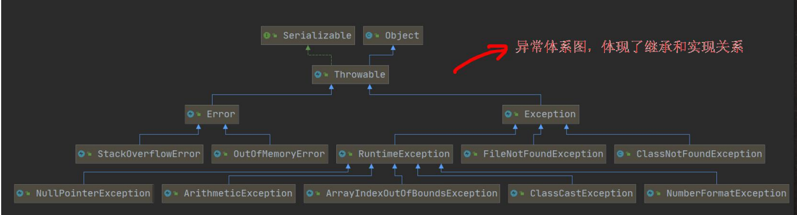

+ 运行时异常：编译器检查不出来。指的就是运行时的逻辑错误，是程序员应该避免出现的异常。对应的为java.lang.RuntimeException类及它的子类都是运行时异常
+ 其实对于运行时异常，是可以不做处理的，因为这类异常很普遍，若全都处理会对程序的可读性和运行效率产生很大的影响（因为java会默认对运行时异常做抛出处理，但会终止程序的运行）
+ 编译时异常，是编译器要求必须处置的异常

##### 常见的运行时异常

1. NullPointerException 空指针异常
2. ArithmeticException 数学运算异常
3. ArrayIndexOutOfBoundsException 数组下标越界异常
4. ClassCastException 类型转换异常
5. NumberFormatException 数字格式不正确异常

##### 编译异常

1. 介绍：在编译期间就必须处理的异常，否则代码无法通过编译的
2. 常见的编译异常 

+ SQLException 操作数据库时，查询表可能发生的异常
+ IOException 操作文件时的异常
+ FileNotFoundException 文件不存在异常
+ ClassNotFoundException 类不存在异常
+ IllegalArguementException 非法参数异常

##### 异常处理

1. try-catch-finally

​		程序员在代码中捕获发生的异常，自行处理

2. throws

   将发生的异常抛出由方法的调用者来处理，最上层的处理者就是JVM虚拟机（JVM对于异常处理十分简单粗暴，即直接输出异常然后结束程序，这也是运行时异常的默认处理方式，因为运行时异常会被默认抛出，一层一层直至抛出到JVM虚拟机）

3. 处理机制

+ try-catch-finally的处理机制


+ throws的处理机制


##### try-catch异常处理

1. try-catch语法

```java
try{
    //可能会产生异常的代码块
    //将异常生成的对应的异常对象，传递给catch块
}catch(异常){
    //对于异常的处理
}
//可以没有finally
```

+ 例子

```java
public static void main(String[] args) {
	int num1 = 10;
	int num2 = 0;
try {
	int res = num1 / num2;
} catch (Exception e/*捕获到的异常*/) {
	System.out.println(e.getMessage());
}
}
```

2. 注意事项

+ 如果产生了异常，则产生异常后面的代码不会执行，直接进入到catch块中
+ 如果异常没有发生，则顺序执行try的代码块，不会进入到catch
+ 如果希望不管是否发生异常，都执行某段代码（如：关闭连接，释放资源等），则使用finally{}

```java
try{
 	//可能异常代码   
}catch(异常){
    //处理
}finally{
    //释放资源等
}
```

+ 可以有多个catch语句（try中的代码块可能发生多种异常），捕获不同的异常（用于进行不同的业务逻辑处理），要求父类异常的捕获在后，子类异常的捕获在前。（如：Exception在后，NullPointerException在前），如果发生异常，只会匹配一个catch

```java
package com.edu.try_;

	public class TryCatchDetail02 {
	public static void main(String[] args) {

	//1.如果 try 代码块有可能有多个异常
	//2.可以使用多个 catch 分别捕获不同的异常，相应处理
	//3.要求子类异常写在前面，父类异常写在后面
	try {
		Person person = new Person();
		//person = null;
		System.out.println(person.getName());//NullPointerException
		int n1 = 10;
		int n2 = 0;
		int res = n1 / n2;//ArithmeticException
	} catch (NullPointerException e) {
		System.out.println("空指针异常=" + e.getMessage());
	} catch (ArithmeticException e) {
		System.out.println("算术异常=" + e.getMessage());
	} catch (Exception e) {
		System.out.println(e.getMessage());
	} finally {
	}
}
}
class Person {
	private String name = "jack";
	public String getName() {
	return name;
}
}
```

+ 可以使用try-finally，这种用法相当于没有捕获异常，所以程序一定会终止执行的。应用于，执行一段代码无论是否异常都要执行某个业务逻辑

3. 小结

+ 如果没有异常，则执行try中的所有语句，不执行catch中的语句，如果有finally，最后还要执行finally中的语句
+ 如果出现了异常，则try块中异常发生后，try块中剩下的语句不再执行。将执行catch块中的语句，如果有finally，最后还要执行finally中的语句

##### throws异常处理

1. 简介

+ 使用时机：如果一个方法中的语句可能产生某种异常，但是并不确定要如何处理这些异常，那么我们可以使用throws显式的抛出此异常，表明在我们的方法内不对这些异常进行处理，由该方法的调用者进行处理（调用者也可以继续抛出或者用try-catch处理）
+ 使用：在方法的声明中可以用throws语句声明抛出的异常的列表（可以同时抛出多个异常），throws后面的异常类型可以是方法中产生的异常类型，也可以是它的父类
+ 语法：

```java
public static void readFile(String file) throws FileNotFoundException{
    //读文件可能产生FileNotFoundException类型的异常
    FileInputStream fis = new FileInputStream("d://a.tex");
}
```

2. 使用细节

+ 对于编译异常，那么我们必须要在程序中处理掉（try-catch或throws），否则无法通过编译
+ 对于运行时异常，即使我们的程序中没有处理，JAVA默认就是用throws的方法处理。即其实每个方法的声明中都默认包含throws RuntimeException，有异常发生时就会一层一层的向上抛出，最高层的调用者就是JVM虚拟机，然后虚拟机就会处理这个异常（输出异常然后结束程序）
+ 子类重写父类的方法时的异常处理：子类重写的方法，所抛出的异常类型要么和父类方法的一致，要么是父类抛出异常的子类
+ throws和try-catch两个处理方法中，只需要有一个即可

##### 自定义异常

1. 很多时候，尤其是在项目中，我们都需要自定义异常（可以结合枚举类定义异常信息），用于描述错误信息，并且返回给前端
2. 自定义异常的步骤：
   + 定义类：自定义异常类名继承Exception或者RuntimeException
   + 如果继承了Exception，属于编译异常
   + 如果继承了RuntimeException，属于运行时异常（一般都是运行时异常）

3. 使用

```java
public class CustomException {
	public static void main(String[] args) /*throws AgeException*/ {
		int age = 180;
		//要求范围在 18 – 120 之间，否则抛出一个自定义异常
		if(!(age >= 18 && age <= 120)) {
		//这里我们可以通过构造器，设置信息
			throw new AgeException("年龄需要在 18~120 之间");
		}
		System.out.println("你的年龄范围正确.");
	}
}
//自定义一个异常
//1. 一般情况下，我们自定义异常是继承 RuntimeException
//2. 即把自定义异常做成 运行时异常，好处时，我们可以使用默认的处理机制
//3. 即比较方便

class AgeException extends RuntimeException {
	public AgeException(String message) {//构造器
		super(message);
	}
}

```

##### throw和throws的区别

|        |           意义           |    位置    | 后面跟的东西 |
| :----: | :----------------------: | :--------: | :----------: |
| throws |      异常处理的方式      | 方法声明处 |   异常类型   |
| throw  | 手动生成异常对象的关键字 |  方法体中  |   异常对象   |

<br>

## Chapter13 常用类

### 13.1 包装类(Wrapper Class)

*前言*：*为什么需要包装类呢？因为相比于基本数据类型我们的包装类拥有了类的特点，我们就可以调用类中的方法来简化我们的开发，以后在项目中会大量的使用包装类的*

##### 包装类的分类

1. 八种基本的数据类型都有相应的包装类

| 基本数据类型 |  包装类   |
| :----------: | :-------: |
|   boolean    |  Boolena  |
|     char     | Character |
|     byte     |   Byte    |
|    short     |   Short   |
|     int      |  Integer  |
|     long     |   Long    |
|    float     |   Float   |
|    double    |  Double   |

2. 包装类的类图

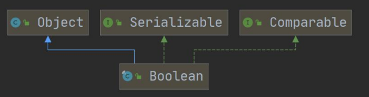

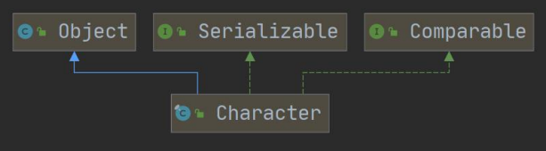

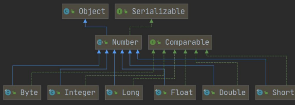

> 其中的Serializable接口，简单的理解是用于实现类的序列化和反序列化，序列化即将我们的实体转换为字节流输出到文件中去，反序列化正相反。想要详细了解可以看[Java对象为啥要实现Serializable接口？](https://zhuanlan.zhihu.com/p/66210653)

> 其中的Comparable接口，简单理解就是对实现它的每个类的对象进行整体排序，实现此接口的对象列表（和数组）可以通过**Collections.sort(和Arrays.sort)**进行自动排序。实现此接口的目的就是为了对我们用到的所有对象进行整体的排序。详细了解可以看[Comparable接口和Comparator接口](https://www.jianshu.com/p/a170823e3a4b)

> 其中数字型包装类的父类Number，源码中的注解是抽象类Number是代表数字值的包装类的超类，这些数字值可以转换为原始类型byte、double、float、int、long和short。从一个特定的Number实现的数字值转换到一个给定的原始类型的具体语义由有关的Number实现定义。
>
> > 如：public abstract int intValue();用于把Integer包装类转换为基本类型int
> >
> > 如：public abstract double doubleValue();

##### 包装类与基本数据类型的转换

*这里我们使用int和Integer的转换为例，其它也基本相同*

1. 手动装箱与拆箱

+ jdk5以前只有手动装箱和拆箱方式，装箱：基本类型->包装类，拆箱：包装类->基本类型

```java
//演示 int <--> Integer 的装箱和拆箱
//jdk5 前是手动装箱和拆箱
//手动装箱 int->Integer
int n1 = 100;
Integer integer = new Integer(n1);
Integer integer1 = Integer.valueOf(n1);
//手动拆箱
//Integer -> int
int i = integer.intValue();
```

> 可以看到intValue()方法就是实现了Number接口中的抽象方法

2. 自动装箱与拆箱

+ jdk5及之后实现了自动装箱和拆箱

```java
//jdk5 后，就可以自动装箱和自动拆箱
int n2 = 200;
//自动装箱 int->Integer
Integer integer2 = n2; //底层使用的是 Integer.valueOf(n2)
//自动拆箱 Integer->int
int n3 = integer2; //底层仍然使用的是 intValue()方法
```

> 如果我们查看Integer.valueof()方法的源码，我们会发现其实对于不同的参数，处理是不同的，源码如下

```java
public static Integer valueOf(int i) {
	if (i >= IntegerCache.low && i <= IntegerCache.high)
		return IntegerCache.cache[i + (-IntegerCache.low)];
	return new Integer(i);
}
```

> 可以查询出IntegerCache.low = -128，IntegerCache.high = 127，那么如果 i 在 IntegerCache.low(-128)~IntegerCache.high(127),就直接从数组返回， 如果不在 -128~127,就直接 new Integer(i)，

> 这两种方式有什么区别呢？
>
> + 若是直接new的话，那么我们的变量就是指向一个对象的地址，在进行比较时要用equals()
> + 若是IntegerCache的数组赋值的话，我们的变量就是被常量直接赋值，比较的时候就是直接比较常量值

##### 包装类和String类型的相互转换

直接上代码

```java
//包装类(Integer)->String
Integer i = 100;//自动装箱
String str1 = i + "";
String str2 = i.toString();
String str3 = String.valueOf(i);
//String -> 包装类(Integer)
String str4 = "12345";
Integer i2 = Integer.parseInt(str4);//使用到自动装箱
Integer i3 = new Integer(str4);//构造器
Integer i4 = Integer.valueOf(str4);//valueof()方法
```

##### Integer类和Character类的常用方法

仅提供几个常用的方法，详情可以查看包装类的源码，最好用到的时候直接面向CSDN编程

```java
System.out.println(Integer.MIN_VALUE); //返回最小值
System.out.println(Integer.MAX_VALUE);//返回最大值
System.out.println(Character.isDigit('a'));//判断是不是数字
System.out.println(Character.isLetter('a'));//判断是不是字母
System.out.println(Character.isUpperCase('a'));//判断是不是大写
System.out.println(Character.isLowerCase('a'));//判断是不是小写
System.out.println(Character.isWhitespace('a'));//判断是不是空格
System.out.println(Character.toUpperCase('a'));//转成大写
System.out.println(Character.toLowerCase('A'));//转成小
```

<br>

### 13.2 String 类

##### String类的理解

1. String对象用于保存字符串，本质就是保存字符序列
2. 字符串常量对象是使用双引号括起来的字符序列。例如“你好”，“1212”，“boy”
3. 字符串的字符使用Unicode编码，一个字符占两个字节
4. 类图

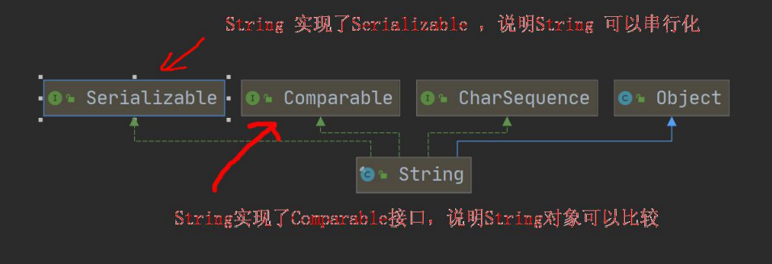

5. String 是 final 类，不能被其他的类继承
6. String 中的属性 private final char value[]; 才是用于存放字符串内容的地方
7. 一定要注意：value 是一个 final 类型， 不可以修改：即 value 不能指向新的地址，但是单个字符内容是可以变

##### 创建String对象

1. 两种方式：

+ 一：直接赋值 `String s = "Quin_lan"`
+ 二：调用构造器`String s2 = new String("Quin_lan")`

2. 两种方式的区别

+ 方式一：先从常量池查看是否有“Quin_lan”的数据空间，如果有直接指向；如果没有则重新创建，然后指向。s最终的指向是常量池的空间地址。
+ 方式二：先在堆中创建空间，堆中的维护了value属性，value指向了常量池的Quin_lan空间。

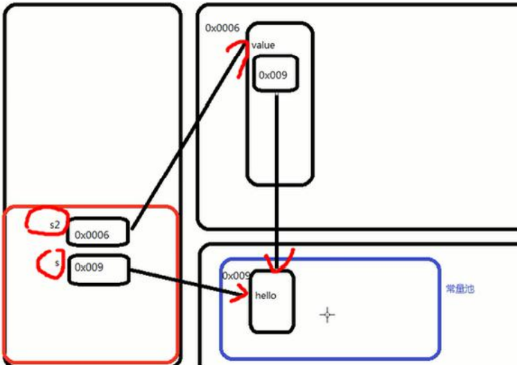

##### String类的常用方法

- equals：区分大小写，判断==内容==是否相等
- equalsIgnoreCase：不区分大小写，判断==内容==是否相等
- length：获取字符的个数，字符串的长度
- indexOf：获取字符在字符串中第一次出现的索引，索引从0开始，如果找不到，返回-1
- lastIndexOf：获取字符在字符串中最后一次出现的索引
- substring：截取指定范围的字串
- trim：去除前后空格
- charAt：获取某索引处的字符
- toUpperCase：转换成大写
- toLowerCase：转换成小写
- concat：拼接字符串
- replace：替换字符串中的字符
- split：以指定内容来分割字符串，对于某些分割字符，我们需要使用 转义 比如文件路径
- compareTo：比较两个字符串的大小
- toCharArray：转换成字符数组
- format：格式化字符串

```java
	String name = "john";
	int age = 10;
	double score = 56.857;
	char gender = '男';

//1. %s , %d , %.2f %c 称为占位符
//2. 这些占位符由后面变量来替换
//3. %s 表示后面由 字符串来替换
//4. %d 是整数来替换
//5. %.2f 表示使用小数来替换，替换后，只会保留小数点两位, 并且进行四舍五入的处理
//6. %c 使用 char 类型来替换
	String formatStr = "我的姓名是%s 年龄是%d，成绩是%.2f 性别是%c.希望大家喜欢我！";
	String info2 = String.format(formatStr, name, age, score, gender);
```

<br>

### 13.3 StringBuffer 类

##### String类和StringBuffer类的区别

1. String保存的是字符串的常量，里面的值不能更改，每次String类的更新实际上是更改了指向的地址，效率低。 `private final char value[]`
2. StringBuffer类保存的是字符串变量，里面的值可以修改，不用每次都更新地址，效率高。 `char[] value`

##### StringBuffer 和 String 的相互转换

``````java
//看 String——>StringBuffer
 String str = "hello tom";

//方式 1 使用构造器
//注意： 返回的才是 StringBuffer 对象，对 str 本身没有影响
StringBuffer stringBuffer = new StringBuffer(str);

//方式 2 使用的是 append 方法
StringBuffer stringBuffer1 = new StringBuffer();
stringBuffer1 = stringBuffer1.append(str);

//看看 StringBuffer ->String
StringBuffer stringBuffer3 = new StringBuffer("韩顺平教育");

//方式 1 使用 StringBuffer 提供的 toString 方法
String s = stringBuffer3.toString();

//方式 2: 使用构造器来搞定
String s1 = new String(stringBuffer3)
``````

##### StringBuffer类常用方法

``````java
StringBuffer s = new StringBuffer("hello")
//增
s.append(',');// "hello,"
s.append("张三丰");//"hello,张三丰"

//删
/*
* 删除索引为>=start && <end 处的字符
* 解读: 删除 11~14 的字符 [11, 14)
*/
s.delete(11, 14);

//改
//使用 周芷若 替换 索引 9-11 的字符 [9,11)
s.replace(9, 11, "周芷若");

//查找指定的子串在字符串第一次出现的索引，如果找不到返回-1
int indexOf = s.indexOf("张三丰");

//插
//在索引为 9 的位置插入 "赵敏",原来索引为 9 的内容自动后移
s.insert(9, "赵敏");

//长度
System.out.println(s.length());

``````

<br>

### 13.4 StringBuilder 类

*前言：*StringBuilder类，一个可变的字符序列。此类提供了和StringBuffer兼容的API，但是StringBuilder的方法没有做互斥处理，即没有synchronized关键字，因此只能适用于单线程，不能在多线程时使用，但是Stringbuilder类是效率最高的。

##### String、StringBuffer 和 Stringbuilder 的比较

1. StringBuilder 和 StringBuffer非常相似，均代表可变的字符序列，而且方法也一样
2. String：不可变字符序列，效率低，但是复用率高
3. StringBuffer：可变字符序列、效率较高、线程安全
4. StringBuilder:可变字符序列、效率最高、线程不安全
5. String使用注意说明:
   string s="a"; // 创建了一个字符串
   s += "b"; // 实际上原来的" a"字符串对象已经丢弃了，现在又产生了一个字符
   串s+"b" (也就是" ab")。如果多次执行这些改变串内容的操作，会导致大量副
   本字符串对象存留在内存中，降低效率。如果这样的操作放到循环中，会极大
   影响程序的性能=>==结论:如果我们对String 做大量修改，不要使用String==

##### String、StringBuffer 和 StringBuilder 的选择

使用的原则，结论:

1. 如果字符串存在大量的修改操作，一般使用StringBuffer或StringBuilder
2. 如果字符串存在大量的修改操作，并在单线程的情况，使用StringBuilder
3. 如果字符串存在大量的修改操作，并在多线程的情况，使用StringBuffer
4. 如果我们字符串很少修改，被多个对象引用，使用String, 比如配置信息等

<br>

### 13.5 Math 类

*就是一些基本的数学运算*

##### 常用方法

[所有方法](http://www.51gjie.com/java/580.html)

```java
7.random 求随机数
// random 返回的是 0 <= x < 1 之间的一个随机小数
// 思考：请写出获取 a-b 之间的一个随机整数,a,b 均为整数 ，比如 a = 2, b=7
// 即返回一个数 x 2 <= x <= 7
// 老韩解读 Math.random() * (b-a) 返回的就是 0 <= 数 <= b-a
// (1) (int)(a) <= x <= (int)(a + Math.random() * (b-a +1)
```

<br>

### 13.6 Arrays 类

##### 常用方法

1. toString：将数组全部输出

```java
Arrays.toString(arr)
```

2. sort：排序(可以通过实现comparator接口的匿名内部类来定制升序还是降序)

```java
//演示 sort方法的使用

        Integer arr[] = {1, -1, 7, 0, 89};
        //进行排序
        //老韩解读
        //1. 因为数组是引用类型，所以通过sort排序后，会直接影响到 实参 arr
        //2. sort重载的，也可以通过传入一个接口 Comparator 实现定制排序
        //3. 调用 定制排序 时，传入两个参数 (1) 排序的数组 arr
        //   (2) 实现了Comparator接口的匿名内部类 , 要求实现  compare方法
        //5. 先演示效果，再解释
        //6. 这里体现了接口编程的方式 , 看看源码，就明白
        //   源码分析
        //(1) Arrays.sort(arr, new Comparator()
        //(2) 最终到 TimSort类的 private static <T> void binarySort(T[] a, int lo, int hi, int start, Comparator<? super T> c)()
        //(3) 执行到 binarySort方法的代码, 会根据动态绑定机制 c.compare()执行我们传入的匿名内部类的 compare ()
        //     while (left < right) {
        //                int mid = (left + right) >>> 1;
        // ! ! ! ! ! !==> if (c.compare(pivot, a[mid]) < 0) 
        //                    right = mid;
        //                else
        //                    left = mid + 1;
        //            }
        //(4) new Comparator() {
        //            @Override
        //            public int compare(Object o1, Object o2) {
        //                Integer i1 = (Integer) o1;
        //                Integer i2 = (Integer) o2;
        //                return i2 - i1;
        //            }
        //        }
        //(5) public int compare(Object o1, Object o2) 返回的值>0 还是 <0
        //    会影响整个排序结果, 这就充分体现了 接口编程+动态绑定+匿名内部类的综合使用
        //    将来的底层框架和源码的使用方式，会非常常见
        //Arrays.sort(arr); // 默认排序方法
        //定制排序
        Arrays.sort(arr, new Comparator() {
            @Override
            public int compare(Object o1, Object o2) {
                Integer i1 = (Integer) o1;
                Integer i2 = (Integer) o2;
                return i2 - i1;
            }
        });
        System.out.println("===排序后===");
        System.out.println(Arrays.toString(arr));//
```

```java
//自己编写一个sort，使用匿名内部类

int[] arr = {1, -1, 8, 0, 20};
        //bubble01(arr);

        bubble02(arr, new Comparator() {
            @Override
            public int compare(Object o1, Object o2) {
                int i1 = (Integer) o1;
                int i2 = (Integer) o2;
                return i2 - i1;// return i2 - i1;
            }
        });

        System.out.println("==定制排序后的情况==");
        System.out.println(Arrays.toString(arr));

    }

    //使用冒泡完成排序
    public static void bubble01(int[] arr) {
        int temp = 0;
        for (int i = 0; i < arr.length - 1; i++) {
            for (int j = 0; j < arr.length - 1 - i; j++) {
                //从小到大
                if (arr[j] > arr[j + 1]) {
                    temp = arr[j];
                    arr[j] = arr[j + 1];
                    arr[j + 1] = temp;
                }
            }
        }
    }

    //结合冒泡 + 定制
    public static void bubble02(int[] arr, Comparator c) {
        int temp = 0;
        for (int i = 0; i < arr.length - 1; i++) {
            for (int j = 0; j < arr.length - 1 - i; j++) {
                //数组排序由 c.compare(arr[j], arr[j + 1])返回的值决定
                if (c.compare(arr[j], arr[j + 1]) > 0) {
                    temp = arr[j];
                    arr[j] = arr[j + 1];
                    arr[j + 1] = temp;
                }
            }
        }
    }
```

3. binarySearch 对有序数组进行查找（二分查找）

```java
int index = Arrays.binarySearch(arr,3) //3若不存在，则返回负数
```

4. copyOf 数组元素复制

```java
Integer[] newArr = Arrays.copyOf(arr,arr.length)
```

5. fill 数组元素填充

```java
Arrays.fill(num,99); //num数组所有元素都被99填充
```

6. equals 比较两个数组内容是否完全一致

```java
boolean equals = Arrays.equals(arr,arr2);
```

7. asList 将一个数组，转换成list

```java
List<Integer> asList = Arrays.asList(2,3,23,564,1,76);
```

<br>

### 13.7 System 类

##### 常见方法

1. exit：退出当前程序

```java
System.exit(0); //0表示一个状态，正常退出
```

2. currentTimeMillens：返回当前时间距离1970-1-1的毫秒数

```java
System.out.println(System.currentTimeMillis());
```

3. gc：运行垃圾回收机制

<br>

### 13.8 BigInteger 和 BigDecimal 类

1. 应用场景

+ BigInteger适合保存较大的整型
+ BigDecimal适合保存精度更高的浮点数

2. 常见方法

+ BigInteger

```java
bigInteger.add(bigInteger2);
bigInteger.subtract(bigInteger2);
bigInteger.multiply(bigInteger2);
bigInteger.divide(bigInteger2);
```

+ BigDecimal

```java
bigDecimal.add(bigDecimal2);
bigDecimal.subtract(bigDecimal2);
bigDecimal.multiply(bigDecimal2);
//bigDecimal.divide(bigDecimal2);//可能抛出异常ArithmeticException.无限循环小数
//在调用divide 方法时，指定精度即可. BigDecimal.ROUND_CEILING
bigDecimal.divide(bigDecimal2,BigDecimal.ROUND_CEILING);
```

<br>

### 13.9 日期类

#####  第一代日期类：Date 和 SimpleDateFormat

+ Date类：精确到毫秒，但是输出格式为国外的方式
+ SimpleDateFormat类：格式化Date类或者解析日期为Date类

```java
        //1. 获取当前系统时间
        //2. 这里的Date 类是在java.util包
        //3. 默认输出的日期格式是国外的方式, 因此通常需要对格式进行转换
        Date d1 = new Date(); //获取当前系统时间

        //1. 创建 SimpleDateFormat对象，可以指定相应的格式
        //2. 这里的格式使用的字母是规定好，不能乱写
        SimpleDateFormat sdf = new SimpleDateFormat("yyyy年MM月dd日 hh:mm:ss E");
        String format = sdf.format(d1); // format:将日期转换成指定格式的字符串
        System.out.println("当前日期=" + format);

        //1. 可以把一个格式化的String 转成对应的 Date
        //2. 得到Date 仍然在输出时，还是按照国外的形式，如果希望指定格式输出，需要转换
        //3. 在把String -> Date ， 使用的 sdf 格式需要和你给的String的格式一样，否则会抛出转换异常
        String s = "1996年01月01日 10:20:30 星期一";
        Date parse = sdf.parse(s);  //会有异常需要抛出
        System.out.println("parse=" + sdf.format(parse));
```

##### 第二代日期类：Calendar

+ 没有专用的格式化方法需要自己组合输出的格式

```java
        //1. Calendar是一个抽象类， 并且构造器是private
        //2. 可以通过 getInstance() 来获取实例
        //3. 提供大量的方法和字段提供给程序员
        //4. Calendar没有提供对应的格式化的类，因此需要程序员自己组合来输出(灵活)
        //5. 如果我们需要按照 24小时进制来获取时间， Calendar.HOUR ==改成=> Calendar.HOUR_OF_DAY
        Calendar c = Calendar.getInstance(); //创建日历类对象//比较简单，自由
        System.out.println("c=" + c);
        //2.获取日历对象的某个日历字段
        System.out.println("年：" + c.get(Calendar.YEAR));
        // 这里为什么要 + 1, 因为Calendar 返回月时候，是按照 0 开始编号
        System.out.println("月：" + (c.get(Calendar.MONTH) + 1));
        System.out.println("日：" + c.get(Calendar.DAY_OF_MONTH));
        System.out.println("小时：" + c.get(Calendar.HOUR));
        System.out.println("分钟：" + c.get(Calendar.MINUTE));
        System.out.println("秒：" + c.get(Calendar.SECOND));
        //Calender 没有专门的格式化方法，所以需要程序员自己来组合显示
        System.out.println(c.get(Calendar.YEAR) + "-" + (c.get(Calendar.MONTH) + 1) + "-" + c.get(Calendar.DAY_OF_MONTH) +
                " " + c.get(Calendar.HOUR_OF_DAY) + ":" + c.get(Calendar.MINUTE) + ":" + c.get(Calendar.SECOND) );

```

##### 第三代日期类：LocalDate、LocalTime、LocalDateTime

+ LocalDate：只包含日期（年月日）
+ LocalTime：只包含时间（时分秒）
+ LocalDateTime：包含日期和时间（年月日时分秒）
+ DateTimeFormatter：格式化日期类

```java
		//1. 使用now() 返回表示当前日期时间的 对象
        LocalDateTime ldt = LocalDateTime.now(); //LocalDate.now();//LocalTime.now()

        //2. 使用DateTimeFormatter 对象来进行格式化
        // 创建 DateTimeFormatter对象
        DateTimeFormatter dateTimeFormatter = DateTimeFormatter.ofPattern("yyyy-MM-dd HH:mm:ss");
        String format = dateTimeFormatter.format(ldt);
        System.out.println("格式化的日期=" + format);

        System.out.println("年=" + ldt.getYear());
        System.out.println("月=" + ldt.getMonth());
        System.out.println("月=" + ldt.getMonthValue());
        System.out.println("日=" + ldt.getDayOfMonth());
        System.out.println("时=" + ldt.getHour());
        System.out.println("分=" + ldt.getMinute());
        System.out.println("秒=" + ldt.getSecond());

        LocalDate now = LocalDate.now(); //可以获取年月日
        LocalTime now2 = LocalTime.now();//获取到时分秒


        //提供 plus 和 minus方法可以对当前时间进行加或者减
        //看看890天后，是什么时候 把 年月日-时分秒
        LocalDateTime localDateTime = ldt.plusDays(890);
        System.out.println("890天后=" + dateTimeFormatter.format(localDateTime));

        //看看在 3456分钟前是什么时候，把 年月日-时分秒输出
        LocalDateTime localDateTime2 = ldt.minusMinutes(3456);
        System.out.println("3456分钟前 日期=" + dateTimeFormatter.format(localDateTime2));
```

##### Instant：时间戳

```java
		//1.通过 静态方法 now() 获取表示当前时间戳的对象
        Instant now = Instant.now();
        System.out.println(now);
        //2. 通过 from 可以把 Instant转成 Date
        Date date = Date.from(now);
        //3. 通过 date的toInstant() 可以把 date 转成Instant对象
        Instant instant = date.toInstant();
```

<br>

<br>

## chapter14 集合

*前言：*其实就是用于存放不同数据结构的一个容器，在开发中经常使用

### 14.1 集合的框架体系

+ Collection（单列集合）

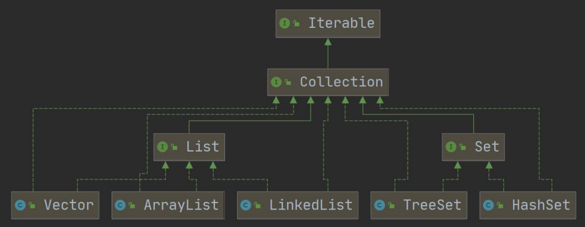

+ Map（双列集合）

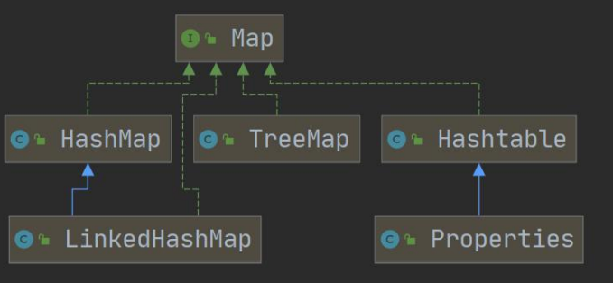

<br>

### 14.2 Collection接口

*前言：*collection实现子类可以存放多个元素，每个元素可以是object

#### Collection接口遍历方式

+ 使用Iterator（迭代器）
  + Iterator==对象==称为迭代器，主要用于遍历Collection集合中的元素
  + 所有实现了Collection接口的集合类都有一个iterator()方法，用于返回一个实现了Iterator接口的对象，即返回一个迭代器
  + Iterator仅用于遍历集合，本身不存放对象
  + 在调用iterator.next()方法之前必须调用iterator.hasNext()进行检测。若不调用，且没有下一条记录的时候，会抛出异常

```java
		Collection col = new ArrayList();

        col.add(new Book("三国演义", "罗贯中", 10.1));
        col.add(new Book("小李飞刀", "古龙", 5.1));
        col.add(new Book("红楼梦", "曹雪芹", 34.6));

        //现在希望能够遍历 col集合
        //1. 先得到 col 对应的 迭代器
        Iterator iterator = col.iterator();

        //老师教大家一个快捷键，快速生成 while => itit
        //显示所有的快捷键的的快捷键 ctrl + j
        while (iterator.hasNext()) {
            Object obj = iterator.next();
            System.out.println("obj=" + obj);
        }
        
        //3. 当退出while循环后 , 这时iterator迭代器，指向最后的元素
        //   iterator.next();//NoSuchElementException当指向最后元素时再次调用iterator.next()就会抛出异常
        //4. 如果希望再次遍历，需要重置我们的迭代器
        iterator = col.iterator();
        System.out.println("===第二次遍历===");
        while (iterator.hasNext()) {
            Object obj = iterator.next();
            System.out.println("obj=" + obj);
        }
    }
```


+ 使用增强for循环
  + 增强for循环可以代替iterator迭代器（其实底层的实现也是用的迭代器）

```java
//		  快捷键方式 I
        for (Object book : col) {
            System.out.println("book=" + book);
        }    

        //增强for，也可以直接在数组使用
//        int[] nums = {1, 8, 10, 90};
//        for (int i : nums) {
//            System.out.println("i=" + i);
//        }
```


#### list接口

+ List集合类中的元素是有序的，有对应的索引，可以通过索引存取，并且元素可以重复

+ [List常用方法](https://blog.csdn.net/FOREVER_GWC/article/details/105533818)


##### 1. ArrayList 类

+ ArrayList底层由数组来实现数据的存储的，可以允许null值

+ ArrayList基本等于Vector，但是ArrayList线程不安全、速度快，Vector线程安全（synchronized）

+ ArrayList中维护了一个Object类型的数组elementData用于真正存放数据

+ 当创建ArrayList对象时，如果使用无参构造器，则初始容量为0，第一次添加，扩容为10，然后每次1.5倍

+ 如果使用指定大小的构造器，则初始的elementData容量为指定的大小，如需扩容则扩容为1.5倍

  

##### 2. LinkedList 类

+ LinkedList底层是用双向链表实现的，线程不安全

+ LinkedList的添加和删除操作速度比较快

  

##### 3. Vector 类

+ Vector底层也是一个对象数组
+ Vector是线程安全的，有synchronized关键字
+ 创建Vector对象时，如果使用无参构造器，初始容量10，然后两倍扩容
+ 如果指定大小，则每次两倍扩容


##### 4. ArrayList和LinkedList比较

+ 一般，在开发中%80以上都是查询所以大部分情况下都是使用ArrayList
+ 改查操作多选ArrayList
+ ==增删操作多选LinkedList==:在实际开发中一定要注意应用场景，如果操作中的增删操作比较多一定要记得用LinkedList，因为对ArrayList遍历删除操作时会遇到很多问题。


#### set接口

+ set 接口的实现类的对象(Set 接口对象), 不能存放重复的元素, 只可以添加一个 null
+ set 接口对象存放数据是无序(即添加的顺序和取出的顺序不一致) 
+ ==注意==：取出的顺序虽然不是添加的顺序，但是它是固定的


##### 1. HashSet 类

+ HashSet在底层是使用HashMap实现的

```java
//构造器源码
public HashSet() {
		map = new HashMap<>();
}
```


+ 案例

```java
		HashSet set = new HashSet();

        //1. 在执行add方法后，会返回一个boolean值
        //2. 如果添加成功，返回 true, 否则返回false
        //3. 可以通过 remove 指定删除哪个对象
        System.out.println(set.add("john"));//T
        System.out.println(set.add("lucy"));//T
        System.out.println(set.add("john"));//F
        System.out.println(set.add("jack"));//T
        System.out.println(set.add("Rose"));//T

        set.remove("john");

        //4 Hashset 不能添加相同的元素/数据?
        set.add("lucy");//添加成功
        set.add("lucy");//加入不了
        set.add(new Dog("tom"));//OK
        set.add(new Dog("tom"));//Ok

        //在加深一下. 非常经典的面试题.
        //看源码，做分析， 先给小伙伴留一个坑，以后讲完源码，你就了然
        //去看他的源码，即 add 到底发生了什么?=> 底层机制.
        set.add(new String("hsp"));//ok
        set.add(new String("hsp"));//加入不了.

		//其实是因为HashMap源码在加入新元素时，他的对比方法是
if (p.hash == hash && ((k = p.key) == key || (key != null && key.equals(k))))
    	//只要这个if语句成立，则不会添加这个新元素，认为它和之前的元素重复了。
    	//即：1.首先是新元素和原来元素hash值的比较，hash值必须相同
    	//   2.然后就是只要 k==key 或者 它的equals方法相等就不会加入
    	//   3.所以当这个新的元素是一个对象的时候，可否添加成功实际上是取决于你的对应类的equals方法，因为String的equals方法是对比的字符串内容是否相同，所以即使两个对象的地址不同，只要他们的内容相同就算是重复了，无法添加进去
```


+ HashSet的添加元素底层如何实现
  + HashSet底层是HashMap，所以分析HashMap源码，HashMap底层是（数组+链表+红红黑树）
  + HashSet插入数据的流程
    + HashSet 底层是HashMap
    + 添加一个元素时，先得到hash值会转成->索引值
    + 找到存储数据表table，看这个索引位置是否已经存放的有元素
    + 如果没有，直接加入
    + 如果有，调用equals比较，如果相同，就放弃添加，如果不相同，则添加到最后
    + 在Java8中，如果一条链表的元素个数到达TREEIFY THRESHOLD(默认是8)，并且table的大小 >= MIN_TREEIFY_CAPACITY（默认64），就会进行树化（红黑树）
  + 源码分析

```java
		HashSet hashSet = new HashSet();
        hashSet.add("java");//到此位置，第1次add分析完毕.
        hashSet.add("php");//到此位置，第2次add分析完毕
        hashSet.add("java");

        /*
        老韩对HashSet 的源码解读
        1. 执行 HashSet()
            public HashSet() {
                map = new HashMap<>();
            }
            
        2. 执行 add()
           public boolean add(E e) {//e = "java"
                return map.put(e, PRESENT)==null;//(static) PRESENT = new Object();
           }
         3.执行 put() , 该方法会执行 hash(key) 得到key对应的hash值 算法h = key.hashCode()) ^ (h >>> 16)
             public V put(K key, V value) {//key = "java" value = PRESENT 共享
                return putVal(hash(key), key, value, false, true);
            }
         4.执行 putVal
         final V putVal(int hash, K key, V value, boolean onlyIfAbsent,
                   boolean evict) {
                Node<K,V>[] tab; Node<K,V> p; int n, i; //定义了辅助变量
                //table 就是 HashMap 的一个数组，类型是 Node[]
                //if 语句表示如果当前table 是null, 或者 大小=0
                //就是第一次扩容，到16个空间.
                if ((tab = table) == null || (n = tab.length) == 0)
                    n = (tab = resize()).length;

                //(1)根据key，得到hash 去计算该key应该存放到table表的哪个索引位置并把这个位置的对象，赋给 p
                //(2)判断p 是否为null
                //(2.1) 如果p 为null, 表示还没有存放元素, 就创建一个Node (key="java",value=PRESENT)
                //(2.2) 就放在该位置 tab[i] = newNode(hash, key, value, null)

                if ((p = tab[i = (n - 1) & hash]) == null)
                    tab[i] = newNode(hash, key, value, null);
                else {
                    //一个开发技巧提示： 在需要局部变量(辅助变量)时候，在创建
                    Node<K,V> e; K k; //
                    //如果当前索引位置对应的链表的第一个元素和准备添加的key的hash值一样
                    //并且满足 下面两个条件之一:
                    //(1) 准备加入的key 和 p 指向的Node 结点的 key 是同一个对象
                    //(2)  p 指向的Node 结点的 key 的equals() 和准备加入的key比较后相同
                    //就不能加入
                    if (p.hash == hash &&
                        ((k = p.key) == key || (key != null && key.equals(k))))
                        e = p;
                    //再判断 p 是不是一颗红黑树,
                    //如果是一颗红黑树，就调用 putTreeVal , 来进行添加
                    else if (p instanceof TreeNode)
                        e = ((TreeNode<K,V>)p).putTreeVal(this, tab, hash, key, value);
                    else {//如果table对应索引位置，已经是一个链表, 就使用for循环比较
                          //(1) 依次和该链表的每一个元素比较后，都不相同, 则加入到该链表的最后
                          //    注意在把元素添加到链表后，立即判断 该链表是否已经达到8个结点
                          //    如果达到了八个节点, 就调用 treeifyBin() 对当前这个链表进行树化(转成红黑树)
                          //    注意，在转成红黑树时，要进行判断, 判断条件
                          //    if (tab == null || (n = tab.length) < MIN_TREEIFY_CAPACITY(64))
                          //            resize();
                          //    如果上面条件成立，先table扩容.
                          //    只有上面条件不成立时，才进行转成红黑树
                          //(2) 依次和该链表的每一个元素比较过程中，如果有相同情况,就直接break

                        for (int binCount = 0; ; ++binCount) {
                            if ((e = p.next) == null) {
                                p.next = newNode(hash, key, value, null);
                                if (binCount >= TREEIFY_THRESHOLD(8) - 1) // -1 for 1st
                                    treeifyBin(tab, hash);
                                break;
                            }
                            if (e.hash == hash &&
                                ((k = e.key) == key || (key != null && key.equals(k))))
                                break;
                            p = e;
                        }
                    }
                    if (e != null) { // existing mapping for key
                        V oldValue = e.value;
                        if (!onlyIfAbsent || oldValue == null)
                            e.value = value;
                        afterNodeAccess(e);
                        return oldValue;
                    }
                }
                ++modCount;
                //size 就是我们每加入一个结点Node(k,v,h,next), size++
                if (++size > threshold)
                    resize();//扩容
                afterNodeInsertion(evict);
                return null;
            }
         */

    }
```


+ HashSet的扩容和转化成红黑树的机制
  + HashSet底层是HashMap，第一次添加时，table数组扩容到16，临界值（threshold）是16 * 加载因子（loadFactor）是0.75 = 12
  + 如果table数组使用到了临界值12，就会扩容到16 * 2 = 32，新的临界值就是32 * 0.75 = 24，以此类推
  + 在Java8中，如果一条链表的元素个数到达TREEIFY_THRESHOLD（默认是8），并且table的大小 <= MIN_TREEIFY_CAPACITY（默认64），就会转化成红黑树，否则仍然采用数组的扩容机制
  + 源码分析

```java
 /*
        HashSet底层是HashMap, 第一次添加时，table 数组扩容到 16，
        临界值(threshold)是 16*加载因子(loadFactor)是0.75 = 12
        如果table 数组使用到了临界值 12,就会扩容到 16 * 2 = 32,
        新的临界值就是 32*0.75 = 24, 依次类推

         */
        HashSet hashSet = new HashSet();
//        for(int i = 1; i <= 100; i++) {
//            hashSet.add(i);//1,2,3,4,5...100
//        }
        /*
        在Java8中, 如果一条链表的元素个数到达 TREEIFY_THRESHOLD(默认是 8 )，
        并且table的大小 >= MIN_TREEIFY_CAPACITY(默认64),就会进行树化(红黑树),
        否则仍然采用数组扩容机制

         */

//        for(int i = 1; i <= 12; i++) {
//            hashSet.add(new A(i));//
//        }


        /*
            当我们向hashset增加一个元素，-> Node -> 加入table , 就算是增加了一个size++

         */

        for(int i = 1; i <= 7; i++) {//在table的某一条链表上添加了 7个A对象
            hashSet.add(new A(i));//
        }

        for(int i = 1; i <= 7; i++) {//在table的另外一条链表上添加了 7个B对象
            hashSet.add(new B(i));//
        }

```


##### 2. LinkedHashSet 类

+ 在LinkedHashSet中维护了一个hash表和双向链表
+ 每一个节点有before和after属性，用于形成双向链表，还拥有next属性指向自己的下一个节点
+ LinkedHashSet可以确保插入顺序和遍历顺序一致

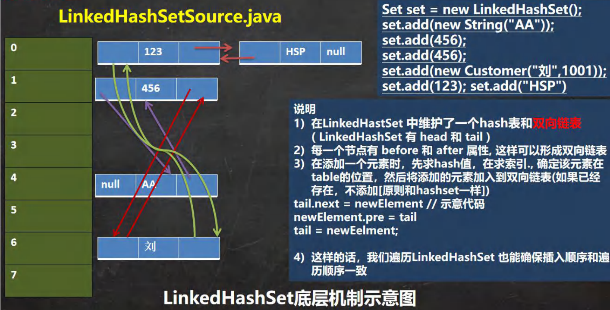


### 14.3 Map 接口


##### Map 接口实现类的特点

+ Map与Collection并列存在。用于保存具有映射关系的数据：Key - Value
+ Map中的key与value可以是任何的引用类型数据，会封装到HashMap$Node对象中
+ Map中的key不允许重复
+ Map中的Value可以重复
+ Map的key可以为null，value也可以为null，注意key为null时只能有一个，而value为null时可以有多个
+ key与value之间存在一对一关系，总是通过key来找到value


##### Map 接口常用方法

+ 当put相同的key值数据时，会替换原来的value

```java
		Map map = new HashMap();
        map.put("邓超", new Book("", 100));//OK
        map.put("邓超", "孙俪");//替换-> 一会分析源码
        map.put("王宝强", "马蓉");//OK
        map.put("宋喆", "马蓉");//OK
        map.put("刘令博", null);//OK
        map.put(null, "刘亦菲");//OK
        map.put("鹿晗", "关晓彤");//OK
        map.put("hsp", "hsp的老婆");

        System.out.println("map=" + map);

//        remove:根据键删除映射关系
        map.remove(null);
        System.out.println("map=" + map);
//        get：根据键获取值
        Object val = map.get("鹿晗");
        System.out.println("val=" + val);
//        size:获取元素个数
        System.out.println("k-v=" + map.size());
//        isEmpty:判断个数是否为0
        System.out.println(map.isEmpty());//F
//        clear:清除k-v
        //map.clear();
        System.out.println("map=" + map);
//        containsKey:查找键是否存在
        System.out.println("结果=" + map.containsKey("hsp"));//T
```


##### Map 接口的遍历方法

1. HashMap内部的存储结构：

+ Map存放数据的 key-value 示意图，一对 k-v 是放在一个HashMap$Node中的，因为Node接口实现了Entry接口，所以有的地方也说一对 k-v就是一个Entry。

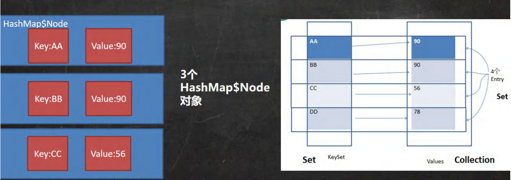
+ 每一个k-v还被存储在EntrySet的集合中，便于遍历。并且所有的key也被单独存储在KeySet的集合中，所有的value也被存储在Values集合中

```java
		Map map = new HashMap();
        map.put("no1", "韩顺平");//k-v
        map.put("no2", "张无忌");//k-v
        map.put(new Car(), new Person());//k-v

        //1. k-v 最后是 HashMap$Node node = newNode(hash, key, value, null)
        //2. k-v 为了方便程序员的遍历，还会 创建 EntrySet 集合 ，该集合存放的元素的类型 Entry, 而一个Entry对象就有k,v EntrySet<Entry<K,V>> 即： transient Set<Map.Entry<K,V>> entrySet;
        //3. entrySet 中， 定义的类型是 Map.Entry ，但是实际上存放的还是 HashMap$Node，这是因为 static class Node<K,V> implements Map.Entry<K,V>
        //4. 当把 HashMap$Node 对象 存放到 entrySet 就方便我们的遍历, 因为 Map.Entry 提供了重要方法  K getKey(); V getValue();

        Set set = map.entrySet();
        System.out.println(set.getClass());// HashMap$EntrySet
        for (Object obj : set) {

            //System.out.println(obj.getClass()); //HashMap$Node
            //为了从 HashMap$Node 取出k-v
            //1. 先做一个向下转型
            Map.Entry entry = (Map.Entry) obj;
            System.out.println(entry.getKey() + "-" + entry.getValue() );
        }

		//得到Key的集合
        Set set1 = map.keySet();
        System.out.println(set1.getClass());
		//得到Value的集合
        Collection values = map.values();
        System.out.println(values.getClass());
```

2. Map接口遍历

+ containsKey:查找键是否存在
2) keySet:获取所有的键
+ entrySet:获取所有关系k-v
+ values:获取所有的值

```java
		Map map = new HashMap();
        map.put("邓超", "孙俪");
        map.put("王宝强", "马蓉");
        map.put("宋喆", "马蓉");
        map.put("刘令博", null);
        map.put(null, "刘亦菲");
        map.put("鹿晗", "关晓彤");

        //第一组: 先取出 所有的Key , 通过Key 取出对应的Value
        Set keyset = map.keySet();
        //(1) 增强for
        System.out.println("-----第一种方式-------");
        for (Object key : keyset) {
            System.out.println(key + "-" + map.get(key));
        }
        //(2) 迭代器
        System.out.println("----第二种方式--------");
        Iterator iterator = keyset.iterator();
        while (iterator.hasNext()) {
            Object key =  iterator.next();
            System.out.println(key + "-" + map.get(key));
        }

        //第二组: 把所有的values取出
        Collection values = map.values();
        //这里可以使用所有的Collections使用的遍历方法
        //(1) 增强for
        System.out.println("---取出所有的value 增强for----");
        for (Object value : values) {
            System.out.println(value);
        }
        //(2) 迭代器
        System.out.println("---取出所有的value 迭代器----");
        Iterator iterator2 = values.iterator();
        while (iterator2.hasNext()) {
            Object value =  iterator2.next();
            System.out.println(value);

        }

        //第三组: 通过EntrySet 来获取 k-v
        Set entrySet = map.entrySet();// EntrySet<Map.Entry<K,V>>
        //(1) 增强for
        System.out.println("----使用EntrySet 的 for增强(第3种)----");
        for (Object entry : entrySet) {
            //将entry 转成 Map.Entry
            Map.Entry m = (Map.Entry) entry;
            System.out.println(m.getKey() + "-" + m.getValue());
        }
        //(2) 迭代器
        System.out.println("----使用EntrySet 的 迭代器(第4种)----");
        Iterator iterator3 = entrySet.iterator();
        while (iterator3.hasNext()) {
            Object entry =  iterator3.next();
            //System.out.println(next.getClass());//HashMap$Node -实现-> Map.Entry (getKey,getValue)
            //向下转型 Map.Entry
            Map.Entry m = (Map.Entry) entry;
            System.out.println(m.getKey() + "-" + m.getValue());
        }
```


##### HashMap 类

+ Map接口的常用实现类: HashMap、 Hashtable和Properties 
+ HashMap是Map接口使用频率最高的实现类。
4) 与HashSet一样，不保证映射的顺序，因为底层是以hash表的方式来存储的. (jdk8的
hashMap 底层数组+链表+红黑树)
7) HashMap没有实现同步，因此是线程不安全的，方法没有做同步互斥的操作，没有
synchronized

##### HashMap 源码剖析（与HashSet相同）

+ HashMap底层维护了Node类型的数组table,默认为null
+ 当创建对象时，将加载因子(loadfactor)初始化为0.75.
+ 当添加key-val时，通过key的哈希值得到在table的索引。 然后判断该索引处是否有元素，
  如果没有元素直接添加。如果该索引处有元素，继续判断该元素的key和准备加入的key相
  是否等，如果相等，则直接替换val;如果不相等需要判断是树结构还是链表结构，做出相
  应处理。如果添加时发现容量不够，则需要扩容。
+ 第1次添加，则需要扩容table容量为16,临界值(threshold)为12 (16*0.75)
+ 以后再扩容，则需要扩容table容量为原来的2倍(32),临界值为原来的2倍,即24,依次类推
+ 在Java8中，如果一条链表的元素个数超过TREEIFY THRESHOLD(默认是8)，并且
  table的大小>= MIN TREEIFY CAPACITY(默认64),就会进行树化(红黑树)

##### HashTable 类

+ 存放的元素是键值对:即K-V
+ hashtable的键和值都不能为null, 否则会抛出NullPointerException

+ hashTable使用方法基本上和HashMap- -样

+ hashTable是线程安全的(synchronized), hashMap是线程不安全的

##### Propertise 类

+ Properties类继承自Hashtable类并且实现了 Map接口，也是使用一种键值对的形
  式来保存数据。他的使用特点和Hashtable类似

+ Properties 主要用于从xxx.properties文件中，加载数据到Properties类对象，
  并进行读取和修改

##### TreeSet 类 和 TreeMap 类

1. TreeSet 类（底层是TreeMap用二叉树来实现存储）

+ 当我们使用无参构造器，创建TreeSet时，仍然是无序的
+ 如果希望添加的元素，按照字符串大小来排序，可以使用TreeSet提供的一个构造器，传入一个比较器(匿名内部类)

```java
		/*1. 构造器把传入的比较器对象，赋给了 TreeSet的底层的 TreeMap的属性			this.comparator

         public TreeMap(Comparator<? super K> comparator) {
                this.comparator = comparator;
            }
         2. 在调用 treeSet.add("tom"), 在底层会执行到

             if (cpr != null) {//cpr 就是我们的匿名内部类(对象)
                do {
                    parent = t;
                    //动态绑定到我们的匿名内部类(对象)compare
                    cmp = cpr.compare(key, t.key);
                    if (cmp < 0)
                        t = t.left;
                    else if (cmp > 0)
                        t = t.right;
                    else //如果相等，即返回0,这个Key就没有加入
                        return t.setValue(value);
                } while (t != null);
            }
         */

//        TreeSet treeSet = new TreeSet();
        TreeSet treeSet = new TreeSet(new Comparator() {
            @Override
            public int compare(Object o1, Object o2) {
                //下面 调用String的 compareTo方法进行字符串大小比较
                //如果老韩要求加入的元素，按照长度大小排序
                //return ((String) o2).compareTo((String) o1);
                return ((String) o1).length() - ((String) o2).length();
            }
        });
        //添加数据.
        treeSet.add("jack");
        treeSet.add("tom");//3
        treeSet.add("sp");

        System.out.println("treeSet=" + treeSet);
```


2. TreeMap 类

```java
		//使用默认的构造器，创建TreeMap, 是无序的(也没有排序)
        /*
            老韩要求：按照传入的 k(String) 的大小进行排序
         */
//        TreeMap treeMap = new TreeMap();
        TreeMap treeMap = new TreeMap(new Comparator() {
            @Override
            public int compare(Object o1, Object o2) {
                //按照传入的 k(String) 的大小进行排序
                //按照K(String) 的长度大小排序
                //return ((String) o2).compareTo((String) o1);
                return ((String) o2).length() - ((String) o1).length();
            }
        });
        treeMap.put("jack", "杰克");
        treeMap.put("tom", "汤姆");
        treeMap.put("kristina", "克瑞斯提诺");
        treeMap.put("smith", "斯密斯");
        treeMap.put("hsp", "韩顺平");//加入不了

        System.out.println("treemap=" + treeMap);

        /*

            老韩解读源码：
            1. 构造器. 把传入的实现了 Comparator接口的匿名内部类(对象)，传给给TreeMap的comparator
             public TreeMap(Comparator<? super K> comparator) {
                this.comparator = comparator;
            }
            2. 调用put方法
            2.1 第一次添加, 把k-v 封装到 Entry对象，放入root
            Entry<K,V> t = root;
            if (t == null) {
                compare(key, key); // type (and possibly null) check

                root = new Entry<>(key, value, null);
                size = 1;
                modCount++;
                return null;
            }
            2.2 以后添加
            Comparator<? super K> cpr = comparator;
            if (cpr != null) {
                do { //遍历所有的key , 给当前key找到适当位置
                    parent = t;
                    cmp = cpr.compare(key, t.key);//动态绑定到我们的匿名内部类的compare
                    if (cmp < 0)
                        t = t.left;
                    else if (cmp > 0)
                        t = t.right;
                    else  //如果遍历过程中，发现准备添加Key 和当前已有的Key 相等，就不添加
                        return t.setValue(value);
                } while (t != null);
            }
         */
```


##### 开发中如何选择集合的实现类

在开发中，选择什么集合实现类，主要取决于业务操作特点，然后根据集合实现类特性进行
选择，分析如下:

1. 先判断存储的类型(一 组对象[单列]或-组键值对[双列])
2. 一组对象[单列]: Collection接口
   	允许重复: List
   			增删多: LinkedList [底层维护了一个双向链表]
   			改查多: ArrayList [底层维护Object类型的可变数组]
   	不允许重复: Set
   			无序: HashSet [底层是HashMap ，维护了一个哈希表即(数组+链表+红黑树)]
   			排序: TreeSet 
   			插入和取出顺序一致: LinkedHashSet , 维护数组+双向链表
3. 一组键值对[双列]: Map
   	        键无序: HashMap [底层是:哈希表jdk7: 数组+链表，jdk8: 数组+链表+红黑树]
               键排序: TreeMap 
               键插入和取出顺序一致: LinkedHashMap
               读取文件：Properties

##### Collections 工具类

1. 介绍

+ Collections是一个操作Set、 List和Map等集合的工具类
2) Collections中提供了一系列==静态==的方法对集合元素进行排序、查询和修改等操作

2. 常用方法

+ reverse(List): 反转List中元素的顺序
2) shuffle(List): 对List集合元素进行随机排序
3) sort(List): 根据元素的自然顺序对指定List集合元素按升序排序
4) sort(List, Comparator):根据指定的Comparator产生的顺序对List集合元素进行
排序
+ swap(List, int, int):将指定list集合中的i处元素和j处元素进行交换
+ Object max(Collection):根据元素的自然顺序，返回给定集合中的最大元素
+ Object max(Collection, Comparator): 根据Comparator指定的顺序，返回给定集合中的最大元素
+ Object min(Collection)
+ Object min(Collection, Comparator)
+ int frequency(Collection, Object): 返回指定集合中指定元素的出现次数
+ void copy(List dest, List src):将src中的内容复制到dest中
+ boolean replaceAll(List list, Object oldVal, Object newVal):使用新值替换List对象的所有旧值

<br>

## Chapter15 泛型

*前言：*泛型就是就是数据类型的类型

### 15.1 泛型介绍

##### 基本介绍

+ 泛型又称参数化类型，是Jdk5.0出现的新特性，解决数据类型的安全性问题
+ Java泛型可以保证如果程序在编译时没有发出警告，运行时就不会产生ClassCastException异常。同时，代码更加简洁、健壮
+ 泛型的作用是:可以在类声明时通过一个标识表示类中某个属性的类型，或者是某个方
  法的返回值的类型，或者是参数类型。

##### 泛型的语法

+ 泛型的声明
  + `interface 接口<T>`、`class 类 <K,V>`
  + 其中，T，K，V 不代表值，而是代表类型
  + 任意的字母都可以

+  泛型的实例化
  + `List<String> strList = new ArrayList <> ();`
  + `Iterator < Customer> iterator = customers.iterator();`

```java
 public static void main(String[] args) {
        //使用泛型方式给HashSet 放入3个学生对象
        HashSet<Student> students = new HashSet<>();
        students.add(new Student("jack", 18));
        students.add(new Student("tom", 28));
        students.add(new Student("mary", 19));

        //遍历
        for (Student student : students) {
            System.out.println(student);
        }

        //使用泛型方式给HashMap 放入3个学生对象
        //K -> String ; V->Student
        HashMap<String, Student> hm = new HashMap<String, Student>();
        /*
            public class HashMap<K,V>  {}
         */
        hm.put("milan", new Student("milan", 38));
        hm.put("smith", new Student("smith", 48));
        hm.put("hsp", new Student("hsp", 28));

        //迭代器 EntrySet
        /*
        public Set<Map.Entry<K,V>> entrySet() {
            Set<Map.Entry<K,V>> es;
            return (es = entrySet) == null ? (entrySet = new EntrySet()) : es;
        }
         */
        Set<Map.Entry<String, Student>> entries = hm.entrySet();
        /*
            public final Iterator<Map.Entry<K,V>> iterator() {
                return new EntryIterator();
            }
         */
        Iterator<Map.Entry<String, Student>> iterator = entries.iterator();
        System.out.println("==============================");
        while (iterator.hasNext()) {
            Map.Entry<String, Student> next =  iterator.next();
            System.out.println(next.getKey() + "-" + next.getValue());
            
        }

    }
}
```


##### 泛型的使用细节

+ interface Lis\<T>{} ，public class HashSet\<E> {}..等等
  说明: T, E只能是引用类型（包装类）看看下面语句是否正确?:

```
  List<Integer> list = new ArrayList< Integer> (); //OK
  List<int> list2 = new ArrayList <int> ();//错误
```

+ 在给泛型指定具体类型后，可以传入该类型或者其子类类型
+ 泛型使用形式
  + `List< Integer> list1 = new ArrayList < Integer> ();`
  + ` List< Integer> list2 = new ArrayList<> ();`
+ 如果我们这样写List list3 = new ArrayList();默认给它的泛型是[\<E> E就是Object ]
  

### 15.3 自定义泛型

##### 自定义泛型类

+ 基本语法

  + class类名<T, R...> { //...表示可以有多个泛型
    成员

    }

+ 注意细节
  
    + 普通成员可以使用泛型(属性、方法)
    + 使用泛型的数组，不能初始化
    + 静态方法中不能使用类的泛型
    + 泛型类的类型，是在创建对象时确定的(因为创建对象时，需要指定确定类型)
    + 如果在创建对象时，没有指定类型，默认为Object
    

```java
public static void main(String[] args) {

        //T=Double, R=String, M=Integer
        Tiger<Double,String,Integer> g = new Tiger<>("john");
        g.setT(10.9); //OK
        //g.setT("yy"); //错误，类型不对
        System.out.println(g);
        Tiger g2 = new Tiger("john~~");//OK T=Object R=Object M=Object
        g2.setT("yy"); //OK ,因为 T=Object "yy"=String 是Object子类
        System.out.println("g2=" + g2);

    }
}

//老韩解读
//1. Tiger 后面泛型，所以我们把 Tiger 就称为自定义泛型类
//2, T, R, M 泛型的标识符, 一般是单个大写字母
//3. 泛型标识符可以有多个.
//4. 普通成员可以使用泛型 (属性、方法)
//5. 使用泛型的数组，不能初始化
//6. 静态方法中不能使用类的泛型
class Tiger<T, R, M> {
    String name;
    R r; //属性使用到泛型
    M m;
    T t;
    //因为数组在new 不能确定T的类型，就无法在内存开空间
    T[] ts;

    public Tiger(String name) {
        this.name = name;
    }

    public Tiger(R r, M m, T t) {//构造器使用泛型

        this.r = r;
        this.m = m;
        this.t = t;
    }

    public Tiger(String name, R r, M m, T t) {//构造器使用泛型
        this.name = name;
        this.r = r;
        this.m = m;
        this.t = t;
    }

    //因为静态是和类相关的，在类加载时，对象还没有创建
    //所以，如果静态方法和静态属性使用了泛型，JVM就无法完成初始化
//    static R r2;
//    public static void m1(M m) {
//
//    }

    //方法使用泛型

    public String getName() {
        return name;
    }

    public void setName(String name) {
        this.name = name;
    }

    public R getR() {
        return r;
    }

    public void setR(R r) {//方法使用到泛型
        this.r = r;
    }

    public M getM() {//返回类型可以使用泛型.
        return m;
    }

    public void setM(M m) {
        this.m = m;
    }

    public T getT() {
        return t;
    }

    public void setT(T t) {
        this.t = t;
    }

    @Override
    public String toString() {
        return "Tiger{" +
                "name='" + name + '\'' +
                ", r=" + r +
                ", m=" + m +
                ", t=" + t +
                ", ts=" + Arrays.toString(ts) +
                '}';
    }
```


##### 自定义泛型接口

+ 基本语法
  + interface接口名<T, R...> {
    }
+ 注意细节
    + 接口中，静态成员也不能使用泛型(这个和泛型类规定一样)
    + 泛型接口的类型，在继承（接口继承接口）接口或者实现（类实现接口）接口时确定
    + 没有指定类型，默认为Object
    

```java
//在继承接口 指定泛型接口的类型
interface IA extends IUsb<String, Double> {

}
//当我们去实现IA接口时，因为IA在继承IUsu 接口时，指定了U 为String R为Double
//，在实现IUsu接口的方法时，使用String替换U, 是Double替换R
class AA implements IA {

    @Override
    public Double get(String s) {
        return null;
    }
    @Override
    public void hi(Double aDouble) {

    }
    @Override
    public void run(Double r1, Double r2, String u1, String u2) {

    }
}

//实现接口时，直接指定泛型接口的类型
//给U 指定Integer 给 R 指定了 Float
//所以，当我们实现IUsb方法时，会使用Integer替换U, 使用Float替换R
class BB implements IUsb<Integer, Float> {

    @Override
    public Float get(Integer integer) {
        return null;
    }

    @Override
    public void hi(Float aFloat) {

    }

    @Override
    public void run(Float r1, Float r2, Integer u1, Integer u2) {

    }
}
//没有指定类型，默认为Object
//建议直接写成 IUsb<Object,Object>
class CC implements IUsb { //等价 class CC implements IUsb<Object,Object> {
    @Override
    public Object get(Object o) {
        return null;
    }
    @Override
    public void hi(Object o) {
    }
    @Override
    public void run(Object r1, Object r2, Object u1, Object u2) {

    }

}

interface IUsb<U, R> {

    int n = 10;
    //U name; 不能这样使用

    //普通方法中，可以使用接口泛型
    R get(U u);

    void hi(R r);

    void run(R r1, R r2, U u1, U u2);

    //在jdk8 中，可以在接口中，使用默认方法, 也是可以使用泛型
    default R method(U u) {
        return null;
    }
}


```


##### 自定义泛型方法

+ 基本语法
  + 修饰符 <T,R..>返回类型方法名(参数列表) { }
+ 注意细节
    + 泛型方法，可以定义在普通类中，也可以定义在泛型类中
    + 当泛型方法被调用时，类型会确定
    + public void eat(E e) {}， 修饰符后没有<T,R..> eat方法不是泛型方法，而是使用了泛型


```java
public static void main(String[] args) {
        Car car = new Car();
        car.fly("宝马", 100);//当调用方法时，传入参数，编译器，就会确定类型
        System.out.println("=======");
        car.fly(300, 100.1);//当调用方法时，传入参数，编译器，就会确定类型

        //测试
        //T->String, R-> ArrayList
        Fish<String, ArrayList> fish = new Fish<>();
        fish.hello(new ArrayList(), 11.3f);
    }
}

//泛型方法，可以定义在普通类中, 也可以定义在泛型类中
class Car {//普通类

    public void run() {//普通方法
    }
    //说明 泛型方法
    //1. <T,R> 就是泛型
    //2. 是提供给 fly使用的
    public <T, R> void fly(T t, R r) {//泛型方法
        System.out.println(t.getClass());//String
        System.out.println(r.getClass());//Integer
    }
}

class Fish<T, R> {//泛型类
    public void run() {//普通方法
    }
    public<U,M> void eat(U u, M m) {//泛型方法

    }
    //说明
    //1. 下面hi方法不是泛型方法
    //2. 是hi方法使用了类声明的 泛型
    public void hi(T t) {
    }
    //泛型方法，可以使用类声明的泛型，也可以使用自己声明泛型
    public<K> void hello(R r, K k) {
        System.out.println(r.getClass());//ArrayList
        System.out.println(k.getClass());//Float
    }

}

```


### 15.4 泛型通配符

##### 通配符说明

+ 无界通配符：<?>  支持任意泛型类型
+ 上届通配符：<? extends A>    支持A类以及A类的子类，规定类泛型的上届
+ 下届通配符：<? super A>      支持A类以及A类的父类，规定了泛型的下届

##### <?> 和 T 的区别

+ ？和 T 都表示不确定的类型，区别在于我们可以对 T 进行操作，但是对 ？ 不行，比如如下这种 ：

```java
// 可以
T t = operate();

// 不可以
？ car = operate();
```

+ T 是一个 确定的 类型，通常用于泛型类和泛型方法的定义，？是一个 不确定 的类型，通常用于泛型方法的调用代码和形参，不能用于定义类和泛型方法。
+ 更详细的关于[两者间的区别的文章](https://juejin.cn/post/6844903917835419661)

<br>

### 15.5 JUnit

##### 为什么用JUnit

+ 一个类有很多功能代码需要测试，为了测试， 就需要写入到main方法中
+ 如果有多个功能代码测试，就需要来回注销，切换很麻烦
+ 如果可以直接只运行一个方法，就方便很多，并且可以给出相关信息，就好了-> JUnit

##### 基本介绍

+ JUnit是一个Java语言的单元测试框架
+ 多数Java的开发环境都已经集成了JUnit作为单元测试的工具

##### 使用

+ 在具体方法前加上注解@Test就可以在运行时，只运行这个方法

```java
public class JUnit_ {
    public static void main(String[] args) {
        //传统方式
        //new JUnit_().m1();
        //new JUnit_().m2();

    }


    @Test
    public void m1() {
        System.out.println("m1方法被调用");
    }

    @Test
    public void m2() {
        System.out.println("m2方法被调用");
    }

    @Test
    public void m3() {
        System.out.println("m3方法被调用");
    }
}

```

<br>

## Chapter16 坦克大战一

*前言：这章简单介绍，用了很多gui，只要这个世界正常，你是不会用到java gui的。主要就是下面的这两个包，很多事关于gui的东西，那为什么要听这章呢？是因为后面的很多知识点在这里也要用到！*

```
javax.swing.*;
java.awt.*;
```

### 16.1 java绘图坐标系

##### 介绍

+ 下图说明了Java坐标系。坐标原点位于左上角，以像素为单位。在Java坐标系中,第一
  个是x坐标，表示当前位置为水平方向，距离坐标原点x个像素;第二个是y坐标，表示当
  前位置为垂直方向，距离坐标原点y个像素。

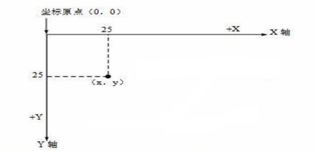

+ 像素是密度单位

##### 绘图原理

+ Component类提供了两个和绘图相关最重要的方法:
  1. paint(Graphics g)绘制组件的外观
  2. repaint()刷新组件的外观。
+ 当组件第一次在屏幕显示的时候,程序会自动的调用paint(方法来绘制组件
    + 在以下情况paint(将会被调用:
    
      1. 窗口最小化，再最大化
    
      2. 窗口的大小发生变化
    
      3. epaint方法被调用

### 16.2 事件处理机制

##### 基本说明

java事件处理是采取"委派事件模型"。当事件发生时,产生事件的对象，会把此"信息"传递
给"事件的监听者"处理，这里所说的"信息"实际上就是java.awt.event事件类库里某个
类所创建的对象，把它称为"事件的对象"。

##### 示意图

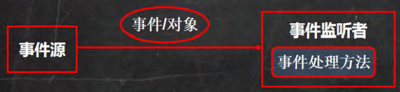

##### 深入理解

+ 事件源:事件源是一个产生事件的对象，比如按钮，窗口等。

+ 事件:事件就是承载事件源状态改变时的对象，比如当键盘事件、鼠标事件、窗口事件
  等等，会生成一个事件对象，该对象保存着当前事件很多信息，比如KeyEvent 对象有
  含有被按下键的Code值。java.awt.event包 和javax.swing.event包中定义了各种事
  件类型

+ 事件类型

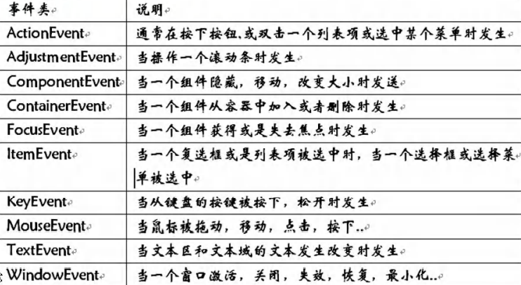

+ 事件监听器接口
  + 当事件源产生一个事件，可以传送给事件监听者处理
  + 事件监听者实际上就是一个类，该类实现了某个事件监听器接口比如前面我们案例中的MyPanle就是一个类，它实现了KeyListener接口，它就可以作为一个事件监听者，对接受到的事件进行处理
  + 事件监听器接口有多种，不同的事件监听器接口可以监听不同的事件，一一个类可以实现多个监听接口
  + 这些接口在java.awt.event包javax.swing.event包中定义。列出常用的事件监听器接口，查看jdk文档聚集了

<br>

## Chapter17 多线程基础

*前言：这只是一些基础的，多线程东西很多，很复杂*

### 17.1 线程相关概念

*前言：与操作系统的许多概念重合，想要学高级的，基础确实非常重要*

+ 并发：同一时刻，多个任务交替执行，造成一种“貌似同时”的错觉，即单核cpu实现的多任务就是并发
+ 并行：同一时刻，多个任务同时执行，多核cpu可以实现并行

### 17.2 线程基本使用

##### 创建线程的两种方式

+ 继承Tread类，重写run方法
+ 实现Runnable接口，重写run方法

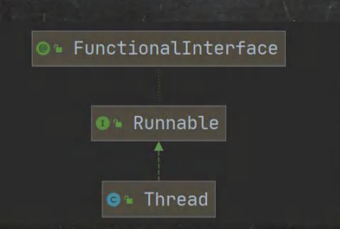

##### 继承Thread类实现线程

+ 请编写程序，开启一个线程，该线程每隔1秒。 在控制台输出"喵喵， 我是小猫咪”
+ 使用JConsole监控线程执行情况
  + [Jconsole](http://www.51testing.com/?uid-116228-action-viewspace-itemid-149296)是JDK自带的[监控](http://www.51testing.com/?uid-116228-action-viewspace-itemid-149296)工具，在JDK/bin目录下可以找到。它用于连接正在运行的本地或者远程的[JVM](http://www.51testing.com/?uid-116228-action-viewspace-itemid-149296)，对运行在[java](http://www.51testing.com/?uid-116228-action-viewspace-itemid-149296)应用程序的资源消耗和性能进行监控，并画出大量的图表，提供强大的可视化界面。而且本身占用的服务器内存很小，甚至可以说几乎不消耗。

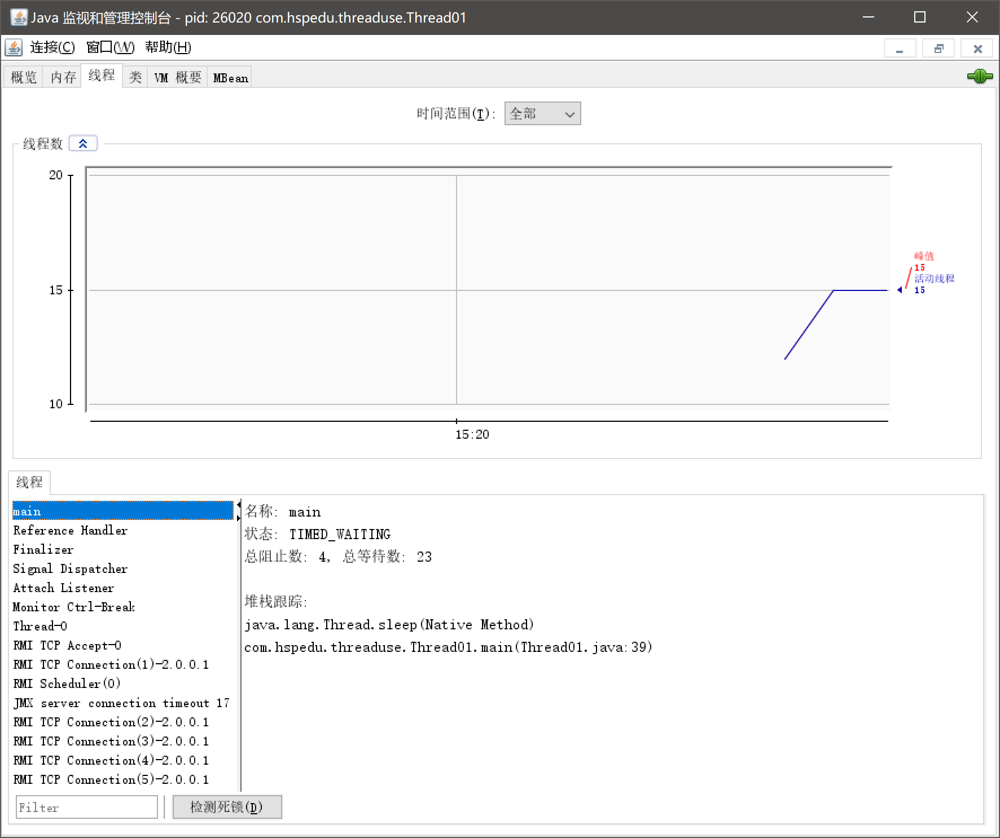

+ 关于 Native 关键字
  + 使用native关键字说明这个方法是原生函数，也就是这个方法是用C/C++语言实现的，并且被编译成了DLL，由java去调用。
  + 这些函数的实现体在DLL中，JDK的源代码中并不包含，你应该是看不到的。对于不同的平台它们也是不同的。这也是java的底层机制，实际上java就是在不同的平台上调用不同的native方法实现对操作系统的访问的。
+ 程序示意图

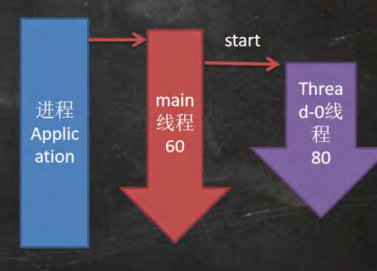

```java
public class Thread01 {
    public static void main(String[] args) throws InterruptedException {

        //创建Cat对象，可以当做线程使用,因为是直接继承的Thread类，可以直接调用对象的.start()方法，即可创建线程
        Cat cat = new Cat();

        //老韩读源码
        /*
            (1)
            public synchronized void start() {
                start0();
            }
            (2)
            //start0() 是本地方法，是JVM调用, 底层是c/c++实现
            //真正实现多线程的效果， 是start0(), 而不是 run
            private native void start0();

         */

        cat.start();//启动线程-> 最终会执行cat的run方法


        //cat.run();//run方法就是一个普通的方法, 没有真正的启动一个线程，就会把run方法执行完毕，才向下执行
        //说明: 当main线程启动一个子线程 Thread-0, 主线程不会阻塞, 会继续执行
        //这时 主线程和子线程是交替执行..
        Thread.currentThread().setName("高贝贝");
        System.out.println("主线程继续执行" + Thread.currentThread().getName());//名字main
        for(int i = 0; i < 60; i++) {
            System.out.println("主线程 i=" + i);
            //让主线程休眠
            Thread.sleep(1000);
        }

    }
}

//老韩说明
//1. 当一个类继承了 Thread 类， 该类就可以当做线程使用
//2. 我们会重写 run方法，写上自己的业务代码
//3. run Thread 类 实现了 Runnable 接口的run方法
/*
    @Override
    public void run() {
        if (target != null) {
            target.run();
        }
    }
 */


class Cat extends Thread {

    int times = 0;
    @Override
    public void run() {//重写run方法，写上自己的业务逻辑

        while (true) {
            //该线程每隔1秒。在控制台输出 “喵喵, 我是小猫咪”
            System.out.println("喵喵, 我是小猫咪" + (++times) + " 线程名=" + Thread.currentThread().getName());
            //让该线程休眠1秒 ctrl+alt+t
            try {
                Thread.sleep(1000);
            } catch (InterruptedException e) {
                e.printStackTrace();
            }
            if(times == 80) {
                break;//当times 到80, 退出while, 这时线程也就退出..
            }
        }
    }
}

```

+ start()方法调用start0()方法后，该线程并不一定会立马执行，只是将线程变成了可运行状态。具体什么时候执行，取决于CPU，由CPU统一调度。

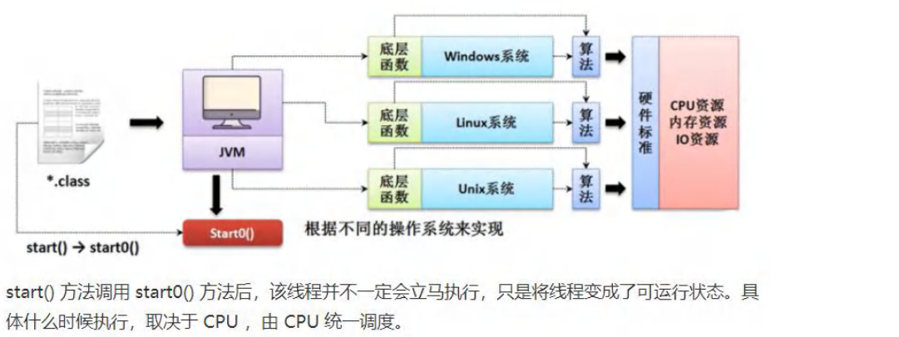


##### 实现Runnable接口实现线程

+ java是单继承的，在某些情况下一个类可能已经继承了某个父类，这时在用继承
  Thread类方法来创建线程显然不可能了。
2. java设计者们提供了另外一个方式创建线程，就是通过实现Runnable接口来创
建线程（推荐使用这种方式，因为在后期涉及到线程同步问题时，只有实现Runnable接口的线程才能实现线程同步）

```java
public class Thread02 {
    public static void main(String[] args) {
        Dog dog = new Dog();
        //dog.start(); 这里不能调用start
        //创建了Thread对象，把 dog对象(实现Runnable),放入Thread
        Thread thread = new Thread(dog);
        thread.start();

//        Tiger tiger = new Tiger();//实现了 Runnable
//        ThreadProxy threadProxy = new ThreadProxy(tiger);
//        threadProxy.start();
    }
}

class Animal {
}

class Tiger extends Animal implements Runnable {

    @Override
    public void run() {
        System.out.println("老虎嗷嗷叫....");
    }
}

//线程代理类 , 模拟了一个极简的Thread类
//代理模式（设计模式中的一种）
class ThreadProxy implements Runnable {//你可以把Proxy类当做 ThreadProxy

    private Runnable target = null;//属性，类型是 Runnable

    @Override
    public void run() {
        if (target != null) {
            target.run();//动态绑定（运行类型Tiger）
        }
    }

    public ThreadProxy(Runnable target) {
        this.target = target;
    }

    public void start() {
        start0();//这个方法时真正实现多线程方法
    }

    public void start0() {
        run();
    }
}


class Dog implements Runnable { //通过实现Runnable接口，开发线程

    int count = 0;

    @Override
    public void run() { //普通方法
        while (true) {
            System.out.println("小狗汪汪叫..hi" + (++count) + Thread.currentThread().getName());

            //休眠1秒
            try {
                Thread.sleep(1000);
            } catch (InterruptedException e) {
                e.printStackTrace();
            }

            if (count == 10) {
                break;
            }
        }
    }
}
```


##### 继承 Thread vs 实现 Runnable 的区

+ 从java的设计来看，通过继承Thread或者实现Runnable接口来创建线程本质上没有区别,从jdk帮助文档我们可以看到Thread类本身就实现了Runnable接口
+ 实现Runnable接口方式更加适合多个线程共享一个资源的情况，并且避免了单继承的限制，==建议使用Runnable==。实现Runnable接口的方式能够解决线程同步问题。


### 17.3 线程的常用方法

##### 常用方法

+ setName //设置线程名称，使之与参数name相同
2. getName //返回该线程的名称
3. start //使该线程开始执行; Java 虚拟机底层调用该线程的startO方法
4. run //调用线程对象 run方法;
5. setPriority //更改线程的优先级
6. getPriority //获取线程的优先级
7. sleep //在指定的毫秒数内让当前正在执行的线程休眠 (暂停执行)
8. interrupt //中断线程
+ 注意
  + start底层会创建新的线程，调用run, run 就是一个简单的方法调用，不会启动新
    线程
  + 线程优先级的范围
  3. interrupt,中断线程，但并没有真正的结束线程。所以一般用于中断正在休眠线程
  4. sleep:线程的静态方法，使当前线程休眠

##### 线程中断

+ 中断是通过调用Thread.interrupt()方法来做的. 这个方法通过修改了被调用线程的中断状态来告知那个线程, 说它被中断了. 对于非阻塞中的线程, 只是改变了中断状态, 即Thread.isInterrupted()将返回true; 对于可取消的阻塞状态中的线程, 比如等待在这些函数上的线程, Thread.sleep(), Object.wait(), Thread.join(), 这个线程收到中断信号后, 会抛出InterruptedException, 同时会把中断状态置回为true.但调用Thread.interrupted()会对中断状态进行复位。

```java

    //Interrupted的经典使用代码    
	//下面的代码展示了，无论while中的循环工作是否处于阻塞状态（sleep），我们通过调用interrupt方法都可以结束该线程
    public void run(){    
            try{    
                 ....    
                 while(!Thread.currentThread().isInterrupted()&& more work to do){    
                        // do more work;    
                 }    
            }catch(InterruptedException e){    
                        // thread was interrupted during sleep or wait    
            }    
            finally{    
                       // cleanup, if required    
            }    
    }    
```


+ 很显然，在上面代码中，while循环有一个决定因素就是需要不停的检查自己的中断状态。当外部线程调用该线程的interrupt 时，使得中断状态置位即变为true。这是该线程将终止循环，不在执行循环中的do more work了。]
+ 这说明: interrupt中断的是线程的某一部分业务逻辑，前提是线程需要检查自己的中断状态(isInterrupted())。
+ 但是当线程被阻塞的时候，比如被Object.wait, Thread.join和Thread.sleep三种方法之一阻塞时。调用它的interrput()方法。可想而知，没有占用CPU运行的线程是不可能给自己的中断状态置位的。这就会产生一个InterruptedException异常。


+ 如果线程被阻塞，它便不能核查共享变量，也就不能停止。这在许多情况下会发生，例如调用 Object.wait()、ServerSocket.accept()和DatagramSocket.receive()时，他们都可能永久的阻塞线程。即使发生超时，在超时期满之前持续等待也是不可行和不适当的，所以，要使 用某种机制使得线程更早地退出被阻塞的状态。很不幸运，不存在这样一种机制对所有的情况 都适用，但是，根据情况不同却可以使用特定的技术。
+ 使用Thread.interrupt()中断线程正 如Example中所描述的，Thread.interrupt()方法不会中断一个正在运行的线程。这一方法 实际上完成的是，在线程受到阻塞时抛出一个中断信号，这样线程就得以退出阻塞的状态。更确切的说，如果线程被Object.wait, Thread.join和Thread.sleep三种方法之一阻塞，那么，它将接收到一个中断异常（InterruptedException），从而提早地终结被阻塞状态。因此，如果线程被上述几种方法阻塞，正确的停止线程方式是设置共享变量，并调用interrupt()（注意变量应该先设置）。如果线程没有被阻塞，这时调用interrupt()将不起作用；否则，线程就将得到异常（该线程必须事先预备好处理此状况），接着逃离阻塞状态。在任何一种情况中，最后线程都将检查共享变量然后再停止。

##### 线程插队

+ yield:线程的礼让。让出cpu,让其他线程执行，但礼让的时间不确定，所以也不一定礼让成功
+ join:线程的插队。插队的线程一旦插队成功，则肯定先执行完插入的线程==所有==的任务

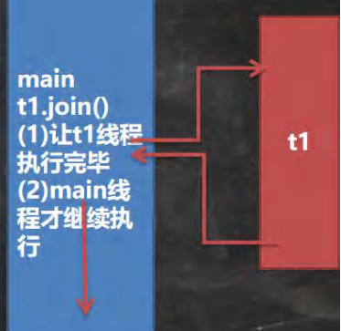

##### 用户线程与守护线程

+ 用户线程:也叫工作线程，当线程的任务执行完或通知方式结束
+ 守护线程:一般是为工作线程服务的，当所有的用户线程结束，守护线程自动结束
+ 常见的守护线程:垃圾回收机制

```java
public class ThreadMethod03 {
    public static void main(String[] args) throws InterruptedException {
        MyDaemonThread myDaemonThread = new MyDaemonThread();
        //如果我们希望当main线程结束后，子线程自动结束
        //,只需将子线程设为守护线程即可
        myDaemonThread.setDaemon(true);
        myDaemonThread.start();

        for( int i = 1; i <= 10; i++) {//main线程
            System.out.println("宝强在辛苦的工作...");
            Thread.sleep(1000);
        }
    }
}

class MyDaemonThread extends Thread {
    public void run() {
        for (; ; ) {//无限循环
            try {
                Thread.sleep(1000);//休眠1000毫秒
            } catch (InterruptedException e) {
                e.printStackTrace();
            }
            System.out.println("马蓉和宋喆快乐聊天，哈哈哈~~~");
        }
    }
}
```


### 17.4 线程的生命周期

##### JDK 中用 Thread.State 枚举表示了线程的几种状态

线程状态。线程可 以处于以下状态之- -:

+ NEW
  尚未启动的线程处于此状态。
+ RUNNABLE
  在Java虛拟机中执行的线程处于此状态。
+ BLOCKED
  被阻塞等待监视器锁定的线程处于此状态。
+ WAITING
  正在等待另一个线程执行特定动作的线程处于此状态。
+ TIMED WAITING
  正在等待另一个线程执行动作达到指定等待时间的线程处于此状态。
+ TERMINATED
  已退出的线程处于此状态。

##### 线程状态转换图

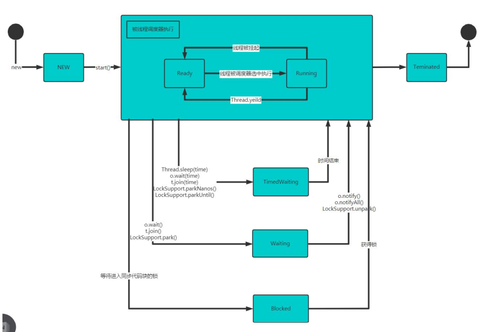

##### 查看线程状态

```java
T t = new T();
        System.out.println(t.getName() + " 状态 " + t.getState());
        t.start();

        while (Thread.State.TERMINATED != t.getState()) {
            System.out.println(t.getName() + " 状态 " + t.getState());
            Thread.sleep(500);
        }

        System.out.println(t.getName() + " 状态 " + t.getState());
```


### 17.5 线程的同步

##### 线程同步机制

+ 在多线程编程，一些敏感数据不允许被多个线程同时访问，此时就使用同步访问技
  术保证数据在任何同-时刻，最多有一个线程访问，以保证数据的完整性。
+ 也可以这里理解:线程同步，即当有一个线程在对内存进行操作时，其他线程都不
  可以对这个内存地址进行操作，直到该线程完成操作，其他线程才能对该内存地
  址进行操作。

##### 同步的具体方法——Synchronized

+ Java语言中，引入了对象互斥锁的概念，来保证共享数据操作的完整性。
+ 每个对象都对应于一个可称为“互斥锁”的标记，这个标记用来保证在任一时刻，只
  能有一个线程访问该对象。
+ 关键字synchronized来与对象的互斥锁联系。当某个对象用synchronized修饰时，
  表明该对象在任一时刻只能由一个线程访问
+ 同步的局限性:导致程序的执行效率要降低
+ 同步方法(非静态的)的锁可以是this,也可以是其他对象(要求是同一个对象)
+ 同步方法(静态的)的锁为当前类本身。

+ 同步代码块
  ```java
  synchronized (对象) { // 得到对象的锁，才能操作同步代码
  /需要被同步代码;
  }
  ```

+ synchronized还可以放在方法声明中， 表示整个方法为同步方法
  ```java
   public synchronized void m (String name){
    //需要被同步的代码
   }
  ```

##### 具体使用

```java
public class SellTicket {
    public static void main(String[] args) {

        SellTicket03 sellTicket03 = new SellTicket03();
        new Thread(sellTicket03).start();//第1个线程-窗口
        new Thread(sellTicket03).start();//第2个线程-窗口
        new Thread(sellTicket03).start();//第3个线程-窗口

    }
}


//实现接口方式, 使用synchronized实现线程同步
class SellTicket03 implements Runnable {
    private int ticketNum = 100;//让多个线程共享 ticketNum
    private boolean loop = true;//控制run方法变量
    Object object = new Object();


    //同步方法（静态的）的锁为当前类本身
    //老韩解读
    //1. public synchronized static void m1() {} 锁是加在 SellTicket03.class
    //2. 如果在静态方法中，实现一个同步代码块.
    /*
        synchronized (SellTicket03.class) {
            System.out.println("m2");
        }
     */
    public synchronized static void m1() {

    }
    public static  void m2() {
        synchronized (SellTicket03.class) {
            System.out.println("m2");
        }
    }

    //老韩说明
    //1. public synchronized void sell() {} 就是一个同步方法
    //2. 这时锁默认在 this对象
    //3. 也可以在代码块上写 synchronized ,同步代码块, 互斥锁还是在this对象
    public /*synchronized*/ void sell() { //同步方法, 在同一时刻， 只能有一个线程来执行sell方法

        synchronized (/*this*/ object) {
            if (ticketNum <= 0) {
                System.out.println("售票结束...");
                loop = false;
                return;
            }

            //休眠50毫秒, 模拟
            try {
                Thread.sleep(50);
            } catch (InterruptedException e) {
                e.printStackTrace();
            }

            System.out.println("窗口 " + Thread.currentThread().getName() + " 售出一张票"
                    + " 剩余票数=" + (--ticketNum));//1 - 0 - -1  - -2
        }
    }

    @Override
    public void run() {
        while (loop) {

            sell();//sell方法是一共同步方法
        }
    }
}


```


##### 注意

+ 同步方法如果没有使用static修饰:默认锁对象为this
+ 如果方法使用static修饰，默认锁对象:当前类.class
+ 实现的落地步骤: 
  + 需要先分析上锁的代码
  + 选择同步代码块或同步方法
  + 要求多个线程的锁对象为同一个即可!


### 17.6 线程的死锁

+ 多个线程都占用了对方的锁资源，但不肯相让，导致了死锁，在编程是一定要避免死锁的发生.

### 17.7 释放锁

##### 会释放锁的操作

+ 当前线程的同步方法、同步代码块执行结束
+ 当前线程在同步代码块、同步方法中遇到break、return。 
+ 当前线程在同步代码块、同步方法中出现了未处理的Error或Exception, 导致异常结束
+ 当前线程在同步代码块、同步方法中执行了线程对象的wait()方法，当前线程暂停，并释
  放锁。

##### 不会释放锁的操作

+ 线程执行同步代码块或同步方法时，程序调用Thread.sleep()、 Thread.yield()方法暂停当前线程的执行，不会释放锁

<br>

## Chapter18 坦克大战二

*滑了，没啥用，高速学习知识吧*

<br>

## Chapter19  IO流

<br>

### 19.1 文件

##### 文件和文件流

+ 文件：文件是保存数据的地方，比如大家经常使用的word文档，txt文件，对我们并不陌生。它既可以保存一张图片，也可以保持视频，声音。
+ 文件流：数据在数据源（文件）和程序（内存）之间经历的路径
  + 输入流：数据从数据源到程序的路径
  + 输出流：数据从程序到数据源的路径

##### 常用的文件操作

1. 创建文件对象相关构造器和方法

+ 文件对象可以==用目录创建==（目录本质上也是一种文件，特殊的文件）

```java
new File(String pathname) //根据路径构建一个File对象
new File(File parent,String child) //根据父目录文件+子路径构建
new File(String parent,String child) //根据父目录+子路径构建
File.createNewFile()  //创建新文件
```

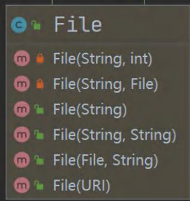

2. 获取文件的相关信息

+ getName、getAbsolutePath、 getParent、 length、 exists、 isFile、isDirectory

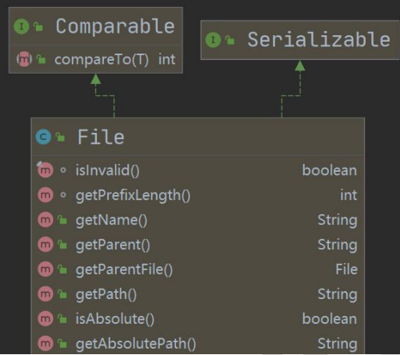

```java
public void info() {
        //先创建文件对象
        File file = new File("e:\\news1.txt");

        //调用相应的方法，得到对应信息
        System.out.println("文件名字=" + file.getName());
        //getName、getAbsolutePath、getParent、length、exists、isFile、isDirectory
        System.out.println("文件绝对路径=" + file.getAbsolutePath());
        System.out.println("文件父级目录=" + file.getParent());
        System.out.println("文件大小(字节)=" + file.length());
        System.out.println("文件是否存在=" + file.exists());//T
        System.out.println("是不是一个文件=" + file.isFile());//T
        System.out.println("是不是一个目录=" + file.isDirectory());//F


    }
```

3. 目录的操作和文件删除

+ mkdir创建一级目录、mkdirs创建多级目录、 delete删除空目录或文件

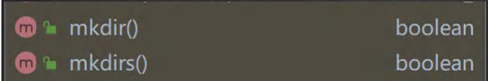

```java
file.delete()
```


```java
	    String directoryPath = "D:\\demo\\a\\b\\c";
        File file = new File(directoryPath);
        if (file.exists()) {
            System.out.println(directoryPath + "存在..");
        } else {
            if (file.mkdirs()) { //创建一级目录使用mkdir() ，创建多级目录使用mkdirs()
                System.out.println(directoryPath + "创建成功..");
            } else {
                System.out.println(directoryPath + "创建失败...");
            }
        }
```

<br>

### 19.2 IO流的分类及体系图

##### Java IO 流原理

+ I/O是Input/Output的缩写， I/0技术是非常实用的技术，用于处理数据传输。如读/写文件，网络通讯等。
2. Java程序中，对于数据的输入/输出操作以”流(stream)" 的方式进行。
+ java.io包下提供了各种"流”类和接口，用以获取不同种类的数据，并通过方法输入或输出数据。

##### 流的分类

+ 按操作数据单位不同分为：字节流(8 bit)二进制文件，字符流(按字符)文本文件
+ 按数据流的流向不同分为：输入流，输出流
+ 按流的角色的不同分为：节点流，处理流/包装流

| （抽象基类） |    字节流    | 字符流 |
| :----------: | :----------: | :----: |
|  **输入流**  | InputStream  | Reader |
|  **输出流**  | OutputStream | Writer |

1. Java的 IO 流共涉及40多个类，实际上非常规则，都是从如上4个抽象基类派生的。
2. 由这四个类派生出来的子类名称都是以其父类名作为子类名后缀。

##### IO流体系图

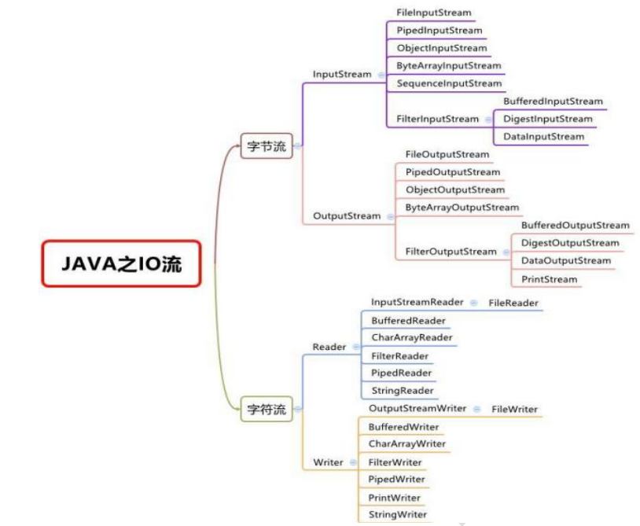

<br>

### 19.3 FileInputStream and FileOutputStream

##### InputStream

+ InputStream:字节输入流
+ InputStream抽象类是所有类字节输入流的超类
+ InputStream常用的子类
  + FileInputStream:文件输入流
  + BufferedInputStream:缓冲字节输入流
  + ObjectlnputStream:对象字节输入流
+ 类图

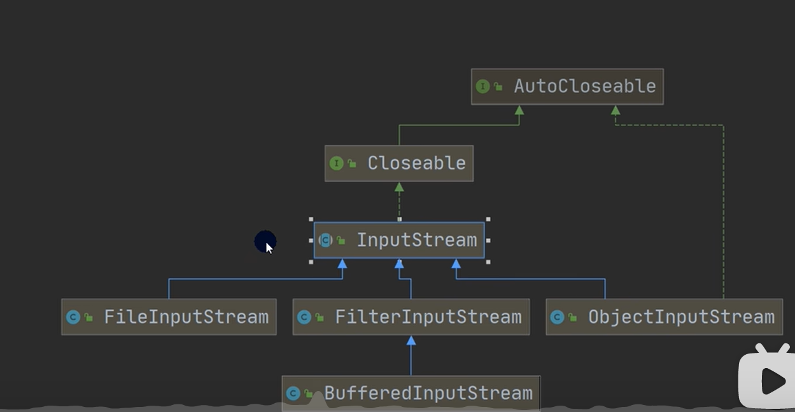


##### FileInputStream

+ 常用方法

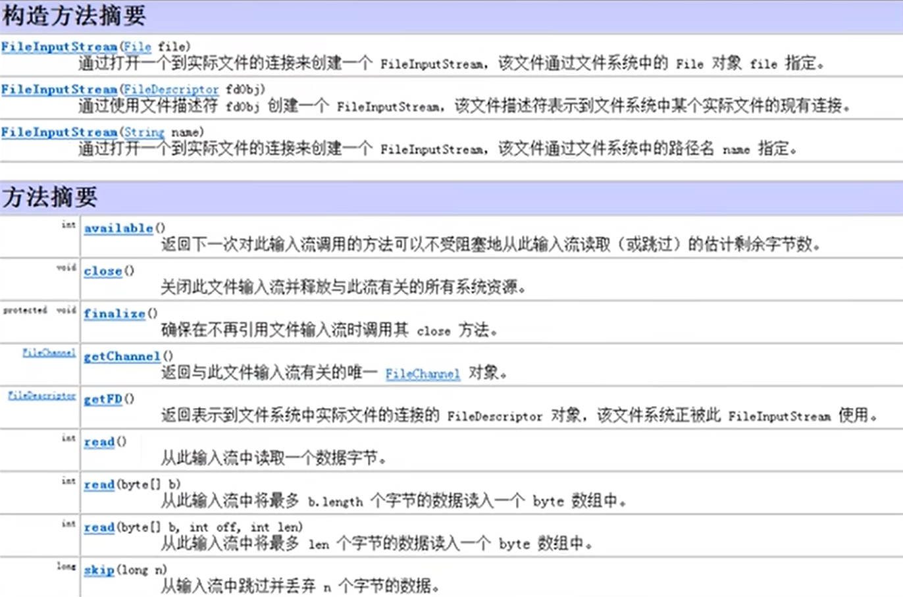

+ 示例一

```java
public void readFile01() {
        String filePath = "e:\\hello.txt";
        int readData = 0;
        FileInputStream fileInputStream = null;
        try {
            //创建 FileInputStream 对象，用于读取 文件
            fileInputStream = new FileInputStream(filePath);
            //从该输入流读取一个字节的数据。 如果没有输入可用，此方法将阻止。
            //如果返回-1 , 表示读取完毕
            while ((readData = fileInputStream.read()) != -1) {
                System.out.print((char)readData);//转成char显示
            }

        } catch (IOException e) {
            e.printStackTrace();
        } finally {
            //关闭文件流，释放资源.
            try {
                fileInputStream.close();
            } catch (IOException e) {
                e.printStackTrace();
            }
        }

    }
```

+ 示例二

```java
public void readFile02() {
        String filePath = "D:\\afei2\\leisure\\zhf.txt";
        //字节数组
        byte[] buf = new byte[8]; //一次读取8个字节.
        int readLen = 0;
        FileInputStream fileInputStream = null;
        try {
            //创建 FileInputStream 对象，用于读取 文件
            fileInputStream = new FileInputStream(filePath);
            //从该输入流读取最多b.length字节的数据到字节数组。 此方法将阻塞，直到某些输入可用。
            //如果返回-1 , 表示读取完毕
            //如果读取正常, 返回实际读取的字节数
            while ((readLen = fileInputStream.read(buf)) != -1) {
                System.out.print(new String(buf,0,readLen));//显示
            }

        } catch (IOException e) {
            e.printStackTrace();
        } finally {
            //关闭文件流，释放资源.
            try {
                fileInputStream.close();
            } catch (IOException e) {
                e.printStackTrace();
            }
        }

    }
```

<br>

##### FileOutputStream

+ 类图

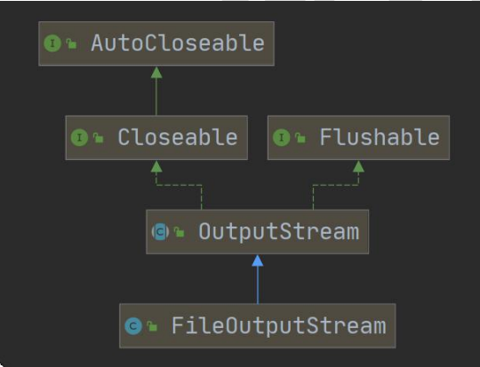

+ 常用方法

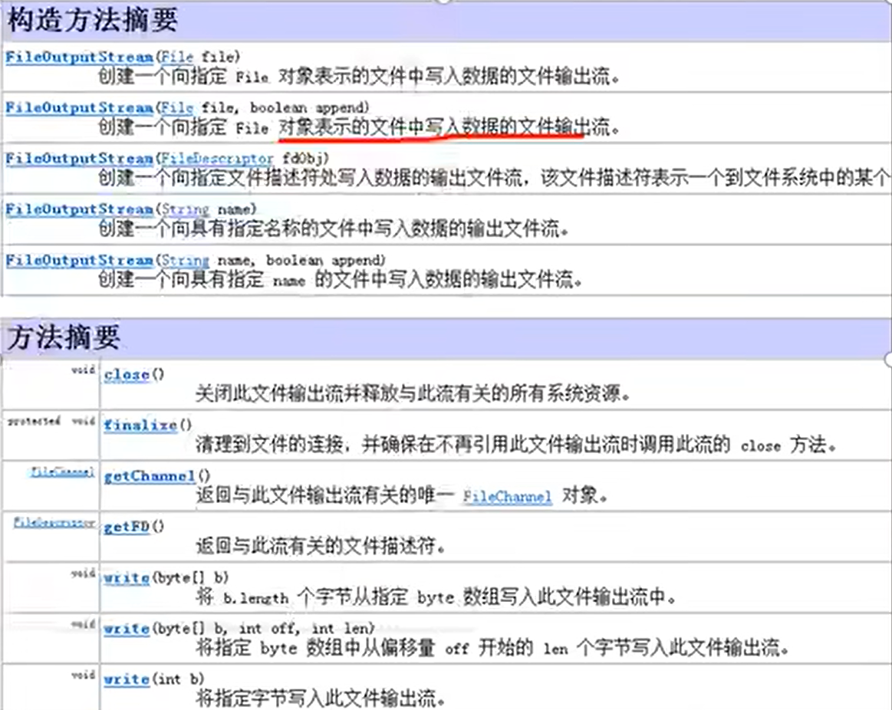

+ 示例

```java
public void writeFile() {

        //创建 FileOutputStream对象
        String filePath = "e:\\a.txt";
        FileOutputStream fileOutputStream = null;
        try {
            //得到 FileOutputStream对象 对象
            //老师说明
            //1. new FileOutputStream(filePath) 创建方式，当写入内容时，会覆盖原来的内容
            //2. new FileOutputStream(filePath, true) 创建方式，当写入内容时，是追加到文件后面
            fileOutputStream = new FileOutputStream(filePath, true);
            //写入一个字节
            //fileOutputStream.write('H');//
            //写入字符串
            String str = "hsp,world!";
            //str.getBytes() 可以把 字符串-> 字节数组
            //fileOutputStream.write(str.getBytes());
            /*
            write(byte[] b, int off, int len) 将 len字节从位于偏移量 off的指定字节数组写入此文件输出流
             */
            fileOutputStream.write(str.getBytes(), 0, 3);

        } catch (IOException e) {
            e.printStackTrace();
        } finally {
            try {
                fileOutputStream.close();
            } catch (IOException e) {
                e.printStackTrace();
            }
        }
```

##### 实现文件拷贝（FileInputStream and FileoutputStream）

```java
//完成 文件拷贝，将 e:\\Koala.jpg 拷贝 c:\\
        //思路分析
        //1. 创建文件的输入流 , 将文件读入到程序
        //2. 创建文件的输出流， 将读取到的文件数据，写入到指定的文件.
        String srcFilePath = "e:\\Koala.jpg";
        String destFilePath = "e:\\Koala3.jpg";
        FileInputStream fileInputStream = null;
        FileOutputStream fileOutputStream = null;

        try {

            fileInputStream = new FileInputStream(srcFilePath);
            fileOutputStream = new FileOutputStream(destFilePath);
            //定义一个字节数组,提高读取效果
            byte[] buf = new byte[1024];
            int readLen = 0;
            while ((readLen = fileInputStream.read(buf)) != -1) {
                //读取到后，就写入到文件 通过 fileOutputStream
                //即，是一边读，一边写
                fileOutputStream.write(buf, 0, readLen);//一定要使用这个方法

            }
            System.out.println("拷贝ok~");


        } catch (IOException e) {
            e.printStackTrace();
        } finally {
            try {
                //关闭输入流和输出流，释放资源
                if (fileInputStream != null) {
                    fileInputStream.close();
                }
                if (fileOutputStream != null) {
                    fileOutputStream.close();
                }
            } catch (IOException e) {
                e.printStackTrace();
            }
        }
```

<br>

### 19.4 FileReader and FileWriter

##### 类图

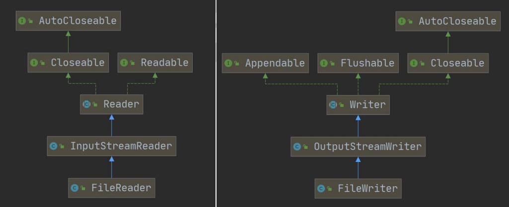


##### FileReader 相关方法

+ new FileReader(File/String)
2) read:每次读取单个字符，返回该字符，如果到文件末尾返回-1
+ read(char[]): 批量读取多个字符到数组，返回读取到的字符数，如果到文件末尾返回-1
+ 相关API:
  + new String(char[]):将char[]转换成String
  + new String(char[], off, len):将char[]的指定部分转换成String

##### FileWriter 相关方法

+ new FileWriter(File/String): 覆盖模式，相当于流的指针在首端
2) new FileWriter(File/String,true): ==追加模式==，相当于流的指针在尾端
3) write(int):写入单个字符
4) write(char[]):写入指定数组
5) write(char[],off,len):写入指定数组的指定部分
6) write (string) :写入整个字符串
+ write(string,offset,len):写入字符串的指定部分
+ 相关API: String类: toCharArray:将String转换成char[]
7) ➢注意
FileWriter使用后，==必须要关闭(close)或刷新(flush),否则写入不到指定的文件==!

##### FileReader 示例一

```java
public void readFile01() {
        String filePath = "e:\\story.txt";
        FileReader fileReader = null;
        int data = 0;
        //1. 创建FileReader对象
        try {
            fileReader = new FileReader(filePath);
            //循环读取 使用read, 单个字符读取
            while ((data = fileReader.read()) != -1) {
                System.out.print((char) data);
            }

        } catch (IOException e) {
            e.printStackTrace();
        } finally {
            try {
                if (fileReader != null) {
                    fileReader.close();
                }
            } catch (IOException e) {
                e.printStackTrace();
            }
        }
    }
```

##### FileReader 示例二

```java
public void readFile02() {
        System.out.println("~~~readFile02 ~~~");
        String filePath = "e:\\story.txt";
        FileReader fileReader = null;

        int readLen = 0;
        char[] buf = new char[8];
        //1. 创建FileReader对象
        try {
            fileReader = new FileReader(filePath);
            //循环读取 使用read(buf), 返回的是实际读取到的字符数
            //如果返回-1, 说明到文件结束
            while ((readLen = fileReader.read(buf)) != -1) {
                System.out.print(new String(buf, 0, readLen));
            }

        } catch (IOException e) {
            e.printStackTrace();
        } finally {
            try {
                if (fileReader != null) {
                    fileReader.close();
                }
            } catch (IOException e) {
                e.printStackTrace();
            }
        }
    }
```

##### FileWriter 示例

```java
String filePath = "D:\\note.txt";
        //创建FileWriter对象
        FileWriter fileWriter = null;
        char[] chars = "高贝贝好看".toCharArray();
        System.out.println(chars.length);
        for (int i = 0; i < chars.length; i++) {
            char temp = chars[i];
            System.out.println(temp);
        }
        try {
            fileWriter = new FileWriter(filePath);//默认是覆盖写入
//            3) write(int):写入单个字符
            fileWriter.write('H');
//            4) write(char[]):写入指定数组
            fileWriter.write(chars);
//            5) write(char[],off,len):写入指定数组的指定部分
            fileWriter.write("韩顺平教育".toCharArray(), 0, 3);
//            6) write（string）：写入整个字符串
            fileWriter.write(" 你好北京~");
            fileWriter.write("风雨之后，定见彩虹");
//            7) write(string,off,len):写入字符串的指定部分
            fileWriter.write("上海天津", 0, 2);
            //在数据量大的情况下，可以使用循环操作.


        } catch (IOException e) {
            e.printStackTrace();
        } finally {

            //对应FileWriter , 一定要关闭流，或者flush才能真正的把数据写入到文件
            //老韩看源码就知道原因.
            /*
                看看代码
                private void writeBytes() throws IOException {
        this.bb.flip();
        int var1 = this.bb.limit();
        int var2 = this.bb.position();

        assert var2 <= var1;

        int var3 = var2 <= var1 ? var1 - var2 : 0;
        if (var3 > 0) {
            if (this.ch != null) {
                assert this.ch.write(this.bb) == var3 : var3;
            } else {
                this.out.write(this.bb.array(), this.bb.arrayOffset() + var2, var3);
            }
        }

        this.bb.clear();
    }
             */
            try {
                //fileWriter.flush();
                //关闭文件流，等价 flush() + 关闭
                fileWriter.close();
            } catch (IOException e) {
                e.printStackTrace();
            }

        }

        System.out.println("程序结束...");
```

<br>

### 19.5 节点流和处理流

##### 基本介绍

+ 节点流可以从一个特定的数据源读写数据，如FileReader，FileWriter


+ 处理流(也叫包装流)是"连接”在已存在的流(节点流或处理流)之上，为程序提供更为强大的读写功能，也更加灵活，如BufferedReader、BuferedWriter [源码]

##### 节点流和处理流一览图

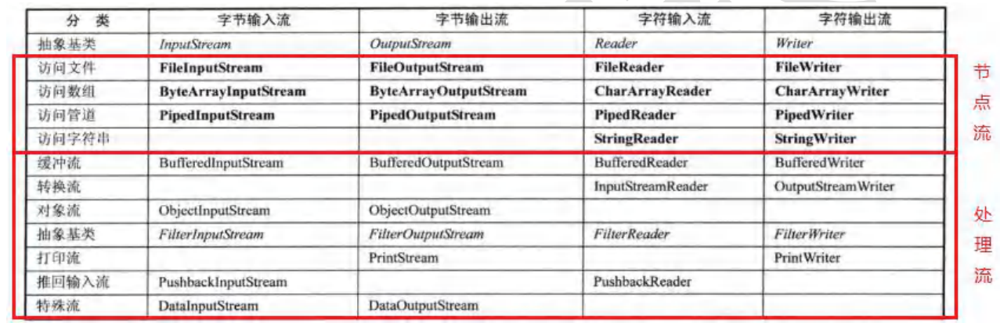

##### 节点流和处理流的区别和联系

+ 节点流是底层流/低级流直接跟数据源相接。
+ 处理流(包装流)包装节点流，既可以消除不同节点流的实现差异，也可以提供更方便的方法来完成输入输出。
+ 处理流(也叫包装流)对节点流进行包装，使用了修饰器设计模式，不会直接与数据源相连[模拟==修饰器设计模式==]

##### 处理流的优势

+ 性能的提高:主要以增加缓冲的方式来提高输入输出的效率。
+ 操作的便捷:处理流可能提供了一系列便捷的方法来一 次输入输出大批量的数据，使用更加灵活方便

##### 处理流-BufferedReader and BufferedWriter

+ ➢BufferedReader 和BufferedWriter属于字符流，是按照字符来读取数据的
+ 关闭时处理流，只需要关闭外层流即可、
+ BufferedReader示例：

```java
String filePath = "e:\\a.java";
        //创建bufferedReader
        BufferedReader bufferedReader = new BufferedReader(new FileReader(filePath));
        //读取
        String line; //按行读取, 效率高
        //说明
        //1. bufferedReader.readLine() 是按行读取文件
        //2. 当返回null 时，表示文件读取完毕
        while ((line = bufferedReader.readLine()) != null) {
            System.out.println(line);
        }

        //关闭流, 这里注意，只需要关闭 BufferedReader ，因为底层会自动的去关闭 节点流
        bufferedReader.close();
```

+ BufferedWriter示例

```java
String filePath = "e:\\ok.txt";
        //创建BufferedWriter
        //说明:
        //1. new FileWriter(filePath, true) 表示以追加的方式写入
        //2. new FileWriter(filePath) , 表示以覆盖的方式写入
        BufferedWriter bufferedWriter = new BufferedWriter(new FileWriter(filePath));
        bufferedWriter.write("hello, 韩顺平教育!");
        bufferedWriter.newLine();//插入一个和系统相关的换行
        bufferedWriter.write("hello2, 韩顺平教育!");
        bufferedWriter.newLine();
        bufferedWriter.write("hello3, 韩顺平教育!");
        bufferedWriter.newLine();

        //说明：关闭外层流即可 ， 传入的 new FileWriter(filePath) ,会在底层关闭
        bufferedWriter.close();
```

+  BufferedReader and BufferedWriter 拷贝文件示例

```java
        //1. BufferedReader 和 BufferedWriter 是按字符操作
        //2. 不要去操作 二进制文件[声音，视频，doc, pdf ], 可能造成文件损坏
        String srcFilePath = "e:\\a.java";
        String destFilePath = "e:\\a2.java";
        BufferedReader br = null;
        BufferedWriter bw = null;
        String line;
        try {
            br = new BufferedReader(new FileReader(srcFilePath));
            bw = new BufferedWriter(new FileWriter(destFilePath));

            //说明: readLine 读取一行内容，但是没有换行
            while ((line = br.readLine()) != null) {
                //每读取一行，就写入
                bw.write(line);
                //插入一个换行
                bw.newLine();
            }
            System.out.println("拷贝完毕...");

        } catch (IOException e) {
            e.printStackTrace();
        } finally {
            //关闭流
            if(br != null) {
                    br.close();
                }
            if(bw != null) {
                    bw.close();
                }
        }
```

##### 处理流-BufferedInputStream and BufferedOutputStrea

+ BufferedInputStream：BufferedInputStream是字节流，在创建BufferedInputStream时，会创建一个内部缓冲区数组.

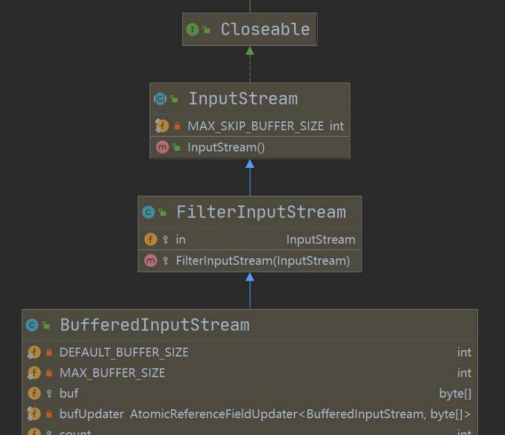

+ BufferedOutputStream：BufferedOutputStream是字节流，实现缓冲的输出流，可以将
  多个字节写入底层输出流中，而不必对每次字节写入调用底层系统


+ BufferedInputStream and BufferedOutputStrea 拷贝文件示例

```java
        String srcFilePath = "e:\\a.java";
        String destFilePath = "e:\\a3.java";

        //创建BufferedOutputStream对象BufferedInputStream对象
        BufferedInputStream bis = null;
        BufferedOutputStream bos = null;

        try {
            //因为 FileInputStream  是 InputStream 子类
            bis = new BufferedInputStream(new FileInputStream(srcFilePath));
            bos = new BufferedOutputStream(new FileOutputStream(destFilePath));

            //循环的读取文件，并写入到 destFilePath
            byte[] buff = new byte[1024];
            int readLen = 0;
            //当返回 -1 时，就表示文件读取完毕
            while ((readLen = bis.read(buff)) != -1) {
                bos.write(buff, 0, readLen);
            }

            System.out.println("文件拷贝完毕~~~");

        } catch (IOException e) {
            e.printStackTrace();
        } finally {
            //关闭流 , 关闭外层的处理流即可，底层会去关闭节点流
                    bis.close();
                    bos.close();
        }
```

##### 对象流-ObjectInputStream 和 ObjectOutputStream

+ 既可以存储数据也可以存储数据类型
+ ➢序列化和反序列化

1. 序列化就是在保存数据时，保存数据的值和数据类型
2. 反序列化就是在恢复数据时， 恢复数据的值和数据类型
3. 需要让某个对象支持序列化机制，则必须让其类是可序列化的，为了让某个类是可序列化的，该类必须实现如下两个接口之一:
   ➢Serializable // 这是一个标记接口， 没有方法
   ➢Externalizable //该接口有方法需要实现，因此我们一般实现上面的Serializable接口

+ ObjectInputStream 提供 反序列化功能，类图

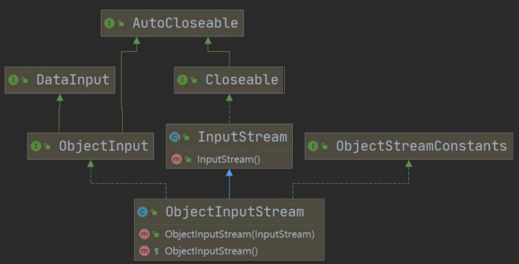

+ ObjectOutputStream 提供 序列化功能，类图

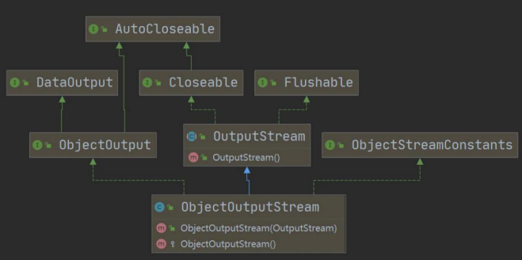

+ ObjectOutputStream 示例

```java
//序列化后，保存的文件格式，不是存文本，而是按照他的格式来保存
        String filePath = "e:\\data.dat";

        ObjectOutputStream oos = new ObjectOutputStream(new FileOutputStream(filePath));

        //序列化数据到 e:\data.dat
        oos.writeInt(100);// int -> Integer (实现了 Serializable)
        oos.writeBoolean(true);// boolean -> Boolean (实现了 Serializable)
        oos.writeChar('a');// char -> Character (实现了 Serializable)
        oos.writeDouble(9.5);// double -> Double (实现了 Serializable)
        oos.writeUTF("韩顺平教育");//String
        //保存一个dog对象
        oos.writeObject(new Dog("旺财", 10, "日本", "白色"));
        oos.close();
        System.out.println("数据保存完毕(序列化形式)");
```

+ ObjectInputStream 示例

```java
		//指定反序列化的文件
        String filePath = "e:\\data.dat";

        ObjectInputStream ois = new ObjectInputStream(new FileInputStream(filePath));

        //读取
        //老师解读
        //1. 读取(反序列化)的顺序需要和你保存数据(序列化)的顺序一致
        //2. 否则会出现异常

        System.out.println(ois.readInt());
        System.out.println(ois.readBoolean());

        System.out.println(ois.readChar());
        System.out.println(ois.readDouble());
        System.out.println(ois.readUTF());


        //dog 的编译类型是 Object , dog 的运行类型是 Dog
        Object dog = ois.readObject();
        System.out.println("运行类型=" + dog.getClass());
        System.out.println("dog信息=" + dog);//底层 Object -> Dog

        //这里是特别重要的细节:

        //1. 如果我们希望调用Dog的方法, 需要向下转型
        //2. 需要我们将Dog类的定义，放在到可以引用的位置
        Dog dog2 = (Dog)dog;
        System.out.println(dog2.getName()); //旺财..

        //关闭流, 关闭外层流即可，底层会关闭 FileInputStream 流
        ois.close();
```

+ 注意事项和细节说明
  + 读写顺序要一致
  + 要求序列化或反序列化对象,需要实现Serializable
  + 序列化的类中建议添加SerialVersionUID,为了提高版本的兼容性（就是给序列化的类提供了唯一ID，这样以后即使修改了类内的代码，也不影响读写）
  + 序列化对象时，默认将里面所有属性都进行序列化，但除了static或transient修饰的成员
  + 序列化对象时，要求里面属性的类型也需要实现序列化接口
  + 序列化具备可继承性，也就是如果某类已经实现了序列化，则它的所有子类也已经默认实现了序列化

##### 标准输入输出流

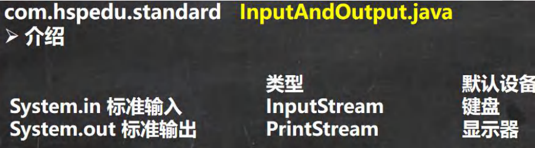

##### 转换流-InputStreamReader 和 OutputStreamWrite

+ 就是字符流读取写入时，默认的编码都是utd-8，所以转换流InputStreamReader 和 OutputStreamWrite为了可以用其他的编码方式读取和写入
+ InputStreamReader:Reader的子类，可以将InputStream(字节流)包装成(转换)Reader(字符流)
+ OutputStreamWriter:Writer的子类，实现将OutputStream(字节流)包装成Writer(字符流)
+ 当处理纯文本数据时，如果使用字符流效率更高，并且可以有效解决中文问题，所以建议将字节流转换成字符流
+ 可以在使用时指定编码格式(比如utf- 8, gbk , gb2312, IS08859-1等)
+ 编程将字节流FilelnputStream 包装成(转换成)字符流InputStreamReader,对文件进行读取(按照utf- 8/gbk格式)，==进而在包装成BufferedReader==

+ InputStreamReader 示例

```java
String filePath = "e:\\a.txt";
        //解读
        //1. 把 FileInputStream 转成 InputStreamReader
        //2. 指定编码 gbk
        //InputStreamReader isr = new InputStreamReader(new FileInputStream(filePath), "gbk");
        //3. 把 InputStreamReader 传入 BufferedReader
        //BufferedReader br = new BufferedReader(isr);

        //将2 和 3 合在一起
        BufferedReader br = new BufferedReader(new InputStreamReader(
        new FileInputStream(filePath), "gbk"));

        //4. 读取
        String s = br.readLine();
        System.out.println("读取内容=" + s);
        //5. 关闭外层流
        br.close();
```

+ OutputStreamWriter 示例

```java
		String filePath = "e:\\hsp.txt";
        String charSet = "utf-8";
        OutputStreamWriter osw = new OutputStreamWriter(new FileOutputStream(filePath), charSet);
        osw.write("hi, 韩顺平教育");
        osw.close();
        System.out.println("按照 " + charSet + " 保存文件成功~");
```

<br>

### 19.6 打印流-PrintStream 和 PrintWriter

+ 就是用于打印输出的，默认在控制台，也可以更改到文件，感觉没啥用

### 19.7 Properties

+ 即：键值对的配置文件（肯定不需要这么读取了，用注解就可以，跳）
+ 可以用Properties读取和修改


## Chapter20 坦克大战三

滑


## Chapter21 网络编程

*前言：以我目前的开发经验而言，我并没有感觉这个东西有什么用，所以特意差了一些，问了问chatgpt，虽然使用Spring Boot的时候基本没有感觉用过网络编程，但我觉得应该是因为Spring Boot框架使用注解把它们都封装起来了，而且我觉得可能在开发windows应用程序时，会用到很多网络编程的东西，所以还是简单看一下吧*

>  Web应用程序服务器端和Windows应用程序服务器端有很多不同之处，其中一些主要区别如下：
>
> 1. 运行环境：Web应用程序通常运行在Web服务器上，而Windows应用程序可以在Windows操作系统上运行。
>
> 2. 通信协议：Web应用程序通常使用HTTP协议进行通信，而Windows应用程序可以使用各种协议进行通信，例如TCP/IP、RPC等。
>
> 3. 用户界面：Web应用程序通常使用浏览器作为客户端，而Windows应用程序通常具有自己的用户界面，可以通过窗口和控件与用户交互。
>
> 4. 部署方式：Web应用程序通常使用Web服务器进行部署，而Windows应用程序可以直接安装在计算机上或者通过远程桌面等方式进行部署。
>
> 至于框架方面，Web应用程序服务器端通常使用基于Java的框架，例如Spring、Struts等，或者其他的Web框架，例如Node.js、Django等。Windows应用程序服务器端可以使用各种不同的框架和技术，例如.NET Framework、WinForms、WPF等，取决于具体的应用需求和技术栈选择。


>Spring Boot 是一个现代化的、轻量级的 Java Web 开发框架，其本身就已经提供了许多网络编程的相关功能，所以您可能没有使用传统的 Java 网络编程相关内容。
>
>具体来说，Spring Boot 提供了对 HTTP 协议的完整支持，包括请求和响应的处理、路由、会话管理、安全认证等方面的功能。您可以使用 Spring Boot 提供的注解和类库来处理 HTTP 请求，而不需要编写低层次的网络编程代码。Spring Boot 还提供了许多与网络编程相关的库，例如 Spring WebFlux，它提供了基于 Reactor 的反应式编程模型，以及 WebSocket 支持等。


> Spring Boot是一个现代化的Java Web应用程序开发框架，它大量使用了Java EE规范中的技术和框架。其中包括Servlet API，JPA，JMS和Spring框架等。这些技术和框架都可以用来构建网络应用程序，因此使用Java网络编程的需求可能会被这些更高级的技术所替代。
>
> 在Spring Boot应用程序中，可以使用Spring框架提供的RESTful API来处理HTTP请求和响应，这样可以大大简化网络编程的复杂性。此外，Spring框架还提供了许多用于处理不同类型网络请求的模块，比如Spring Data JPA用于处理数据库操作、Spring Security用于安全认证和授权、Spring WebSocket用于实时通信等。
>
> 虽然Java网络编程是Java EE规范中的一个重要部分，但是在使用Spring Boot的情况下，您可能会发现大部分网络编程需求都可以通过更高级别的Spring组件来解决，而不需要显式地编写网络编程代码。


### 21.1 TCP 和 UDP

##### TCP

+ 使用TCP协议前，须先建立TCP连接，形成传输数据通道
+ 传输前，采用"三次握手"方式，是可靠的
+ TCP协议进行通信的两个应用进程:客户端、服务端
+ 在连接中可进行大数据量的传输
+ 传输完毕，需释放已建立的连接，效率低

##### UDP

+ 将数据、源、目的封装成数据包，不需要建立连接
+ 每个数据报的大小限制在==64K==内，不适合传输大量数据
+ 因无需连接，故是不可靠的
+ 发送数据结束时无需释放资源(因为不是面向连接的)，速度快

### 21.2 InetAddress 类

+ 获取本机InetAddress对象getLocalHost
+ 根据指定主机名/域名获取ip地址对象getByName
+ 获取InetAddress对象的主机名getHostName
+ 获取InetAddress对象的地址getHostAddress

### 21.3 Socket

+ 套接字：实际上我觉得可以理解为（ip:端口）

### 21.4 TCP 网络通信编程

##### 基本内容

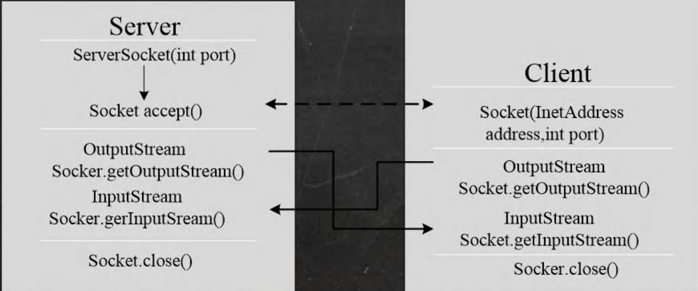

##### 示例

+ 客户端

```java
public class SocketTCP03Client {
    public static void main(String[] args) throws IOException {
        //思路
        //1. 连接服务端 (ip , 端口）
        //解读: 连接本机的 9999端口, 如果连接成功，返回Socket对象
        Socket socket = new Socket(InetAddress.getLocalHost(), 9999);
        System.out.println("客户端 socket返回=" + socket.getClass());
        //2. 连接上后，生成Socket, 通过socket.getOutputStream()
        //   得到 和 socket对象关联的输出流对象
        OutputStream outputStream = socket.getOutputStream();
        //3. 通过输出流，写入数据到 数据通道, 使用字符流
        BufferedWriter bufferedWriter = new BufferedWriter(new OutputStreamWriter(outputStream));
        bufferedWriter.write("hello, server 字符流");
        bufferedWriter.newLine();//插入一个换行符，表示写入的内容结束, 注意，要求对方使用readLine()!!!!
        bufferedWriter.flush();// 如果使用的字符流，需要手动刷新，否则数据不会写入数据通道


        //4. 获取和socket关联的输入流. 读取数据(字符)，并显示
        InputStream inputStream = socket.getInputStream();
        BufferedReader bufferedReader = new BufferedReader(new InputStreamReader(inputStream));
        String s = bufferedReader.readLine();
        System.out.println(s);

        //5. 关闭流对象和socket, 必须关闭
        bufferedReader.close();//关闭外层流
        bufferedWriter.close();
        socket.close();
        System.out.println("客户端退出.....");
    }
}
```


```java
public class SocketTCP03Server {
    public static void main(String[] args) throws IOException {
        //思路
        //1. 在本机 的9999端口监听, 等待连接
        //   细节: 要求在本机没有其它服务在监听9999
        //   细节：这个 ServerSocket 可以通过 accept() 返回多个Socket[多个客户端连接服务器的并发]
        ServerSocket serverSocket = new ServerSocket(9999);
        System.out.println("服务端，在9999端口监听，等待连接..");
        //2. 当没有客户端连接9999端口时，程序会 阻塞, 等待连接
        //   如果有客户端连接，则会返回Socket对象，程序继续

        Socket socket = serverSocket.accept();

        System.out.println("服务端 socket =" + socket.getClass());
        //
        //3. 通过socket.getInputStream() 读取客户端写入到数据通道的数据, 显示
        InputStream inputStream = socket.getInputStream();
        //4. IO读取, 使用字符流, 老师使用 InputStreamReader 将 inputStream 转成字符流
        BufferedReader bufferedReader = new BufferedReader(new InputStreamReader(inputStream));
        String s = bufferedReader.readLine();
        System.out.println(s);//输出

        //5. 获取socket相关联的输出流
        OutputStream outputStream = socket.getOutputStream();
       //    使用字符输出流的方式回复信息
        BufferedWriter bufferedWriter = new BufferedWriter(new OutputStreamWriter(outputStream));
        bufferedWriter.write("hello client 字符流");
        bufferedWriter.newLine();// 插入一个换行符，表示回复内容的结束
        bufferedWriter.flush();//注意需要手动的flush


        //6.关闭流和socket
        bufferedWriter.close();
        bufferedReader.close();
        socket.close();
        serverSocket.close();//关闭

    }
}
```


##### netstat 指令

+ netstat -an可以查看当前主机网络情况，包括端口监听情况和网络连接情况
+ netstat -an | more可以分页显示


### 21.5 UDP 网络通信编程

##### 基本介绍

+ 类DatagramSocket和DatagramPacket[数据包/数据报]实现了基于UDP协议网络程序。
+ UDP数据报通过数据报套接字DatagramSocket发送和接收，系统不保证UDP数据报一定能够安全送到目的地，也不能确定什么时候可以抵达。
+ DatagramPacket对象封装了UDP数据报，在数据报中包含了发送端的IP地址和端口号以及接收端的IP地址和端口号。
+ UDP协议中每个数据报都给出了完整的地址信息，因此无须建立发送方和接收方的连接

##### 基本流程

+ 核心的两个类/对象DatagramSocket与DatagramPacket
+ 建立发送端，接收端(没有服务端和客户端概念)
+ 发送数据前，建立数据包/报DatagramPacket对象
+ 调用DatagramSocket的发送、 接收方法
+ 关闭DatagramSocket


## Chapter22 多用户即时通信系统


##### 项目流程

> 需求分析（需求分析师）：需求报告
>
> 设计阶段（产品经理/结构师）：整体设计
>
> 实现阶段
>
> 测试阶段
>
> 部署阶段
>
> 维护阶段

<br>

<br>

## Chapter23 反射

<br>

### 23.1 反射存在意义

##### ocp原则（开闭原则：不修改代码，扩容功能）

+ 设计模式的一个基本原则：即通过改变外部的配置文件，在不修改源码的情况下，来控制程序。（Spring Boot 项目通过yml文件修改关键参数不需修改代码，重新运行jar包即可。==这在实际项目中的使用非常广泛而且好用==）
+ 这样就残生了一种需求，即在配置文件中写上要创建的类对象，然后读取配置文件，创建类。通过new，是无法用类似com.hspedu.Cat这样的类名来新建对象的。这时候就要使用反射机制。
+ 反射机制也是很多框架的基础，没有反射机制，既没有框架
+ 通过反射机制创建对象，可以让类的加载在真正运行到创建对象的语句的时候再进行，new的话是在编译的时候就会进行类的加载

##### 反射简单使用

```java
//3. 使用反射机制解决
        //(1) 加载类, 返回Class类型的对象cls
        Class cls = Class.forName(classfullpath);//"com.hspedu.Cat"
        //(2) 通过 cls 得到你加载的类 com.hspedu.Cat 的对象实例
        Object o = cls.newInstance();
        System.out.println("o的运行类型=" + o.getClass()); //运行类型
        //(3) 通过 cls 得到你加载的类 com.hspedu.Cat 的 methodName"hi"  的方法对象
        //    即：在反射中，可以把方法视为对象（万物皆对象）
        Method method1 = cls.getMethod(methodName);
        //(4) 通过method1 调用方法: 即通过方法对象来实现调用方法
        System.out.println("=============================");
        method1.invoke(o); //传统方法 对象.方法() , 反射机制 方法.invoke(对象)
```


### 23.2 反射机制

##### Java Reflection

+ 反射机制允许程序在执行期借助于Reflection API取得任何类的内部信息(比如成员变量，构造器，成员方法等等)，并能操作对象的属性及方法。反射在设计模式和框架底层都会用到
+ ==加载完类==之后，在堆中就产生了一个Class类型的对象(==一个类只有一个Class对象==)，这个对象包含了类的完整结构信息。通过这个对象得到类的结构。这个Class对象就像一面镜子，透过这个镜子看到类的结构，所以，形象的称之为:反射

##### Java 反射机制原理图

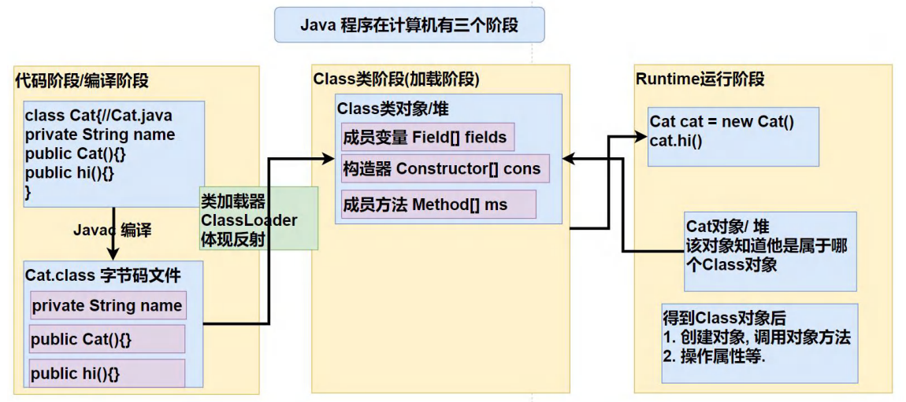

+ 每一个类（Class）都有一个（且只有一个）对应的对象，来对应这个类，可以反射出这个类的结构信息

##### Java 反射机制可以完成

+ 在运行时判断任意一个对象所属的类
+ 在运行时构造任意一个类的对象
+ 在运行时得到任意一个类所具有的成员变量和方法
+ 在运行时调用任意一个对象的成员变量和方法
+ 生成动态代理

##### 反射相关的类

+ ava.lang.Class:代表一个类，Class对象表示某 个类加载后在堆中的对象

+ java.lang.reflect.Method:代表类的方法，Method对象表示某个类的方法

+ java.lang.reflect.Field: 代表类的成员变量，Field对象表示某个类的成员变量

+ java.lang.reflect.Constructor:代表类的构造方法，Constructor对象表示构造器

  这些类在iava lana . reflection

##### 基本使用

```java
	//java.lang.reflect.Field: 代表类的成员变量, Field对象表示某个类的成员变量
    //得到name字段
    //getField不能得到私有的属性
    Field nameField = cls.getField("age"); //
    System.out.println(nameField.get(o)); // 传统写法 对象.成员变量 , 反射 :  成员变量对象.get(对象)

     //java.lang.reflect.Constructor: 代表类的构造方法, Constructor对象表示构造器
    Constructor constructor = cls.getConstructor(); //()中可以指定构造器参数类型, 返回无参构造器
    System.out.println(constructor);//Cat()

	Constructor constructor2 = cls.getConstructor(String.class); //这里老师传入的 String.class 就是String类的Class对象
    ystem.out.println(constructor2);//Cat(String name)
```

##### 反射优点和缺点

+ 优点:可以动态的创建和使用对象(也是框架底层核心),使用灵活，没有反射机制，框架技术就失去底层支撑。
+ 缺点:使用反射基本是解释执行，对执行速度有影响。（实际执行较慢）

##### 反射调用优化

+ Method和Field、 Constructor对象都有setAccessible(方法
+ setAccessible作用是启动和禁用访问安全检查的开关
+ 参数值为true表示反射的对象在使用时取消访问检查，提高反射的效率。参数值为false则表示反射的对象执行访问检查

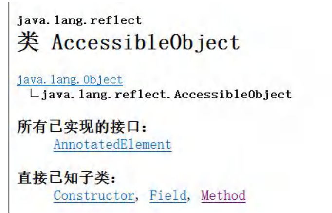


### 23.3 Class 类

##### 基本介绍

+ Class也是类，因此也继承Object类
+ Class类对象不是new出来的，而是系统创建的
+ ==对于某个类的Class类对象，在内存中只有一份，因为类只加载一次==
+ 每个类的实例都会记得自己是由哪个Class实例所生成
+ 通过Class对象可以完整地得到一个类的完整结构，通过一系列API
+ Class对象是存放在堆的
+ 类的字节码二进制数据，是放在方法区的，有的地方称为类的元数据(包括 方法代变量名，方法名，访问权限等等) 

+ 类图

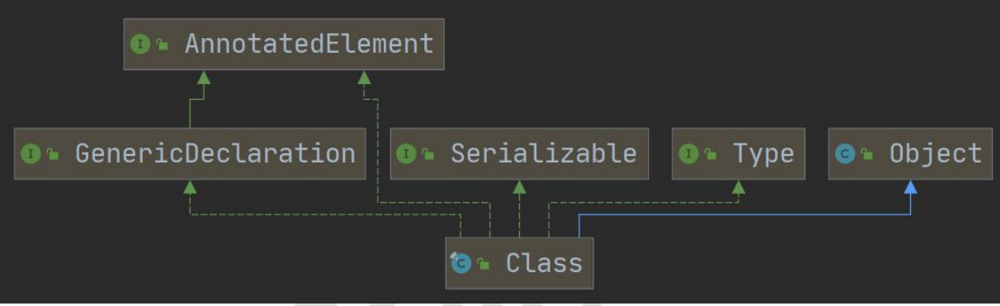

##### 常用方法

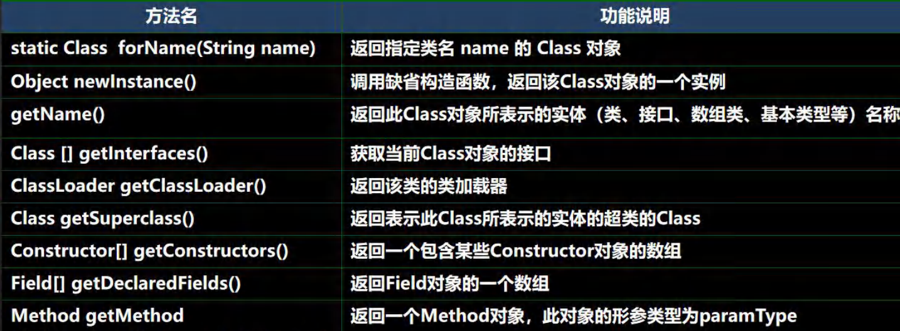

##### 获取Class类对象

+ 前提:已知一个类的全类名，且该类在类路径下，可通过Class类的静态方法
  forName()获取，可能抛出ClassNotFoundException

  实例：`Class cls1 = Class.forName( "java.lang.Cat" );`
  应用场景：多用于配置文件，读取类全路径，加载类.

+ 前提:若已知具体的类，通过类的class获取，该方式最为安全可靠，程序性能最高

  实例：`Class cls2 = Cat.class;`
  应用场景：多用于参数传递，比如通过反射得到对应构造器对象.

+ 前提:已知某个类的实例，调用该实例的getClass()方法获取Class对象

  实例：``Class clazz =对象.getClass();//运行类型``
  应用场景:通过创建好的对象，获取Class对象

+ 其他方式
  ```java
  ClassLoader cl =对象.getClass().getClassLoader();
  Class clazz4 = cl.loadClass( "类的全类名”);
  ```

+ 基本数据(int, char,boolean,float,double,bytelong,short) 按如下方式得到Class类对象
  `Class cls =基本数据类型.class`

+ 基本数据类型对应的包装类，可以通过.TYPE得到Class类对象
  `Class cls =包装类.TYPE`

##### 哪些类型有Class对象

+ 外部类，成员内部类，静态内部类，局部内部类，匿名内部类
+ interface :接口
+ 数组
+ enum :枚举
+ annotation :注解
+ 基本数据类型
+ void

### 23.4 类加载

##### 基本说明

+ 静态加载:编译时加载相关的类，如果没有则报错，依赖性太强
+ 动态加载:运行时加载需要的类，如果运行时不用该类，即使不存在该类，则不报
  错，降低了依赖性

##### 类加载时机

+ 当创建对象时(new) 					//静态加载（编译时加载）
+ 当子类被加载时,父类也加载      //静态加载（编译时加载）
+ 调用类中的静态成员时               //静态加载（编译时加载）
+ 通过反射                                       //动态加载（运行时加载）

##### 类加载过程图

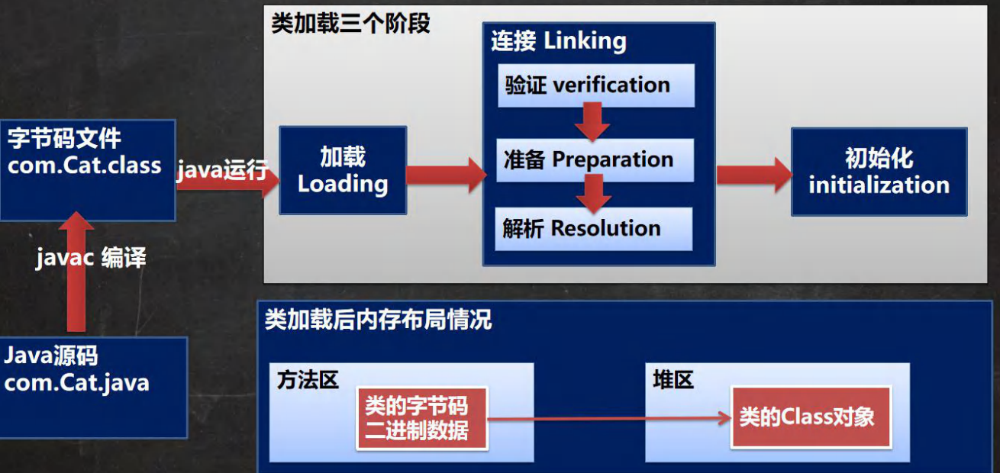

##### 类加载各阶段完成的任务

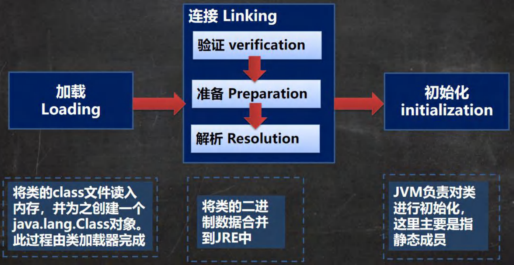

##### 加载阶段

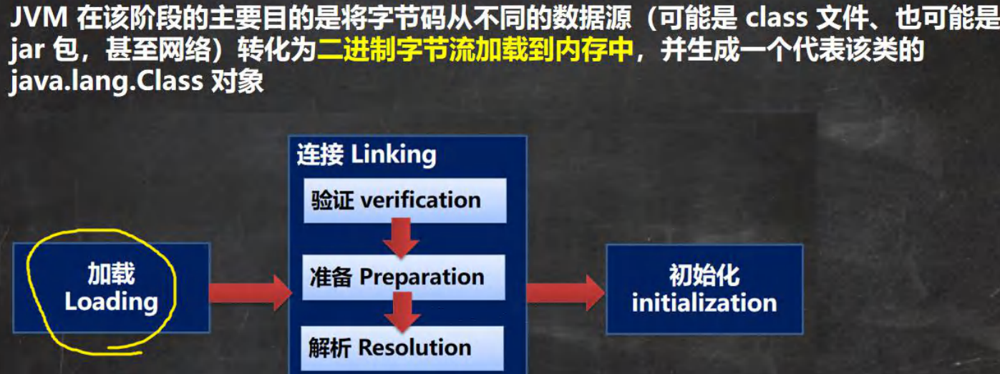

##### 连接阶段-验证

+ 目的是为了确保Class文件的字节流中包含的信息符合当前虚拟机的要求，并且不会危害虚拟机自身的安全。
+ 包括:文件格式验证(是否以魔数OXcafebabe开头)、元数据验证、字节码验证和符号引用验证
+ 可以考虑使用-Xverify:none 参数来关闭大部分的类验证措施，缩短虚拟机类加载的时间。

##### 连接阶段-准备

+ JVM会在该阶段对静态变量，分配内存并默认初始化(对应数据类型的默认初始值，如0、OL、null、 false等)。这些变量所使用的内存都将在方法区中进行分配

##### 连接阶段-解析

+ 虚拟机将常量池内的符号引用替换为直接引用
+ 即：将对类名的引用替换为其在内存地址的地址引用

##### Initialization (初始化)

+ 到初始化阶段，才真正开始执行类中定义的Java程序代码，此阶段是执行\<clinit> ()方法的过程。
+ \<clinit> ()方法是由编译器按语句在源文件中出现的顺序，依次自动收集类中的所有静态变量的赋值动作和静态代码块中的语句，并进行合并。
+ 虚拟机会保证一个类的< clinit> ()方法在多线程环境中被正确地加锁、同步，如果多个线程同时去初始化一个类， 那么只会有一一个线程去执行这个类的< clinit>()方法，其他线程都需要阻塞等待，直到活动线程执行< clinit> ()方法完毕

<br>

### 23.5 通过反射获取类的结构信息

##### java.lang.Class

+ getName:获取全类名
+ getSimpleName:获取简单类名
+ getFields:获取所有public修饰的属性，包含本类以及父类的
+ getDeclaredFields:获取本类中所有属性
+ getMethods:获取所有public修饰的方法，包含本类以及父类的
+ getDeclaredMethods:获取本类中所有方法
+ getConstructors:获取本类所有public修饰的构造器
+ getDeclaredConstructors获取本类中所有构造器
+ getPackage:以Package形式返回包信息
+ getSuperClass:以Class形式返回父类信息
+ getInterfaces:以Class[]形式返回接口信息
+ getAnnotations:以Annotation[]形式返回注解信息

##### java.lang.reflect.Field

+ getModifiers:以int形式返回修饰符
  [说明:默认修饰符是0，public 是1 , private是2，protected是4, static是8 , final 是16] , public(1) + static (8) = 9
2. getType:以Class形式返回类型
3. getName:返回属性名

##### java.lang.reflect.Method

+ getModifiers:以int形式返回修饰符
  [说明:默认修饰符是0，public 是1 , private 是2，protected 是4, static是8，final 是16]
+ getReturnType:以Class形式获取返回类型
+ getName:返回方法名
+ getParameterTypes:以Class[]返回参数类型数组

##### java.lang.reflect.Constructor

+ getModifiers:以int形式返回修饰符
+ getName:返回构造器名(全类名)
+ getParameter Types:以Class[]返回参数类型数组


### 23.6 通过反射创建对象

##### Class 和 Constructor

+ Class类相关方法
  + newInstance :调用类中的无参构造器，获取对应类的对象
  + getConstructor(Class...clazz):根据参数列表，获取对应的public构造器对象
  + getDecalaredConstructor(Class..clazz):根据参数列表，获取对应的所有构造器对象

+ Constructor类相关方法
  + setAccessible:暴破
  + newInstance(Objet...obj):调用构造器

##### 示例

+ 可以通过反射爆破来访问类中的私有属性、方法和构造器

```java
//1. 先获取到User类的Class对象
        Class<?> userClass = Class.forName("com.hspedu.reflection.User");
        //2. 通过public的无参构造器创建实例
        Object o = userClass.newInstance();
        System.out.println(o);
        //3. 通过public的有参构造器创建实例
        /*
            constructor 对象就是
            public User(String name) {//public的有参构造器
                this.name = name;
            }
         */
        //3.1 先得到对应构造器
        Constructor<?> constructor = userClass.getConstructor(String.class);
        //3.2 创建实例，并传入实参
        Object hsp = constructor.newInstance("hsp");
        System.out.println("hsp=" + hsp);
        //4. 通过非public的有参构造器创建实例
        //4.1 得到private的构造器对象
        Constructor<?> constructor1 = userClass.getDeclaredConstructor(int.class, String.class);
        //4.2 创建实例
        //暴破【暴力破解】 , 使用反射可以访问private构造器/方法/属性, 反射面前，都是纸老虎
        constructor1.setAccessible(true);
        Object user2 = constructor1.newInstance(100, "张三丰");
        System.out.println("user2=" + user2);
```


### 23.7 通过反射访问类中的成员

##### 访问属性

+ 根据属性名获取Field对象:`Field f = class对象.getDeclaredField(属性名);`
+ 暴破:`f.setAccessible(true); //f是Field `
+ 访问
  `f.set(o,值); /。表示对象`
  `syso(f.get(o));//o表示对象`
+ 注意：如果是静态属性，则set和get中的参数o,可以写成null

###### 访问方法

+ 根据方法名和参数列表获取Method方法对象: `Method m =class.getDeclaredMethod(方法名，XX.class); //得到本类的所有方法`
+ 获取对象: Object o= class.newInstance();
+ 暴破: m.setAccessible(true);
+ 访问: Object returnValue = m.invoke(o,实参列表);//o就是对象
+ 注意:如果是静态方法，则invoke的参数o,可以写成null!


