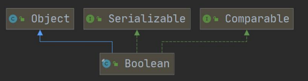
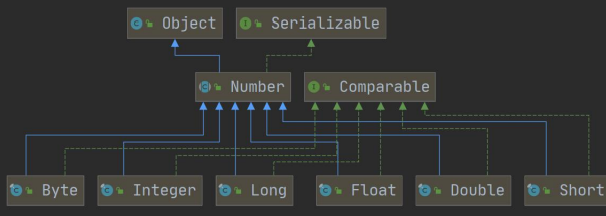

# 包装类(Wrapper Class)

*前言*：*为什么需要包装类呢？因为相比于基本数据类型我们的包装类拥有了类的特点，我们就可以调用类中的方法来简化我们的开发，以后在项目中会大量的使用包装类的*

##### 包装类的分类

1. 八种基本的数据类型都有相应的包装类

| 基本数据类型 |  包装类   |
| :----------: | :-------: |
|   boolean    |  Boolena  |
|     char     | Character |
|     byte     |   Byte    |
|    short     |   Short   |
|     int      |  Integer  |
|     long     |   Long    |
|    float     |   Float   |
|    double    |  Double   |

2. 包装类的类图






> 其中的Serializable接口，简单的理解是用于实现类的序列化和反序列化，序列化即将我们的实体转换为字节流输出到文件中去，反序列化正相反。想要详细了解可以看[Java对象为啥要实现Serializable接口？](https://zhuanlan.zhihu.com/p/66210653)

> 其中的Comparable接口，简单理解就是对实现它的每个类的对象进行整体排序，实现此接口的对象列表（和数组）可以通过**Collections.sort(和Arrays.sort)**进行自动排序。实现此接口的目的就是为了对我们用到的所有对象进行整体的排序。详细了解可以看[Comparable接口和Comparator接口](https://www.jianshu.com/p/a170823e3a4b)

> 其中数字型包装类的父类Number，源码中的注解是抽象类Number是代表数字值的包装类的超类，这些数字值可以转换为原始类型byte、double、float、int、long和short。从一个特定的Number实现的数字值转换到一个给定的原始类型的具体语义由有关的Number实现定义。
>
> > 如：public abstract int intValue();用于把Integer包装类转换为基本类型int
> >
> > 如：public abstract double doubleValue();

##### 包装类与基本数据类型的转换

*这里我们使用int和Integer的转换为例，其它也基本相同*

1. 手动装箱与拆箱

+ jdk5以前只有手动装箱和拆箱方式，装箱：基本类型->包装类，拆箱：包装类->基本类型

```java
//演示 int <--> Integer 的装箱和拆箱
//jdk5 前是手动装箱和拆箱
//手动装箱 int->Integer
int n1 = 100;
Integer integer = new Integer(n1);
Integer integer1 = Integer.valueOf(n1);
//手动拆箱
//Integer -> int
int i = integer.intValue();
```

> 可以看到intValue()方法就是实现了Number接口中的抽象方法

2. 自动装箱与拆箱

+ jdk5及之后实现了自动装箱和拆箱

```java
//jdk5 后，就可以自动装箱和自动拆箱
int n2 = 200;
//自动装箱 int->Integer
Integer integer2 = n2; //底层使用的是 Integer.valueOf(n2)
//自动拆箱 Integer->int
int n3 = integer2; //底层仍然使用的是 intValue()方法
```

> 如果我们查看Integer.valueof()方法的源码，我们会发现其实对于不同的参数，处理是不同的，源码如下

```java
public static Integer valueOf(int i) {
	if (i >= IntegerCache.low && i <= IntegerCache.high)
		return IntegerCache.cache[i + (-IntegerCache.low)];
	return new Integer(i);
}
```

> 可以查询出IntegerCache.low = -128，IntegerCache.high = 127，那么如果 i 在 IntegerCache.low(-128)~IntegerCache.high(127),就直接从数组返回， 如果不在 -128~127,就直接 new Integer(i)，

> 这两种方式有什么区别呢？
>
> + 若是直接new的话，那么我们的变量就是指向一个对象的地址，在进行比较时要用equals()
> + 若是IntegerCache的数组赋值的话，我们的变量就是被常量直接赋值，比较的时候就是直接比较常量值

##### 包装类和String类型的相互转换

直接上代码

```java
//包装类(Integer)->String
Integer i = 100;//自动装箱
String str1 = i + "";
String str2 = i.toString();
String str3 = String.valueOf(i);
//String -> 包装类(Integer)
String str4 = "12345";
Integer i2 = Integer.parseInt(str4);//使用到自动装箱
Integer i3 = new Integer(str4);//构造器
Integer i4 = Integer.valueOf(str4);//valueof()方法
```

##### Integer类和Character类的常用方法

仅提供几个常用的方法，详情可以查看包装类的源码，最好用到的时候直接面向CSDN编程

```java
System.out.println(Integer.MIN_VALUE); //返回最小值
System.out.println(Integer.MAX_VALUE);//返回最大值
System.out.println(Character.isDigit('a'));//判断是不是数字
System.out.println(Character.isLetter('a'));//判断是不是字母
System.out.println(Character.isUpperCase('a'));//判断是不是大写
System.out.println(Character.isLowerCase('a'));//判断是不是小写
System.out.println(Character.isWhitespace('a'));//判断是不是空格
System.out.println(Character.toUpperCase('a'));//转成大写
System.out.println(Character.toLowerCase('A'));//转成小
```

