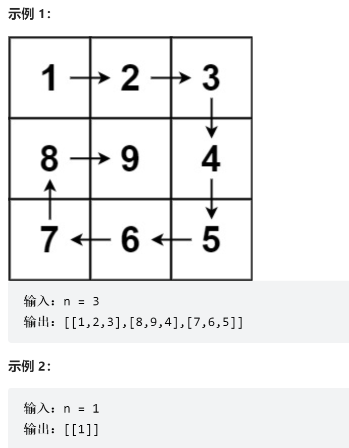

##### 题目描述：

给你一个正整数 `n` ，生成一个包含 `1` 到 `n2` 所有元素，且元素按顺时针顺序螺旋排列的 `n x n` 正方形矩阵 `matrix` 。



##### 解法一：按层模拟

我的思路：我的方法和官方解法不太一样，我是通过按层赋值，然后递归调用，完成的此题。

将每层的（一层正方形）赋值方式定义在一个函数中，递归调用


```java
class Solution {
    public int[][] generateMatrix(int n) {
        int[][] arr = new int[n][n];
        Func(arr,0,n-1,1);
        return arr;
    }
/**
* @Param 四个参数，arr[][]：二维数组，low：该层的起始下标（两个维度的下标一样），high：该层的终止下标（两个维度的下标一样），num：要填入二维数组的第一个数
*
**/
    private void Func(int[][] arr, int low, int high, int num) {
        //要满足传入参数low必须孝于high，才循环赋值，当low等于high时，是特殊情况这层只有一个位置，如果low大于high则说明二维数组已经填充完毕，什么都不用做
        if ( low < high ) {
            //在一个for循环里填充 上下左右 四个边，四个边每次填充都满足填充的数曾一
            for (int i = 0; i <= high-low; i++) {
                arr[low][low + i] = num + i;
                arr[low + i][high] = num + high - low + i;
                arr[high][high - i] = num + 2 * (high - low) + i;
                //第四个边情况特殊，不用再填充第四个边的最上位置，因为哪个就是初始位置
                if (i != high - low) arr[high - i][low] = num + 3 * (high - low) + i;
            }
            //向内一层，递归调用
            Func(arr ,low + 1,high - 1,num + (4*(high - low)));
        }else if(low == high) arr[low][high] = num;
    }
}
```

