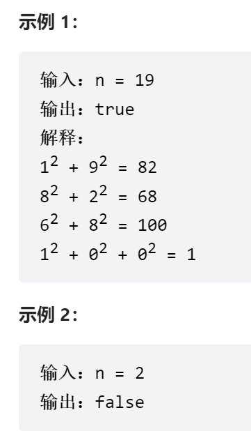

##### 题目描述：

编写一个算法来判断一个数 n 是不是快乐数。

「快乐数」 定义为：

+ 对于一个正整数，每一次将该数替换为它每个位置上的数字的平方和。
+ 然后重复这个过程直到这个数变为 1，也可能是 无限循环 但始终变不到 1。
+ 如果这个过程 结果为 1，那么这个数就是快乐数。

如果 n 是 快乐数 就返回 true ；不是，则返回 false 。

来源：力扣（LeetCode）
链接：https://leetcode.cn/problems/happy-number


##### 示例：




##### 解法：

还是相对比较简单，但是要注意在如何取出整数的每位数上，我使用的方法是用了包装类的自带方法，int->string->char[] 实现的，其实可以用完全数学方法实现。


```java
private int getNext(int n) {
        int totalSum = 0;
        while (n > 0) {
            int d = n % 10;
            n = n / 10;
            totalSum += d * d;
        }
        return totalSum;
    }
```


思路简单，也是用一个hash set 存储每一次出现过的n即可，就可以解决。

```java
class Solution {
    public boolean isHappy(int n) {
        for (HashSet<Integer> set = new HashSet<>(); set.add(n)  ;) {
            char[] chars = String.valueOf(n).toCharArray();
            n = 0 ;
            for (int temp :
                    chars) {
                temp -= 48;
                n += temp*temp;
            }
            if(n == 1 ) return true;

        }
        return false;

    }
}
```

