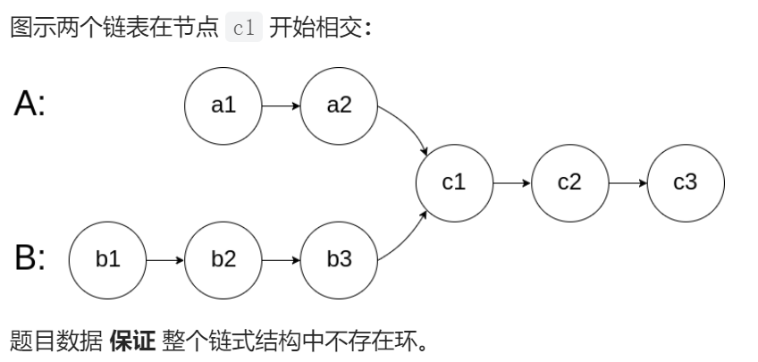

##### 题目描述：

给你两个单链表的头节点 `headA` 和 `headB` ，请你找出并返回两个单链表相交的起始节点。如果两个链表不存在相交节点，返回 `null` 。

##### 示例：




##### 解法：

可以感觉出来，现在写题越来越得心应手了，原来一言不合一上午。现在思路很快。

这道题主要思路就是如果有相交的结点，则相交结点之后一定都是想同的，则这个部分的长度相同，假设A的长度为M，B的长度为N，则|M-N|一定是在相交节点之前，所以把长的链表先遍历过|M-N|后面的节点一一对应遍历即可找到相交位置。


```java
public class Solution {
    public ListNode getIntersectionNode(ListNode headA, ListNode headB) {
        ListNode tempA = headA ;
        ListNode tempB = headB ;
        ListNode ret;
        int lengthA , lengthB ,diff;
        for ( lengthA = 0; tempA != null ; lengthA++) {
            tempA = tempA.next;
        }
        for ( lengthB = 0; tempB != null ; lengthB++) {
            tempB = tempB.next;
        }
        diff = Math.abs(lengthA - lengthB);
        tempA = headA;
        tempB = headB;
        if(lengthA > lengthB){
            
            for (int i = 0; i < diff; i++) {
                tempA= tempA.next;
            }
        }else {
            
            for (int i = 0; i < diff; i++) {
                tempB= tempB.next;
            }
        }
        while(tempA != tempB && tempA != null && tempB != null){
            tempA = tempA.next;
            tempB = tempB.next;

        }
        ret = tempA;
        return ret;
        
    }
}
```

