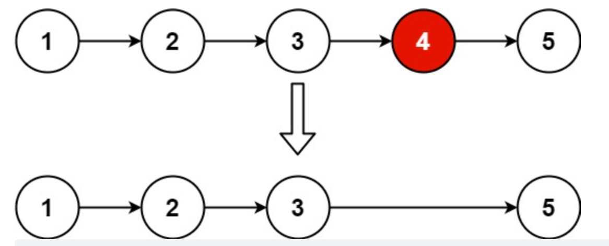

##### 题目描述

给你一个链表，删除链表的倒数第 `n` 个结点，并且返回链表的头结点。


##### 示例：

```
输入：head = [1,2,3,4,5], n = 2
输出：[1,2,3,5]
```




##### 解法：

思路简单，双指针，指针间距n；

特殊情况：要删除的刚好是头节点，所以我们创造个新头节点，指向我们真正的头节点。

```java
/**
 * Definition for singly-linked list.
 * public class ListNode {
 *     int val;
 *     ListNode next;
 *     ListNode() {}
 *     ListNode(int val) { this.val = val; }
 *     ListNode(int val, ListNode next) { this.val = val; this.next = next; }
 * }
 */
class Solution {
    public ListNode removeNthFromEnd(ListNode head, int n) {
        ListNode pre = new ListNode();
        pre.next = head;
        ListNode bac = head;
        for (int i = 0; bac.next != null ; i++) {
            bac = bac.next;
            if( i >= n-1 ) pre = pre.next;
        }
        if(pre.next == head ) head = head.next;
        else pre.next = pre.next.next;
        return head;

    }
}
```

