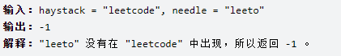

# KMP

*网上有很多对于KMP算法的分析，原理描述。这里主要进行算法代码的分析，并结合leetcode的28题解释。*

> 我自己也看了很多KMP的视频和博客，但是由于对于next数组的标准不同意，导致越看越乱，所以我们的文章中会先行解决这个next数组的标准设置问题，并给出相应的理由。并在实际的解题中解释为什么这么做。

### 题目描述：

给你两个字符串 haystack 和 needle ，请你在 haystack 字符串中找出 needle 字符串的第一个匹配项的下标（下标从 0 开始）。如果 needle 不是 haystack 的一部分，则返回  -1 。

 

来源：力扣（LeetCode）
链接：https://leetcode.cn/problems/find-the-index-of-the-first-occurrence-in-a-string


> 字符串匹配问题：暴力解比较简单，但是时间复杂度为 $O(M*N)$ 。用KMP算法可以降至 $O(M+N)$ 有效的优化，我们用KMP来解这道题。


##### 示例：



### KMP解法：

在这里我们规定：

**上述示例中的 $haystack$ 串为文本串，$needle$ 串为模式串**

KMP解决的问题就是：要在文本串中查找是否出现过一个模式串。

这里关于KMP的原理就不多赘述了。

直接分析代码。

KMP算法原理以及next数组的求解原理建议看这篇文章[（算法）通俗易懂的字符串匹配KMP算法及求next值算法](https://blog.csdn.net/qq_37969433/article/details/82947411)

##### 求解next数组

> 看过很多的求解next数组的代码，很多时候是由于大家对于next数组的标准不一，而导致的混乱和难以理解。因为有的人会把next数组统一减一，或者右移一位，导致各个next不尽相同，我们首先给出我的next数组的标准，再给出几个例子，就能很清晰的明白我们的next数组是什么样的。

我的next标准:

+ 当不匹配时，直接找当前不匹配的下标的next。不用找前一个的。即若 $needle[j] != haystack[i]$ 时，我们直接让 $j=next[j]$ 不用多余操作。
+ 从next下标为0开始记录
+ 求 $next[j]$ 的时候看 $needle[j-1]$ 及之前位置的最长相同的前后缀长
+ $next[0]$ 固定为-1, $next[1]$ 固定为0

###### 示例一：

needle = "aabaabaafa"

next[] = [-1, 0, 1, 0, 1, 2, 3, 4, 5, 0]

###### 示例二：

needle = "leetcode"

next[] = [-1, 0, 0, 0, 0, 0, 0, 0]

###### 示例三：

needle = "ississippi"

next[] = [-1, 0, 0, 0, 1, 2, 3, 4, 0, 0]

相信通过前面的解释和示例大家应该能够明白我们的next数组的标准了，给出大家一个模式串相信大家也一定可以手写得到它的next数组了。

直接上代码

```java
public static void getNext(int[] next, String s) {
    	//1 先是对边界情况的处理。
    	//  s.length()为零的情况我们在KMP主函数的代码中进行了处理
        if(s.length()==1){ next[0]=-1;return;}
    	//2 对下标为0和为1的两个特殊位置，直接赋值
        next[0] = -1;next[1]=0;
    	//3 i指向了我们当前要赋值的next数组位置的前一个，即我们要赋值的是next[i+1]的位置。因为我们在前面的标准中的第三条说过，赋值next[i+1]时，我们要看s[i]以及之前位置的最长相同前后缀长
    	//  j在初始化时，是指向i的前一个位置
        int i = 1,j = 0;
    	//4 i要为next数组每个位置赋值，但因为是赋值next[i+1]，所以next小于next.length-1就可以
        while(i < next.length-1){
            //5 在每次s[i]和s[j]相等的时候即可为我们的next数组赋值，关于这个的具体原理解释，建议直接看最后的参考文章，对于原理解释的很清楚，这里我们只简单说明结论。
            //  我们的next[i+1]可能的最大值就是next[i]+1,这个结论一定成立，所以我们的KMP算法才能有好的时间复杂度，否则光求next数组的复杂度就极高。
            //  为什么我们对比的是s[i]和s[j],但是当我们为next数组赋值时却是next[++i] = ++j;至于next下标的位置我们在(3)中已经解释过了。那为什么赋值是j+1呢？是因为在我们的next数组标准的第一条中定义的标准，因为我们在下标为s[j]对比不匹配时，我们要直接让j = next[j]我们直接看当前下标的next数组，所以这个下标的next值指向的就是相等前后缀子串的下一个元素，我们判断s[i] = s[j]成功后，j指向的就是相等最长前缀的最后一个元素，而我们需要的next值是最长相等前缀的下一个元素。所以赋值时是j+1
            if( s.charAt(i) == s.charAt(j)){
                next[++i] = ++j;
            }
            //6 当我们的j递归到0时就无法向前递归j = next[j]，所以我们可以直接给next[i+1]赋值了
            else if( j == 0 ) {
                next[++i] = j;
            }
            //7 当我们的s[i] != s[j]时，我们可以直接向前递归j = next[j]，关于为什么这么做我们不做解释，但是这是一定可以的，原理看文末参考文章
            else j = next[j];
        }
    }
```

###### next[0]为什么不为0，需要好好解释

这也是与我们的其他的next数组的标准息息相关的，因为我们设计的是当模式串的 $needle[j] != haystack[i]$ 时，我们直接让 $j = next[j]$ ，之后我们不需要移动任何一个指针的位置，即在我们的KMP的主函数中，当不匹配时我们直接 $j = next[j]$ 之后不需要任何操作，直接对比就可以。这样在 $j != 0$ 时的匹配中都很方便。但是会产生一个问题，就是如果我们的 $next[0] = 0$ 那么当我们的模式串不匹配时，如果 $j = 0$ 这时候 $j = next[j]$ 我们就会进入死循环，因为i和j都不会变动，j也是一直 $0=0$ 的赋值。所以我们需要知道不匹配且 j 已经等于0的这种情况的发生，所以我们让 $next[0] = -1$ 这样我们就可以检测导这种情况的发生，做出特殊的处理。我们的处理就是这种情况下 i 和 j 同时加一。


##### KMP整体代码

```java
class Solution28 {
    public static int strStr(String haystack, String needle) {
        if(needle.length() > haystack.length()) return -1;
        if(needle.length() == 0 ) return 0;
        //得到next数组
        int[] next = new int[needle.length()];
        getNext(next,needle);
        //i模式串（长的）指针 ， j匹配串（短的）指针
        for (int i = 0,j = 0; i < haystack.length();) {
            //1 当匹配时 i，j 都加一
            if(j < needle.length() && haystack.charAt(i) == needle.charAt(j)) {j++;i++;}
            //2 当不匹配时利用next数组回溯，但是注意如果是在我们的匹配串的第一个位置就不匹配时，即next[j] = -1 时，i和j都要加一。
            //  因为正常当next[j] == 0 时，我们不需要对i进行加一操作，直接比较模式串的当前位置即可（上一次不匹配的位置），
            //  可是当前我们的匹配串已经在第一个位置就不匹配时，若i还不加一，则会造成 死循环的出现。所以当我们在匹配串的第一个位置不匹配时，
            //  必须要让i加一，以为用j==-1，来标记这种情况的发生，所以j也要加一。
            else if(j < needle.length() && haystack.charAt(i) != needle.charAt(j)) {
                j = next[j];
                if(j == -1) {i++;j++;}
            }
            //3 当全部匹配成功时返回，即j等于needle.length
            if(j == needle.length() ) return i-needle.length();
        }


        return -1;

    }

    /**
     * 求next的最重要的一点是：next[j]的可能的最大值就是next[j-1]+1,所以在求每一个next[j]的时候，我们只需要利用已有的next数组来跳转即可，一次不匹配就继续跳转j = next[j]
     * 我的next标准:
     * 1.当不匹配时，直接找当前不匹配的下标的next。不用找前一个的
     * 2.以0为最小，next小标从0开始记录
     * 3.求next[j]的时候看next[j-1]及之前的位置相同的前后缀长
     * 4.next[0]固定为-1,next[1]固定为0
     *
     * next为什么不为0，需要好好解释
     * @param next
     * @param s
     */

    public static void getNext(int[] next, String s) {
        if(s.length()==1){ next[0]=-1;return;}
        next[0] = -1;next[1]=0;
        int i = 1,j = 0;
        while(i < next.length-1){
            if( s.charAt(i) == s.charAt(j)){
                next[++i] = ++j;
            }
            else if( j == 0 ) {
                next[++i] = j;
            } else j = next[j];
        }
    }
```


##### 参考

KMP算法原理以及next数组的求解原理建议看这篇文章[（算法）通俗易懂的字符串匹配KMP算法及求next值算法](https://blog.csdn.net/qq_37969433/article/details/82947411)
