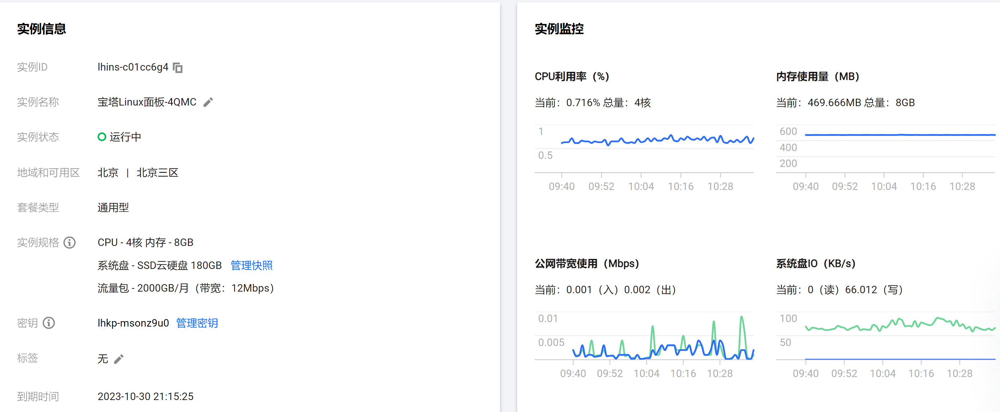
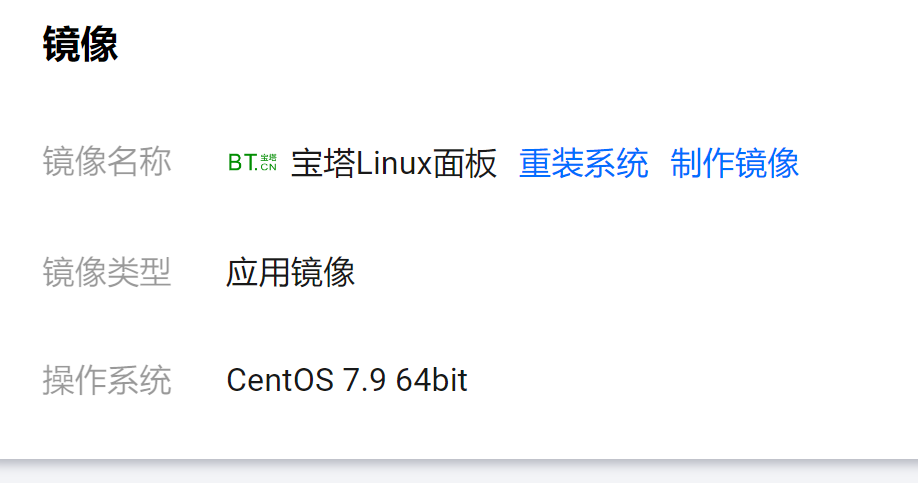
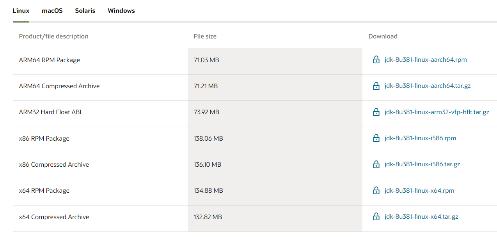
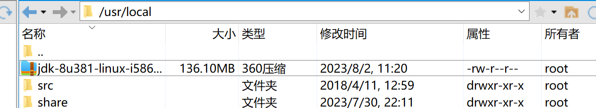
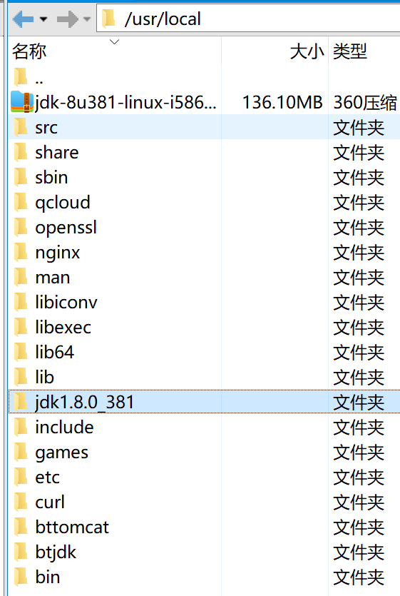
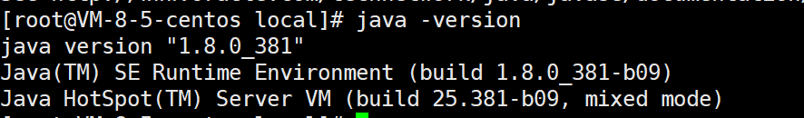

# 云服务器配置JDK

*业务需求在腾讯云买了一台云服务器，需要自己配置环境，记录一下*

### 硬件配置






### 安装过程

##### 1.oracle官网下载

[oracle](https://www.oracle.com/java/technologies/downloads/#java8)下载JDK压缩包，根据自己的服务器配置选择



##### 2.压缩包上传服务器

通过xftp将压缩包上传至服务器的/usr/local，路径下。




##### 3.解压

通过以下命令解压至当前文件夹下，/usr/local路径下初夏jdk1.8.0_381文件夹，已解压成功

```
tar -zxvf jdk-8u261-linux-x64.tar.gz
```



然后把文件夹名更改问java，纯属个人习惯，不改名也可以

##### 4.配置环境变量

修改配置文件

```
vim /etc/profile
```

在最后加入下面内容

```
#set java env
JAVA_HOME=/usr/local/java
PATH=$PATH:$JAVA_HOME/bin
export JAVA_HOME PATH
```

让修改的环境变量生效

```
source /etc/profile
```

##### 5.验证




##### 参考

[服务器运行jar包流程](https://blog.csdn.net/zhhelnice/article/details/103828731)

[Linux下安装jdk的两种方法](https://www.cnblogs.com/Dr-wei/p/13339957.html)