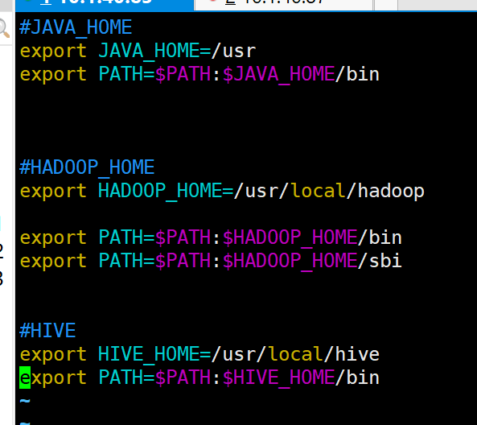

# LINUX


### Linux文件颜色的含义

+ 灰色文件：其他文件
+ 蓝色文件：目 录
+ 白色文件：一般性文件，如文本文件，配置文件，源码文件等。
+ 浅蓝色文件：链接文件，主要是使用ln命令建立的文件。
+ 绿色文件：可执行文件，可执行的程序。
+ 红色文件：压缩文件或者包文件。
+ 红色闪烁：表示链接的文件有问题了
+ 黄色文件：表示设备文件。

### 查找某个进程绑定的端口号

```
netstat -anp | grep 进程号
```


### 找到服务器上正在使用的端口

```
netstat -tuln
```

```
sudo ss -tuln
```

+ 该命令可能会出现`command not found`

```
yum install net-tools
```

> `netstat -tuln` 是一个常用的Linux命令，用于查看当前系统中的网络连接状态和监听端口情况。下面是对该命令的具体解释：
>
> - `netstat`：是网络统计（network statistics）的缩写，用于显示与网络相关的统计数据和连接信息。
> - `-t`：显示TCP协议相关的连接和监听信息。
> - `-u`：显示UDP协议相关的连接和监听信息。
> - `-l`：仅显示正在监听（listening）的端口。
> - `-n`：以数字形式显示IP地址和端口号，而不解析为主机名和服务名。
>
> 综合起来，`netstat -tuln` 命令将显示当前系统上所有正在监听的TCP和UDP端口的详细信息，包括IP地址、端口号、连接状态、进程ID等。
>
> 在输出结果中，您可以查看以下信息：
> - "Proto" 列：显示协议类型（如TCP或UDP）。
> - "Recv-Q" 和 "Send-Q" 列：显示接收和发送队列中的字节数。
> - "Local Address" 列：显示本地IP地址和监听的端口号。
> - "Foreign Address" 列：显示远程连接的IP地址和端口号。
> - "State" 列（仅适用于TCP连接）：显示连接的状态，如ESTABLISHED、LISTENING等。
> - "PID/Program name" 列：显示与每个连接相关联的进程ID和对应的程序名称。
>
> 通过运行 `netstat -tuln` 命令，您可以快速查看系统中正在监听的网络连接和对应的端口号，以及关联的进程信息。这对于识别正在运行的网络服务、检查网络连接状态以及解决网络问题非常有用。

### 输出环境变量

```
env
```

### 查找文件路径

```
which java
```

> `which` 是一个在 Linux 和类 Unix 系统中常用的命令，用于查找给定命令或可执行文件的路径。
>
> 当在终端或命令行中执行 `which` 命令时，后面跟随着要查找的命令或可执行文件的名称。`which` 命令会在系统的环境变量 `PATH` 指定的目录中搜索该命令或可执行文件，并返回找到的第一个匹配项的完整路径。

### 环境变量编辑并生效

```
[root@Master hive]# sudo vim /etc/profile.d/my_env.sh
[root@Master hive]# source /etc/profile
```



### 查看centos的剩余空间

```
df -h
```

```
[root@Master ~]# df -h
文件系统                 容量  已用  可用 已用% 挂载点
devtmpfs                 7.8G     0  7.8G    0% /dev
tmpfs                    7.8G     0  7.8G    0% /dev/shm
tmpfs                    7.8G   18M  7.8G    1% /run
tmpfs                    7.8G     0  7.8G    0% /sys/fs/cgroup
/dev/mapper/centos-root   50G   19G   32G   37% /
/dev/sda2               1014M  193M  822M   19% /boot
/dev/mapper/centos-home  6.0T  172G  5.8T    3% /home
tmpfs                    1.6G     0  1.6G    0% /run/user/0
tmpfs                    1.6G     0  1.6G    0% /run/user/1000
[root@Master ~]# 

```


### 查找文件

```
find ~/ -name "**"
```


要寻找文件名中包含 "redis" 的文件，你可以使用 `find` 命令来进行搜索。在终端中执行以下命令：

```bash
find /path/to/search/directory -type f -name "*redis*"
```

将 "/path/to/search/directory" 替换为你希望开始搜索的目录路径。这个命令将会在指定目录及其子目录中查找文件名包含 "redis" 的文件，并将它们列出。

解释一下命令中使用的选项：
- `-type f`：只搜索普通文件，排除目录和其他类型的文件。
- `-name "*redis*"`：指定要搜索的文件名，其中 "*" 是通配符，允许在文件名中包含 "redis" 的部分。

注意：上述命令可能需要root权限或者适当的权限来访问一些目录。如果你没有足够的权限，可以尝试在合适的目录下执行该命令，例如在自己的主目录下搜索：

```bash
find ~/ -type f -name "*redis*"
```


### vim查找关键字位置

 vim可以通过`/关键字`查找出现多个结果则使用 n字符切换到下一个即可，查找到结果后输入:noh退回到正常模式


### 压缩包

打包当前文件夹下所有文件，命名为：etc.tar.gz

 ```
 [root@Slave1 hadoop]# tar -zcvf etc.tar.gz *
 ```

文件下载到本地

```
[root@Slave1 hadoop]# sz etc.tar.gz 
```


### 修改权限

权限：文件权限通常分为读取（r）、写入（w）和执行（x）三个部分

> `chmod +x op_base.sh` 是一条Linux/Unix命令，用于给文件分配执行权限。让我们详细解释一下：
>
> - `chmod`：这是一个用于修改文件权限的命令，其名称是"change mode"的缩写。
>
> - `+x`：这是chmod命令的参数，表示添加执行权限。在Linux/Unix系统中，文件权限通常分为读取（r）、写入（w）和执行（x）三个部分。`+x` 表示添加执行权限，允许文件在终端中执行（如果是脚本）或在shell中运行。
>
> - `op_base.sh`：这是要添加执行权限的文件的名称。在这个示例中，文件名是op_base.sh。
>
> 所以，`chmod +x op_base.sh` 的作用是将op_base.sh文件的权限更改为可执行，以便您可以在终端中运行它。如果这个文件是一个Shell脚本，您可以通过`./op_base.sh` 来运行它，前提是您已经在终端中位于包含该文件的目录，并且具有执行该文件的权限。
>
> 这个命令通常用于使脚本文件或可执行文件在Linux系统中可运行。请注意，要运行脚本，还需要确保脚本文件的内容和语法正确。

### source

> `source` 命令是用于在当前Shell会话中执行一个脚本文件的命令。它通常用于加载和运行Shell脚本或配置文件中的命令，以便将它们应用到当前Shell环境中。
>
> `source` 命令的常见用法是在Linux和Unix系统中，它可以用不同的方式执行，具体取决于您的Shell（通常是Bash或其他Shell）。
>
> 以下是一些常见的用法和示例：
>
> 1. **在Bash中使用source命令**：
>
>    在Bash Shell中，`source` 命令通常有两种等效的形式：`. filename` 和 `source filename`，它们都可以用来执行一个脚本文件。示例：
>
>    ```bash
>    source myscript.sh
>    ```
>
>    或
>
>    ```bash
>    . myscript.sh
>    ```
>
>    这会在当前Shell环境中执行名为 `myscript.sh` 的脚本文件中的命令。
>
> 2. **使用source命令加载配置文件**：
>
>    `source` 命令通常用于加载配置文件，例如 `.bashrc` 或 `.profile`。这允许您立即应用配置更改，而不必注销并重新登录到Shell。示例：
>
>    ```bash
>    source ~/.bashrc
>    ```
>
>    这会重新加载 `~/.bashrc` 文件中的配置。
>
> 3. **传递参数给脚本**：
>
>    您还可以向脚本文件传递参数，就像在普通的Shell脚本调用中一样。示例：
>
>    ```bash
>    source myscript.sh arg1 arg2
>    ```
>
>    这将在执行 `myscript.sh` 时将参数 `arg1` 和 `arg2` 传递给脚本。
>
> 总之，`source` 命令是用于在当前Shell环境中执行脚本文件或加载配置文件的有用工具。它使得在Shell中应用更改变得更加方便，而不必启动新的Shell会话。

### ./ 的用法

> 在Linux中，`.`（点号）和`./`（点号+斜杠）表示不同的含义和用法，它们有以下区别：
>
> 1. `.`（点号）：
>    - `.` 表示当前目录。当你在终端中使用`.`时，它代表当前工作目录的路径。例如，如果你输入 `ls .`，它将列出当前目录的内容。
>    - `.` 也可用于引用当前目录中的文件或程序。例如，如果你有一个位于当前目录的脚本文件，你可以运行它：`./myscript.sh`，其中 `./` 表示当前目录。
>    - 注意：在Linux中，为了安全考虑，通常不允许直接运行当前目录中的可执行文件，除非你使用了 `./` 前缀。
>
> 2. `./`（点号+斜杠）：
>    - `./` 也表示当前目录，但它通常用于执行当前目录中的可执行文件，以明确指示你要运行的是当前目录下的程序。
>    - 例如，如果你有一个位于当前目录的可执行文件（例如shell脚本或二进制程序），你可以使用 `./` 来运行它，如 `./myprogram` 或 `./myscript.sh`。
>    - 这是因为Linux默认情况下不会在当前目录中查找可执行文件，为了运行它们，你需要提供路径（使用 `./` 指定当前目录）。
>
> 总之，`.` 表示当前目录，而 `./` 表示当前目录下的可执行文件。使用它们取决于你要执行的操作和文件所在的位置。不过，需要注意的是，在实际使用中，为了安全起见，最好将当前目录中的可执行文件放到系统的可执行文件路径中，以便可以直接运行而无需使用 `./` 前缀。

### source 命令和 ./ 命令执行脚本文件的区别

+ source 命令（ . filename）：直接在当前 shell 中运行脚本文件，脚本中的变量、函数等定义会影响当前 shell 的环境
+ ./：脚本会在一个子shell中执行，任何在子shell中定义的变量、函数等都不会影响到当前 shell

> `source` 命令通常用于执行 shell 脚本文件，例如 Bash 脚本文件。它的作用是在当前 shell 进程中运行指定的脚本文件，而不是在一个单独的子shell中运行。这意味着脚本中的变量、函数等定义会影响当前 shell 的环境。
>
> `source` 命令的语法如下：
>
> ```
> source filename
> ```
>
> 或者使用更常见的点号（`.`）来代替 `source`：
>
> ```
> . filename
> ```
>
> 其中 `filename` 是要执行的脚本文件的名称，可以包括完整路径或相对路径。
>
> 使用 `source` 或 `.` 来执行脚本文件通常用于以下情况：
>
> 1. **设置环境变量**：脚本文件可以设置环境变量，例如 `export MY_VARIABLE=123`，以便在当前 shell 会话中使用。
>
> 2. **定义函数**：你可以在脚本文件中定义函数，并在当前 shell 中使用这些函数。
>
> 3. **加载配置文件**：一些应用程序或工具可能要求你加载配置文件以配置其行为。
>
> 4. **执行一系列命令**：你可以将一系列命令放在脚本中，并使用 `source` 命令来按顺序执行它们。
>
> 请注意，如果你只是使用 `./script.sh` 来运行脚本文件，那么脚本会在一个子shell中执行，任何在子shell中定义的变量、函数等都不会影响到当前 shell。而使用 `source` 命令则能够在当前 shell 中执行脚本，使得其中的变量和函数对当前 shell 生效。这在配置环境变量、加载配置文件等场景中非常有用。

### 关于文件后缀

+ Linux 中的文件后缀没有强制性要求，只是约定俗成

> 脚本文件的后缀在Linux和Unix系统中通常没有强制性规定，这意味着你可以为脚本文件选择几乎任何后缀。但是，约定俗成的做法是为不同类型的脚本文件使用特定的后缀，以便更容易地识别其用途。以下是一些常见的脚本文件后缀和它们的用途：
>
> 1. **.sh**: 这是Bash脚本文件的常见后缀。通常用于包含Bash脚本命令的文件。
>
> 2. **.bash**: 同样也用于Bash脚本文件，但不太常见。
>
> 3. **.py**: 这是Python脚本文件的后缀，用于包含Python编写的脚本。
>
> 4. **.pl**: 这是Perl脚本文件的后缀，用于包含Perl编写的脚本。
>
> 5. **.rb**: 这是Ruby脚本文件的后缀，用于包含Ruby编写的脚本。
>
> 6. **.js**: 这是JavaScript脚本文件的后缀，用于包含JavaScript代码。
>
> 7. **.php**: 这是PHP脚本文件的后缀，用于包含PHP代码。
>
> 8. **.c**, **.cpp**, **.h**: 这些是C和C++源代码文件的常见后缀，通常需要编译成可执行文件。
>
> 9. **.java**: 这是Java源代码文件的后缀，通常需要编译成字节码并运行在Java虚拟机上。
>
> 10. **.html**, **.css**, **.xml**: 这些后缀通常用于Web开发中的网页和样式表文件，不是脚本文件。
>
> 尽管上述是一些常见的后缀约定，但实际上，你可以根据自己的需求和偏好为脚本文件选择任何后缀。重要的是要确保文件包含正确的脚本语言，并且具有执行权限（如果需要执行的话）。无论你选择的后缀是什么，都应该在文件的开头使用合适的shebang来指定脚本语言，例如 `#!/bin/bash` 或 `#!/usr/bin/python3`，以确保系统知道如何执行它。


### 查看内存

```
free -h
```


**total** 内存总量。**used** 已使用的内存。，计算公式是`used = total - free - buffers - cache`。

**free**可用/未使用的内存。**shared** 可以忽略此列，**buff/cache** 内核缓冲区以及页面缓存和slab使用的组合内存。 如果应用程序需要，可以随时回收此内存。


**available**  在不使用[交换空间](https://www.myfreax.com/tag/swap/)的情况**，**启动应用程序可用内存的估计数。free命令显示物理内存和[交换空间](https://www.myfreax.com/tag/swap/)的信息。


[Linux 内存使用率](https://www.myfreax.com/check-memory-linux/)

### 查看磁盘

```
df -h
```

### 查看cpu

```
lscpu
```


### scp


### 复制文件

```bash
cp [选项] 源文件 目标文件或目录
```


+ 复制文件到当前目录并重命名

```
cp oldfile.txt newfile.txt
```


### 移动文件

```bash
mv [选项] 源文件 目标文件或目录
```

+ 文件改名

```
mv oldfile.txt newfile.txt
```


### 工具文件bin目录下为什么有 .cmd 和 .sh 两种脚本

+ .cmd：是在 windows 下运行的脚本
+ .sh：是在 Linux 下运行的脚本


