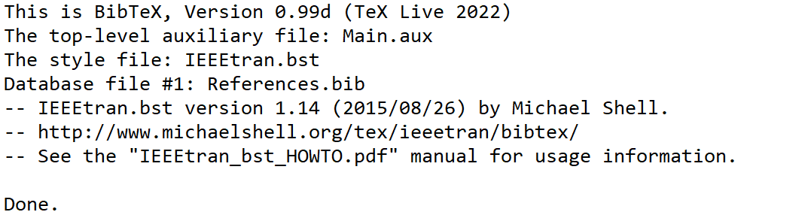

### Winedt中bib文件编译报错

*我下载了原版的实验报告的模板，只需要先XeLaTex然后BibTex再XeLaTex然后再XeLaTex*

> 首先我们需要先XeLaTex才能用BibTex编译参考文献，并且可以预编译我们的目录

> BibTex编译我们的参考文献文件

> 然后的XeLaTex把我们的参考文献和目录都包含进来，但是正文中的参考文献编号都是问好我们需要再次使用XeLaTex

1. 

+ 报错


```latex
I found no \citation commands—while reading file Main.aux
```

+ 解决之路

我在原模板文件中去掉了原文中的关于文献的引用（==原文中有两篇参考文献引用，我只去掉了一篇==），就是下面的红框部分，再次编译，发现在最后的参考文献部分，我们正文中删掉的引用文献在最后面才考文献部分也消失了。但是在我们用BibTex编译时并没有报错。




现在我把==两篇==参考文献在正文中的引用全部去掉，再次编译，发现也有了同样的报错。所以可以找到问题就是我们的.bib文件中的参考文献在正文中必须要有引用，可以只引用其中的几篇，但是绝对不可以一篇都不引用


### 参考：

[endnote使用手册](file://D:\tools\tools_for_paper\EndNote\EndNote X9.1\endnote x9 使用手册.pdf)

[在latex中导入endnote中的参考文献——简明步骤](https://blog.csdn.net/jianwushuang/article/details/53525521)

[Latex中 BiBTeX found no citation commands 解决办法](https://blog.csdn.net/xin_yu_xin/article/details/50244913)

[.bib添加注释](https://www.cnblogs.com/USTBlxq/p/6509948.html)

[Winedt自定义宏并添加工具栏按钮](https://ask.latexstudio.net/ask/article/103.html)

[LaTeX参考文献引用显示?问号解决办法！！！！](https://blog.csdn.net/qq_39662852/article/details/88878870)

[Latex 编译时出现问号[?]的几种情况及解决办法](https://blog.csdn.net/Ryan_lee9410/article/details/104946657)