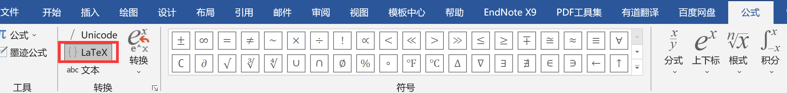
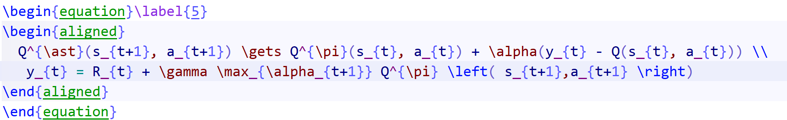
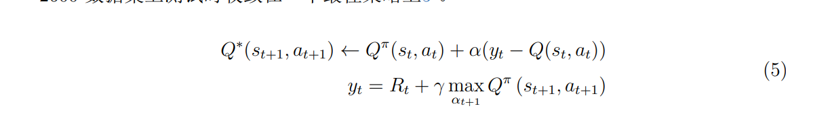
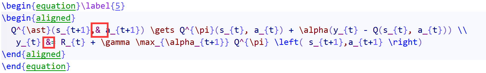

# 如何编辑latex公式

众所周知其实latex的公式语法很难，要记得很多，那么我们如何简单的可视化的编辑latex公式呢

1. [latex公式在线编辑器](https://www.latexlive.com/)

***这个网站太好用了，还可以识别图片转LaTex公式，且准确率很高***

> 在看别人论文想用别人的latex公式时，用这个网站的图片识别，基本无敌

2. word编辑公式可以直接转换为latex

### 别人论文中的公式如何导出latex公式

*我们的课程作业要用latex写一篇论文的读书笔记，但是论文中有很多公式，难道要一个一个手敲吗？当然不了*

> ~~我们可以先用[PDF处理工具](https://www.ilovepdf.com/)把PDF转word，这个网站特别的好用，转出来的word公式准确性比较高，虽然不是word中的公式模板，但是我们可以选中公式然后点击插入-》公式，就可以自动转化为公式了。~~



> ~~选择latex选项，然后复制我们的公式即可~~

上面这个方法不要用了，虽然哪个PDF处理网站很好用，并且处理出来的word看起来和pdf很像，但是公式转化的方式并不知道实怎么样的，公式只是看着一样，但并不是word的公式编辑出来的样子。**word编辑公式转latex依然好用**


### 公式具体使用

+ 最大最小值符号也是特殊字符，用`\max`和`\min`来表示，虽然在源码中不用`\`显示效果也一样，但是当max需要上下标时效果就不同了
  + 还有就是行内式和行间式效果会不同，可以强制显示在公式的正上方和正下方，如下用`\limits_{}^{}`来显示，还可以用`\mathop{}`来强制转换为数学公式
  $\max \limits_{\left\{V \in v_{t}\right \} } \tau_{t}$


$$
\max_{\left\{V \in v_{t}\right \} } \tau_{t}
$$

+ 下面这两个公式环境唯一的差别就是有没有公式的编号
```latex
  begin{equation}
```

```latex
  begin{equation*}
```

+ 

### 公式中的换行

在`\equation`环境中是不能用`\\`换行的，我们要在`\equation`环境中再加入一个`\aligned`即可换行，还可以用`&`来指定对其位置

源码（未使用`&`对齐）：



效果图：



源码：红色方框为对其标志位置：



效果图：


##### 参考

[为什么//不能换行在equation环境中](https://tex.stackexchange.com/questions/194236/why-does-not-return-a-new-line-in-an-equation)

[LaTeX 第五课：数学公式排版](https://zhuanlan.zhihu.com/p/24502400)

