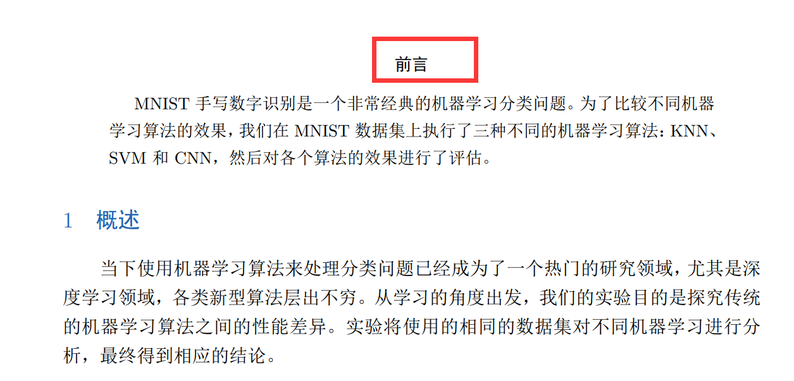

## LaTex重新设置摘要或者参考文献的标题名

*前言：这是因为我要交一份研一上的学习报告，在最开始要写一份前言说明这学期的情况，我就使用我已经做好的实验报告模板直接来修改了，但是我的模板都是article的文件类型不能直接使用\frontmatter，而且使用\frontmatter的效果也不好，它并不会显式的显示出**前言**这两个字，于是乎我想到了把，摘要这两个字直接改为前言就很完美了。*

下面文字来自[CTEX宏集手册](http://mirrors.ibiblio.org/CTAN/language/chinese/ctex/ctex.pdf)。

> CTEX 宏集已经尽可能就中文的行文和版式习惯做了调整和配置，通常而言，这些配置已 经够用。因此，除非必要，我们不建议普通用户修改这些默认配置。 
>
> 不过，CTEX 宏集也提供了一系列选项。用户可以使用这些选项来控制 CTEX 宏集的行为。 按形式分类，这些选项有的以传统的方式提供，有的以 ⟨key⟩=⟨value⟩ 的形式提供。按指定位置 分类，这些选项又可以分为以下三类：
>
>  • 名字后带有 ✩ 号的选项，只能作为宏包/文档类选项，需要在引入宏包/文档类的时候指 定；
>
>  • 名字后带有 ⋆ 号的选项，只能通过 CTEX 宏集提供的用户接口 \ctexset 来设定；
>
>  • 名字后不带有特殊符号的选项，既可以作为宏包/文档类选项，也可以通过 \ctexset 来 设定。
>
>  \ctexset {⟨键值列表⟩} 是 CTEX 宏集的通用控制命令，用来在宏包载入后控制宏包的各项功能。\ctexset 的参数是 一个键值列表，以通用的接口完成各项设置。 \ctexset 的参数是一组由逗号分隔的选项列表，列表中的选项通常是一个 ⟨key⟩=⟨value⟩ 格式的定义。例如设置摘要与参考文献标题名称就可以使用：

```latex
\ctexset{
abstractname = {本文概要},
bibname = {文\quad 献}
}
```

所以我们直接在引导区加入下面代码就可以了，当然前提是你已经引入了ctex包

```latex
% set that abstract name Customization 
\ctexset{
abstractname = {前言}
}
```

效果如图：



### 参考

[CTEX宏集手册](http://mirrors.ibiblio.org/CTAN/language/chinese/ctex/ctex.pdf)