# 贝贝操作指南

*我只给贝贝先简单介绍我发给贝贝的LaTex模板怎么用，想学更多操作等我写完博客吧*

## overleaf

#### 简介

overleaf是一款简单的，在线的latex编辑器，包含了大量的模板和指南。推荐可以直接使用overleaf，不用下载任何东西还可以云端同步，否则下载编辑器的话很麻烦不只要下载编辑器，还要下载编译器（其实类似于下载java环境一样，要先下载jdk再下载IDEA，LATEX的编辑器也很麻烦，而且还有好几款编辑器可以选择，不像是java大家全都是用的IDEA，LaTex有好几个编辑器可以选择，而且没有很同意的观点认为哪个最好）。

#### 注册

1. google搜索overleaf

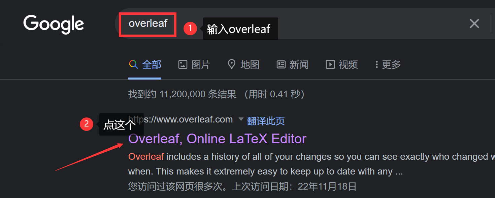

2. 飞飞推荐先注册个google邮箱哦，然后再chrome浏览器登录自己的账号，很多网站都能用google账号一键登录，先登录google账号在chrome上，然后再登录（==哎呀呀，我好像每一步都给宝贝做出来啊，用不用飞飞写个教程怎么注册谷歌邮箱，哈哈哈哈哈哈哈哈哈哈哈哈==）

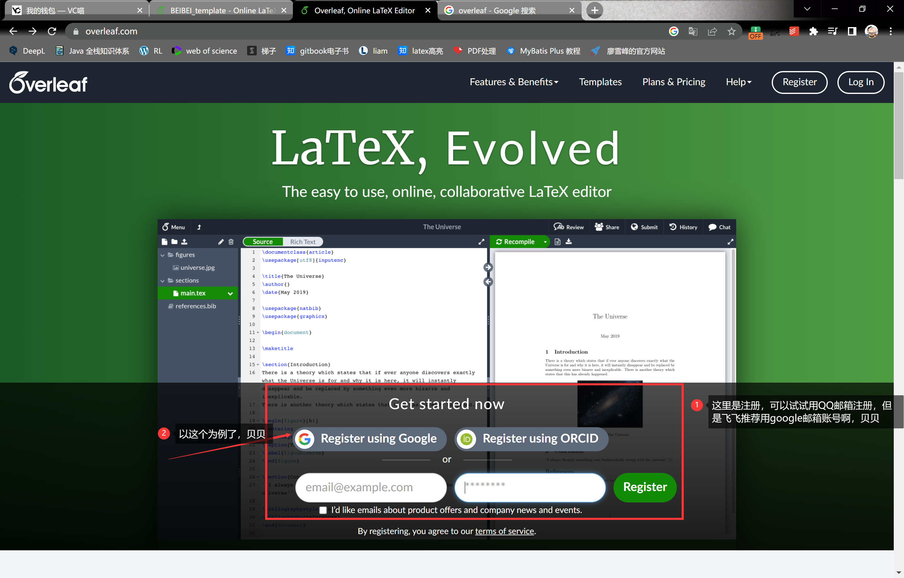

3. 我这里以前登陆过了一点就进来了，贝贝试试是什么样的（不懂可以告诉我）

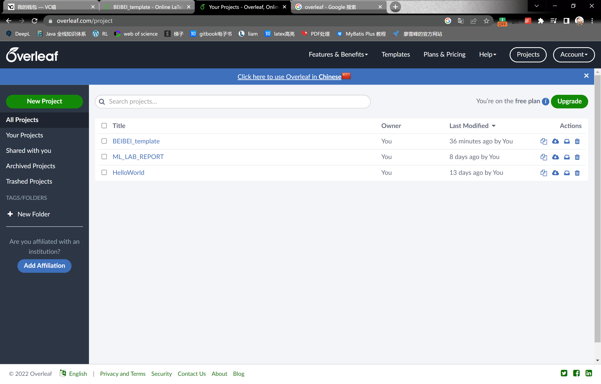

#### 贝贝收到的模板文件

+ 我会给贝贝发送两个文件一个是最后的pdf，一个是latex的各种源文件

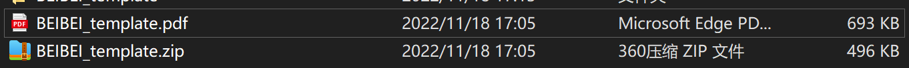

+ 解压后的文件

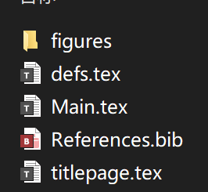

+ 文件用途解析

  + .tex这个就是正经的latex源文件了，他需要用编译器（overleaf中集成了各种版本的）才能编译成pdf文件
  + .bib文件是参考文献的文件，打开如下图所示，其实就是一种固定的格式，然后可以通过一个标识符来在正文中引用（第一个参考文献的标识符就是：FPE，第二个：Gole97），这个格式的文件是可以在web of science的官网上直接生成的（知网也可以哦，基本主流论文检索网站都可以生成的），不用担心要自己输入这些东西哦

  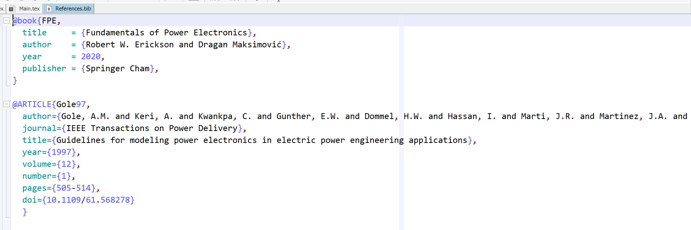

  + 为什么又三个.tex呢？因为可以直接主文件中导入其他两个文件，这个titlepage就是我们的模板的第一页的配置defs是一些包的导入，比如我们的目录的超链接就是在这里导入的

#### 如何用overleaf打开我们的文件

1. 新建一个项目，选择上传项目

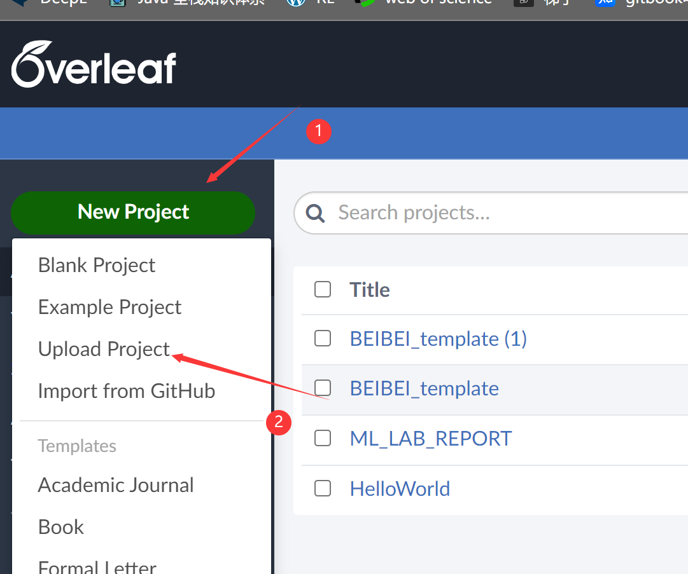

2. 然后上传我们的压缩包

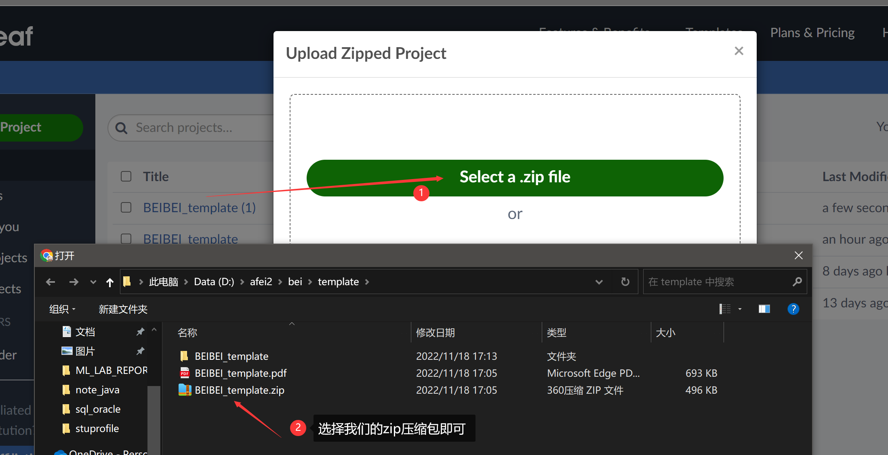

3.打开后可能会像这样右边红红的（不要慌哦），这是因为我们使用了中文的模板，而overleaf默认的编辑器pdflatex是不支持中文的，所以需要切换一下，点在左上角的menu

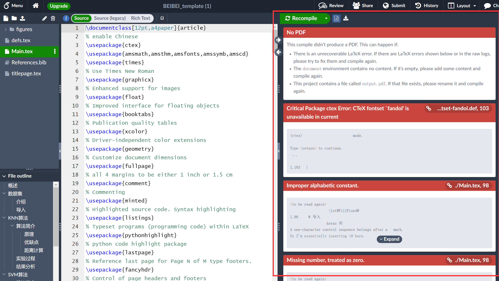

可以看到我们的默认的编译器（compiler）为pdfLaTex，我们只需要切换为XeLaTex

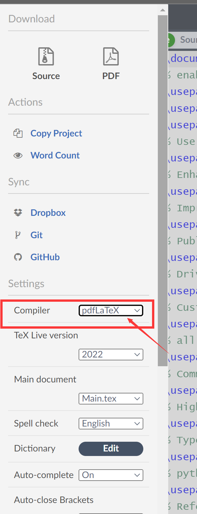

4.点击recompile就可以看到我们的pdf预览效果了

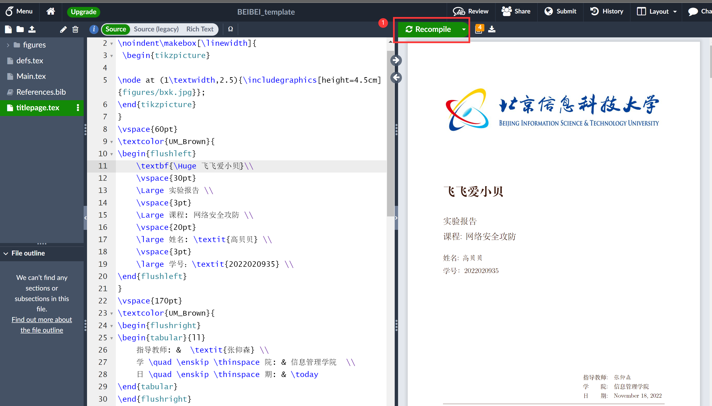

*提示*：recompile点右边哪个向下的小箭头，下面又auto compile自动编译，千万别开，我们的网速顶不住

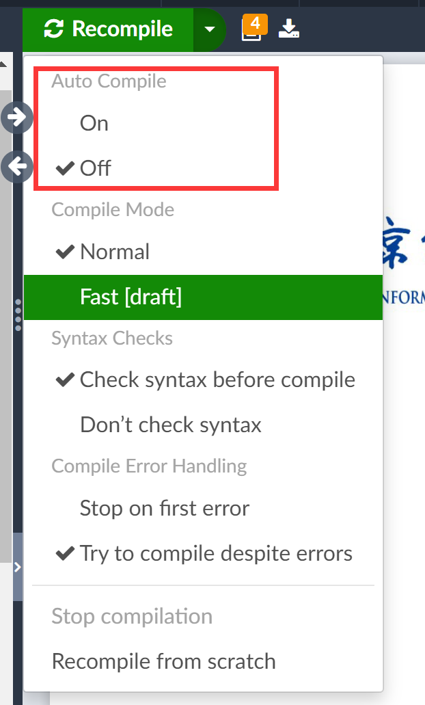

## 我们的模板如何使用

#### main.tex

1. 可以看到我们的文件开头好多usepackage其实就是导包

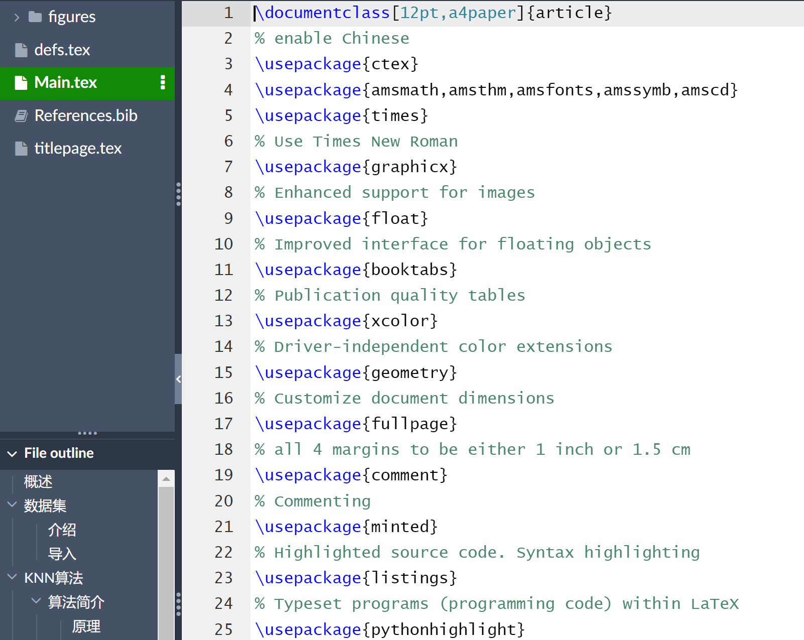

2. 这两个input就是把我们的其他两个.tex导入进来

>  /newpage 顾名思义就是新的一页，因为他前面导入的是一整个首页，会在后面介绍这个titlepage的，教你如何修改他

> pagenumbering 表示的是页面的编码方式

> tableofcontents 就是自动生成目录的，有超链接哦（早defs中定义的，但我也看不太懂，直接用就完事了）

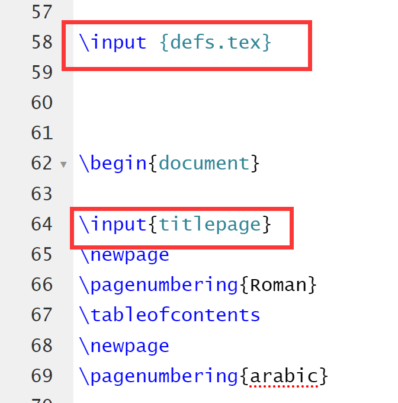

3. 摘要：

   >  这里面就是摘要部分，替换成自己的就行

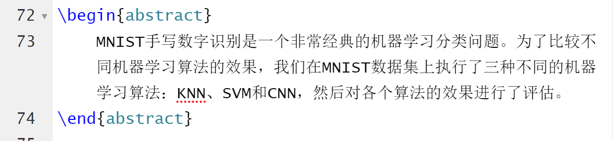

4. 章节：

   > 每个section就是每个章节，大括号里是章节名字，要是子章节就可以用subsection，子子章节就是subsubsection

   > \par就是标记一段的结束，一般不需要显示的使用会自己换段，但是偶尔需要比如后面是个图片，多试试。

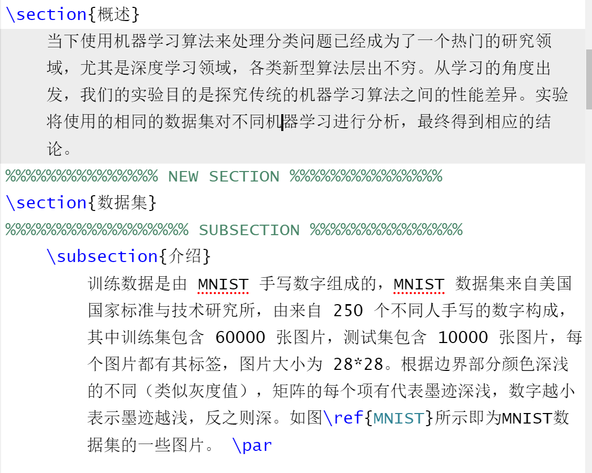

5. 图片

> 1: 是导入图片的语句，大括号里是相对路径，方括号里是定义的宽度，这个意思就是文字宽度的百分之八十

> 2: 是定义了我么的图片名字就是对应的效果图里的图片名

> 3: 定义了我们的图片的标签，用于方便我们在正文中引用，正文中`\label{标签名}`就可以使用，这个图片下边会自动为每个图片编辑编号（1、2、3等）的，在正文中引用后，正文的引用标签自动替换为编号

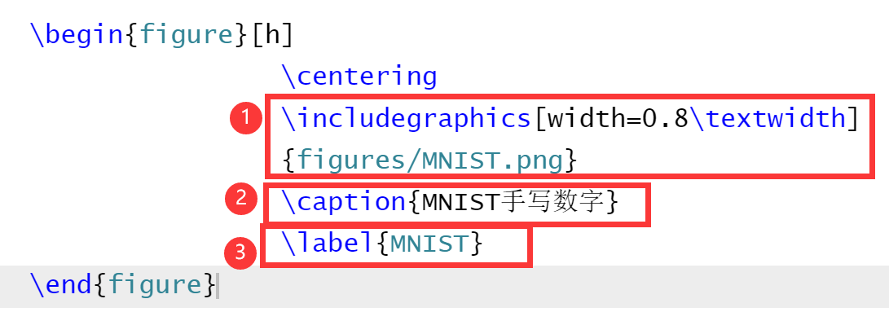

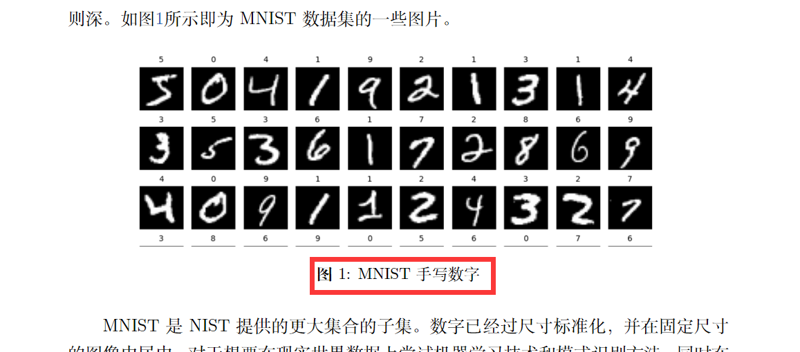

6. 代码

> 我在模板中集成了python代码的高亮，只用这个`\begin{python}`和`\end{python}`的标签就可以直接插入python的代码了

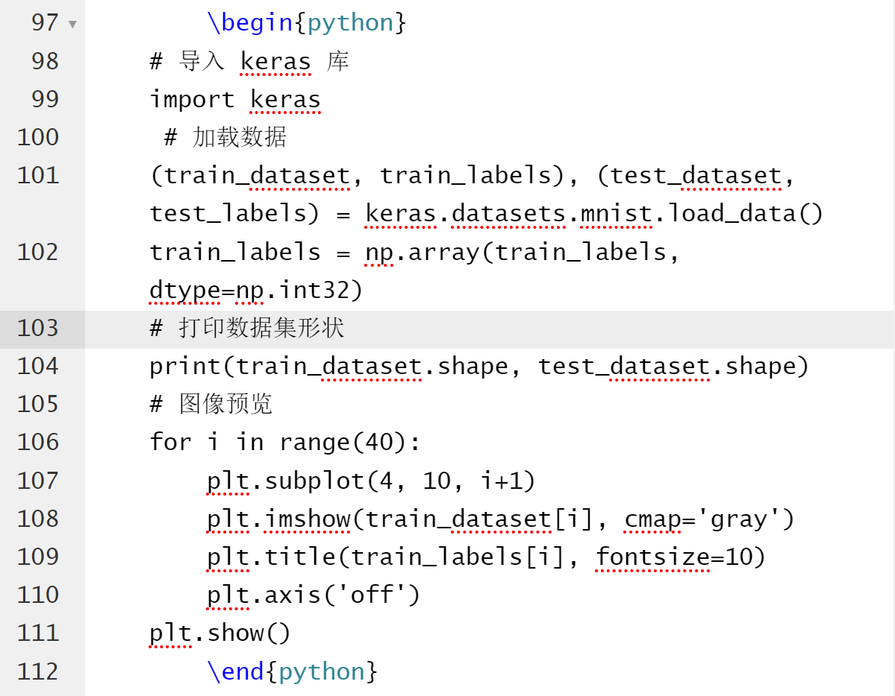

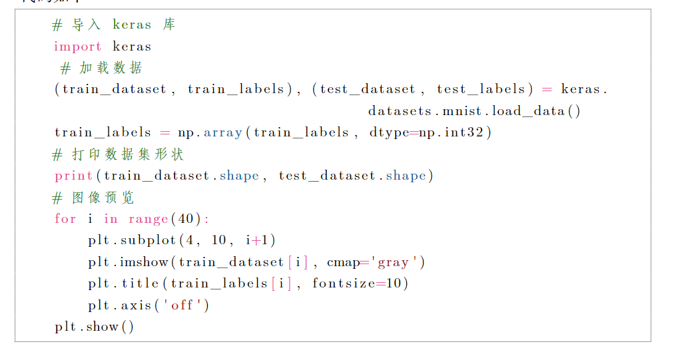

7. 数学公式

> 数学公式请自己google了，贝贝因为我也不会，这个很复杂，语法很难但是有很多可视化的编辑公式的软件可以导出latex代码，我也没试过，而且其实overleaf中有可视化的公式编辑器，但是付费哈哈哈哈哈

8. 参考文献（由于我的实验报告中没有用到参考文献，这个我是截图的原本的模板，我也会发给你，这个原本的模板也介绍的怎么使用，也可以看看哦（但是没必要））

> 在**正文**中引用参考文献如1，`cite{标签名}`即可，标签名就是我们的.bib文件里的标签名，我在前面说了哪个是标签名，关于如何生成.bib我也可以教你哦，但是我想==看看福利==哈哈哈哈哈哈哈哈哈哈哈哈

> 2: 这个就是论文中最后的参考文献的那一页，先另起一页，然后就是指定参考文献的风格`\bibliographystyle{IEEEtran}`这个就是IEEE的风格，最后呢就是导入我们的参考文献的文件名了`\bibliography{References}`

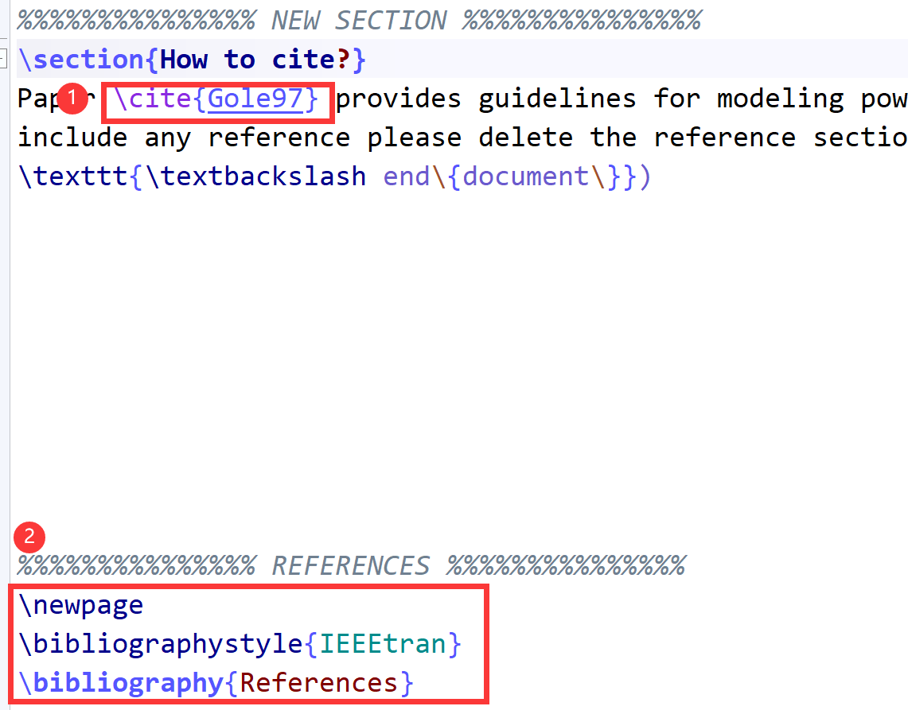

#### titlepage

1. log

   现在基本也能看懂这个代码的基本格式了吧，贝贝。

> 这个begin和end就是标示这里面的东西都符合我们的这个标签的格式

> 这个`\includegraphics[height=4.5cm]{figures/bxk.jpg}};`就是导入我们的log图片，并且指定了高度

> `\begin{tikzpicture}`这个我也不记得了，反正也是限制了格式，不用改这个，所以就没管，我突然发现，应用和你从下而上学真的不一样，应用他能用就行不用管很多东西，只要能用，但是一旦出现问题就很难受，从头到尾的查。

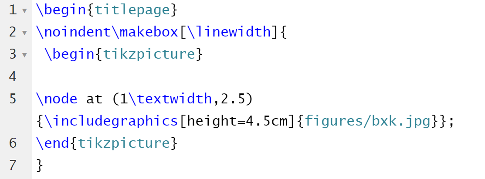

2. 课程等信息

> 先是定义了一个颜色，没看出来吧，这其实是个偏棕色的

> `\begin{flushleft}`这个就是把这段内容显示在页面的左边

> `\vspace{30pt}`这个差不多是字体的大小，我记得是竖直方向上的大小，其实效果就是字体大小。nonono我突然发现这个是和上边的文字的竖直间隔距离。

> 

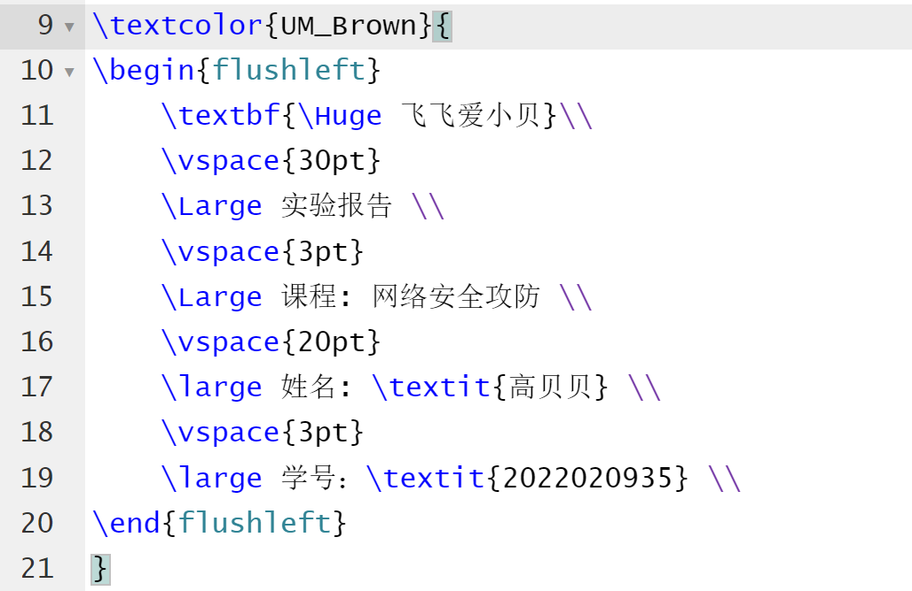

3. 日期等信息

> `\begin{flushright}`定义这个标签里的在右边

> `\begin{tabular}`这个是定义了个表格，但是没有显示表格的线，这个具体的语法我也忘了，自己查查吧，小贝贝

> `\today`这个是获得今天的日期

> `\quad \enskip \thinspace`这个是各种空格，像方设法的对齐，哈哈哈哈哈哈哈哈哈哈哈哈

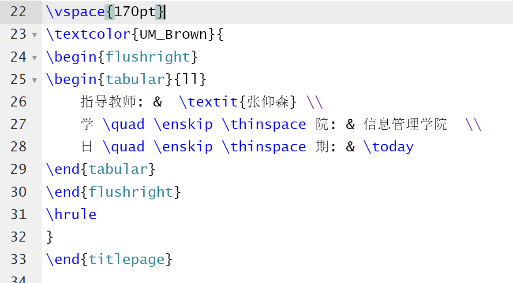