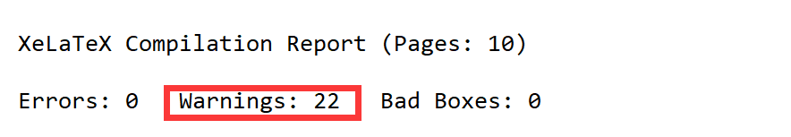

# overleaf项目下载到本地如何跑通

##### 使用的编译器问题

我的报错

```(./Main.tex
! Undefined control sequence.
l.1 \documentclass
                  [12pt,a4paper]{article}
? ^C

! Emergency stop.
l.1 
    
No pages of output.
Transcript written on Main.log.```
```

使用XeLaTex编译器（我用成XeTex了），不要用错了

##### package问题

可以编译出来了，但是目录无法生成，图片的超链接也没有生成，应该是使用的超链接的package没有导入。

可以看到22个警告，没有错误



可以看到我们的生成的pdf目录页为空，所以猜测时package的问题


首先我使用的是winedt编译器，可以在我们的控制台看到编译的输出内容，我们的警告都是在输出内容的最下边。接下来一个一个解决问题

1. 
   
+ 问题:

```
Package rerunfilecheck Warning: File `Main.out' has changed.
(rerunfilecheck)                Rerun to get outlines right
(rerunfilecheck)                or use package `bookmark'.
```

+ 原因与解决

我们使用了`\usepackage{hyperref}`包，它为其书签创建.out文件。它需要编译两遍。因此重新运行XeLaTeX就可以。其实就是需要运行两次XeLaTex，就可以解决问题。

+ 其他解决

> 添加 \usepackage{bookmark}。然后使用一个更现代的书签管理实现，没有.out文件。书签会提前更新，因此在大多数情况下只需要运行一次LaTeX。

这是链接里的解决方法但是我并没有完全明白，我尝试了使用这个package，他确实消除了这个警告，而且生成文件中没有了.out文件，但是他依然需要编译两次才可以生成目录，不知道是不是需要更改源码中对于书签的使用，我们源文件中使用的是hyperref包，不知道这两个包的区别，但是bookmark包好像是对于它的升级，解决了hyperref原有的很多问题不知道使用方法中有没有区别，是否可以实现编译一次就生成目录。

todo:研究一下这两个包的区别

但是现在只要编译两次就可以生成正常的pdf进行使用了！

+ [bookmark中文手册](https://www.latexstudio.net/index/details/index/mid/2912.html)

+ [bookmark英文官网介绍](https://ctan.org/pkg/bookmark)


+ [关于问题一的参考](https://tex.stackexchange.com/questions/167948/package-rerunfilecheck-warning-file-out-has-changed)