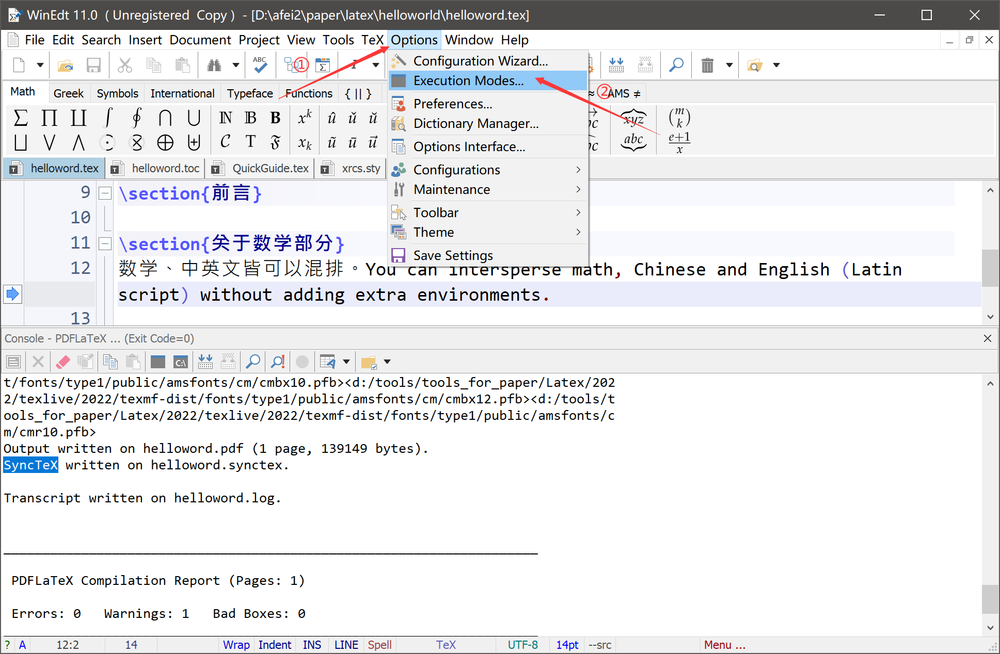
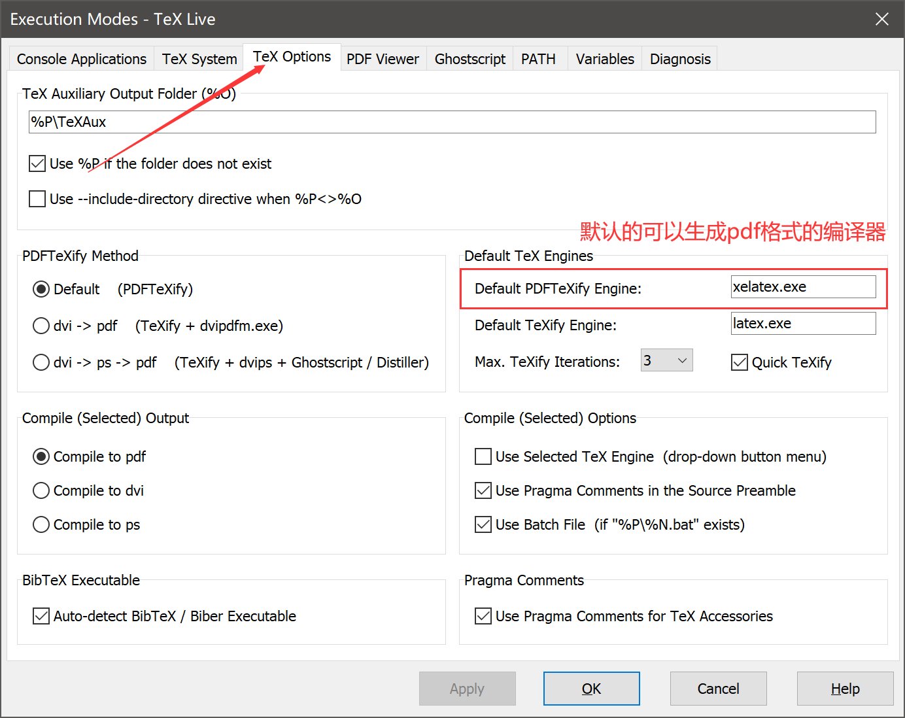
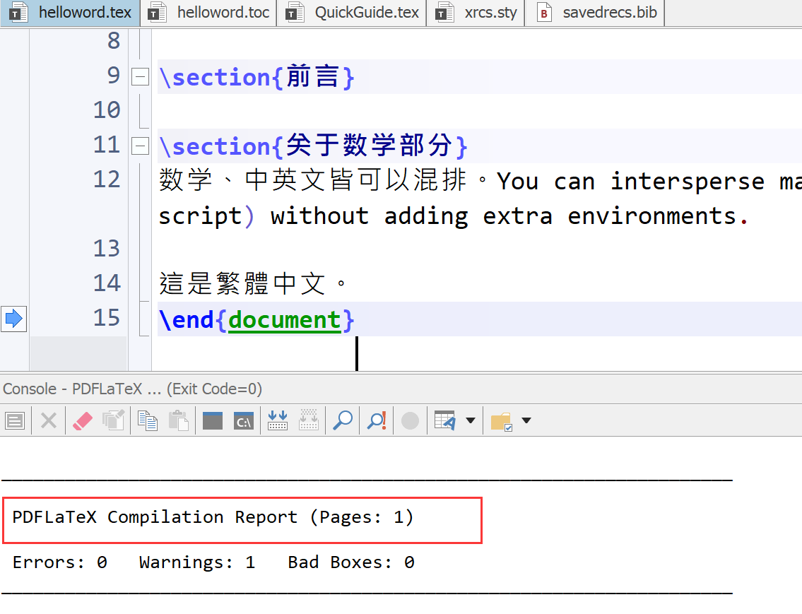
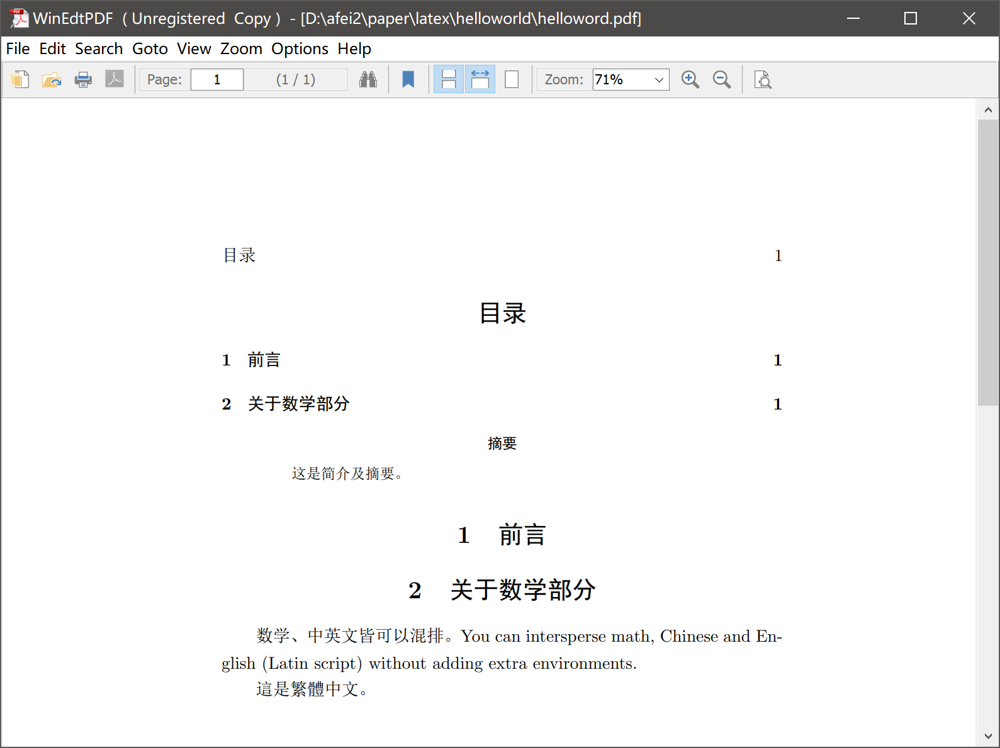
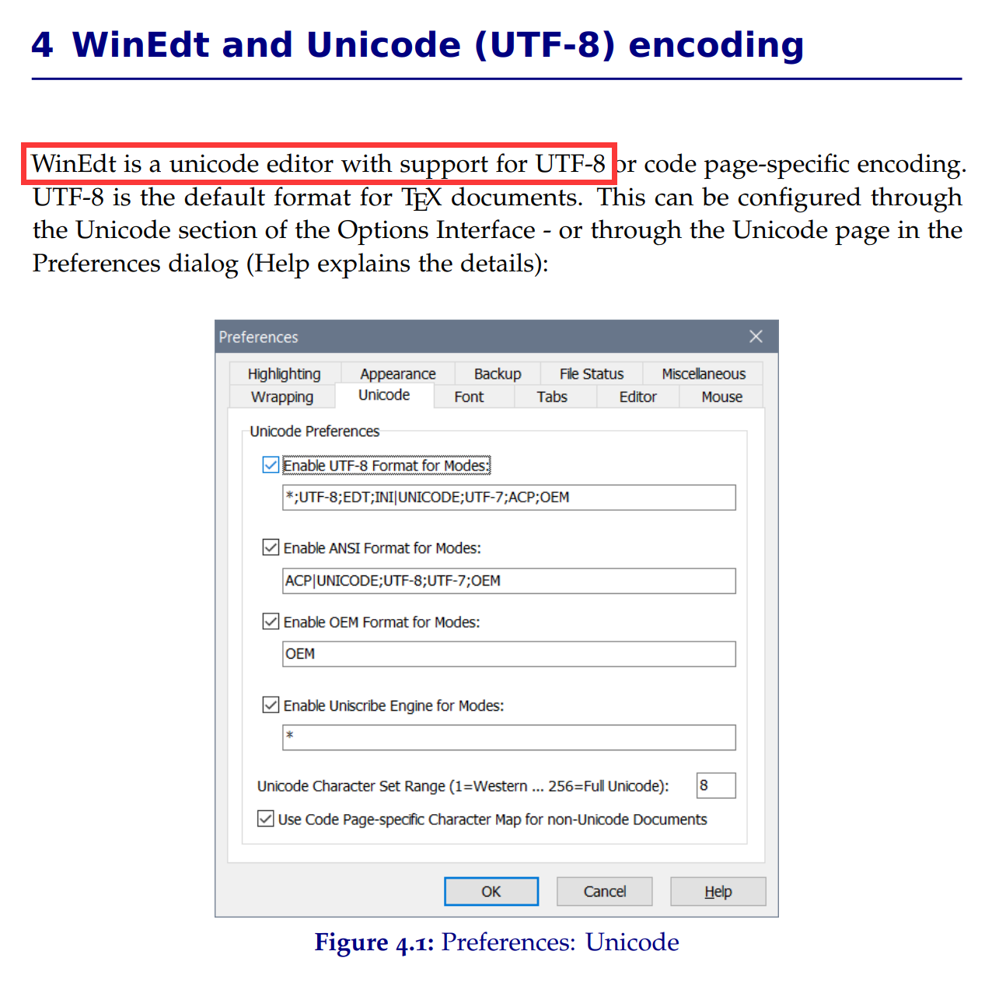
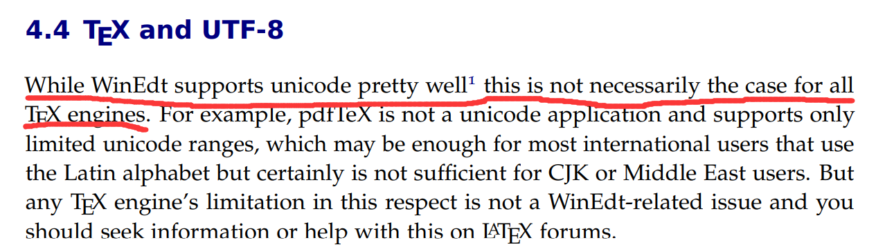
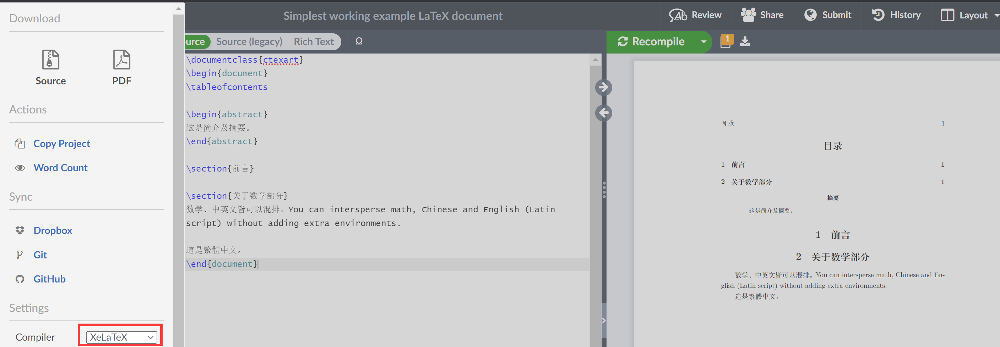
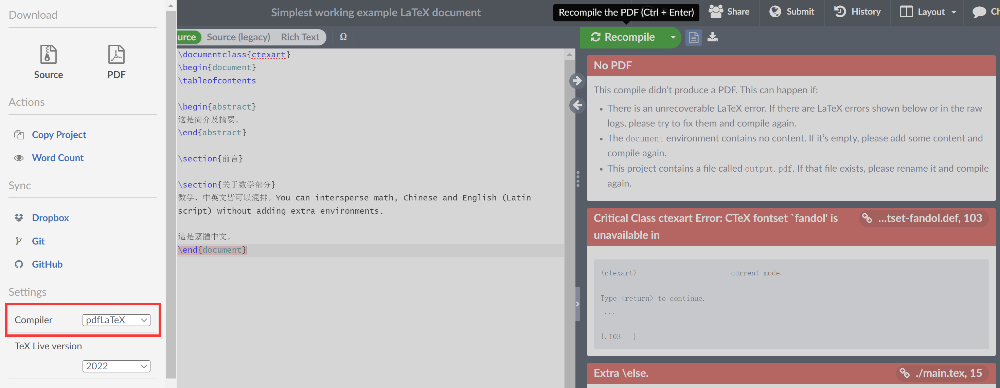

[TOC]
## 关于Winedt为什么可以用pdfLaTex编译中文

*前言*：如果你只是想用Winedt实现LaTex中英混排那么可以直接选择编译器为XeLaTex，并且在导言区的第一行使用```documentclass{cteart}```即可，此外如果你需要使用`memoir`或者由你的大学提供的论文的`.cls`文件，但仍想使用ctex包，你可以加载ctex包，如下

```latex
\documentclass{UniThesis}
\usepackage{ctex}
```

起因：在开始学习LaTex时阅读了Liam Huang老师的[一份其实很短的 LaTeX 入门文档](https://liam.page/2014/09/08/latex-introduction/)里面提到了如何实现中英文混排，只需要我们使用CTEX宏包和使用XeLaTex编译即可，但是我在使用Winedt编译时由于没有更改默认的配置自动使用的是pdfLaTex编译，发现pdfLaTex也能编译中文文档所以查找了很多资料，解决了我的疑惑。

##### 查看Winedt的默认编译器：

①Options->Execution Modes



②红框中的就是默认的生成pdf格式的编译器（在你使用编译按钮时自动调用，当然你也可以从导航栏中的TeX自主的选择每次使用的编译器），Winedt默认的是pdflatex，我的已经改成了xelatex



### 1.XeLaTex和pdfLaTex的关系

+ **相同点**：首先XeLaTex和pdfLaTex都是使用LaTex格式，并且最后都是生成的pdf格式的文档。如果对于TEX家族的各个成员（如Tex、Latex、pdfLaTex、pdfLaTex等等）还不是很了解可以看这篇文章：[TEX家族成员简介](https://www.cnblogs.com/wushaogui/p/10353558.html)。
+ **不同点**：它俩最主要的区别就是XeLaTex支持Unicode字符，可以对中文字符进行排版，而pdfLaTex只支持ASCII字符编码，不能使用中文字符。

### 2.Winedt中使用pdfLaTex编译中文的tex

在overleaf上down下来的源码

```latex
\documentclass{ctexart}
\begin{document}
\tableofcontents

\begin{abstract}
这是简介及摘要。
\end{abstract}

\section{前言}

\section{关于数学部分}
数学、中英文皆可以混排。You can intersperse math, Chinese and English (Latin script) without adding extra environments.

這是繁體中文。
\end{document}
```

编译输出：可以看到红框中的内容我们使用了PDFLaTex编译成功



生成的pdf文档：可以看到pdf也没有任何问题



为什么会有这样的现象呢？

### 3.原因

在各种网站上搜索无果后，我找到了Winedt官网下载了[官网](https://www.winedt.com/download.html)的QuickGuide文件，在里面找到了答案。

在其第四章中介绍了Winedt本身就是一个unicode编辑器，所以很多情况下它不使用XeLaTex也能对中文进行编译。



**但是**，其在后边的章节中介绍了，（下面这段话的大意）虽然WinEdt对unicode的支持相当好，但这不一定是所有TEX编译器的情况。例如，pdfTeX不是一个unicode应用程序，它只支持有限的unicode范围，这对大多数使用拉丁字母的国际用户来说可能是足够的，但对中日韩或中东用户来说肯定是不够的。因此用pdfLaTex来编译中文排版也有可能出现问题的，建议直接用XeLaTex不会有任何问题- -！



### 4.验证

为了确认能用pdfLaTex编译中文的文档是Winedt的特性，我特意在[overleaf](https://www.overleaf.com/project)(在线LaTex编辑器)上编译了一下第二节中的代码。

这是使用XeLaTex编译的情况：



使用pdfLaTex编译的情况，可以看到出现了各种报错，这就解释了Winedt的特性，一款unicode编译器

