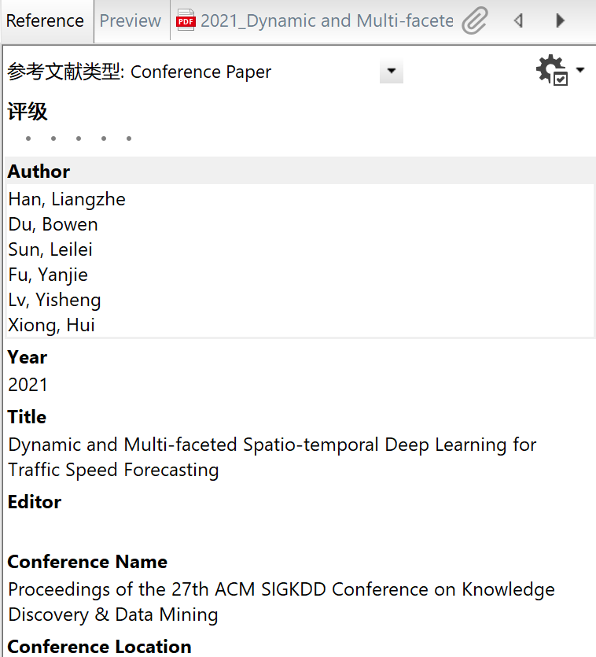
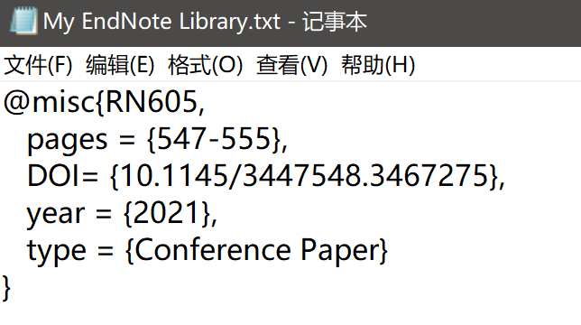
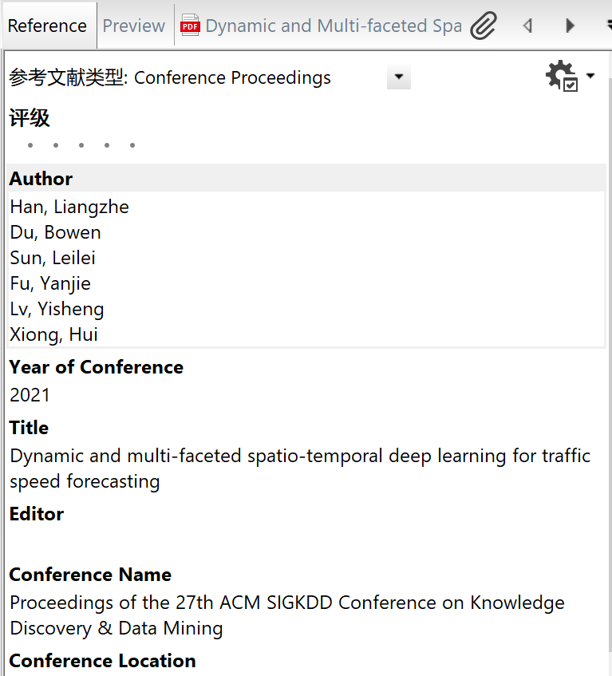
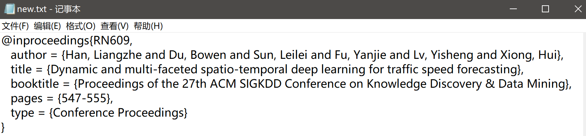
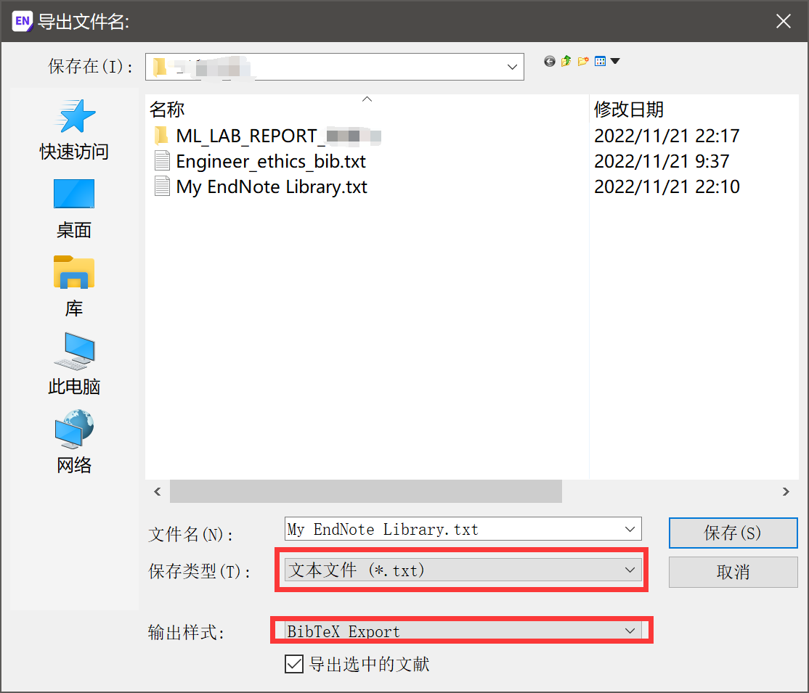
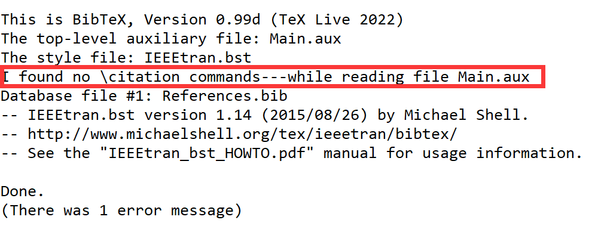
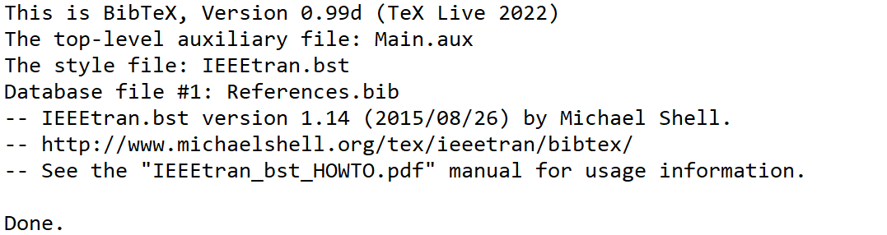
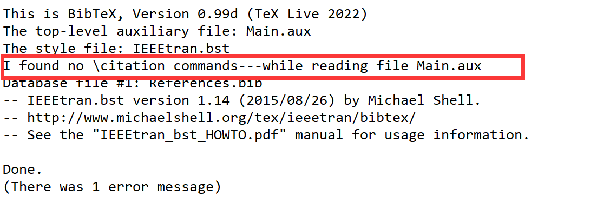

# 使用endnote管理文献

*前言*：为什么使用endnote呢？因为它可以方便的快捷的对你的文献进行分类，分组管理，可以批量的导出参考文献格式，批量的参考文献格式导入，可以将文献的pdf连接到我们的文献信息上，快速阅读，可以标记是否阅读，记录文件的重要性

### 文献的导入

endnote首先我们的文献一般都是从别的论文数据库检索出来的（当然从endnote也可以直接检索，但是endnote检索的结果看着比较不清晰，最好去各种论文数据库官网查找），找到我们可能需要的文献之后，先导出文献，以endnote的方式导出，可能到处的格式为.ciw、.enw、.ris等格式，每个格式都一样我们都可以直接双击打开，endnote会直接导入文献信息的，但是这样只是导入了文献的信息，没有具体的论文，我们可以再endnote中使用查找全文的功能，但是这是官方的检索渠道，即你需要有这个数据库的权限才能下载全文，我们可以选择去dblp或scihub上下载，然后链接到我们的文献信息上。

##### 为什么有的PDF导入后文献信息不全

> 这是因为有的文献的原文pdf中有DOI号（这个有没有DOI主要是看发表他的期刊有没有加），所以导入时endnote会根据这个DOI号自动找到它的文献信息，并且引入。但是有的文献原文PDF时没有DOI号的，所以你导入的时候文献信息就不全。

> 还有一种可能是我们导入了中文的文献，当我们中文数据库检索的时候一定要注意，千万注意我们选择问文献的类型，因为中文数据库中有的是报纸什么的这种奇怪的类型，你导入的时候不仅是信息不全，如果你把这条记录导出为bib到latex的参考文献中，你会发现latex也识别不了这种类型文献！

**PDF导入注意事项**

虽然说有的PDF导入时，由于它原文中就有它的DOI号，所以在导入时endnote是会根据你的PDF的DOI号去检索论文的文献信息的，而且大概率可以检索到，然后在endnote中论文信息显示也很齐全，如下



但是一旦你要导出该文献时，就会发现它的信息还是不全的



所以建议导入endnote文献信息时，都直接从论文检索数据库导出endnote引用，不要直接导入pdf了效果很不好。下面是我从谷歌学术导入的文献信息，可以看出来显示出的信息基本没有区别，但是一旦进行导出，效果就天差地别



这是对应的导出的信息，可以看出来这个信息就很全了。



### 导出的txt参考文献文件如何使用

使用endnote导出文件时，如下图，选择BibTex Export保存类型没有.bib文件所以我们选择.txt文件。




### Winedt中bib文件编译报错

*我下载了原版的实验报告的模板，只需要先XeLaTex然后BibTex再XeLaTex然后再XeLaTex*

> 首先我们需要先XeLaTex才能用BibTex编译参考文献，并且可以预编译我们的目录

> BibTex编译我们的参考文献文件

> 然后的XeLaTex把我们的参考文献和目录都包含进来，但是正文中的参考文献编号都是问好我们需要再次使用XeLaTex

1. 

+ 报错



```latex
I found no \citation commands—while reading file Main.aux
```

+ 解决之路

我在原模板文件中去掉了原文中的关于文献的引用（==原文中有两篇参考文献引用，我只去掉了一篇==），就是下面的红框部分，再次编译，发现在最后的参考文献部分，我们正文中删掉的引用文献在最后面才考文献部分也消失了。但是在我们用BibTex编译时并没有报错。




现在我把==两篇==参考文献在正文中的引用全部去掉，再次编译，发现也有了同样的报错。所以可以找到问题就是我们的.bib文件中的参考文献在正文中必须要有引用，可以只引用其中的几篇，但是绝对不可以一篇都不引用




### 参考：

[endnote使用手册](file://D:\tools\tools_for_paper\EndNote\EndNote X9.1\endnote x9 使用手册.pdf)

[在latex中导入endnote中的参考文献——简明步骤](https://blog.csdn.net/jianwushuang/article/details/53525521)

[Latex中 BiBTeX found no citation commands 解决办法](https://blog.csdn.net/xin_yu_xin/article/details/50244913)

[.bib添加注释](https://www.cnblogs.com/USTBlxq/p/6509948.html)

[Winedt自定义宏并添加工具栏按钮](https://ask.latexstudio.net/ask/article/103.html)

