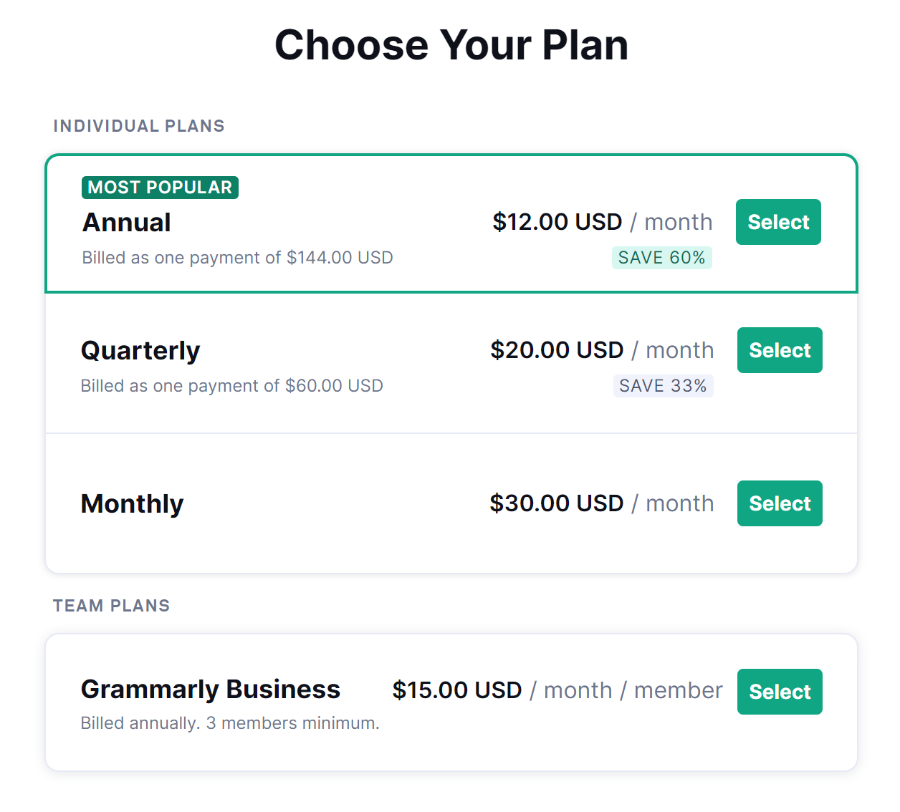

# 介绍

*英语阅读与写作期末作业需要段落缩写，同时也是借助这个机会去学习、了解一下关于论文的润色工具的选择问题。因为以后的学习中肯定也会用到*

查找了很多关于论文润色的工具资料

#### Grammmerly

这个工具呢，在很多文章中都是说它的使用量很大，就是用户很多，搞科研的人基本都会用它，但是每篇文章都不是首推它的使用，原因如下

> 首先，它的[官网](https://app.grammarly.com/)设计的有点复杂了，我进入的时候看了很久才找到怎么用，而且它的很多功能是收费的，并且它只有语法错误的检查功能和Clarity（让你的表达更简单的被理解）功能免费，并没有润色功能，当然付费的话可能会有。但是这个工具有word插件、chrome插件、windows软件、网页版可以使用

##### 费用

这是它的收费价格，当然以刀为单位，我相信对于绝大多数中国人来说这个价格应该是小贵的，没有啥必要。

##### windows软件

~~我下载了他的软件，用不了，应该是因为需要翻墙，我的梯子只是浏览器梯子，软件可能用不了~~，其实是可以用的，只是登录的时候需要翻墙登录。这个软件还是很好用的，只需要开启它，无论在哪里输入英文，它都会自动检查你的语法，可以安装一个使用。

 

#### QuillBot

这个工具登陆[官网](https://quillbot.com)，就是很简洁，一下子就能知道怎么用，并且提供有paraphraser（同义改写）功能，Grammar Checker（语法检查功能），Summarize（总结概括）功能，并且也有chrome插件和word插件，但是没有windows软件。

但是它的重写功能**限制词数为125**.

## 还有以下几个工具还没有研究过好不好用

[火龙果写作](https://www.mypitaya.com/)：b站上找到的推荐，但是在一些文章的推荐中没有见到过，不过[官网](https://www.mypitaya.com/)设计的还不错。试了一下，改写等功能都要收费不过还不贵

看着做的很好，可以试试

[Ginger](https://www.gingersoftware.com/)：看文章的推荐，好像是Grammarly升级版，比Grammarly多一些功能，而且是逐句的检查语法错误，还有同义词查询功能，也能改写，不过没有付费的话，改写字数有限

[stylewrite](https://www.stylewriter-usa.com/)：推荐度很高，不过只有软件，不能在线使用，据说

[chimprewriter](https://chimprewriter.com/)：新款的，进入了它的官网好像到处都是bug now感觉no good，也是只能下载软件不能在线使用