# Deep Reinforcement Learning for Traffic Signal Control: A Review

交通信号控制的深度强化学习研究综述

[原文链接](D:\afei2\paper\paper_trafficlight\Shaikh-2022-A Review on Swarm Intelligence and.pdf)

## 原文翻译

*对原文逐字翻译以及一些自己的理解*

### ABSTRACT

*Traffic congestion is a complex, vexing, and growing issue day by day in most urban areas worldwide. The integration of the newly emerging deep learning approach and the traditional reinforcement learning approach has created an advanced approach called deep reinforcement learning (DRL) that has shown promising results in solving high-dimensional and complex problems, including traffic congestion.This article presents a review of the attributes of traffic signal control (TSC), as well as DRL architectures and methods applied to TSC, which helps to understand how DRL has been applied to address traffic congestion and achieve performance enhancement. The review also covers simulation platforms, a complexity analysis, as well as guidelines and design considerations for the application of DRL to TSC. Finally, this article presents open issues and new research areas with the objective to spark new interest in this research field.To the best of our knowledge, this is the first review article that focuses on the application of DRL to TSC*

在全球大多数城市地区，交通拥堵是一个复杂的、令人困扰的、与日俱增的问题。新兴的深度学习方法和传统的强化学习方法的整合创造了一种先进的方法，称为深度强化学习（DRL），在解决包括交通拥堵在内的高维复杂问题方面显示出了良好的效果。

本文对交通信号控制（TSC）的属性以及应用于TSC的DRL架构和方法进行了回顾，这有助于了解DRL如何被应用于解决交通拥堵问题并实现性能提升。该综述还涵盖了仿真平台、复杂性分析，以及将DRL应用于TSC的指导方针和设计考虑。最后，本文提出了开放性问题和新的研究领域，目的是为了激发人们对这一研究领域的新兴趣。

据我们所知，这是第一篇专注于DRL在TSC中应用的综述文章。

### I. INTRODUCTION

*With rapid population growth and urbanization, traffic demand is steadily rising in metropolises worldwide. Traffic signal controls (TSCs) are installed to monitor traffic flows and alleviate traffic congestion at intersections [1]–[3]. During traffic congestion, vehicles move slowly or stop at lanes, and the queue length of the vehicles increases [4]. Congestion that occurs in a single lane has a single-point-of-failure effect as it can also affect the traffic conditions of the other lanes at the same and neighboring intersections. There are three main reasons that exacerbate congestion. Firstly, traffic entering an intersection is greater than the traffic leaving it.*

*Secondly, cross-blocking occurs when vehicles cannot cross an intersection despite a green signal being activated as the respective lane of the downstream intersection has become fully occupied. Thirdly, green idling occurs when no vehicle is present at an intersection when a green signal is activated.*

随着人口的快速增长和城市化进程，世界各地的大都市的交通需求都在稳步上升。交通信号控制（TSCs）的安装是为了监测交通流量和缓解交叉口的交通拥堵[1]-[3]。在交通拥堵期间，车辆移动缓慢或停在车道上，车辆的排队长度增加[4]。发生在单一车道上的拥堵具有单点故障效应，因为它也会影响同一路口和邻近路口的其他车道的交通状况。加剧拥堵的原因主要有三个。首先，进入一个交叉口的交通量大于离开该交叉口的交通量。

第二，当车辆无法通过一个十字路口时，尽管绿色信号被激活，但由于下游十字路口的相应车道已被完全占用，就会发生交叉阻塞。第三，当绿色信号启动时，没有车辆出现在十字路口时，就会发生绿色空转。

------

*TSCs have three traditional signal colors: red indicates a stop, yellow indicates a slow down, and green indicates a go. A cycle consists of a predetermined sequence of traffic phases, and the cycle length is the time interval of a cycle.*

*A traffic phase consists of a combination of green signals allocated to a set of lanes simultaneously for non-conflicting movements at an intersection. A short moment of all red signals is included in between traffic phases to provide safe transition, causing some time loss. A traffic phase split (or the green time) is the time interval, which is part of a cycle length, allocated for a traffic phase.*

TSC有三种传统的信号颜色：红色表示停止，黄色表示减速，绿色表示前进。一个周期由预先确定的交通阶段序列组成，周期长度是指一个周期的时间间隔。

一个交通阶段由分配给一组车道的绿色信号组合组成，同时用于交叉口的非冲突性运动。在交通相位之间有一个短暂的红色信号，以提供安全过渡，造成一些时间损失。交通相位分割（或绿灯时间）是指分配给一个交通相位的时间间隔，它是一个周期长度的一部分。

------

*Traditionally, TSCs determine the traffic phase splits to manage traffic flows and alleviate traffic congestion using three main approaches. Firstly, a deterministic TSC applies a pretimed control system that uses the Webster formula based on historical traffic data collected at different times [5].*

*Secondly, a semi-dynamic TSC applies an actuated control system that uses current (or instantaneous) traffic conditions, rather than longer-term traffic conditions. For example, green signals are activated at lanes with vehicles [6]. Thirdly, a fully-dynamic TSC applies an actuated control system that uses longer-term traffic conditions. For example, a traffic phase split is increased with the average waiting time and queue length of vehicles at a lane. While the semi-dynamic TSC approach uses a single inductive loop detector installed at a lane to detect the presence of vehicles, the fully-dynamic TSC uses at least two inductive detectors to measure the queue length [7]–[11].*

传统上，TSC确定交通相位划分，以管理交通流和缓解交通拥堵，主要采用三种方法。首先，==一个确定性的TSC应用一个预设的控制系统，该系统使用基于不同时间收集的历史交通数据的Webster公式[5]==。

其次，==半动态的TSC应用一个执行的控制系统，使用当前（或瞬时）的交通状况，而不是长期的交通状况==。例如，在有车辆的车道上启动绿色信号[6]。第三，一个==完全动态的TSC应用一个使用长期交通状况的执行控制系统==。例如，用车道上车辆的平均等待时间和排队长度来增加交通相位分割。半动态TSC方法使用安装在车道上的单个感应式环形检测器来检测车辆的存在，而全动态TSC则使用至少两个感应式检测器来测量排队长度[7]-[11]。

------

*Research has been undertaken to investigate TSCs that can optimize traffic signal scheduling and timing, such as adjusting traffic phase splits, in order to ameliorate traffic congestions at moderately and heavily trafficked single or multiple intersections. Reinforcement learning (RL) has been the preferred unsupervised artificial intelligence technique for accomplishing a fully-dynamic TSC [12]. RL possesses the capability to learn the relationships between actions and their effects on the operating environment (or states). Specifically, RL adjusts traffic phase splits, or even skips traffic phases, according to traffic conditions which are dynamic and can be unpredictable. Nevertheless, RL is marred by the curse of dimensionality, an issue whereby the number of states (or the state space) becomes too large, leading to two main shortcomings [13]. Firstly, a higher computational cost must be incurred to explore all state-action pairs in order to identify optimal actions, causing a longer learning time. Secondly, a larger storage capacity is required to store knowledge (or Q-values).*

人们已经开始研究能够优化交通信号调度和时间的TSC，例如调整交通相位的划分，以改善中度和重度交通的单个或多个交叉口的交通拥堵状况。强化学习（RL）一直是完成全动态TSC的首选无监督人工智能技术[12]。强化学习具有学习行动之间的关系和它们对运行环境（或状态）的影响的能力。具体来说，RL可以根据动态的、不可预测的交通状况来调整交通相位的划分，甚至跳过交通相位。然而，RL受到维度诅咒的影响，这是一个状态（或状态空间）数量变得过大的问题，导致==两个主要缺点==[13]。首先，==为了确定最佳行动，探索所有的状态-行动对必须产生较高的计算成本，导致学习时间延长==。其次，==需要更大的存储容量来存储知识（或Q值）==。

------

*Recently, deep learning (DL), which is an advanced artificial intelligence technique, has been successfully combined with RL to provide deep reinforcement learning (DRL), and it has shown to address the shortcomings of RL [14]. DRL has three main advantages. Firstly, DRL enables a continuous state space representation, so there can be a large number of states. Secondly, DRL reduces the learning time required to explore all state-action pairs and identify optimal actions. Thirdly, DRL uses several layers of neurons to store the weights (or network parameters) of the links connecting the neurons, which are used to approximate the Q-values efficiently in order to address the storage capacity issue in RL [15].*

最近，作为一种先进的人工智能技术，==深度学习（DL）已经成功地与RL结合起来，提供深度强化学习（DRL），并显示出解决RL的缺点==[14]。DRL有三个主要优点。首先，DRL能够实现连续的状态空间表示，因此可以有大量的状态。第二，DRL减少了探索所有状态-动作对和识别最优动作所需的学习时间。第三，DRL使用几层神经元来存储连接神经元的链接的权重（或网络参数），用来有效地近似Q值，以解决RL的存储容量问题[15]。

------

#### A.SIGNIFICANCE OF DEEP REINFORCEMENT LEARNING FOR TRAFFIC SIGNAL CONTROL

深度强化学习对交通信号控制的意义

*Several success stories of the use of DRL over the years have brought new and refreshed enthusiasm to the world of artificial intelligence. In 2013, DeepMind introduces DRL applied to playing a range of Atari 2600 games with superhuman performance [14]. Later in 2016, DRL is trained by DeepMind to play the Alpha Go board game, which defeated a host of world champions [16]. Subsequently, DRL has been applied in many real-world applications, such as robotics [17], natural language processing [18], health care [19], business management [20], Industry 4.0 [21], smart grid [22], computer vision [23], transportation, particularly TSC and driver-less vehicles [24]. In view of these developments, this article presents a comprehensive review of the limited work on DRL applied to TSC, motivated by the goal of achieving better-than-human intelligence solutions. In general, DRL offers main advantages that are appealing to TSCs as follows*

多年来，几个使用DRL的成功案例给人工智能的世界带来了新的、焕然一新的热情。2013年，DeepMind介绍了DRL应用于玩一系列雅达利2600游戏的超人表现[14]。后来在2016年，DRL被DeepMind训练来玩阿尔法围棋棋盘游戏，打败了一大批世界冠军[16]。随后，DRL被应用于许多现实世界的应用，如机器人[17]、自然语言处理[18]、医疗保健[19]、商业管理[20]、工业4.0[21]、智能电网[22]、计算机视觉[23]、交通，特别是TSC和无人驾驶车辆[24]。鉴于这些发展，本文对应用于TSC的DRL的有限工作进行了全面回顾，其动机是为了实现比人类智能更好的解决方案。总的来说，DRL提供的主要优势对TSC有吸引力，具体如下

-------

*DRL enables an agent to adapt to the real-time traffic condition that evolves in a complex and unpredictable manner due to unexpected disturbances, such as bad weather conditions and road accidents.*

==DRL使 agent 能够适应实时交通状况==，这种状况由于意外的干扰，如恶劣的天气条件和道路事故，以复杂和不可预测的方式演变。

*DRL can be a model-based or model-free approach, and it enables an agent to perform self-learning on the fly without having prior knowledge about the operating environment, including traffic condition and network. The model-based approach creates a model of the operating environment, and then selects an action and observes feedback from the model [25]. On the other hand, the model-free approach does not create a model of the operating environment. The model-free approach has been chosen for TSC because it has lower complexity and computational requirement compared to the model-based approach.*

DRL可以是基于模型的方法，也可以是无模型的方法，它使 agent 能够在不事先了解运行环境（包括交通状况和网络）的情况下，在飞行中进行自我学习。基于模型的方法创建一个运行环境的模型，然后选择一个行动并观察模型的反馈[25]。另一方面，无模型的方法不创建操作环境的模型。无模型的方法被选择用于TSC，因为与基于模型的方法相比，它的复杂性和计算要求较低。

*DRL represents reward with system goal(s) and performance measure(s), which take account of multiple factors that affect system performance from the operating environment. For instance, the reward changes with the average waiting time, queue length, or throughput of vehicles at an intersection (see Section IV).*

DRL用系统目标和性能指标来表示奖励，这些指标考虑了来自运行环境的影响系统性能的多种因素。例如，奖励随着路口车辆的平均等待时间、队列长度或吞吐量而变化（见第四节）。

*DRL addresses the curse of dimensionality, which adversely affect the traditional RL approach, when applied to TSC. This is because TSC has a large state space as there are multiple factors affecting a traffic network.*

DRL解决了维度的诅咒，这对传统的RL方法有不利影响，当应用于TSC时。这是因为TSC有一个很大的状态空间，因为有多种因素影响交通网络。

*Most importantly, DRL provides added advantages compared to other approaches applied to TSC as shown in Table 2.*

*Meanwhile, the trend of the number of papers published from January 2016 to March 2020 on the use of DRL to TSC is shown in Fig. 1. This study was conducted on three wellknown literature databases with scientific scope, namely Web of Science, ScienceDirect, and IEEEXplore Digital Library*

最重要的是，如表2所示，与其他应用于TSC的方法相比，DRL提供了额外的优势。

同时，从2016年1月到2020年3月发表的关于DRL用于TSC的论文数量趋势见图1。本研究在三个知名的科学范围内的文献数据库中进行，即Web of Science、ScienceDirect和IEEEXplore数字图书馆。

------

#### B. OUR CONTRIBUTIONS

我们的贡献

*While general reviews of designing TSCs using RL [13], [30]–[32], multi-agent systems [29], big data [34], DL [35], and other artificial intelligence approaches, such as fuzzy systems [33], have been presented, this article complements their works by focusing on the DRL approach, particularly on how DRL models can be applied to formulate the TSC problem, and how the strengths of various DRL approaches can provide added advantages in addressing the challenges brought about by traffic management and control. To the best of our knowledge, this is the first comprehensive article that contributes to the body of knowledge by providing systematic and extensive synthesis, analysis and summary of limited DRL schemes applied to TSC, which helps to identify research gaps in existing schemes and explore future research directions. Various technical aspects of DRL-based TSCs, including DRL models, DRL methods, DL architectures, simulation platforms, complexity analysis and performance measures, are covered to enhance the technicality of article.*

虽然对使用RL[13]、[30]-[32]、多代理系统[29]、大数据[34]、DL[35]和其他人工智能方法（如模糊系统[33]）设计TSC进行了一般性评论，但本文通过关注DRL方法，特别是如何应用DRL模型来制定TSC问题，以及各种DRL方法的优势如何为解决交通管理和控制带来的挑战提供附加优势，来补充它们的工作。据我们所知，这是第一篇全面的文章，通过对应用于TSC的有限DRL方案进行系统而广泛的综合、分析和总结，为知识体系做出了贡献，这有助于找出现有方案的研究差距，并探索未来的研究方向。文章涵盖了基于DRL的TSC的各个技术层面，包括DRL模型、DRL方法、DL架构、仿真平台、复杂性分析和性能测量，以增强文章的技术性。

------

#### C. ORGANIZATION OF THIS ARTICLE

文章结构

*The rest of this article is organized as shown in Fig. 2.*

*Section II presents an overview of DL, RL, and DRL, as well as various DL architectures with RL methods. The simulation platforms are also presented. Section III presents the attributes of TSC systems. Section IV presents the representations of DRL models and complexity analysis for TSC. Section V presents the application of DRL to TSC.*

*Section VI presents the guidelines and design considerations for the application of DRL to TSC. Section VII presents open issues. Finally, Section VIII concludes this article.*

本文的其余部分的组织结构如图2所示。

第二节介绍了DL、RL和DRL的概况，以及各种具有RL方法的DL架构。还介绍了仿真平台。第三节介绍TSC系统的属性。第四节介绍了DRL模型的表示方法和TSC的复杂性分析。第五节介绍了DRL在TSC中的应用。

第六节介绍了DRL在TSC中应用的指导方针和设计考虑。第七节提出了一些有待解决的问题。最后，第八节是本文的结论。

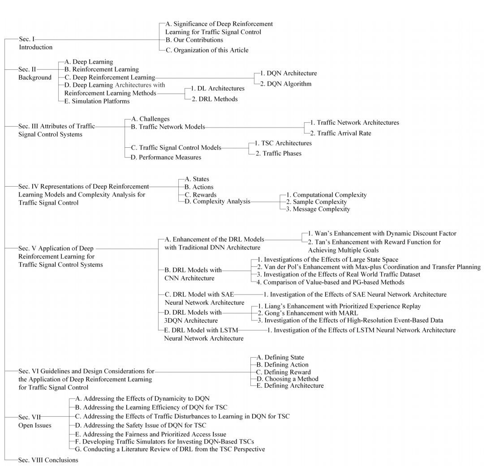

-------

### Ⅱ.Background

*This section presents an overview of DL, RL, and DRL, as well as various DL architectures with RL methods. In addition, simulation platforms are presented*

本节介绍了DL、RL和DRL的概述，以及采用RL方法的各种DL架构。此外，还介绍了仿真平台

#### A. DEEP LEARNING

深度学习 

*Deep learning (DL) is an advanced artificial intelligence approach that consists of a deep neural network (DNN), such as a fully-connected layer network (FCLN) [36], [37]. The term ‘‘deep" indicates that the neural network consists of a large number of hidden layers (e.g., up to 150 layers [38]), which may be fully-connected (FC) with each other, while a traditional neural network generally consists of a much lower number of hidden layers (e.g., two or three layers [39]). Fig. 3 shows a FCLN architecture that consists of three main types of layers, namely the input, hidden, and output layers, and it is an interconnected assembly of neurons (i.e., processing elements) that are capable of learning unstructured and complex data [40]. During training, data flows from the input layer to the output layer. The output yk of a neuron k in the hidden and output layers is as follows :*

*where wkj represents the weight (or network parameter), which is assigned on the basis of the relative importance of input xj compared to other inputs, and ’(:) represents the activation function at neuron k.*

*There are various kinds of DL architectures applied to TSC, including the traditional FCLN, convolutional neural network (CNN), stacked auto encoder (SAE), dueling network, and long short-term memory (LSTM) (see Section II-D for more details).*

深度学习（DL）是一种先进的人工智能方法，由深度神经网络（DNN）组成，如全连接层网络（FCLN）[36], [37]。术语''深''表示该神经网络由大量的隐藏层组成（例如，多达150层[38]），这些隐藏层之间可能是全连接的（FC），而传统的神经网络一般由数量少得多的隐藏层组成（例如，两层或三层[39]）。图3显示了一个FCLN架构，它由三种主要类型的层组成，即输入层、隐藏层和输出层，它是一个相互连接的神经元（即处理元件）的组合，能够学习非结构化的复杂数据[40]。在训练期间，数据从输入层流向输出层。隐蔽层和输出层中的神经元k的输出 $y_k$ 如下[41]：

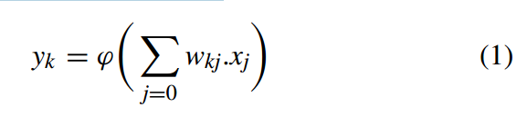

其中 $w_{kj}$ 代表权重（或网络参数），它是根据输入 $x_j$ 与其他输入相比的相对重要性分配的，$\varphi(\cdot )$ 代表神经元 $k$ 的激活函数。

应用于TSC的DL架构有多种，包括传统的FCLN、卷积神经网络（CNN）、堆叠自动编码器（SAE）、决斗网络和长短期记忆（LSTM）（详见第二节D）。

-------

#### B. REINFORCEMENT LEARNING

*Reinforcement learning (RL) is the third paradigm of artificial intelligence, which is different from the supervised learning and unsupervised learning approaches. It enables an agent to explore and exploit different state-action pairs so that it achieves the best possible positive reward (or negative cost) for system performance enhancement as time goes by t D 1; 2; 3; : : : [42]–[45]. Algorithm 1 presents the traditional RL algorithm [42]. At time instant t 2 T , an agent observes its Markovian (or memoryless) decision-making factors (orstate st 2 S) in the dynamic and stochastic operating environment, and selects and performs an action at 2 A [46]–[49]. Subsequently, the agent observes the next state stC1 and receives an immediate reward (or cost) rtC1(stC1), which depends on the next state stC1 for the state-action pair (st; at). Then, it updates Q-value Qt(st; at), which represents knowledge, for the state-action pair. The Q-value Qt(st; at) represents the appropriateness of taking action at under state st , and it is updated using Q-function as follows [50]:*

*where 0 ≤ α ≤ 1 is the learning rate, and δt(st; at) is the temporal difference, which is based on the Bellman equation that represents the difference between immediate and discounted rewards for two successive estimations as follows [51]:*

where γ max a2A Qt(stC1; a) represents the discounted reward, which is the expected maximum Q-value at time t C 1 and so on, and 0 ≤ γ ≤ 1 represents a discount factor that shows the preference for the discounted reward.

*In other words, the immediate reward rtC1(stC1) represents a short-term reward, while the discounted reward γ max a2A Qt(stC1; a) represents a long-term reward. As time goes by t D 1; 2; 3; : : :, the agent explores, updates, and stores the Q-values Qt(stC1; a) of all the state-action pairs (st; at) in a two-dimensional Q-table*

*During action selection, an agent selects either exploration or exploitation. Exploration selects a random action with a small probability " to update its Q-value so that better actions can be identified in a dynamic and stochastic operating environment as time progresses. On the other hand, exploitation selects the best-known (or greedy) action with probability 1 − " to maximize the state value using the value function as follows [52]:*

*where π is the policy, which is applied by the agent to decide the next action atC1 based on the current state st , and it is defined as follows [53]:*

强化学习（RL）是人工智能的第三个范式，它与监督学习和无监督学习方法不同。它使 agent 能够探索和利用不同的状态-行动对，以便随着时间的推移t = 1,2, 3, 实现系统性能提升的最佳正回报（或负成本）： [42]-[45]. 算法1提出了传统的RL算法[42]。在时间瞬间 $t \in T$，agent 在动态和随机的操作环境中观察其马尔科夫（或无记忆）决策因素（或状态 $s_t \in S$），并选择和执行一个行动 $a_t \in A$ [46]-[49]。随后，agent 观察下一个状态 $s_{t+1}$，并获得一个即时奖励（或成本）$r_{t+1}(s_{t+1})$，这个奖励值取决于状态-动作对 $(s_t,a_t)$ 的下一个状态 $s_{t+1}$ 。然后，它更新了代表知识的Q值 $Q_t(s_t,a_t)$，因为这对状态-动作。Q值 $Q_t(s_t,a_t)$ 代表在状态 $s_t$ 下采取动作 $a_t$ 的适当性，它是通过Q函数更新的，如下所示[50]：

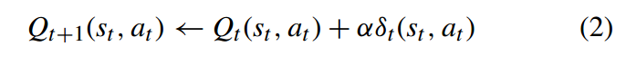

其中 $0 \le \alpha \le 1$ 是学习率，$\delta _t(s_t,a_t)$ 是时序差异（temporal difference），它基于贝尔曼方程（Bellman equation），表示两次估计之间即时奖励和折扣奖励之间的差异，具体如下所示

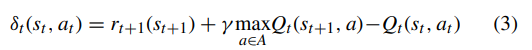

其中，$\gamma \max_{a \in A} Q_t(s_{t+1},a)$ 代表折扣奖励，即时间 $t+1$ 的预期最大Q值，以此类推，$0 \le \gamma \le1$表示折扣因子，表明对折扣奖励的倾向性。

换句话说，即时奖励 $r_{t+1}(s_{t+1})$ 代表短期奖励，而折扣奖励 $\gamma \max_{a \in A} Q_t(s_{t+1},a)$ 代表长期奖励。随着时间的推移t = 1, 2, 3, .... agent 探索、更新并将所有状态-行动对 $(s_t,a_t)$ 的Q值 $Q_t(s_{t+1},a)$ 存储在一个二维的Q表中

在行动选择过程中，agent 根据探索（exploration）和开发（exploitation）两种策略之一进行选择。探索以较小的概率 $\epsilon $ 选择一个随机动作，以更新其Q值，以便在动态和随机的操作环境中随着时间的推移能够找到更好的动作。另一方面，开发以概率 $1- \epsilon$ 选择最佳已知（或贪婪）动作，以利用值函数最大化状态值，具体如下所示[52]：

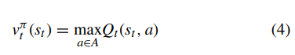

其中π是策略（policy），即: agent 根据当前状态 $s_t$ 决定下一步动作 $a_{t+1}$ 时所采用的策略，其定义如下[53]：

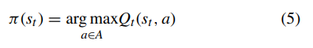

> 这个公式表示：
>
> ​	使得 $Q_t(s_t,a)$ 取最大值时的 $s_t$ 的值
>
>  
>
> 在数学公式中，"arg"是"argmax"或"argmin"的简写，表示取得使得函数达到最大或最小值的自变量（参数）的值。具体来说：
>
> - "argmax"表示取得使得函数取得最大值的自变量的值。例如，argmax(f(x))表示使得函数f(x)取得最大值的x的值。
> - "argmin"表示取得使得函数取得最小值的自变量的值。例如，argmin(g(x))表示使得函数g(x)取得最小值的x的值。
>
> 简而言之，"arg"指示了取得最大值或最小值的自变量的值。

因此，代理根据最大的Q值选择一个动作。为简单起见，在本文所提到的算法中仅展示了开发策略。

------

#### C. DEEP REINFORCEMENT LEARNING

*Deep reinforcement learning (DRL) is the combination of two artificial intelligence approaches (i.e., DL and RL). Deep Q-network (DQN) is the first DRL method proposed by DeepMind [14], and it has been widely used in TSC. DQN has two main features, namely experience replay and target network [54]–[57]. Using experience replay, an agent stores an experience in a replay memory, and subsequently trains itself using experiences randomly selected from the replay memory [58]. Using target network, an agent utilizes a duplicate of the main network, and uses its weights to calculate target Q-values subsequently used to calculate a loss function minimized using gradient descent [59]. The weights of the target networks are fixed (or updated after a certain number of iterations) to improve training stability. During training, the target Q-value is used to compute the loss of a selected action in order to stabilize training, and it is updated every certain number of iterations [60]–[63]. The main network enables an agent to select an action after observing its state from the environment, and subsequently updates its main Q-values. The rest of this section presents the DQN architecture and algorithm, respectively*

深度强化学习（DRL）是两种人工智能方法（即DL和RL）的结合。==深度Q网络（DQN）是DeepMind[14]提出的第一个DRL方法，它已被广泛应用于TSC中==。==DQN有两个主要特点，即经验回放和目标网络[54]-[57]。使用经验回放，一个 agent 将经验存储在回放存储器中，随后使用从回放存储器中随机选择的经验来训练自己[58]。使用目标网络，agent 利用主网络的副本，并使用其权重计算目标Q值，随后用于计算使用梯度下降最小化的损失函数[59]。目标网络的权重是固定的（或在一定次数的迭代后更新），以提高训练的稳定性。在训练过程中，目标Q值被用来计算所选动作的损失，以稳定训练，并且每隔一定的迭代次数就会更新一次[60]-[63]。主网络使 agent 在从环境中观察到其状态后选择行动，并随后更新其主Q值==。本节的其余部分分别介绍了DQN的结构和算法

-------

##### 1) DQN ARCHITECTURE

*DQN possesses one of the different kinds of DL architectures, such as FCLN, CNN, SAE, 3DQN, and LSTM. FCLN has been widely used with DQN. Fig. 4 presents the architecture of DQN. An agent has three main components, namely the replay memory, the main network, and the target network.*

*The replay memory is a dataset of an agent’s experiences Dt D (e1; e2; : : : ; et; : : : ), which are gathered when the agent interact with the environment as time goes by t D 1; 2; 3; : : : . Subsequently, the experiences Dt are used during the training process. The main network consists of a FCLN, and the weight θk of the FCLN is used to approximate its Q-values Q(s; aI θk ) at iteration k. The main network is used to select an action at for a particular state st observed from the environment in order to achieve the best possible reward rtC1(stC1) and next state stC1 at the next time instant t C 1.*

*The target network is a duplicate of the main network, and the weight θ − of the FCLN is used to approximate its Q-values Q(s; aI θ − k ) after the kth iteration. There are two main differences between the Q-values of the main and target networks.*

*Firstly, the main network is used during action selection and training, while the target network is used during training only.*

*The target network improves the training stability, without which the policy may oscillate between the main and target Q-values in a single network. Secondly, the Q-values Q(s; aI θk ) of the main network are updated in every iteration k, while the weights θ − j of the target network are updated by copying the weights θj of the main network at every C steps, which is equivalent to k iterations*

DQN拥有不同种类的DL架构之一，如FCLN、CNN、SAE、3DQN和LSTM。FCLN已被广泛用于DQN。图4展示了DQN的架构。一个代理有三个主要部分，即重放存储器、主网络和目标网络。

重放存储器是一个 agent 的经验 $D_t = (e_1,e_2,...)$ 的数据集，这些经验是在代理与环境互动时收集的，随着时间的推移t = 1, 2, 3, .... 。随后，在训练过程中使用经验Dt。主网络由一个全连接层网络（FCLN）组成，其中权重θk用于在第k次迭代中近似其Q值Q(s; aI θk)。主网络用于根据从环境观察到的特定状态st选择动作at，以实现在下一个时间点 $t+1$ 获得最佳奖励 $r_{t+1}(s_{t+1})$ 和下一个状态 $s_{t+1}$。

目标网络是主网络的一个副本，其中权重 $\theta ^-$ 用于近似其Q值 $Q(s,a,\theta _k^-)$。主网络和目标网络的Q值之间存在两个主要区别。

==首先，主网络用于动作选择和训练，而目标网络仅用于训练。==

==目标网络提高了训练的稳定性==，否则策略可能会在单个网络的主要和目标Q值之间摇摆不定。其次，主网络的Q值Q(s; aI θk)在每次迭代 $k$ 中更新，而目标网络的权重θ−j通过在每个C步骤（相当于k次迭代）中将主网络的权重θj复制来进行更新。

--------

##### 2) DQN ALGORITHM

--------

#### D. DEEP LEARNING ARCHITECTURES WITH REINFORCEMENT LEARNING METHODS

带有强化学习方法的深度学习架构

*This section presents DL architectures used with RL methods applied to different types of traffic network models, including single intersection [66]–[72], [99], multi intersections [74], real world [77]–[79], and grid [76]. Fig. 12 presents the DRL attributes for TSC.*

本节介绍了应用于不同类型交通网络模型的DL架构与RL方法，包括单路口[66]-[72]，[99]，多路口[74]，现实世界[77]-[79]，以及网格[76]。图12展示了TSC的DRL属性。

-------

##### 1) DL ARCHITECTURES

The DL architectures used with RL methods for TSCs are as follows:

与TSC的RL方法一起使用的DL架构如下

-------

*N.1 The traditional FCLN has been adopted in [70], [72] to approximate the Q-values of TSCs (see Section II-A).*

N.1 传统的FCLN已经在[70], [72]中被采用来近似TSC的Q值（见第二节A）。

-------

*N.2 Convolutional neural network (CNN) has been widely adopted in [66], [69], [74], [76], [78] to approximate the Q-values of TSCs. While the traditional DL approach consists of fully connected (FC) layers, CNN has two main types of layers, namely the convolutional layer, and as well as the traditional FC layer (see Fig. 5 for an example of a CNN architecture [69]). In Fig. 5, CNN has one input layer, two convolutional layers, two FC layers, and one output layer. Each convolutional layer consists of three parts, namely convolution, pooling, and activation. The data flows from the input layer to the output layer. The layers are as follows:*

N.2 卷积神经网络（CNN）在[66]、[69]、[74]、[76]、[78]中被广泛采用来近似计算TSC的Q值。传统的DL方法由全连接（FC）层组成，而CNN主要有两种类型的层，即卷积层，以及传统的FC层（CNN结构的例子见图5[69]）。在图5中，CNN有一个输入层，两个卷积层，两个FC层，以及一个输出层。每个卷积层由三部分组成，即卷积、池化和激活。数据从输入层流向输出层。这些层如下：

-------

*N.3 Stacked auto encoder (SAE) neural network, which performs encoding and decoding functions, has been adopted in [67] to approximate the Q-values of TSCs.*

*Fig. 6 shows an example of a SAE architecture. The data flows from the input layer to the output layer. The layers are as follows:*

N.3 叠加自动编码器（SAE）神经网络，执行编码和解码功能，已在[67]中被采用来近似TSC的Q值。

图6显示了一个SAE架构的例子。数据从输入层流向输出层。各层情况如下：

--------

*N.4 Double dueling deep Q-network (3DQN), with its FC layer split into two separate streams, has been adopted in [71], [73], [77] to approximate the Q-values of TSCs.*

*The 3DQN architecture consists of double Q-learning [85] and a dueling network [86] as shown in an example of a 3DQN architecture in Fig. 7. In double Q-learning, a max operator decouples the selection of an action from the evaluation of an action; while in traditional Q-learning, a max operator uses the same value for both selection and evaluation of an action. The dueling network has two separate streams to estimate the state value and the advantage of each action separately. The data flows from the input layer to the output layer. The layers are as follows:*

N.4 双决斗深Q网络（3DQN），其FC层被分成两个独立的流，在[71], [73], [77]中被采用来近似TSC的Q值。

3DQN结构由双Q-学习[85]和决斗网络[86]组成，如图7中3DQN结构的一个例子所示。在双Q-learning中，一个最大运算符将行动的选择与行动的评估解耦；而在传统的Q-learning中，一个最大运算符在行动的选择和评估中都使用相同的值。决斗网络有两个独立的数据流，分别估计状态值和每个行动的优势。数据从输入层流向输出层。各层情况如下：

-------

*N.5 The traditional long short-term memory (LSTM) neural network, which is based on a recurrent neural network, consists of a memory cell; and it has been adopted in [79] to approximate the Q-values of TSCs. Fig. 8 shows an example of a LSTM architecture. The data flows from the input layer to the output layer. The layers are as follows:*

N.5 传统的长短时记忆(LSTM)神经网络，是以递归神经网络为基础的，由一个记忆单元组成；并且在[79]中被采用来近似TSC的Q值。图8显示了一个LSTM架构的例子。数据从输入层流向输出层。层数如下：

--------

##### ==2) DRL METHODS==

*There are three DRL methods applied to DL architectures for TSCs as follows:*

有三种DRL方法适用于TSC的DL架构，如下所示：

------

*E.1 Value-based method. The value-based method is the traditional DQN method (see Sections II-B and IIC), which has been adopted in [66]–[74], [76]–[78], [99]. The value-based DQN maps each state-action pair (st; at) to a state value Vt(st) learned using value function (see Equation (4)) in order to identify the best possible action for each state*

E.1 基于值的方法。基于值的方法是传统的DQN方法（见第II-B节和IIC节），在[66]-[74], [76]-[78], [99]中被采用。基于值的DQN将每个状态-动作对（$s_t$；$a_t$）映射到使用值函数（见公式（4））学习的状态值$V_t(s_t)$，以确定每个状态的最佳 action

-------

*E.2 Policy-gradient (PG)-based method. DQN with the PGbased method selects an action at 2 A based on a policy with probability distribution π(at jstI θ) given a state st 2 S, where the probability distribution is learned by performing gradient descent on the policy parameter (i.e., the weight θ of DQN). Equation (8) is revised as follows*

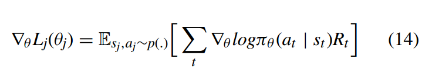

*where Rt D P t γ rt represents the reward function. PG-based DQN has been adopted in [68].*

E.2 基于政策梯度（PG）的方法。采用基于PG的方法的DQN根据给定状态st 2 S的概率分布π（at jstI θ）的策略在2 A处选择一个行动，其中概率分布是通过对策略参数（即DQN的权重θ）进行梯度下降学习的。方程（8）被修改为：

其中Rt D P tγRt表示奖励函数。[68]中已经采用了基于PG的DQN。

> 深度强化学习结合了深度学习和强化学习的两个主要组成部分，以实现更强大的决策和学习能力。
>
> 在深度学习方面，深度强化学习使用深度神经网络作为函数逼近器，用于近似值函数或策略函数。深度神经网络可以学习输入状态和行动之间的复杂映射关系，并具有强大的表示学习能力。通过使用深度神经网络，深度强化学习能够处理高维、复杂的状态和行动空间，并从中提取有用的特征和表示。
>
> 在强化学习方面，深度强化学习使用基于奖励信号的试错学习框架。智能体与环境交互，观察当前的状态，并根据当前策略选择一个行动。环境根据智能体的行动返回奖励信号和下一个状态。通过不断与环境的交互，智能体通过学习调整策略，以最大化累积奖励。
>
> 深度强化学习将深度学习和强化学习相结合，主要有两种主要方法：
>
> 1. 值函数学习：深度强化学习使用深度神经网络来逼近值函数，即根据当前状态和行动预测其对应的累积回报。通过优化神经网络的参数，使其能够准确地预测值函数，并基于值函数进行决策。
>
> 2. 策略梯度：深度强化学习使用深度神经网络来近似策略函数，即根据当前状态选择一个行动的概率分布。通过优化神经网络的参数，使其能够产生更优的行动策略。通常使用梯度上升法来更新策略网络的参数，以最大化累积回报。
>
> 深度强化学习通过将深度学习的表示学习能力与强化学习的决策和优化能力相结合，能够在复杂的任务和环境中实现自主决策和学习，取得了许多重要的突破和应用。

-----

### III. ATTRIBUTES OF TRAFFIC SIGNAL CONTROL SYSTEMS

交通信号控制系统的特征

*The attributes of the intersections, traffic, and TSCs have brought about challenges to traffic management. This section presents these attributes to provide a better understanding about the TSC problem, which is solved using DRL as presented in Section IV. Figure 9 presents various aspects of the TSC attributes. In addition, performance measures are presented.*

交叉口、交通流量和交通信号控制系统的特征给交通管理带来了挑战。本节将介绍这些特征，以更好地理解交通信号控制问题，该问题在第四节中使用深度强化学习进行解决。图9展示了交通信号控制系统特征的各个方面。此外，还提供了性能指标。

----------

### IV. REPRESENTATIONS OF DEEP REINFORCEMENT LEARNING MODELS AND COMPLEXITY ANALYSIS FOR TRAFFIC SIGNAL CONTROL

深度强化学习模型的表示及交通信号控制的复杂性分析

*The traditional DRL approach for TSC has been widely used in the literature [66], [69] [74]. Extension to the traditional DRL approach with enhanced features has also been investigated as presented in Section II-D. The DRL agent can be embedded in TSC to coordinate vehicles [75], [76]. The rest of this section presents the attributes of DRL for TSC systems. Fig. 12 presents the DRL attributes for TSC. In addition, complexity analysis is presented.*

传统的交通信号控制（TSC）中使用了广泛的传统深度强化学习（DRL）方法，这在文献[66]，[69]和[74]中得到了广泛应用。同时，还对传统DRL方法进行了增强特性的扩展，如在第II-D节中所述。可以将DRL代理嵌入到TSC中以协调车辆的行动[75]，[76]。本节的其余部分介绍了适用于TSC系统的DRL属性。图12展示了TSC的DRL属性。此外，还进行了复杂性分析的介绍。

-------

#### A. STATES

*The state s i t 2 S i of an agent i represents its decisionmaking factors. Each state can consist of j sub-states s i;j t D (s i;1 t ;s i;2 t ;s i;3 t ; : : : ;s i;j t ), in which the sub-states have different representations at intersection i. In the context of DRL, there are six main representations for a state s i t :*

代理 $i$ 的状态 $s_t^i \in S^i$ 表示其决策因素。每个状态可以包含 $j$ 个子状态 $s_t^{i,j} = (s_t^{i,1},s_t^{i,2},s_t^{i,3},...,s_t^{i,j})$，其中子状态在交叉口 $i$ 具有不同的表示。在DRL的背景下，状态 $s_t^i$ 有六种主要表示方式：

------

#### B. ACTIONS

*A.1 Traffic phase type represents the selection of a combination of green signals allocated simultaneously for non-conflicting traffic flows at an intersection. The traffic phases can be activated in one of these manners: a) in-order (i.e., round-robin with certain periods of traffic phase splits); and b) out-of-order. At time t, an action a i t D fa i 1 ; a i 2 ; a i 3 ; : : : ; a i n g at an intersection i represents one of the activated traffic phases. The number of candidate actions is equal to the number of traffic phases [66], [67].*

A.1 交通相位类型表示在交叉口上同时为非冲突的交通流分配的绿灯信号组合的选择。交通相位可以以以下方式之一激活：a) 有序（即循环顺序，并具有一定的交通相位切分周期）；b) 无序。

在时刻t，交叉口i上的动作ait∈{ai1, ai2, ai3, ..., aing}表示激活的交通相位之一。

候选动作的数量等于交通相位的数量[66]，[67]。

*A.2 Traffic phase split represents the selection of a time interval for a traffic phase at an intersection i. The action a i t D fa i 1 ; a i 2 g represents whether agent i keeps the current traffic phase (a i 1 ), or switches to another traffic phase (a i 2 ) which normally happens when the current traffic phase does not receive the best possible reward [71].*

A.2 交通相位切分表示在交叉口i上为交通相位选择一个时间间隔。动作ait∈{ai1, ai2}表示代理i是保持当前的交通相位（ai1），还是切换到另一个交通相位（ai2）。通常情况下，当当前交通相位未能获得最佳奖励时，会发生切换。

-------

#### C. REWARDS

*The reward r i tC1 (s i tC1 ) 2 R i of an agent i represents its feedback from the operating environment, where R i is a set of potential rewards at agent i. The reward value can be fixed, such as r i tC1 (s i tC1 ) D 1 that represents a reward and r i tC1 (s i tC1 ) D 0 that represents a cost (or penalty). In the context of DRL, there are three main representations for a reward r i tC1 (s i tC1 ) as follows:*

==代理i的奖励ritC1(siC1) ∈ Ri表示其从操作环境中获得的反馈==，其中Ri是代理i可能的奖励集合。奖励值可以是固定的，例如ritC1(siC1) = 1表示奖励，ritC1(siC1) = 0表示成本（或惩罚）。在DRL的背景下，奖励ritC1(siC1)有三种主要表示方式，如下所示：

*R.1 Relative waiting time. In this representation, an agent receives rewards (or costs) that change with the average waiting time of the vehicles at an intersection. The average waiting time of the vehicles at an intersection can increase due to cross-blocking, congestion, or red signal.*

*The reward r i tC1 (s i tC1 ) is a relative value. As an example, r i tC1 (s i tC1 ) D Wi t − Wi tC1 represents the difference of the average total waiting time of all vehicles at intersection i at time t and time t C 1 (or between traffic phases) [69], [71] [66], [68].*

R.1 相对等待时间。在这种表示中，代理根据交叉口上车辆的平均等待时间获得奖励（或成本）。交叉口上车辆的平均等待时间可能会因为交叉阻塞、拥堵或红灯而增加。

奖励ritC1(siC1)是一个相对值。举个例子，ritC1(siC1) = Wi(t) - Wi(tC1)表示时间t和时间tC1（或两个交通相位之间）交叉口i上所有车辆的平均总等待时间的差异[69]，[71]，[66]，[68]。

----------

*R.2 Relative queue length. In this representation, an agent receives rewards (or costs) that change with the increment/decrement of the queue length of the vehicles at an intersection. The reward r i tC1 (s i tC1 ) is a relative value. As an example, r i tC1 (s i tC1 ) D n i c;tC1 − n i q;tC1 represents the difference between the number of vehicles crossing an intersection n i c;tC1 and the queue length n i q;tC1 , and it indicates whether the green time is sufficient or not at an intersection i [79].*

R.2 相对队列长度。在这种表示中，代理根据交叉口上车辆队列长度的增减获得奖励（或成本）。奖励ritC1(siC1)是一个相对值。举个例子，ritC1(siC1) = nic;tC1 - niq;tC1表示通过交叉口的车辆数量nic;tC1与队列长度niq;tC1之间的差异，它表明交叉口i的绿灯时间是否足够[79]。

--------

*R.3 Phase transition represents the cost of a traffic phase transition, such as the time delay incurred during the transition of a traffic phase [74].*

R.3 相位转换表示交通相位转换的成本，例如在交通相位转换期间产生的时间延迟[74]。

---------

### V. APPLICATION OF DEEP REINFORCEMENT LEARNING FOR TRAFFIC SIGNAL CONTROL SYSTEMS

深度强化学习在交通信号控制系统中的应用

*This section presents the limited application of the traditional and enhanced DRL models to TSCs. There are five main DL architectures, namely the traditional FCLN (N.1), CNN (N.2), SAE (N.3), 3DQN (N.4), and LSTM (N.5), which are applied to TSC in the literature. The DL architectures are essential to cater for the high-dimensional state space in order to address the curse of dimensionality in TSCs. Hence, this section is presented from the DRL perspective, rather than TSCs, and so the categorization is based on the DL architectures. Nevertheless, the TSC attributes are captured by the state representations, such as queue length (S.1), red timing (S.2), green timing (S.3), current traffic phase (S.4), vehicle position (S.5), and vehicle speed (S.6). A summary of the various DRL models and their descriptions applied to TSCs is presented in Table 5. Each DRL model has its strength. For instance, while 3DQN has been widely used to increase the learning speed, CNN has been widely used to analyze visual imagery. Table 7 presents a summary of the DRL attributes of the DRL-based TSCs proposed in the literature. In the literature, all DRL models are embedded in TSCs, and so the agent is TSC (G.1). A summary of the TSC attributes applied in the investigations of DRL-based TSCs is presented in Table 6. Table 8 presents a summary of key contributions, quantitative results/findings, and future directions of DRL-based TSC investigations. Subsequently, Section VI makes use of Tables 5-8 to provide guidelines and design considerations for identifying DRL solutions for different TSC problems. Table 9 presents a summary of the performance measures and simulation platforms applied to the DRL-based TSC investigations.*

本节介绍了传统的和增强的DRL模型在TSC上的有限应用。文献中主要有五种DL架构，即传统的FCLN（N.1）、CNN（N.2）、SAE（N.3）、3DQN（N.4）和LSTM（N.5），它们被应用于TSC。为了解决TSC中的维度诅咒，DL架构对于满足高维状态空间是至关重要的。因此，本节从DRL的角度，而不是TSC的角度来介绍，所以分类是基于DL架构的。尽管如此，TSC的属性还是被状态表示所捕获，如排队长度（S.1）、红色计时（S.2）、绿色计时（S.3）、当前交通阶段（S.4）、车辆位置（S.5）和车辆速度（S.6）。表5列出了应用于TSC的各种DRL模型及其描述的摘要。每个DRL模型都有其优势。例如，3DQN已被广泛用于提高学习速度，而CNN则被广泛用于分析视觉图像。表7列出了文献中提出的基于DRL的TSCs的DRL属性摘要。在文献中，所有的DRL模型都被嵌入到TSC中，所以代理是TSC（G.1）。表6列出了在调查基于DRL的TSC时应用的TSC属性的摘要。表8对基于DRL的TSC调查的主要贡献、定量结果/发现和未来方向进行了总结。随后，第六节利用表5-8为不同的TSC问题提供了确定DRL解决方案的指南和设计考虑。表9列出了应用于基于DRL的TSC研究的性能测量和仿真平台的摘要。

------

表五：应对TSC挑战的DRL模型汇总表

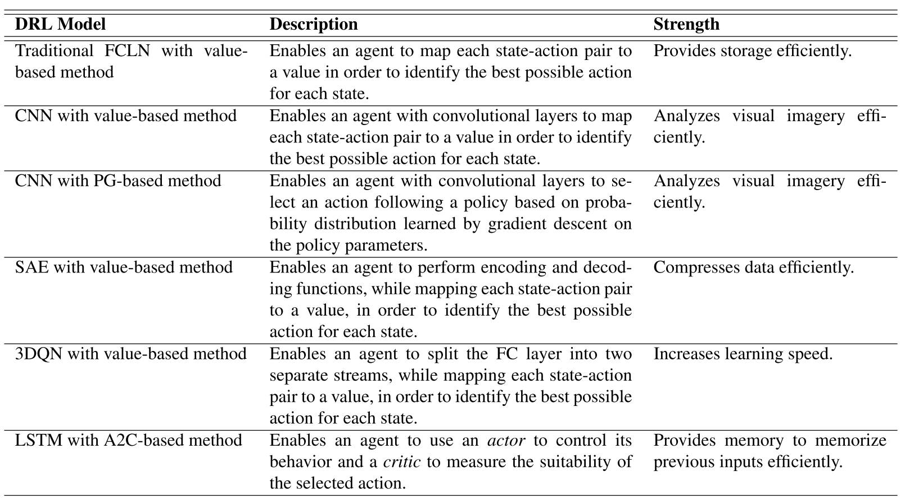

|    **DRL模型**    |                             描述                             |              优势              |
| :---------------: | :----------------------------------------------------------: | :----------------------------: |
| CNN(value-based)  | 使得具有卷积层的 agent 能够将每个状态-动作对映射为一个值，以确定 识别每个状态的最佳可能行动。 |       有效地分析视觉图像       |
| SAE(value-based)  | 使 agent 能够执行编码和解码功能，同时将每个状态-行动对映射到一个值，以确定每个状态的最佳可能行动。 |        有效地压缩数据。        |
| 3DQN(value-based) | 使 agent 能够将FC层分成两个独立的流，同时将每个状态-行动对映射到一个值，以确定每个状态的最佳可能行动。 |          提升学习速度          |
|  LSTM(A2C-based)  | 使 agent 能够使用行为者来控制其行为，并使用批评者来衡量所选行动的适合性。 | 提供记忆，有效地记住以前的输入 |

--------

表八：主要贡献、定量结果/发现和未来方向的总结。

| DL架构   | 参考文献             | 贡献                                                         | 结果与发现                                                   | 未来方向                                                     |
| -------- | -------------------- | ------------------------------------------------------------ | ------------------------------------------------------------ | ------------------------------------------------------------ |
| N.1 FCLN | wan et al.(2018)     | 调查了动态折扣因子的使用                                     | 与基线（即确定性的TSC）相比，平均延迟（P.1）最多可减少20%    | 为了扩展所提出的方案，使其适用于多个交叉点。每个交叉点可以使用不同的DRL方法，如演员批评法[ 1 13 ]、深度确定的梯度策略[114]和近似的策略优化[115]。 |
|          | Tan et al.(2019)     | 纳入了一个新的奖励函数。                                     | 与基线（即确定性和完全动态的TSCs）相比，平均队列长度（P.3）减少40%。 |                                                              |
| N.2 CNN  | Genders et al.(2016) | 调查了大型状态空间的使用。                                   | 与基线（即基于一个隐藏层的神经网络的全动态TSC）相比，平均延迟（P.1）最多可减少82%，平均队列长度（P.3）最多可减少66%。 |                                                              |
|          | Gao et al.(2017)     | 调查了大型状态空间的使用。                                   |                                                              |                                                              |
|          | Mousavi et al.(2017) | 将基于值（E.1）和基于PG（E.2）的方法与基线（即基于一个隐藏层的神经网络的全动态TSC）进行比较。 |                                                              |                                                              |
|          | Van et al.(2016)     | 纳入了max-plus算法和迁移规划算法                             |                                                              |                                                              |
|          | Wei et al.(2018)     | 调查了真实交通数据集的使用                                   |                                                              |                                                              |
| N.3 SAE  | Li et al.(2016)      | 调查了SAE神经网络架构的使用                                  |                                                              |                                                              |
| N.4 3DQN | Liang et al.(2018)   | 融入了优先经验池重放技术                                     |                                                              |                                                              |
|          | Wang et al.(2019)    | 调查了高分辨率的基于事件的数据的使用。                       |                                                              |                                                              |
|          | Gong et al.(2019)    | 将MARL与3DQN(N.4)架构相结合。                                |                                                              |                                                              |
| N.5 LSTM | chu et al.(2019)     | 研究了LSTM神经网络工作架构的使用。                           |                                                              |                                                              |

--------

#### A. ENHANCEMENT OF THE DRL MODELS WITH TRADITIONAL FCLN ARCHITECTURE

用传统的FCLN结构增强DRL模型

*The enhancement of various DRL models based on the traditional FCLN architecture and the value-based approach for TSCs are presented*

介绍了基于传统FCLN架构的各种DRL模型和基于值的TSC方法的增强。

##### 1) WAN’s ENHANCEMENT WITH DYNAMIC DISCOUNT FACTOR

WAN 的优化：使用动态折扣因子

*Wan et al [70] incorporate a dynamic discount factor, which is an enhancement to the discount factor γ in Equation (6), to the traditional FCLN architecture (N.1) and the valuebased approach (E.1). The combination of the traditional FCLN architecture and the value-based approach allows this approach to use FC layers (see Fig. 3) to provide efficient storage while mapping each state-action pair to a state value (see Table 5 for more details). The DRL model optimizes the Q-values to address the challenge of inappropriate traffic phase sequence (C.1) using a centralized model (T.1.1) in a single intersection traffic network (M.1.1) with (T.2.1) and without opposing through traffic (T.2.2). The traffic is characterized by Poisson process (M.2.1). This model is embedded in the TSC of the intersection (G.1). The state st represents the queue length (S.1), the red (S.2) and green (S.3) timings, and the current traffic phase (S.4). The action at represents the type of traffic phase to be activated in the next time instant (A.1). The reward rtC1(stC1) represents the relative waiting time (R.1) of the vehicles. In the proposed scheme, the dynamic discount factor takes account of the time delay between action selection and action execution. When the next action (i.e., a traffic phase) is selected, it may not be executed immediately since a traffic phase can only change every predefined time period (i.e., five seconds). Hence, the discount factor reduces when the time delay increases so that the expected Q-value varies accurately. Equation (6) is revised as follows*

Wan等人[70]在传统的FCLN架构（N.1）和基于值的方法（E.1）中加入了一个动态折扣因子，这是对方程（6）中折扣因子γ的增强。传统的FCLN架构和基于值的方法的结合使这种方法能够使用FC层（见图3）来提供有效的存储，同时将每个状态-动作对映射到一个状态值（更多细节见表5）。DRL模型对Q值进行了优化，以解决在有（T.2.1）和无对向通过交通（T.2.2）的单一交叉口交通网络（M.1.1）中使用集中式模型（T.1.1）的不适当交通相序（C.1）的挑战。交通的特征是泊松过程（M.2.1）。这个模型被嵌入到交叉口的TSC中（G.1）。状态 $s_t$ 代表排队长度（S.1），红色（S.2）和绿色（S.3）时间，以及当前交通阶段（S.4）。行动 $a_t$ 表示在下一个时间瞬间要激活的交通阶段的类型（A.1）。奖励 $r_{t+1}(s_{t+1})$ 代表车辆的相对等待时间（R.1）。==在提议的方案中，动态折扣系数考虑到了行动选择和行动执行之间的时间延迟。当选择下一个行动（即一个交通相位）时，可能不会立即执行，因为一个交通相位只能在每一个预定的时间段（即5秒）改变。因此，当时间延迟增加时，折扣系数就会减少，这样预期的Q值就会准确变化==。方程（6）修改如下

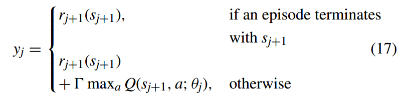

*where $\Gamma = 1 - \tau (1 - \gamma )$ represents the dynamic discount factor, and τ represents the time interval between two consecutive actions. Higher τ represents a longer time delay between action selection and action execution, and vice-versa.*

*The proposed scheme has been shown to increase the throughput (P.4) and reduce the average delay (P.1) of the vehicles.*

其中 $\Gamma = 1 - \tau (1 - \gamma )$ 代表动态折扣系数，$\tau$ 代表两个连续行动之间的时间间隔。更高的 $\tau$ 代表行动选择和行动执行之间有更长的时间延迟，反之亦然。

所提出的方案已被证明可以增加车辆的吞吐量（P.4）并减少平均延迟（P.1）。

--------

##### 2) TAN’s ENHANCEMENT WITH REWARD FUNCTION FOR ACHIEVING MULTIPLE GOALS

TAN的优化：实现多目标的奖励函数

*Tan et al [72] incorporate a novel reward function, which is an enhancement to the reward function r i tC1 (s i tC1 ) D Wi t − Wi tC1 (R.1), to the traditional FCLN architecture (N.1) and the value-based approach (E.1). The combination of the traditional FCLN architecture and the value-based approach allows this approach to use FC layers (see Fig. 3) to provide efficient storage while mapping each state-action pair to a state value (see Table 5 for more details). The DRL model optimizes the Q-values to address the challenge of inappropriate traffic phase sequence (C.1) using a centralized model(T.1.1) in a single intersection traffic network (M.1.1) with opposing through traffic (T.2.1). The traffic is characterized by Poisson process (M.2.1). This model is embedded in the TSC of the intersection (G.1). The state st represents the queue length (S.1) of the vehicles. The action at represents the type of traffic phase to be activated in the next time instant (A.1). In the proposed scheme, a novel reward function is defined to achieve multiple goals as follows*

Tan等人[72]在传统的FCLN架构（N.1）和基于值的方法（E.1）中==加入了一个新的奖励函数，这是对奖励函数 $r_{t+1}^i(S_{t+1}^i) = w_t^i - w_{t+1}^i$ (R.1) 的增强==。传统的FCLN架构和基于值的方法的结合使这种方法能够使用FC层（见图3）来提供有效的存储，同时将每个状态-动作对映射到一个状态值（详见表5）。DRL模型对Q值进行了优化，以解决在单一交叉口交通网络（M.1.1）中使用集中式模型（T.1.1）与对向通过交通（T.2.1）的不适当交通相位顺序（C.1）的挑战。交通的特点是泊松过程（M.2.1）。该模型被嵌入十字路口的TSC（G.1）中。状态 $s_t$ 代表车辆的排队长度（S.1）。动作 $a_t$ 表示在下一个时间瞬间要激活的交通相位的类型（A.1）。在所提出的方案中，定义了一个新的奖励函数，以实现多个目标，如下所示

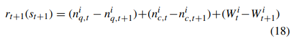

*where, with reference to an intersection i at time t and t C 1, the n i q;t − n i q;tC1 represents the difference in the total number of waiting vehicles, n i c;t − n i c;tC1 represents the difference in the number of crossing vehicles, and Wi t − Wi tC1 represents the difference in the total waiting time of all vehicles.*

*The proposed scheme has been shown to reduce the queue length (P.3) of the vehicles.*

其中，参考一个路口 $i$ 在时间 $t$ 和 $t+1$ , $n_{q,t}^i-n_{q,t+1}^i$ 代表等待车辆总数的差异，$n_{c,t}^i-n_{c,t+1}^i$ 代表通过交叉路口车辆数量的差异，$W_t^i-W_{t+1}^i$ 代表所有车辆的总等待时间的差异。

事实证明，所提出的方案可以减少车辆的排队长度（P.3）。

-------

#### B. DRL MODELS WITH CNN ARCHITECTURE

使用 CNN 架构的 DRL 模型

*The application of various DRL models with the traditional CNN architecture, as well as value-based and PG-based approaches, for TSCs are presented.*

本文介绍了各种具有传统CNN架构的DRL模型，以及基于价值和基于PG的方法在TSC中的应用。

##### 1) INVESTIGATIONS OF THE EFFECTS OF LARGE STATE SPACE

对大状态空间的影响的调查

*Genders et al [66] investigate the use of a large state space to incorporate more information about the traffic. This is because some popular state representations, such as queue length (S.1) [72], [79], ignore the current traffic phase and moving vehicles, including the position (S.5) and speed (S.6) of vehicles. The DRL model is based on the CNN architecture (N.2) and the value-based approach (E.1). The combination of the CNN architecture and the value-based approach allows this approach to the convolutional architecture (see Fig. 5) to analyze visual imagery while mapping each state-action pair to a state value (see Table 5 for more details). This model optimizes the Q-values to address the challenge of inappropriate traffic phase sequence (C.1) using a centralized model (T.1.1) in a single intersection traffic network (M.1.1) with grouped individual traffic (T.2.3). The traffic is characterized by Poisson process (M.2.1). This model is embedded in the TSC of the intersection (G.1). The state st represents the current traffic phase (S.4), the vehicle position (S.5), and the vehicle speed (S.6), and they are fed to the input layer of the CNN architecture. The action at represents the type of traffic phase to be activated in the next time instant (A.1). The reward rtC1(stC1) represents the relative waiting time (R.1) of the vehicles. In this model, the traditional DQN algorithm (see Algorithm 2) is used, which is based on the value-based method. This value-based method identifies the best possible action (i.e., A.1) for the states (i.e., S.4, S.5, and S.6). The use of a large state space allows agents to incorporate more relevant information about the traffic, and it has shown to increase the computational and storage complexities, and reduce the learning rate. Nevertheless, the proposed scheme has shown to increase throughput (P.4) and reduces the average delay (P.1) and queue length (P.3) of the vehicles.*

Genders等人[66]研究了==使用一个大的状态空间来纳入更多的交通信息==。这是因为一些流行的状态表示，如排队长度（S.1）[72], [79]，忽略了当前交通相位和移动车辆，包括车辆的位置（S.5）和速度（S.6）。DRL模型是基于CNN架构（N.2）和基于值的方法（E.1）。CNN架构和基于值的方法的结合使这种卷积架构的方法（见图5）能够分析视觉图像，同时将每个状态-动作对映射到一个状态值（详见表5）。这个模型优化了Q值，以解决在单一交叉口交通网络（M.1.1）中使用集中式模型（T.1.1）与分组的个体交通（T.2.3）的不适当的交通相序（C.1）的挑战。交通量的特征是泊松过程（M.2.1）。这个模型被嵌入到交叉口的TSC中（G.1）。状态 $s_t$ 代表当前交通相位（S.4），车辆位置（S.5）和车辆速度（S.6），它们被送入CNN结构的输入层。action 表示在下一个时间瞬间要激活的交通相位的类型（A.1）。奖励rtC1(stC1)代表车辆的相对等待时间（R.1）。在这个模型中，使用了传统的DQN算法（见算法2），该算法是基于值的方法。这种基于值的方法为状态（即S.4、S.5和S.6）确定了可能的最佳行动（即A.1）。==使用大的状态空间可以使 agent 纳入更多关于交通的相关信息，它已被证明增加了计算和存储的复杂性，并降低了学习率。然而，所提出的方案显示增加了吞吐量（P.4），减少了车辆的平均延迟（P.1）和排队长度（P.3）==。

*Similar model and approach has been adopted by Gao et al[69]. There are two main differences. Firstly, the action at represents the choice to either keep the current traffic phase or switch to the next traffic phase in a predetermined sequence of traffic phases at the next time instant (A.2), which helps to address the challenge of inappropriate traffic phase split (C.2). Secondly, it uses the centralized model (T.1.1) with (T.2.1) and without opposing through traffic (T.2.2). The proposed scheme has shown to reduce the average delay (P.1) and waiting time (P.2).*

==Gao等人也采用了类似的模型和方法==。 [69]. 有两个主要区别。首先，==action $a_t$ 表示选择保持当前交通相位或在下一个时间瞬间切换到预先确定的交通相位序列中的下一个交通相位（A.2），这有助于解决不适当的交通相位分割（C.2）的挑战==。其次，它采用集中式模型（T.1.1）与（T.2.1）和无对立通过交通（T.2.2）。所提出的方案已显示出减少了平均延迟（P.1）和等待时间（P.2）。

> C.2
>
> *Inappropriate traffic phase split: A traffic phase split represents the time interval allocated for a traffic phase.For simplicity, we can focus on the green time of the traffic phase with green signals, in which the rest of the traffic phases receive red signals. Too long of a green time can cause cross-blocking and green idling when the traffic volume is high and low, respectively. Too short of a green time can increase the queue length of a lane, resulting in congestion. The maximum and minimum durations of a traffic phase split can be imposed. The maximum duration prevents a long waiting time for vehicles at other lanes, while the minimum duration ensures that at least a single waiting vehicle can cross an intersection*
>
> 不适当的交通相位分割： 交通相位分割表示分配给一个交通相位的时间间隔。为简单起见，我们可以关注有绿色信号的交通相位的绿色时间，其中其余的交通相位收到红色信号。太长的绿灯时间会在交通量大和小的时候分别造成交叉拥堵和绿灯空转。绿灯时间太短会增加车道的排队长度，导致拥堵。可以规定一个交通相位分割的最大和最小持续时间。最大持续时间可以防止其他车道的车辆有很长的等待时间，而最小持续时间可以确保至少有一辆等待的车辆可以通过交叉口

---------

##### 2）VAN DER POL’s ENHANCEMENT WITH MAX-PLUS COORDINATION AND TRANSFER PLANNING

VAN DER POL的优化：最大尺度协调和转移规划算法

*Van der Pol et al [74], [76] incorporate max-plus coordination [88] and transfer planning [89] into the traditional DQN algorithm (see Algorithm 2) in order to enable coordination among multiple agents. The DRL model is based on the CNN architecture (N.2) and the value-based approach (E.1).*

*The combination of the CNN architecture and the valuebased approach allows this approach to use the convolutional architecture (see Fig. 5) to analyze visual imagery while mapping each state-action pair to a state value (see Table 5 for more details). This model optimizes the Q-values to address the challenge of inappropriate traffic phase sequence (C.1) using a distributed model (T.1.2) in a multi intersection traffic network (M.1.2) and a grid traffic network (M.1.4) with opposing through traffic (T.2.1). The traffic is characterized by a real world traffic model (M.2.2), specifically the Krauß car-following model [90]. This model is embedded in each intersection (G.1), where the state st represents the current traffic phase (S.4), the vehicle position (S.5), and the vehicle speed (S.6). The action at represents the type of traffic phase to be activated in the next time instant (A.1). The reward rtC1(stC1) represents the relative waiting time (R.1) of the vehicles, and the phase transition (R.3) of the traffic phases.*

Van der Pol等人[74], [76]将最大加法协调[88]和迁移规划[89]纳入传统的DQN算法（见算法2），以实现多个代理之间的协调。DRL模型是基于CNN架构（N.2）和基于价值的方法（E.1）。

CNN架构和基于值的方法的结合使该方法能够使用卷积架构（见图5）来分析视觉图像，同时将每个状态-动作对映射到一个状态值（详见表5）。这个模型优化了Q值，以解决在多交叉口交通网络（M.1.2）和有对向通过交通（T.2.1）的网格交通网络（M.1.4）中使用分布式模型（T.1.2）的不适当的交通相序（C.1）的挑战。交通的特点是由一个现实世界的交通模型（M.2.2），特别是Krauß汽车跟随模型[90]。这个模型被嵌入到每个交叉口（G.1）中，其中状态st代表当前的交通阶段（S.4），车辆位置（S.5），以及车辆速度（S.6）。行动at表示在下一个时间瞬间要激活的交通阶段的类型（A.1）。奖励rtC1(stC1)代表车辆的相对等待时间(R.1)，以及交通相位的相位转换(R.3)。

*The ==max-plus coordination algorithm==, which serves as the enhancement for multi-agent reinforcement learning (MARL) [91]–[95], enables an agent to learn about its neighboring agents’ information, such as locally optimized payoff values (e.g., reward achieved by an individual agent). The proposed scheme maximizes a global Q-function, which is the linear combination of the local Q-values, as follows*

==作为多代理强化学习（MARL）[91]-[95]的增强算法，最大加协调算法使一个代理能够了解其邻近代理的信息，如局部优化的报酬值（如单个代理实现的奖励）。所提出的方案使全局Q函数最大化，它是局部Q值的线性组合，==如下所示

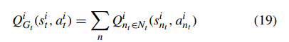

*where N corresponds to a set of all agents in the network.The transfer planning approach enables agents to learn a large problem by decomposing it into smaller source problems. The term ‘transfer’ refers to the transferring of learning among multiple agents. The max-plus coordination algorithm and the transfer planning approach compute the global Q-value in order to achieve the global objective of a traffic network.*

*The proposed scheme has been shown to reduce the average delay (P.1) of the vehicles.*

其中N对应于网络中所有 agent 的集合。迁移规划方法使智能体能够通过将大问题分解为较小的源问题来学习。术语「迁移」指的是在多个智能体之间传递学习。max-plus协调算法和迁移规划方法计算全局Q值，以实现交通网络的全局目标。

事实证明，所提出的方案可以减少车辆的平均延迟（P.1）。

--------

##### 3）INVESTIGATION OF THE EFFECTS OF REAL WORLD TRAFFIC DATASET

真实世界交通数据集的影响研究

*Wei et al [78] investigate the use of a real world traffic dataset consisting of data of more than 405 million vehicles recorded by using 1,704 surveillance cameras in Jinan, China covering 935 locations, out of which 43 of them are fourway intersections. The data is collected within a time period from 1st to 31st August 2016. The DRL model is based on the CNN architecture (N.2) and the value-based approach (E.1).*

*The combination of the CNN architecture and the valuebased approach allows this approach to use the convolutional architecture (see Fig. 5) to analyze visual imagery while mapping each state-action pair to a state value (see Table 5 for more details). This model optimizes the Q-values to address the challenge of inappropriate traffic phase sequence (C.1) using a centralized model (T.1.1) in a real world traffic network (M.1.3), which is based on an urban traffic network in Jinan, China, with opposing through traffic (T.2.1). The traffic is characterized by a real world traffic model (M.2.2).*

*This model is embedded in each intersection (G.1), where the state st represents the queue length (S.1), the current traffic phase (S.4), and the vehicle position (S.5). The proposed scheme is applied to 24 intersections. The action at represents the type of traffic phase to be activated in the next time instant (A.1). The reward rtC1(stC1) represents the relative waiting time (R.1), the relative queue length (R.2) of the vehicles, and the phase transition (R.3) of the traffic phases. In the proposed scheme, the recorded data consists of the timing information (i.e., peak hours 7-9 A.M. and 5-7 P.M., and non-peak hours), the ID of each surveillance camera, and vehicular data (i.e., the position (S.5) of each vehicle). The recorded real world traffic data is fed to the input layer of the CNN architecture, and the output layer provides the Q-value of each possible action, which is the type of traffic phase to be activated in the next time instant (A.1).*

*The proposed scheme has been shown to increase throughput (P.4) and reduce the average delay (P.1) and the queue length (P.3) of the vehicles.*

Wei等人[78]研究了真实世界交通数据集的使用情况，该==数据集由中国济南的1704个监控摄像头记录的超过4.05亿辆汽车的数据组成，覆盖935个地点，其中43个是四通八达的交叉口。这些数据是在2016年8月1日至31日的时间段内收集的==。DRL模型是基于CNN架构（N.2）和基于值的方法（E.1）。

CNN架构和基于值的方法的结合使该方法能够使用卷积架构（见图5）来分析视觉图像，同时将每个状态-动作对映射到一个状态值（详见表5）。这个模型优化了Q值，以解决现实世界交通网络（M.1.3）中使用集中式模型（T.1.1）的不适当的交通相位序列（C.1）的挑战，这个网络是基于中国济南的城市交通网络，有对立的通过交通（T.2.1）。交通的特征由现实世界的交通模型（M.2.2）来描述。

这个模型被嵌入到每个交叉口（G.1），其中==状态st代表排队长度（S.1），当前交通阶段（S.4）和车辆位置（S.5）。建议的方案适用于24个交叉口。动作at表示在下一个时间瞬间要激活的交通相位的类型（A.1）。奖励rtC1(stC1)代表相对等待时间(R.1)，车辆的相对排队长度(R.2)，以及交通相位的转换(R.3)==。在提议的方案中，记录的数据包括时间信息（即上午7-9点和下午5-7点的高峰期，以及非高峰期），每个监控摄像头的ID，以及车辆数据（即每辆车的位置（S.5））。记录的现实世界交通数据被送入CNN架构的输入层，输出层提供每个可能行动的Q值，也就是在下一个时间瞬间要激活的交通阶段的类型（A.1）。

所提出的方案已被证明可以增加吞吐量（P.4），减少车辆的平均延迟（P.1）和排队长度（P.3）。

-------

##### 4) COMPARISON OF VALUE-BASED AND PG-BASED METHODS

基于价值和基于PG的方法的比较

*Mousavi et al [68] compare the two different types of DRL methods, namely the value-based method (E.1) and the PG-based method (E.2), in TSCs. The DRL model is based on the CNN architecture (N.2). The combination of the CNN architecture and both value-based and PG-based methods allows this approach to use the convolutional architecture (see Fig. 5) to analyze visual imagery while mapping each state-action pair to a state value and selecting an action for a particular state (i.e., image) (see Table 5 for more details).*

*This model optimizes the Q-values to address the challenge of inappropriate traffic phase sequence (C.1) using a centralized model (T.1.1) in a single intersection traffic network (M.1.1) with opposing through traffic (T.2.1). The traffic is characterized by Poisson process (M.2.1). This model is embedded in the TSC of the intersection (G.1). The state st represents the current traffic phase (S.4), and the queue length (S.1) of the vehicles. The action at represents the type of traffic phase to be activated in the next time instant (A.1). The reward rtC1(stC1) represents the relative waiting time (R.1) of the vehicles. The value-based method maps each state-action pair to a value Vt(st) in order to identify the best possible action for each state, and the PG-based method selects an action for a certain state based on a policy. The value-based method achieves a slightly higher value of reward and outperforms the PG-based method.*

*The proposed scheme has been shown to reduce the average delay (P.1) and the queue length (P.3) of the vehicles, and so both value-based and PG-based methods are suitable for TSC*

Mousavi等人[68]比较了TSCs中两种不同类型的DRL方法，即基于值的方法（E.1）和基于PG的方法（E.2）。DRL模型是基于CNN架构的（N.2）。CNN架构与基于价值的方法和基于PG的方法的结合使该方法能够使用卷积架构（见图5）来分析视觉图像，同时将每个状态-动作对映射到一个状态值，并为特定状态（即图像）选择一个动作（详见表5）。

这个模型优化了Q值，以解决不适当的交通相位序列（C.1）的挑战，在一个具有对向通过交通（T.2.1）的单一交叉口交通网络（M.1.1）中使用集中式模型（T.1.1）。交通的特征是泊松过程（M.2.1）。这个模型被嵌入到交叉口的TSC中（G.1）。状态st代表当前的交通阶段（S.4），以及车辆的排队长度（S.1）。动作at表示在下一个时间瞬间要激活的交通阶段的类型（A.1）。奖励rtC1(stC1)代表车辆的相对等待时间（R.1）。基于值的方法将每个状态-行动对映射到一个值Vt(st)，以确定每个状态的最佳行动，而基于PG的方法则根据策略为某个状态选择一个行动。基于值的方法实现了一个稍高的奖励值，并超过了基于PG的方法。

所提出的方案已被证明可以减少车辆的平均延迟（P.1）和排队长度（P.3），因此基于价值和基于PG的方法都适合TSC

------

#### C. DRL MODEL WITH SAE NEURAL NETWORK ARCHITECTURE

C带有Sae神经网络结构的DRL模型

*The application of DRL model based on the traditional SAE neural network architecture and the value-based approach for TSC is presented.*

介绍了基于传统SAE神经网络架构的DRL模型和基于值的TSC方法的应用。

##### 1）INVESTIGATION OF THE EFFECTS OF SAE NEURAL NETWORK ARCHITECTURE

调查SAE神经网络架构的影响

*Li et al [67] investigate the use of the SAE neural network architecture that performs encoding and decoding functions to TSC. The DRL model is based on the SAE neural network architecture (N.3) and the value-based approach (E.1).*

*The combination of the SAE architecture and the valuebased approach allows this approach to use the encoding and decoding functions (see Fig. 6) to compress data while mapping each state-action pair to a state value (see Table 5 for more details). This model optimizes the Q-values to address the challenge of inappropriate traffic phase split (C.2) using a centralized model (T.1.1) in a single intersection traffic network (M.1.1) with opposing through traffic (T.2.1). This model is embedded in each intersection (G.1), where the state st represents the queue length (S.1) of the vehicles. The action at represents the choice to either keep the current traffic phase or switch to the next traffic phase in a predetermined sequence of traffic phases at the next time instant (A.2). The reward rtC1(stC1) represents the relative waiting time (R.1) and the relative queue length (R.2) of the vehicles. In the proposed scheme, the SAE neural network architecture consists of one input, two hidden, and one output layers. The input layer encodes the input data, such as the queue length (S.1) of the vehicles, using an encoding function (see Equation (10)), to provide compressed data. The second hidden layer reconstructs the data using a decoding function (see Equation (10)).Finally, the output layer provides the Q-value of each possible action.*

*The proposed scheme has been shown to reduce the average delay (P.1) and the queue length (P.3) of the vehicles.*

Li等人[67]研究了使用SAE神经网络架构，对TSC进行编码和解码功能。DRL模型是基于SAE神经网络架构（N.3）和基于价值的方法（E.1）。

==SAE架构和基于值的方法的结合使该方法能够使用编码和解码功能（见图6）来压缩数据==，同时将每个状态动作对映射到一个状态值（详见表5）。这个模型优化了Q值，以解决不适当的交通相位分割（C.2）的挑战，在单一交叉口交通网络（M.1.1）中使用一个集中的模型（T.1.1），有对立的通过交通（T.2.1）。这个模型被嵌入到每个交叉口（G.1），其中==状态st代表车辆的排队长度（S.1）。行动at代表选择保持当前的交通阶段，或者在下一个时间瞬间切换到预定的交通阶段序列中的下一个交通阶段（A.2）。奖励rtC1(stC1)代表车辆的相对等待时间（R.1）和相对排队长度（R.2）==。==在提出的方案中，SAE神经网络结构由一个输入层、两个隐藏层和一个输出层组成。输入层使用一个编码函数（见公式（10））对输入数据，如车辆的排队长度（S.1）进行编码，以提供压缩数据。第二隐藏层使用解码函数（见公式（10））重建数据。 最后，输出层提供每个可能行动的Q值。==

所提出的方案已被证明可以减少车辆的平均延迟（P.1）和排队长度（P.3）。

------

#### D. DRL MODELS WITH 3DQN ARCHITECTURE

拥有3DQN架构的DRL模型

*The application of various DRL models with the traditional 3DQN architecture and the value-based approach for TSCs is presented*

介绍了各种拥有传统的3DQN架构的DRL模型并且基于值的TSC方法的应用。

##### 1) LIANG’s ENHANCEMENT WITH PRIORITIZED EXPERIENCE REPLAY

LIANG的优化：优先经验池回放技术

*Liang et al [71] incorporate a prioritized experience replay approach [96] to the traditional 3DQN architecture (N.4), which consists of double Q-learning and a dueling network, and the value-based approach (E.1), running the DQN algorithm (see Algorithm 2). The combination of the 3DQN architecture and the value-based approach allows this approach to use double Q-learning and a dueling network to increase the learning speed (see Fig. 7) while mapping each stateaction pair to a state value (see Table 5 for more details).*

*This model optimizes the Q-values to address the challenge of inappropriate traffic phase split (C.2) using a centralized model (T.1.1) in a single intersection traffic network (M.1.1) with (T.2.1) and without opposing through traffic (T.2.2). The traffic is characterized by a real world traffic model (M.2.2).*

*This model is embedded in the TSC of the intersection (G.1).*

*The state st represents the position (S.5) and speed (S.6) of the vehicles. The action at represents the choice to either keep the current traffic phase or switch to the next traffic phase in a predetermined sequence of traffic phases at the next time instant (A.2). The reward rtC1(stC1) represents the relative waiting time (R.1) of the vehicles. In the proposed scheme, the prioritized experience replay chooses experiences from the replay memory on the priority basis in order to increase the learning rate. The prioritized experience replay ranks an experience i, which increases its replay probability, based on the temporal difference error δ calculated as follows*

*where an experience with a lower error is being ranked higher (or prioritized). The replay probability of experience i is calculated as follows*

*where $p_i$ is the priority of an experience i, and $\wp$ represents the priority level. Higher $\wp$ represents a higher priority, and vice-versa, while $\wp$ = 0 represents a random sampling.*

*The proposed scheme has been shown to reduce the average waiting time (P.2) of the vehicles.*

Liang等人[71]在传统的3DQN架构（N.4）和基于值的方法（E.1）==中加入了优先经验重放的方法==[96]，后者由双Q-学习和决斗网络组成，运行DQN算法（见算法2）。==3DQN架构和基 于值的方法的结合，使这种方法能够使用双Q-学习和决斗网络来提高学习速度==（见图7），同时将每个状态-行动对映射到一个状态值（详见表5）。

这个模型优化了Q值，以解决在有（T.2.1）和无对向通过交通（T.2.2）的单一交叉口交通网络（M.1.1）中使用集中式模型（T.1.1）的不当交通相位分割（C.2）的挑战。交通的特点是由一个现实世界的交通模型（M.2.2）来描述。

这个模型被嵌入到交叉口的TSC中（G.1）。

==状态st代表车辆的位置（S.5）和速度（S.6）。行动at表示选择保持当前的交通阶段，或者在下一个时间瞬间切换到预定的交通阶段序列中的下一个交通阶段（A.2）。奖励rtC1(stC1)代表车辆的相对等待时间（R.1）==。在==所提出的方案中，为了提高学习率，优先经验重放从重放存储器中选择经验的优先级。优先经验重放对一个经验 $i$ 进行排序，从而提高其重放概率，其依据是时间差异误差 $\delta$  ，==计算如下

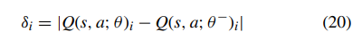

其中误差较小的经验被排在较高的位置（或优先）。经验 $i$ 的重放概率计算如下

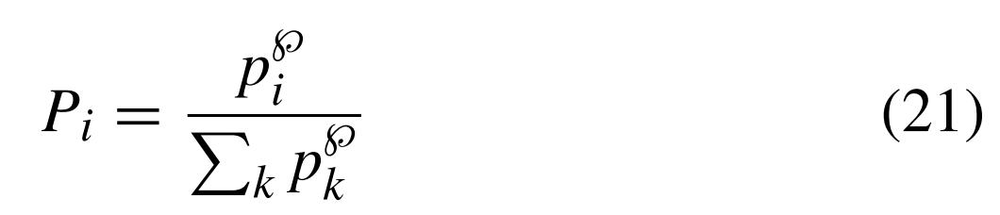

其中 $p_i$ 是一个经验 $i$ 的优先级，而 $\wp$ 代表优先级。更高的 $\wp$ 代表更高的优先级，反之亦然，当 $\wp=0$ 代表随机抽样。

建议的方案已被证明可以减少车辆的平均等待时间（P.2）。

-------

##### 2）GONG’s ENHANCEMENT WITH MARL

GONG的优化：多代理强化学习

*Gong et al [77] incorporate MARL to the traditional 3DQN architecture (N.4), which consists of double Q-learning and a dueling network, and the value-based approach (E.1), running the DQN algorithm (see Algorithm 2). The combination of the 3DQN architecture and the value-based approach allows this approach to use double Q-learning and a dueling network to increase the learning speed (see Fig. 7) while mapping each state-action pair to a state value (see Table 5 for more details). MARL enables coordination among multiple agents.*

*This model optimizes the Q-values to address the challenge of inappropriate traffic phase sequence (C.1) in a multi intersection traffic network (M.1.2) and a real world traffic network (M.1.3), which is based on an urban traffic network in Florida, United States, using a distributed model (T.1.2). The traffic is characterized by a real world traffic model (M.2.2). This model is embedded in the TSC of the intersection (G.1). The state st represents the queue length (S.1), and the position (S.5), of the vehicles. The action at represents the type of traffic phase to be activated in the next time instant (A.1). The reward rtC1(stC1) represents the relative waiting time (R.1) of the vehicles. In the proposed scheme, the MARL algorithm enables agents to exchange information (i.e., rewards and Q-values) with each other in order to coordinate their actions.*

*Algorithm 3 shows the MARL algorithm for DRL. At time instant t, an agent i observes the current state s i t 2 S from the operating environment, and sends its own Q-value Q i t (s i t ; a i t ) to the neighboring agents J i . Subsequently, following steps 5 to 13 of Algorithm 2, agent i receives the optimal Q-value maxa j2A Q j t (s j t ; a j ) from each neighboring agent j 2 J i , selects an action a i t 2 A based on the Q-value at time t, and then receives a reward r i tC1 (s i tC1 ) under the next state s i tC1 2 S at time t C 1. Finally, the agent i updates Q-value Q i t (s i t ; a i t ).*

*Based on Equation (2), the Q-value Q i t (s i t ; a i t ) is updated using Q-function as follows [97]:*

*Meanwhile, the Q-value Q j t (s j t ; a j t ) of a neighboring agent j 2 J i is updated using Q-function as follows*

*The proposed scheme has been shown to increase the throughput (P.4) and reduce the average delay (P.1) of the vehicles.*

==Gong等人[77]将MARL纳入传统的3DQN架构（N.4）和基于值的方法（E.1）==，运行DQN算法（见算法2），后者由双Q学习和决斗网络组成。3DQN架构和基于价值的方法的结合使该方法能够使用双Q-学习和决斗网络来提高学习速度（见图7），同时将每个状态-动作对映射到一个状态值（详见表5）。==MARL能够实现多个代理之间的协调。==

该模型优化了Q值，==以解决多交叉口交通网络==（M.1.2）和现实世界交通网络（M.1.3）中不恰当的交通相位顺序（C.1）的挑战，该网络是基于美国佛罗里达州的城市交通网络，使用分布式模型（T.1.2）。==交通的特点是由一个现实世界的交通模型==（M.2.2）。这个模型被嵌入到交叉口的TSC中（G.1）。==状态st代表车辆的排队长度（S.1）和位置（S.5）。动作at表示在下一个时间瞬间要激活的交通阶段的类型（A.1）。奖励rtC1(stC1)代表车辆的相对等待时间（R.1）==。==在提出的方案中，MARL算法使代理人能够相互交换信息（即奖励和Q值），以协调他们的行动。==

算法3显示了DRL的MARL算法。在时间瞬间 $t$，一个代理 $i$ 从运行环境中观察到当前状态 $s_t^i\in S$，并将自己的Q值 $Q_t^i(s_t^i,A_t^i)$ 发送给邻近的代理 $J^i$。随后，按照算法2的第5至13步，代理 $i$ 从每个相邻的代理 $j \in J^i$ 收到最优Q值 $\max _{a^j \in A}Q_t^j(s_t^j,a^j)$，根据时间 $t$ 的Q值选择一个行动 $a_t^i \in A$，然后在时间 $t+1$ 的状态 $s_{t+1}^i \in S$ 下获得奖励 $r_{t+1}^i(s_{t+1}^i)$。最后，agent $i$ 更新Q值 $Q_t^i(s_t^i,a_t^i)$。基于方程（2），Q值 $Q_t^i(s_t^i,a_t^i)$ 使用Q函数更新，如下所示[97]：

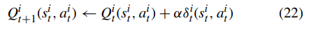

同时，相邻代理 $j \in J^i$ 的Q值 $Q_t^i(s_t^i,a_t^i)$ 使用Q函数更新如下:

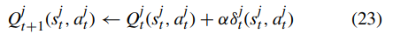

事实证明，所提出的方案提高了车辆的吞吐量（P.4）并减少了平均延迟（P.1）。

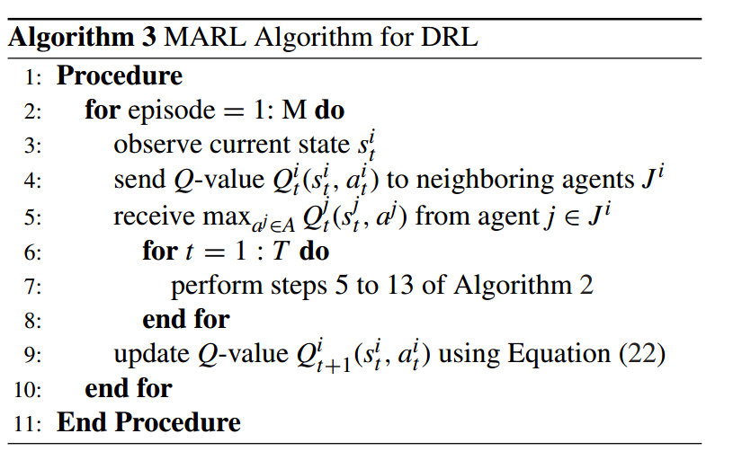

-------

##### 3) INVESTIGATION OF THE EFFECTS OF HIGH-RESOLUTION EVENT-BASED DATA

对高分辨率事件驱动数据效果的研究

*Wang et al [86] investigate the use of high-resolution eventbased data that includes a large amount of useful information about vehicles, including their movements and positions.*

*The DRL model is based on the 3DQN architecture (N.4) and the value-based approach (E.1). The combination of the 3DQN architecture and the value-based approach allows this approach to use double Q-learning and a dueling network to increase the learning speed (see Fig. 7) while mapping each state-action pair to a state value (see Table 5 for more details). This model optimizes the Q-values to address the challenge of inappropriate traffic phase sequence (C.1) using a centralized model (T.1.1) in a single intersection traffic network (M.1.1) with (T.2.1) and without opposing through traffic (T.2.2). The traffic is characterized by a real world traffic model (M.2.2). This model is embedded in the TSC of the intersection (G.1). The state st represents the green timing (S.3), and the vehicle position (S.5). The action at represents the type of traffic phase to be activated (A.1) in the next time instant. The reward rtC1(stC1) represents the relative waiting time (R.1), and the relative queue length (R.2) of the vehicles. The high-resolution event-based data provides a large amount of useful information about the vehicle, such as vehicular movement and position. The highresolution event-based data keeps track of: a) the time of each vehicle arriving at and departing from an inductive loop detector (or vehicle detector); and b) the time gap between two consecutive vehicles, which is the time gap between the two vehicles arriving at and departing from the detector.*

*The 3DQN architecture consists of one input layer, three convolutional layers, three FC layers (in which the third FC layer is split into two separate streams as explained in N.4), and one output layer. The input layer receives the accurate traffic information, and the output layer provides an accurate Q-value for each possible action based on the accurate information [98].*

*The proposed scheme has been shown to increase throughput (P.4) and reduce the queue length of vehicles (P.3).*

Wang等人[86]研究了基于事件的高分辨率数据的使用，这些数据包括大量关于车辆的有用信息，包括它们的运动和位置。

DRL模型是基于3DQN架构（N.4）和基于值的方法（E.1）。3DQN架构和基于价值的方法的结合使这种方法能够使用双Q-学习和决斗网络来提高学习速度（见图7），同时将每个状态-动作对映射到一个状态值（详见表5）。这个模型优化了Q值，以解决在有（T.2.1）和无对向通过交通（T.2.2）的单一交叉口交通网络（M.1.1）中使用集中式模型（T.1.1）的不适当的交通相序（C.1）的挑战。交通的特点是由一个现实世界的交通模型（M.2.2）来描述。这个模型被嵌入到交叉口的TSC中（G.1）。==状态st表示绿灯时间（S.3），以及车辆位置（S.5）。动作at表示在下一个时间瞬间要激活的交通阶段的类型（A.1）。奖励rtC1(stC1)代表相对等待时间(R.1)，以及车辆的相对排队长度(R.2)==。==基于事件的高分辨率数据提供了大量关于车辆的有用信息，如车辆运动和位置。基于事件的高分辨率数据记录了：a）每辆车到达和离开感应圈检测器（或车辆检测器）的时间；b）两辆连续车辆之间的时间间隔，即两辆车到达和离开检测器的时间间隔==。

3DQN架构由一个输入层、三个卷积层、三个FC层（其中第三个FC层被分成两个独立的数据流，如N.4所述）和一个输出层组成。输入层接收准确的交通信息，而输出层根据准确的信息为每个可能的行动提供准确的Q值[98]。

所提出的方案已被证明可以提高吞吐量（P.4）并减少车辆排队长度（P.3）。

-------

#### E. DRL MODEL WITH LSTM NEURAL NETWORK ARCHITECTURE

带有LSTM神经网络结构的DRL模型

*The application of DRL model based on the traditional LSTM neural network architecture and the A2C-based approach for TSC is presented.*

介绍了基于传统LSTM神经网络架构的DRL模型和基于A2C的TSC方法的应用。

*Chu et al [79] investigate the use of LSTM neural network architecture that provides memory to memorize previous inputs of TSC. The DRL model is based on the LSTM neural network architecture (N.5) and the A2Cbased approach (E.3). The combination of LSTM and the A2C-based approach allows this approach to use the LSTM neural network (see Fig. 8) to provide memorization of previous inputs while combining both value-based and PG-based methods to control its behavior and to measure the suitability of the selected action (see Table 5 for more details). This model optimizes the Q-values to address the challenge of inappropriate traffic phase sequence (C.1) using a distributed model (T.1.2) in a multi intersection traffic network (M.1.2), an urban traffic network based on Monaco (M.1.3), and a grid traffic network (M.1.4) with opposing through traffic (T.2.1). The traffic is characterized by a real world traffic model (M.2.2). This model is embedded in the TSC of the intersection (G.1). The state st represents the queue length (S.1) of the vehicles. The action at represents the type of traffic phase to be activated in the next time instant (A.1). The reward rtC1(stC1) represents the relative waiting time (R.1) and the relative queue length (R.2) of the vehicles. In the proposed scheme, the A2C-based method has been used with the LSTM neural network architecture, which consists of one input, one FC, one LSTM (i.e., memory cell), and one output layer. The output layer is separated into two streams: a) actor, which controls the behavior of an agent (i.e., policy-based); and b) critic, which measures the suitability of the selected action (i.e., value-based). The gradient of the loss function for A2C is calculated using Equation (15).*

*The proposed scheme has been shown to increase throughput (P.4) and reduce the average delay (P.1) and queue length (P.3) of vehicles.*

Chu等人[79]研究了==使用LSTM神经网络架构，该架构提供记忆来记忆TSC之前的输入==。DRL模型是基于LSTM神经网络架构（N.5）和基于A2C的方法（E.3）。LSTM和基于A2C的方法的结合使该方法能够使用LSTM神经网络（见图8）来提供对以前输入的记忆，同时结合基于价值和基于PG的方法来控制其行为并衡量所选动作的适合性（更多细节见表5）。这个模型优化了Q值，以解决不适当的交通相位顺序（C.1）的挑战，在多交叉口交通网络（M.1.2）、==基于摩纳哥的城市交通网络==（M.1.3）和有对向通过交通（T.2.1）的网格交通网络（M.1.4）中使用分布式模型（T.1.2）。交通的特点是由一个现实世界的交通模型（M.2.2）来描述。这个模型被嵌入到交叉口的TSC中（G.1）。==状态st代表车辆的排队长度（S.1）。动作at表示在下一个时间瞬间要激活的交通阶段的类型（A.1）。奖励rtC1(stC1)代表车辆的相对等待时间（R.1）和相对排队长度（R.2）==。在提出的方案中，==基于A2C的方法被用于LSTM神经网络结构，它由一个输入层、一个FC、一个LSTM（即记忆单元）和一个输出层组成。输出层被分成两个流：a）行动者，控制代理人的行为（即基于政策）；b）批评者，衡量所选行动的适合性（即基于价值）。A2C的损失函数的梯度是用公式（15）计算的。==

所提出的方案已被证明可以增加吞吐量（P.4），减少车辆的平均延迟（P.1）和排队长度（P.3）。
