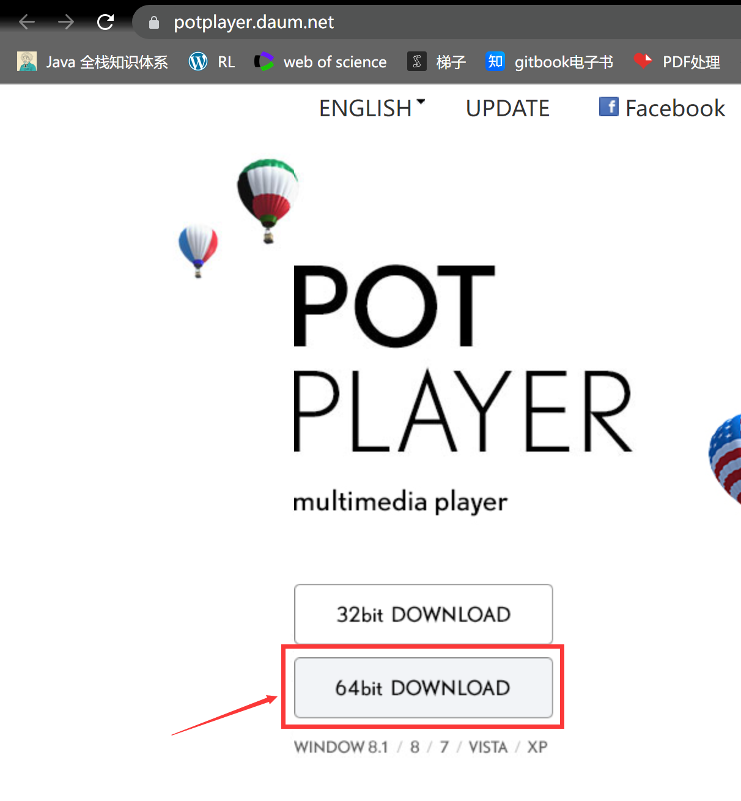
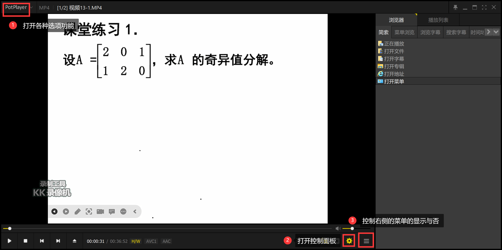

# 视频播放器选择

*起因：因为我的研究生课程需要，因为疫情许多课程化身网课，而我或由于冬日或由于在家的因素所以很难按时的去听课，很多疼腾讯会议的课程都是录频然后有时间再看的，所以我需要一个视频播放软件。*

### 现有的播放器的问题

1. windows自带的”电影和电视“

其问题是在无法倍速播放，大家知道很多课程都是需要倍速的，但是它无法提供此功能

2. Windows media payer

同上，无法倍速

3. 腾讯、爱奇艺、优酷

这些国产的影视剧商家都是一样的，他们实在是太“良心”了，我真的无法言语，实在是有点恶心了，无论哪个播放器大同小异，功能虽然很齐全，但是都会一言不合你的整洁的桌面上就会出现奇怪的图标，甚至某艺还会修改你的默认视频播放器，我是实在是不想用。

### 寻找新的播放器

**参考**

[最好的播放器十大排名 视频播放器哪个软件最好用](https://www.zp0719.com/best-video-player)

[世界十大最好用的视频播放器](https://m.maigoo.com/top/389458.html)

因为之前我哥使用的是PotPlayer，并且推荐程度很高，所以我直接选择了PotPlayer。

### Pot Player

##### 下载

[Pot Player 官网](https://potplayer.daum.net/)进去之后点击下载即可，现在基本都是64位的吧

##### 面板

打开后的面板如图，它的功能确实很强大。

[PotPlayer怎么设置倍速播放？加速播放和减速播放](http://www.potplayercn.com/course/2920.html)